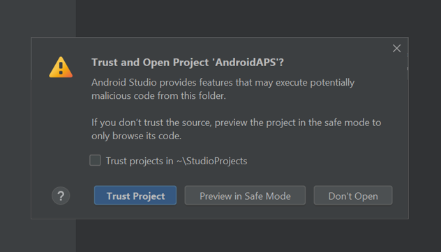
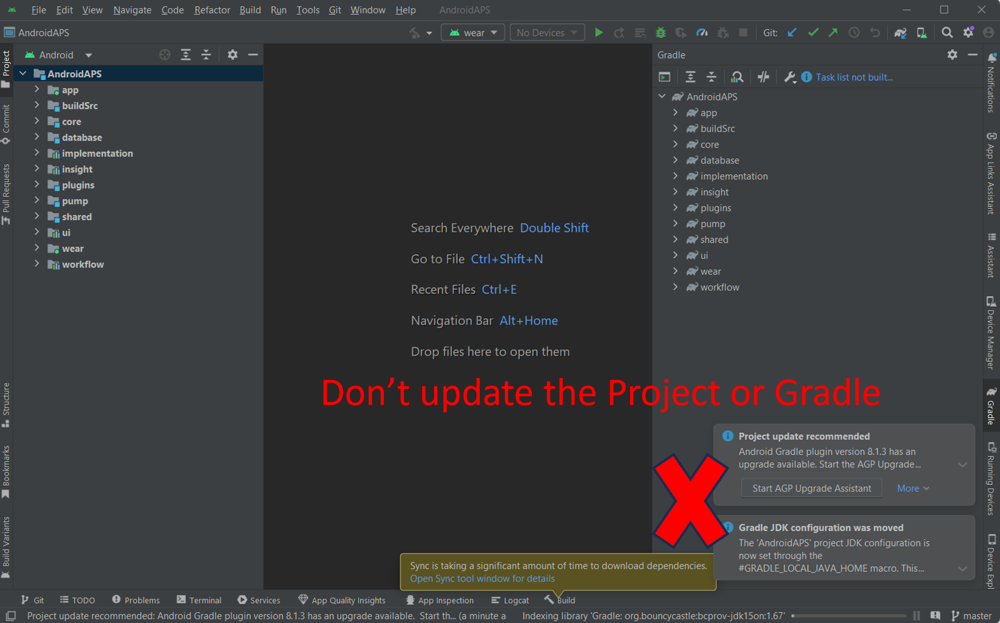
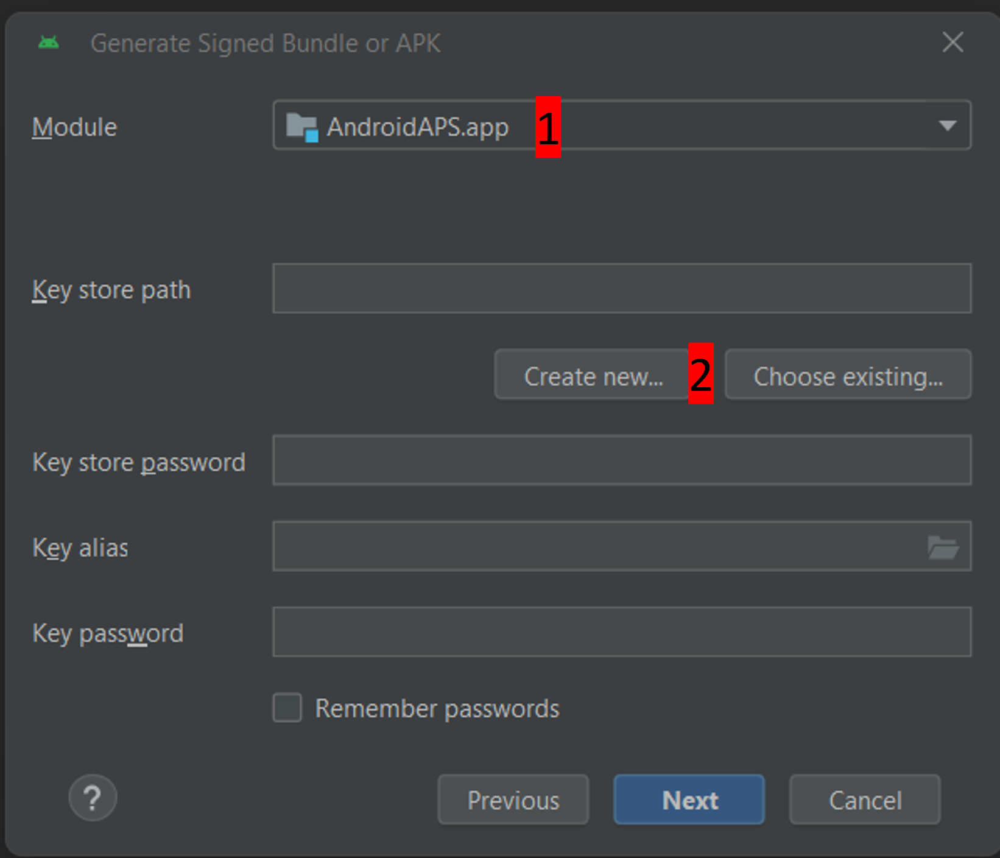
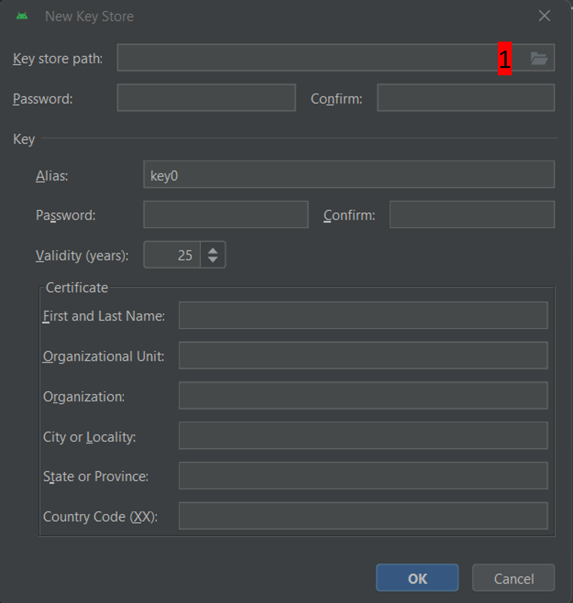
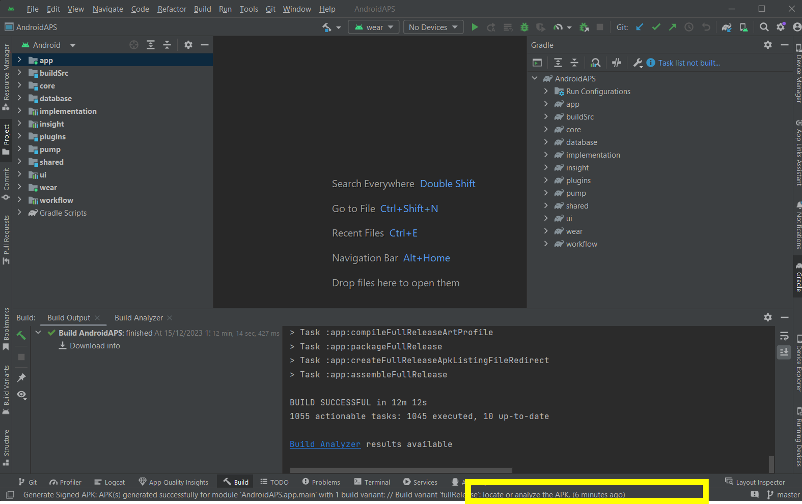
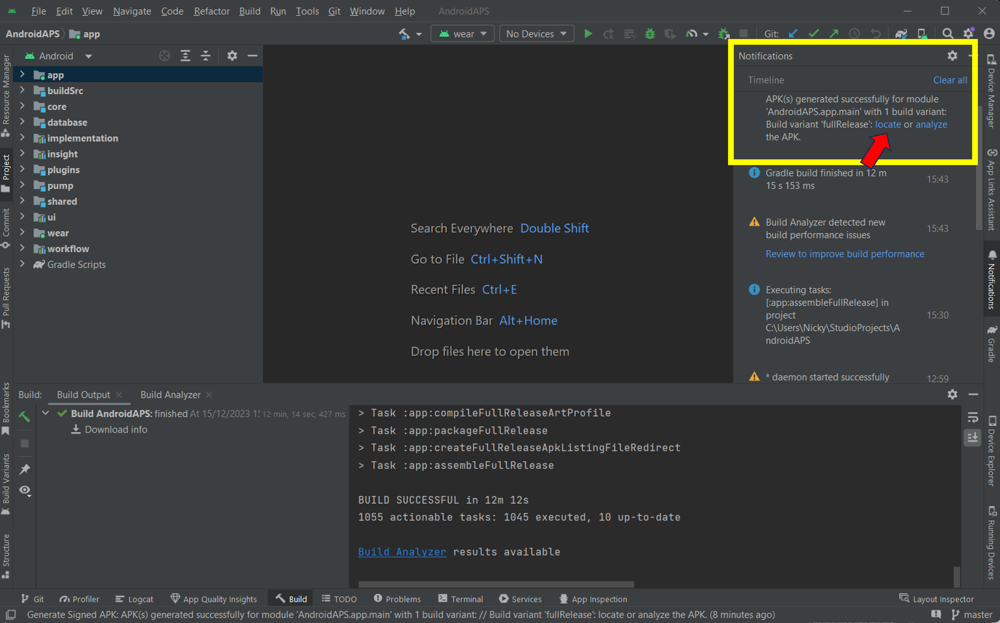
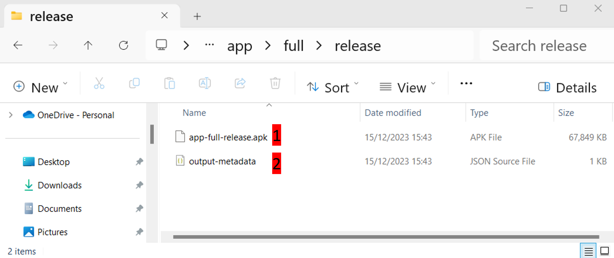

# Sestavení AAPS

## Vyrobte si místo stažení

**Aplikace AAPS (soubor apk) není k dispozici ke stažení, a to kvůli předpisům týkajícím se zdravotnických prostředků. Je legální vytvořit aplikaci pro své vlastní použití, ale nesmíte dát kopii ostatním!**

Podrobnosti viz [Oddíl FAQ](../Getting-Started/FAQ.md).

(Building-APK-recommended-specification-of-computer-for-building-apk-file)=

## Specifikace hardware a softwaru pro vytvoření AAPS

- K sestavení aplikace prosím používejte **[Android Studio ve verzi Hegehog (2023.1.1) nebo některou aktuálnější jako Iguana, Jellyfish nebo Koala] (https://developer.android.com/studio/)**. Starší verze Android Studio musí být nejprve aktualizovány!
- Na [32-bitových systémech Windows](troubleshooting_androidstudio-unable-to-start-daemon-process) není program Android Studio podporován. Mějte prosím na paměti, že 64bitový CPU a 64bitový OS jsou nutné podmínky. Pokud je váš systém nesplňuje, musíte vyměnit příslušný hardware nebo software nebo celý systém.

<table class="tg">
<thead>
  <tr>
    <th class="tg-baqh">OS (pouze 64bitový)</th>
    <th class="tg-baqh">Windows 8 nebo novější</th>
    <th class="tg-baqh">Mac OS 10.14 nebo novější</th>
    <th class="tg-baqh">Jakýkoli Linux, který podporuje Gnome, KDE nebo Unity DE;&nbsp;&nbsp;GNU C knihovnu 2.31 nebo novější</th>
  </tr>
</thead>
<tbody>
  <tr>
    <td class="tg-baqh"><p align="center">CPU (pouze 64bitový)</td>
    <td class="tg-baqh">CPU s architekturou x86_64; 2. generace Intel Core nebo novější, nebo AMD CPU s podporou <br><a href="https://developer.android.com/studio/run/emulator-acceleration#vm-windows" target="_blank" rel="noopener noreferrer"><span style="text-decoration:var(--devsite-link-text-decoration,none)">Windows Hypervisor</span></a></td>
    <td class="tg-baqh">Procesory založené na ARM nebo Intel Core 2. generace nebo novější s podporou <br><a href="https://developer.android.com/studio/run/emulator-acceleration#vm-mac" target="_blank" rel="noopener noreferrer"><span style="text-decoration:var(--devsite-link-text-decoration,none)">Hypervisor.Framework</span></a></td>
    <td class="tg-baqh">CPU s architekturou x86_64; Intel Core 2. generace nebo novější nebo processor AMD s podporou AMD Virtualization (AMD-V) a SSSE3</td>
  </tr>
  <tr>
    <td class="tg-baqh"><p align="center">RAM</td>
    <td class="tg-baqh" colspan="3"><p align="center">min. 8 GB</td>
  </tr>
  <tr>
    <td class="tg-baqh"><p align="center">Pevný disk</td>
    <td class="tg-baqh" colspan="3"><p align="center">Alespoň 30 GB volného místa. Je doporučeno SSD.</td>
  </tr>
  <tr>
    <td class="tg-baqh"><p align="center">Rozlišení</td>
    <td class="tg-baqh" colspan="3"><p align="center">1280 x 800 Minimum <br></td>
  </tr>
  <tr>
    <td class="tg-baqh"><p align="center">Internet</td>
    <td class="tg-baqh" colspan="3"><p align="center">Širokopásmové připojení</td>
  </tr>
</tbody>
</table>

\*\*Důrazně se doporučuje (není povinné) používat SSD (solid state disk) místo HDD (pevný disk), protože bude trvat méně času, než vytvoříte soubor AAPS. \* Stále můžete použít HDD, když vytváříte soubor apk **AAPS**. Pokud to uděláte, dokončení procesu sestavení může trvat dlouho, ale jakmile začnete, můžete ho nechat bez dozoru.

## Pomoc a podpora během procesu sestavení

Pokud narazíte na potíže v procesu vytváření aplikace **AAPS**, projděte nejdříve oddíl [**Řešení potíží se systémem Android Studio**](../Installing-AndroidAPS/troubleshooting_androidstudio).

Pokud si myslíte, že je v instrukcích k procesu sestavení chyba, něco chybí, přijde vám matoucí, nebo s tím stále zápasíte, kontaktujte prosím ostatní uživatele **AAPS** na [Facebooku](https://www.facebook.com/groups/AndroidAPSUsers) nebo [Discordu](https://discord.gg/4fQUWHZ4Mw). Pokud chcete sami něco změnit (aktualizovat snímek obrazovky apod.), odešlete [pull request (PR)] (../make-a-PR.md).

## Návod k sestavení aplikace AAPS krok za krokem

```{admonition} WARNING
:class: warning
If you have built AAPS before, you don't need to take all the following steps again.
Please jump directly to the [update guide](../Installing-AndroidAPS/Update-to-new-version)!
```

Základní kroky k sestavení apk souboru **AAPS** jsou následující:

4.1 [Instalace Git](Install-Git)

4.2 [Instalace Android Studia](Building-APK-install-android-studio)

4.3 [Stažení kódu AAPS](Building-APK-download-AAPS-code)

4.4 [Nastavení cesty ke Git v předvolbách Android Studia](Building-APK-set-git-path-in-preferences)

4.5 [Sestavení "podepsaného" apk souboru AAPS](Building-APK-generate-signed-apk)

V tomto průvodci najdete _příklady_ snímků obrazovky z vytváření apk souboru **AAPS**. Protože **Android Studio** - software, který používáme k sestavení aplikace **AAPS** - je pravidelně aktualizován, tyto screenshoty nemusí být s vaší instalací totožné, ale přesto by mělo být možné postup následovat.

Jelikož **Android Studio** běží na platformě Windows, Mac OS X i Linux, mohou existovat menší rozdíly v krocích na jednotlivých platformách.

(Install-Git)=

### Instalace gitu (pokud ho ještě nemáte)

```{admonition} Why Git? 
:class: dropdown

Git is known as a “_Versioning Control System_” (VCS).\
Git is a program that allows you to track changes in code and to collaborate with others. You will use Git to make a copy of the **AAPS** source code from the GitHub website to your local computer. Then, you will use Git on your computer to build the **AAPS** application (apk). 
```

#### Postup instalace Gitu

1. Zkontrolujte, že již nemáte **Git** nainstalován. Můžete to udělat zadáním „git“ do vyhledávacího panelu Windows – pokud vidíte \*\*„Git bash“ \*\* nebo jinou aplikaci Gitu, je již nainstalován a můžete jít rovnou na [Instalace Android Studia](Building-APK-install-android-studio).


2. Pokud nemáte nainstalovaný Git, stáhněte a nainstalujte si nejnovější pro váš systém [**zde**](https://git-scm.com/downloads). Jakákoliv nedávná verze Gitu by měla fungovat, vyberte správnou verzi pro váš systém, ať je to Mac, Windows nebo Linux.

**Poznámka pro uživatele Macu:** webová stránka Gitu vás také navede k instalaci programu "homebrew", který pomůže s instalací. Pokud instalujete git přes homebrew, není třeba měnit žádné předvolby.

(Make_a_note_of_Git_path)=

- V průběhu instalace, když budete požádání o "zadání umístění", si poznamenejte **cestu k instalaci Git**, kterou budete potřebovat v dalším kroku. Bude se jednat o cestu jako "C:\Program Files\Git\cmd\git.exe".

- V průběhu instalace Gitu jen přijměte všechny výchozí možnosti.

- Po instalaci, pokud jste si zapomněli poznamenat cestu k instalaci Gitu, najdete program takto: napište "git" do vyhledávacího panelu Windows, klikněte pravým tlačítkem myši na "Git bash", vyberte "open file location" a přejeďte myší na ikonu "Git bash", která pak odhalí, kde je instalována.

- Před dalším krokem restartujte počítač.

(Building-APK-install-android-studio)=

### Instalace Android Studio

- **Musíte zůstat online při provádění dalších kroků, protože Android Studio bude stahovat několik aktualizací**

```{admonition} What is Android Studio?
:class: dropdown
Android Studio is a program which runs on your computer. It allows you to download source code from the internet (using Git) and build smartphone (and smartwatch) apps. You cannot "break" a current, looping version of **AAPS** which you might have running on a smartphone by building a new or updated app on your PC with Android Studio, these are totally separate processes. 
```

Následující snímky obrazovky byly vytvořeny z Android Studia ve verzi **Hedgehog** a měly by být shodné s novějšími verzemi.

Jedna z nejdůležitějších věcí při instalaci aplikace Android Studio: Buďte trpěliví! Během instalace a nastavení aplikace Android Studio se stahuje spousta věcí, což zabere dost času.

Stáhněte si nejnovější verzi Android Studia [**zde**](https://developer.android.com/studio#downloads), umístěte ji ve složce stahování prohlížeče a nainstalujte ji do počítače:


Při prvním spuštění Android Studia budete přivítáni takto:


Vyberte "Další":


Ponechte zaškrtnutá políčka a klikněte na "Další":


Ponechte instalaci ve výchozím umístění a zvolte "Další":


Při dotazu na výběr složky Start Menu jednoduše vyberte "Install". Nyní budete muset počkat několik minut, než se Android Studio nainstaluje. Až uvidíte, že je instalace dokončena, klikněte na "Další":


Nyní klikněte na "Dokončit":


Android Studio se nyní spustí.

Pokud jste dotázali, zda chcete importovat nastavení, vyberte "Neimportovat nastavení". Nechceme importovat nastavení z předchozích instalací:


Rozhodněte, zda chcete sdílet data s Googlem nebo ne (pokud si nejste jisti, vyberte "Don't send").


Nyní obdržíte zprávu o chybějící sadě pro vývoj softwaru (Software Development Kit, SDK) (nebojte se, toto bude brzy vyřešeno), zvolte "Další":


Software by měl automaticky vybrat potřebné (SDK) a vybrat umístění.

```{admonition} What is an Android SDK?
:class: dropdown

In order to run **AAPS** on the phone the application needs to integrate with Android itself. Android provides “_software development kits_” (SDK) which allow apps like **AAPS** to interface with an Android operating system.
```

Balíček platforem SDK **neodpovídá** verzi, která běží na vašem telefonu, ale k sestavení **AAPS**. **AAPS** verze 3.2 (a novější) je postavené na API úrovně 34, která je v **Hedgehog** verzi **Android Studio** vybrána automaticky. Proto jednoduše klikněte na "Další":


Když jste požádáni o kontrolu nastavení, stačí vybrat "Další":


Po dotazu na licenční smlouvu vyberte "Přijmout" a poté klikněte na "Dokončit":


> **_Poznámka:_** V závislosti na vašem nastavení se mohou licence k přijetí lišit od toho, co je zobrazeno na snímku obrazovky.

Počkejte, dokud Android Studio nestáhne další komponenty. Může to trvat několik minut:


Jakmile je vše staženo, tlačítko "Dokončit" zmodrá a můžete na něj kliknout:


Nyní uvidíte uvítací obrazovku "Welcome to Android Studio".


(Building-APK-download-AAPS-code)=

### Stažení zdrojového kódu AAPS

```{admonition} Why can it take a long time to download the AAPS code?
:class: dropdown

The first time **AAPS** is downloaded, Android Studio will connect over the internet to the Github website to download the source code for **AAPS**. This should take about 1 minute. 

Android Studio will then use **Gradle** (a development tool in  Android studio) to identify other components needed to install these items on your computer. 

```

Na úvodní obrazovce Android Studia zkontrolujte, že **Projects**" (1) jsou zvýrazněny na levé straně. Poté klikněte na "**Get from VCS**" (2) vpravo:


- Nyní řekneme Android Studiu, odkud kód získat:

- Zvolte "Adresa URL úložiště" (výchozí) vlevo (1).

- Ve výchozím nastavení by měl být vybrán verzovací systém „Git“ (2).

Nyní zkopírujte tuto adresu URL:

```
https://github.com/nightscout/AndroidAPS.git
```

a vložte ji do textového pole URL (3).

- Zkontrolujte, zda je vhodný (výchozí) adresář pro uložení klonovaného kódu (4).

```{admonition} INFORMATION
:class: information
Make a note of the directory. It is where your sourcecode is stored!
```

- Nyní spusťte klonování kódu kliknutím na tlačítko "Clone" (5).


Nyní uvidíte obrazovku s informací, že se repozitář klonuje:


V určitém okamžiku můžete obdržet dotaz, jestli chcete projektu důvěřovat. Klikněte na "Trust project":



Pouze pro uživatele Windows: Pokud firewall požaduje oprávnění, udělte mu je:


Po úspěšném dokončení klonování repozitáře otevře Android Studio naklonovaný projekt.

Klepněte na ozubené kolečko vpravo nahoře a vyberte "**Switch to Classic UI...**" pro návrat k zobrazení použitého v této dokumentaci.

Pokud ikonu ozubeného kolečka nevidíte, nedělejte si starosti. Zobrazení Classic UI už máte spuštěné!


Restartujte Android Studio, aby se projevily provedené změny.


Může se objevit jedno nebo obě následující upozornění o probíhajících procesech. Obě můžete bezpečně zrušit.

 

Až Android Studio znovu nastartuje, trpělivě čekejte (může to trvat několik minut) a především **neaktualizujte** projekt, jak je vám navrhováno ve vyskakovacím okně.



```{admonition} NEVER UPDATE GRADLE!
:class: warning

Android Studio might recommend updating the gradle system. **Never update gradle!** This will lead to difficulties.
```

_Volitelně_ - pokud chcete odstranit vyskakování okna **"project update recommended"**, klikněte na modrý text "More" (1). V dialogovém okně pak vyberte "Don't ask for this project" (2).


Pouze pro uživatele Windows:
Pokud jste od instalace nebo aktualizace Git zatím nerestartovali počítač, vypněte nyní Android Studio. Potom restartujte počítač a Android Studio spusťte znovu.

(Building-APK-set-git-path-in-preferences)=

### Nastavte v předvolbách Android Studio cestu ke gitu

Nyní nastavíme v Android Studiu cestu k nainstalovanému systému [Git](Install-Git).

- Pouze pro uživatele Windows: Ujistěte se, že jste počítač po [instalaci Git](Install-Git) restartovali.
- Otevřete **Android Studio** (můžete ho spustit přes Vyhledávání ve Start menu).
- V levém horním rohu **Android Studia** přejděte na _File-Settings_ (Windows) nebo _Android Studio > Preferences_ (Mac). Dojde k otevření následujícího okna. Rozbalte menu "Version control" (1):


- Nyní vyberte "**Git**" (2).
- Ujistěte se, že v dolní střední části je jako Update method vybrána možnost "Merge" (3).
- Zkontrolujte, jestli **Android Studio** dokáže automaticky najít správnou cestu k souboru **git.exe** kliknutím na tlačítko "Test" (4):


- Pokud je automatické nastavení v pořádku, vedle cesty bude zobrazena vaše aktuální verze **Git**.

  

- Pokud zjistíte, že **git.exe** není nalezen automaticky nebo že kliknutím na tlačítko „Test“ dojde k chybě (1), můžete buď zadat ručně cestu, kterou jste si [dříve](Make_a_note_of_Git_path) uložili, nebo kliknout na ikonu složky (2) a ručně vybrat adresář, kde je **git.exe** uložen:

  

- Pokud si nejste jistí, kde je Git instalován, použijte [vyhledávání](https://www.tenforums.com/tutorials/94452-search-file-explorer-windows-10-a.html) ve Windows Exploreru. Detailní instrukce jsou popsány [výše](Make_a_note_of_Git_path).

- Pokud jste cestu ke Gitu zadali ručně, zkontrolujte správnost nastavení tlačítkem "Test", jak je popsáno výše.

Když je vedle cesty zobrazena verze Gitu (viz snímek obrazovky výše), úspěšně jste tuto fázi dokončili a můžete zavřít okno "Settings" v Android Studiu klepnutím na tlačítko "**OK**" (5):


(Building-APK-generate-signed-apk)=

### Sestavení "podepsaného" APK aplikace AAPS

```{admonition} Why does the AAPS app need to be "signed"?
:class: dropdown

Android requires each app to be _signed_, to ensure that it can only be updated later from the same trusted source that released the original app. For more information on this topic, follow [this link](https://developer.android.com/studio/publish/app-signing.html#generate-key). For our purposes, this just means that we generate a signing or "keystore" file and use it when we build the **AAPS** app.
```

- V panelu nabídek klikněte na "Build" (1) a vyberte "Generate Signed Bundle/APK (2)


- Vyberte variantu „APK“ namísto předvybrané „Android App Bundle“ a klikněte na „Next“:


- Na další obrazovce zkontrolujte, že "Module" je nastavený na "AAPS.app" (1).

(Building-APK-wearapk)=

```{admonition} INFORMATION!
:class: information
Pokud chcete vytvářet aplikaci pro vaše hodinky, musíte vybrat AAPS.wear!
```

- Kliknutím na "Create new..." (2) začnete vytvářet váš "keystore" soubor (úložiště klíčů).

```{admonition} INFORMATION!
:class: information
You will only need to create the keystore once.
If you have build AAPS before, do NOT create a new keystore but select your existing one!
```

**_Poznámka:_** Keystore je soubor, ve kterém jsou uložené informace pro podepisování aplikací. Tento soubor je zašifrovaný a chráněný heslem.



- Klikněte na ikonu "adresáře" (1) pro výběr cesty k vašemu kyestore soubru ve vašem počítači:



- Klikněte na rozbalovací nabídku (1) a vyberte, kam chcete svůj keystore soubor uložit. V tomto příkladu je soubor uložen ve složce "Moje dokumenty" (2). Neukládejte keystore do stejné složky jako soubory Android Studia (StudioProject). Zadejte jednoduchý název vašeho kyestore souboru (3) a potvrďte ho kliknutím na "OK" (4):


Tím se vrátíte na předchozí obrazovku. Na té bude zobrazena cesta k uložení vašeho keystore souboru.

```{admonition} WARNING!
:class: warning
Make sure to note down for yourself where your keystore is stored. You will need it when you build the next AndroidAPS update!
```

Nyní si vyberte (a poznamenejte) jednoduché heslo, zadejte ho do políčka Password (1) a potvrďte ho v políčku Confirm (2).  Heslo ke keystore souboru a uloženým klíčům nemusí být složité. Pokud v budoucnosti heslo zapomenete, podívejte se na [řešení problému se ztraceným keystore souborem](troubleshooting_androidstudio-lost-keystore).

Výchozí alias (3) pro váš klíč je "key0", ponechte to beze změny.

Teď potřebujete heslo k vašemu klíči. Pro zjednodušení, pokud chcete, můžete použít stejné heslo jako k vašemu keystore souboru. Zadejte heslo (4) a potvrďte ho (5).

```{admonition} WARNING!
:class: warning
Note down these passwords! You will need them when you build the next AAPS update!
```

Platnost (6) je ve výchozím stavu 25 let. Ponechte to tak, jak je.

Zadejte vaše jméno a příjmení (7). Žádné další informace není nutné zadávat.

Pro pokračování klikněte na "OK" (8):


V okně "Generate signed bundle or APK" teď bude zobrazena cesta k vašemu keystore souboru. Zadejte znovu heslo k vašemu keystore souboru (1) a klíči (2) a zaškrtněte checkbox "Remember passwords" (3), abyste je příště nemuseli zadávat znovu (typicky při sestavování aktualizované verze AAPS). Klikněte na tlačítko "Next" (4):


Na další obrazovce vyberte variantu "fullRelease" (1) a klikněte na tlačítko "Create" (2).


Android Studio teď sestaví aplikační soubor APK **AAPS**. Ve spodní části obrazovky se ukáže hlášení "Gradle Build Running". Proces bude nějakou dobu trvat, v závislosti na výkonu vašeho počítače a rychlosti připojení na internet, tak buďte **trpělivý!** Pokud chcete sledovat průběh sestavovaání aplikace, klikněte na malou ikonu kladiva s nápisem "Build" v dolní části okna Android Studia:


Nyní můžete sledovat proces sestavování:


Po dokončení sestavení aplikace zobrazí Android Studio informaci "BUILD SUCCESSFUL". Můžete vidět vyskakovací okno na kterém můžete kliknout na text "locate". Pokud vám unikne, otevřete si seznam oznámení kliknutím na oznámení "locate or analyze the APK" (žlutý rámeček) ve spodní části obrazovky:



_Pokud bylo sestavení neúspěšné, podívejte se do sekce [Řešení problémů](../Installing-AndroidAPS/troubleshooting_androidstudio)._

V oznámení klikněte na modrý odkaz "locate":


Otevře se Windows Explorer / souborový manažer. Přejděte do adresáře "full" (1) > "release" (2).


Otevřete adresář "release". Soubor "app-full-release.apk" (1) je APK soubor aplikace **AAPS**, který jste právě vytvořili a který následně přenesete do vašeho telefonu, jak je popsáno v další části dokumentace:



Congratulations! Nyní máte vytvořený APK soubor aplikace **AAPS** a můžete se přesunout k následující sekci [Přesun a instalace **AAPS**](Transferring-and-installing-AAPS.md).
