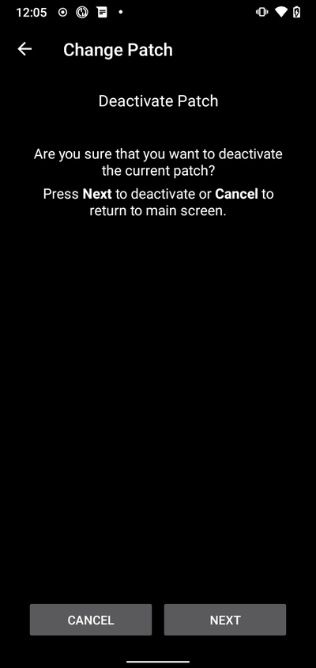
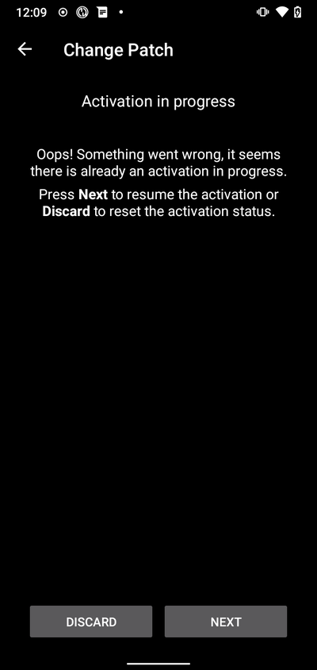

# Medtrum Nano / 300U

Diese Anleitung beschreibt die Konfiguration der Medtrum Insulinpumpe.

Diese Software ist Teil einer DIY-Lösung (Do It Yourself = Eigenbau) und kein kommerzielles Produkt. Daher bist DU gefordert. DU musst lesen, lernen und verstehen, was das System macht und wie du es bedienst. Du bist ganz alleine dafür verantwortlich, was Du mit dem System machst.

## Funktionalitäten bei der Nutzung mit AAPS
* Alle Loop-Funktionen werden unterstützt (SMB, TBR usw.)
* Automatischer Zeitzonenwechsel und Sommer-/Winterzeitumstellung
* Verlängerter/verzögerter Bolus wird nicht unterstützt

## Hardware- und Software-Anforderungen
* **Kompatible Medtrum Pumpenbasen und Reservoir-Patches**
    - Aktuell werden unterstützt:
        - Medtrum TouchCare Nano mit Pumpenbasis Ref.: **MD0201** und **MD8201**.
        - Medtrum TouchCare 300U mit Pumpenbasis Ref.: **MD8301**.
        - Wenn Du ein bisher nicht unterstütztes Modell hast und bereit bist es zu spenden oder Du beim Testen helfen möchtest, kontaktiere uns über den Discord-Kanal [hier](https://discordapp.com/channels/629952586895851530/1076120802476441641).
* **AAPS Version 3.2.0.0 oder neuer sind erstellt und installiert**. Das Vorgehen ist in der Anleitung im Abschnitt [AAPS installieren - App erstellen](../Installing-AndroidAPS/Building-APK.md) beschrieben.
* **Kompatibles Android Smartphone** mit Bluetooth-Verbindung (Bluetooth Low Energy, BLE)
    - Vgl. AAPS [Release Notes](../Installing-AndroidAPS/Releasenotes.md)
* [**Kontinuierliche Glukosemessung (CGM)**](BG-Source.md)

## Bevor du startest

**Sicherheit geht vor** - Stelle sicher, dass Du auf eventuell auftretende Fehler reagieren kannst, bevor Du diesen Prozess beginnst: zusätzliche Patches, Insulin und Smartphone mit vollem Akku sind unbedingt notwendig).

**Die PDM- und Medtrum-App wird nicht mit einem Patch funktionieren, der durch AAPS aktiviert wurde.** Vorher hast Du möglicherweise den PDM oder die Medtrum App verwendet, um Befehle an die Patchpumpe zu senden. Aus Sicherheitsgründen kannst einen aktivierten Patch nur mit dem Gerät oder der App verwenden, die zu dessen Aktivierung verwendet wurde.

*Das heißt NICHT, dass Du Deinen PDM wegwerfen solltest. Verwahre ihn an einem sicheren Ort als Backup für einen Notfall (z.B. Verlust Deines Smartphones oder AAPS Probleme).*

**Deine Pumpe wird auch dann Insulin abgeben, wenn es sie nicht mit AAPS verbunden ist**. Die Basalrate des aktiven AAPS Profils ist in der Patch-Pumpe hinterlegt. Eine funktionsfähiges AAPS, sendet Basalraten-Befehle, die maximal 120 Minuten abdecken. Sollte die Pumpe aus irgendeinem Grund keine neuen Befehle erhalten (z.B. weil die Pumpe und das Smartphone zu weit voneinander entfernt sind), wird die Pumpe auf die in der Pumpe hinterlegte Standardbasalrate zurückfallen, sobald die temporäre Basalrate endet.

**Basalraten-Profile mit 30-Minuten-Schritten werden in AAPS NICHT unterstützt.** Wenn Du AAPS als Neuling nutzt und zum ersten Mal Dein Basalprofil einrichtest, beachte bitte, dass Deine Basalraten im Profil nur zur vollen Stunde starten und 60 Minuten dauern. Basalraten, die zu einer halben Stunde beginnen und/oder 30 Minuten dauern, werden nicht unterstützt und führen zu Fehlern. Wenn Du zum Beispiel eine Basalrate von 1,1 Einheiten hast, die um 9:30 Uhr startet und zwei Stunden bis 11:30 Uhr läuft, wird dies nicht funktionieren. Du muss diese 1,1 IE Basalrate auf einen Zeitraum von entweder 9:00 - 11:00 Uhr oder 10:00 - 12:00 Uhr einstellen. Der in AAPS verwendete Algorithmus kann halbstündige Basalraten nicht verarbeiten, auch wenn die Hardware der Medtrum-Pumpe dies unterstützen könnte.

Gleiches gilt auch für 'Null-Basalraten'. **Basalraten mit 0 IE/h werden in AAPS NICHT unterstützt**. AAPS benutzt Vielfache der im Profil hinterlegten Basalrate, um die benötigte Insulinmenge zu berechnen. Mit 'Null-Basalraten' funktioniert diese Berechnungn nicht, auch wenn die Metrum-Pumpe diese unterstützen könnte. Eine temporäre Null-Basalrate kann durch die Funktion PUMPE TRENNEN oder durch eine Kombination aus LOOP DEAKTIVIEREN/TEMP BASALRATE oder LOOP PAUSIEREN/TEMP BASALRATE erreicht werden.

## Einrichtung

ACHTUNG: Wenn ein Patch mit AAPS mit aktiviert wird, **MÜSSEN** alle anderen Geräte, die mit der Medtrum Pumpenbasis sprechen könnten, deaktiviert werden. z.B. ein aktiver PDM und die Medtrum-App. Vergewissere Dich, dass Du Deine Pumpenbasis und deren Seriennummer für die Aktivierung eines neuen Patches bereit hast.

### Schritt 1: Wähle die Medtrum-Pumpe aus

#### Option 1: Neue Installation

Wenn Du AAPS erstmals installierst, führt Dich der **Einrichtungsassistent** durch die AAPS-Installation. Wenn Du das Pumpenauswahlmenü erreichst, wähle "Medtrum" aus.

Falls Du Dir nicht sicher bist, kannst Du auch zunächst die „Virtuelle Pumpe“ auswählen und nachdem AAPS fertig eingerichtet ist, später dann auf „Medtrum“ wechseln (siehe Option 2).

#### Option 2: Der Konfigurations-Generator

Bei einer bestehenden Installation kannst Du die **Medtrum**-Pumpe unter [Konfiguration](Config-Builder.md#config-builder-profile) auswählen:

Das **Hamburger-Menü** in der oberen linken Ecke antippen und **Konfiguration**\ ➜\ **Pumpe**\ ➜\ **Medtrum**\ durch **Aktivieren** des Optionsfelds vor dem Namen **Medtrum** auswählen.

Wenn Du das **Kontrollkästchen** neben dem **Zahnrad** auswählst, wird die Medtrum-Übersicht als Registerkarte **MEDTRUM**> in der AAPS-Menüleiste sichtbar werden. Wenn Du dieses Kästchen aktivierst, hast Du beim Nutzen von AAPS einen einfachen Zugriff auf die Medtrum-Befehle und es wird deshalb sehr empfohlen.

### Schritt 2: Ändern der Medtrum-Einstellungen

Öffne die Medtrum-Einstellungen, in dem Du unter KONFIGURATION/Pumpe das auf das **Zahnrad** neben dem Eintrag für die Medtrum tippst.

#### Seriennummer:

Gib die Seriennummer Deiner Pumpen-Basis so ein, wie sie dort abgebildet ist. Stell sicher, dass die Seriennummer richtig eingegeben ist und keine Leerzeichen enthält (Du kannst sowohl Groß- als auch Kleinbuchstaben verwenden).

HINWEIS: Diese Einstellung kann nur dann geändert werden, wenn kein Patch aktiv ist.

#### Alarm-Einstellungen

***Voreingestellt: Piepton.***

Diese Einstellung ändert die Art und Weise, wie die Pumpe Dich im Falle einer Warnung oder eines Fehlers alarmiert.

- Piepton > Der Patch wird bei Alarmen oder Warnungen piepen
- Stumm > Der Patch wird Dich nicht alarmieren und auch keine Warnungen abgeben

Hinweis: Im Stumm-Modus gibt AAPS je nach Lautstärkeeinstellungen Deines Smartphones immer noch den Alarm aus. Wenn Du auf den Alarm nicht reagierst, wird der Patch irgendwann piepen.

#### Notification on pump warning (Benachrichtung bei Pumpenwarnung)

***Voreingestellt: Aktiviert.***

Diese Einstellungen ändern die Art und Weise, wie AAPS Benachrichtigung bei nicht kritischen Pumpenwarnungen anzeigt. Wenn die Option aktiviert ist, wird beim Auftreten einer Pumpenwarnung eine Benachrichtigung auf dem Smartphone angezeigt. Das betrifft auch:
    - Niedriger Akkustand
    - Reservoir fast leer (20 IE)
    - Patch-Ablaufwarnung

In jedem Fall werden diese Warnungen auch auf der Medtrum-Übersichtsseite unter [Aktive Alarme](#active-alarms) angezeigt.

#### Patch Ablaufdatum

***Voreingestellt: Aktiviert.***

Diese Einstellung ändert das Verhalten des Patches. Wenn aktiviert, läuft der Patch nach 3 Tagen ab und gibt, sofern die Lautstärkeeinstellungen entsprechend gesetzt sind, eine hörbare Warnung. Nach 3 Tagen und 8 Stunden wird der Patch nicht mehr funktionieren.

Wenn diese Einstellung deaktiviert ist, wird der Patch keine Warnung abgeben und läuft weiter, bis die Patch-Batterie oder das Reservoir leer sind.

#### Pump expiry warning \[hours\] (Patch Ablaufwarnung)

***Default: 72 hours.***

This setting changes the time of the expiration warning, when [Patch Expiration](#patch-expiration) is enabled, AAPS will give a notification on the set hour after activation.

#### Stündliches Maximum Insulin

***Default: 25U.***

This setting changes the maximum amount of insulin that can be delivered in one hour. If this limit is exceeded the patch will suspend and give an alarm. The alarm can be reset by pressing the reset button on in the overview menu see [Reset alarms](#reset-alarms).

Set this to a sensible value for your insulin requirements.

#### Tägliches Maximum Insulin

***Default: 80U.***

This setting changes the maximum amount of insulin that can be delivered in one day. If this limit is exceeded the patch will suspend and give an alarm. The alarm can be reset by pressing the reset button on in the overview menu see [Reset alarms](#reset-alarms).

Set this to a sensible value for your insulin requirements.

### Step 2b: AAPS Alerts settings

Go to preferences

#### Pumpe:

##### BT Watchdog

Go to preferences and select **Pump**:

##### BT Watchdog

This setting will try to work around any BLE issues. It will try to reconnect to the pump when the connection is lost. It will also try to reconnect to the pump when the pump is unreachable for a certain amount of time.

Enable this setting if you experience frequent connection issues with your pump.

#### Local Alerts:

Go to preferences and select **Local Alerts**:

##### Alarm, wenn die Pumpe nicht erreichbar ist

***Voreingestellt: Aktiviert.***

This setting is forced to enabled when the Medtrum driver is enabled. It will alert you when the pump is unreachable. This can happen when the pump is out of range or when the pump is not responding due to a defective patch or pumpbase, for example when water leaks between the pumpbase and the patch.

For safety reasons this setting cannot be disabled.

##### Grenzwert Pumpe ist nicht erreichbar [min]

***Default: 30 min.***

This setting changes the time after which AAPS will alert you when the pump is unreachable. This can happen when the pump is out of range or when the pump is not responding due to a defective patch or pumpbase, for example when water leaks between the pumpbase and the patch.

This setting can be changed when using Medtrum pump but it is recommended to set it at 30 minutes for safety reasons.

### Step 3: Activate patch

**Before you continue:**
- Have your Medtrum Nano pumpbase and a reservoir patch ready.
- Make sure that AAPS is properly set up and a [profile is activated](../Usage/Profiles.md).
- Other devices that can talk to the Medtrum pump are disabled (PDM and Medtrum app)

#### Activate patch from the Medtrum overview Tab

Navigate to the [Medtrum TAB](#overview) in the AAPS interface and press the **Change Patch** button in the bottom right corner.

If a patch is already active, you will be prompted to deactivate this patch first. see [Deactivate Patch](#deactivate-patch).

Follow the prompts to fill and activate a new patch. Please note - it is important to only connect the pumpbase to the reservoir patch at the step when you are prompted to do so. **You must only put the pump on your body and insert the cannula when prompted to during the activation process (after priming is complete).**

##### Start Activation

At this step, double check your serial number and make sure the pumpbase is not connected to the patch yet.

Drücke **Weiter**, um fortzufahren.

##### Fill the patch

Once the patch is detected and filled with a minimum of 70Units of insulin, press **Next** will appear.

##### Prime the patch

Do not remove the safety lock and press the needle button on the patch.

Press **Next** to start prime

Once the prime is complete, press **Next** to continue.

##### Patch setzen

Clean the skin, remove stickers and attach the patch to your body. Remove safety lock and press the needle button on the patch to insert the cannula.

Press **Next** to activate the patch.

##### Patch aktivieren

When activation is complete, the following screen will appear

Drücke **OK** um zum Hauptbildschirm zurückzukehren.

### Deactivate patch

To deactivate a currently active patch, go to the [Medtrum TAB](#overview) in the AAPS interface and press the **Change Patch** button.

You will be asked to confirm that you wish to deactivate the current patch. **Please note that this action is not reversable.** When deactivation is completed, you can press **Next** to continue the process to activate a new patch. If you are not ready to activate a new patch, press **Cancel** to return to the main screen.

If Android APS in unable to deactivate the patch (For instance because the pumpbase has already been removed from the reservoir patch), you may press **Discard** to forget the current patch session and make it possible to activate a new patch.

Once deactivation is complete, press **OK** to return to main screen or press **Next** to continue the process to activate a new patch.

### Resume interrupted activation

If a patch activation is interrupted, for instance because the phone battery runs out, you can resume the activation process by going to the [Medtrum TAB](#overview) in the AAPS interface and press the **Change Patch** button.

Press **Next** to continue the activation process. Press **Discard** to discard the current patch session and make it possible to activate a new patch.

The driver will try to determine the current status of the patch activation. If this was successful it will go into the activation progress at the current step.

## Übersicht

The overview contains the current status of the Medtrum patch. It also contains buttons to change the patch, reset alarms and refresh the status.

##### BLE Status:

This shows the current status of the Bluetooth connection to the pumpbase.

##### Zuletzt verbunden:

This shows the last time the pump was connected to AAPS.

##### Pumpenstatus:

This shows the current state of the pump. Zum Beispiel:
    - ACTIVE : The pump is activated and running normally
    - STOPPED: The patch is not activated

##### Basaltyp:

This shows the current basal type.

##### Basalrate:

This shows the current basal rate.

##### Letzter Bolus:

This shows the last bolus that was delivered.

##### Active bolus:

This shows the active bolus that is currently being delivered.

##### Aktive Alarme:

This shows any active alarms that are currently active.

##### Reservoir:

This shows the current reservoir level.

##### Batterie:

This shows the current battery voltage of the patch.

##### Pumpentyp:

This shows the current pump type number.

##### FW-Version:

This shows the current firmware version of the patch.

##### Patch no:

This shows the sequence number of the activated patch. This number is incremented every time a new patch is activated.

##### Patch läuft ab:

This shows the date and time when the patch will expire.

##### Aktualisieren:

This button will refresh the status of the patch.

##### Change patch:

This button will start the process to change the patch. See [Activate patch](#activate-patch) for more information.

### Alarme zurücksetzen

The alarm button will appear on the overview screen when there is an active alarm that can be reset. Pressing this button will reset the alarms and resume insulin delivery if the patch has been suspended due to the alarm. z.B. when suspended due to a maximum daily insulin delivery alarm.

Press the **Reset Alarms** button to reset the alarms and resume normal operation.

## Problembehandlung

### Connection issues

If you are experiencing connection timeouts or other connection issues:
- In Android application settings for AAPS: Set location permission to "Allow all the time".

### Activation interrupted

If the activation process is interrupted for example by and empty phone battery or phone crash. The activation process can be resumed by going to the change patch screen and follow the steps to resume the activation as outlined here: [Resume interrupted activation](#resume-interrupted-activation)

### Preventing patch faults

The patch can give a variety of errors. To prevent frequent errors:
- Make sure the pumpbase is properly seated in the patch and no gaps are visible.
- When filling the patch do not apply excessive force to the plunger. Do not try to fill the patch beyond the maximum that applies to your model.

## Where to get help

All of the development work for the Medtrum driver is done by the community on a **volunteer** basis; we ask that you to remember that fact and use the following guidelines before requesting assistance:

-  **Level 0:** Lies den entsprechenden Abschnitt dieser Dokumentation um sicherzustellen, dass du verstehst, wie die Funktion, mit der Du Schwierigkeiten hast, funktionieren soll.
-  **Level 1:** If you are still encountering problems that you are not able to resolve by using this document, then please go to the *#Medtrum* channel on **Discord** by using [this invite link](https://discord.gg/4fQUWHZ4Mw).
-  **Level 2:** Vorhandene 'Issues' durchsuchen um zu sehen, ob Dein Problem bereits in den [Issues](https://github.com/nightscout/AAPS/issues) gemeldet wurde. Falls vorhanden, bitte bestätige/kommentiere/ergänze Informationen zu Deinem Problem. Wenn nicht, erstelle bitte ein [neues Issue](https://github.com/nightscout/AndroidAPS/issues) und füge [Deine Logdateien](../Usage/Accessing-logfiles.md) an.
-  **Sei geduldig - die meisten Mitglieder unserer Community sind gutmütige Freiwillige und die Lösung von Problemen erfordert oft Zeit und Geduld von Nutzern und Entwicklern.**
