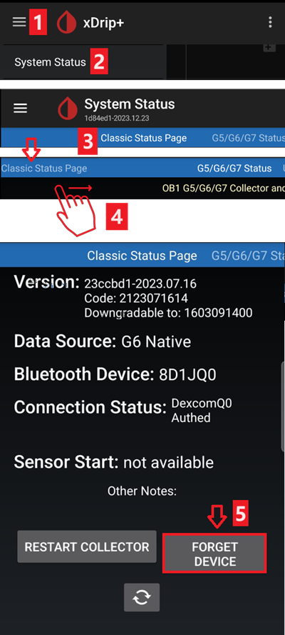
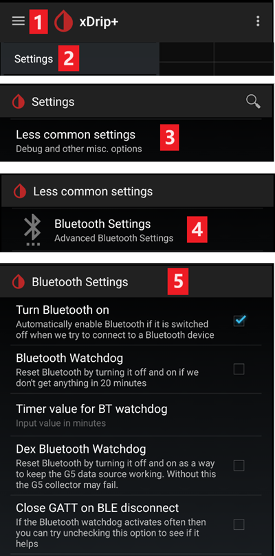
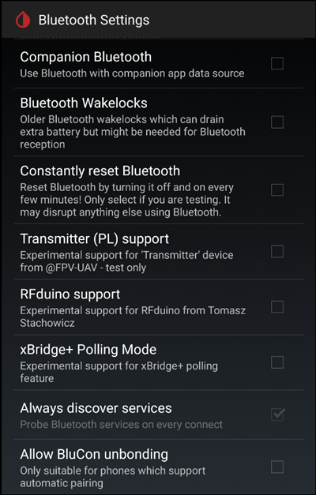
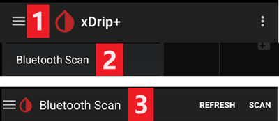

# xDrip+ Einstellungen

If not already set up, then download [xDrip+](https://jamorham.github.io/#xdrip-plus).

Disable battery optimization and allow background activity for the xDrip+ app.

You can safely download the [latest APK (stable)](https://xdrip-plus-updates.appspot.com/stable/xdrip-plus-latest.apk) unless you need recent features or are using sensors that are being actively integrated (like G7), in which case you should use the latest [Nightly Snapshot](https://github.com/NightscoutFoundation/xDrip/releases).

## Grundsätzliche Einstellungen für alle CGM & FGM-Systeme

### Disable Nightscout upload

Starting with AAPS 3.2, you shouldn't let any other app upload data (blood glucose and treatments) to Nightscout.

→ Hamburger Menu (1) → Settings (2) → Cloud Upload (3) -> Nightscout Sync (REST-API)(4) → Switch **OFF** `Enabled` (5)

#### Disable automatic calibration and treatments

If you use an older version of AAPS (before 3.2), make sure to deactivate `Automatic Calibration` (7) If the checkbox for `Automatic Calibration` is checked, activate `Download treatments` (6) once, then remove the checkbox for `Automatic Calibration` and deactivate `Download treatments` again.

Tap `Extra Options`(8)

:::{admonition} Safety warning :class: warning You must deactivate "Upload treatments" from xDrip+, otherwise treatments can be doubled in AAPS leading to false COB and IOB.  
:::

Deactivate `Upload treatments`(9) and make sure you will **NOT** use `Back-fill data` (11).

Option `Alert on failures` should also be deactivated (10). Otherwise you will get an alarm every 5 minutes in case Wi-Fi/mobile network issues or if the server is not available.

### **Inter-app Settings** (Broadcast)

If you are going to use AAPS and the data should be forwarded to i.e. AAPS you have to activate broadcasting in xDrip+ in Inter-App settings.

→ Hamburger Menu (1) → Settings (2) → Inter-app settings (3) → Broadcast locally **ON** (4)

In order for the values to be identical in AAPS with respect to xDrip+, you should activate `Send the displayed glucose value` (5).

Enable Compatible Broadcast (6).

If you have also activated `Accept treatments` in xDrip+ and `Enable broadcasts to xDrip+` in AAPS xDrip+ plugin, then xDrip+ will receive insulin, carbs and basal rate information from AAPS.

If you enable `Accept Calibrations`, xDrip+ will use the calibrations from AAPS. Be careful when you use this feature with Dexcom sensors: read [this](https://navid200.github.io/xDrip/docs/Calibrate-G6.html) first.

Remember to disable Import Sounds to avoid xDrip+ making a ringtone every time AAPS sends a basal/profile change.

(xdrip-identify-receiver)=

#### Identifiziere Empfänger

- If you discover problems with local broadcast (AAPS not receiving BG values from xDrip+) go to → Hamburger Menu (1) Settings (2) → Inter-app settings (3) → Identify receiver (7) and enter `info.nightscout.androidaps` for AAPS build (if you are using PumpControl build, please enter `info.nightscout.aapspumpcontrol` instead!!).
- Achtung: Die Auto-Korrektur neigt manchmal dazu, das i von info in einen Großbuchstaben zu ändern. Du **darfst nur Kleinbuchstaben** verwenden, wenn Du `info.nightscout.androidaps` (oder `info.nightscout.aapspumpcontrol` für PumpControl eingibst), da die Groß-/Kleinschreibung beachtet wird. Mit einem groß geschriebenen 'I' kann AAPS keine Glukose-Werte aus xDrip+ empfangen.
    
    

## Use AAPS to calibrate in xDrip+

- If you want to be able to use AAPS to calibrate then in xDrip+ go to Settings → Interapp Compatibility → Accept Calibrations and select ON. 
- You may also want to review the options in Settings → Less Common Settings → Advanced Calibration Settings.

## Dexcom G6

- Der Dexcom G6-Transmitter kann gleichzeitig mit einem Dexcom-Empfänger (oder alternativ mit der t:slim-Pumpe) und einer App auf dem Handy verbunden werden.
- Wenn Du xDrip+ zum Empfang der CGM-Daten verwendest, deinstalliere zuerst die Dexcom App. **Du kannst xDrip+ und die Dexcom App nicht gleichzeitig mit dem Transmitter verbinden!**
- If you need Clarity and want to profit from xDrip+ features, use the [Build Your Own Dexcom App](DexcomG6-if-using-g6-with-build-your-own-dexcom-app) with local broadcast to xDrip+, or use xDrip+ as a Companion app receiving notifications from the official Dexcom app.

### xDrip+ Version abhängig von der G6 Transmitter Seriennummer

- All G6 transmitters manufactured after fall/end 2018 are called "Firefly". They do not allow sensor restart without [removing the transmitter](https://navid200.github.io/xDrip/docs/Remove-transmitter.html), they do not send raw data. It is recommended to use the latest [Nightly Snapshot](https://github.com/NightscoutFoundation/xDrip/releases).
- Old rebatteried transmitters and modified trasmitters allow sensor life extension and restarts, they also send raw data. You can use the [latest APK (stable)](https://xdrip-plus-updates.appspot.com/stable/xdrip-plus-latest.apk).

### Dexcom-spezifische Einstellungen

- Follow [these instructions](https://navid200.github.io/xDrip/docs/G6-Recommended-Settings.html) to setup xDrip+.

### Preemptive restarts werden nicht empfohlen

**Only rebatteried or modified Dexcom transmitters. [Preemptive restarts](https://navid200.github.io/xDrip/docs/Preemptive-Restart.html) do not work with standard transmitters and will stop the sensor completely: you need to [remove the transmitter](https://navid200.github.io/xDrip/docs/Remove-transmitter.html) to restart the sensor.**

Die automatische Verlängerung von Dexcom G6 Sensoren (`preemptive restarts`) wird nicht empfohlen, da dies zu Sprüngen in den BZ-Werten nach dem Neustart am 9. Tag führen kann.

Mache Dir die folgenden Punkte bewusst, um das System sicher zu nutzen:

- Wenn Du mit nativen Daten und dem Kalibrierungscode in xDrip+ oder Spike arbeitest, ist es am sichersten, auf den "preemptive" Neustart des Sensors zu verzichten.
- Falls Du den "preemptive restart" verwendest, stelle sicher, dass dieser zu einer Tageszeit erfolgt, zu der Du die Änderungen verfolgen und ggf. durch eine Kalibrierung eingreifen kannst. 
- Falls Du Sensoren verlängerst, verzichte aus Sicherheitsgründen entweder auf die Werkskalibrierung an Tag 11 und 12 oder stelle sicher, dass Du die Abweichungen im Auge hast und evtl. durch Kalibrierung korrigieren kannst.
- Das sogenannte "Pre-soaking" (Sensor früher ohne Transmitter setzen, damit er sich an die Gewebsflüssigkeit "gewöhnt") mit Werkskalibrierung führt wahrscheinlich zu Abweichungen in den Glukosewerten. Falls Du mit "pre-soaking" arbeitest, wirst Du wahrscheinlich besser Ergebnisse erzielen, wenn Du den Sensor kalibrierst.
- Wenn Du nicht auf die Abweichungen, die stattfinden können, achten willst, wäre es evtl. besser bei der Verlängerung auf die Werkskalibrierung zu verzichten und das System wie den G5 (mit "Pflichtkalibrierung") zu nutzen.

Mehr zu den Details und Gründen für diese Empfehlungen findest Du im [kompletten Artikel](https://www.diabettech.com/artificial-pancreas/diy-looping-and-cgm/) (englisch) von Tim Street auf seiner Seite [www.diabettech.com](https://www.diabettech.com).

(xdrip-connect-g6-transmitter-for-the-first-time)=

### G6 Transmitter das erste Mal verbinden

**Für den zweiten und alle weiteren Transmitter siehe [Transmitterlaufzeit verlängern](xdrip-extend-transmitter-life) weiter unten.**

Follow [these instructions](https://navid200.github.io/xDrip/docs/Starting-G6.html).

(xdrip-transmitter-battery-status)=

### Transmitter-Batteriestatus

- Battery status can be controlled in system status  
    → Hamburger Menu (1) → System Status (2) → If you are on the Classic Status Page (3) swipe the screen (4) to reach → G5/G6/G7 Status screen.

- See [here](https://navid200.github.io/xDrip/docs/Battery-condition.html) for more information.

(xdrip-extend-transmitter-life)=

### Transmitterlaufzeit verlängern

- [Lifetime](https://navid200.github.io/xDrip/docs/Transmitter-lifetime.html) cannot be extended for Firefly transmitters: only rebatteried or modified transmitters.
- Follow [these instructions](https://navid200.github.io/xDrip/docs/Hard-Reset.html) for non-Firefly transmitters.

(xdrip-replace-transmitter)=

### Transmitter ersetzen

- Schalte den Original Dexcom Empfänger aus (falls Du diesen verwendet).
- [Stop sensor](https://navid200.github.io/xDrip/docs/Dexcom/StartG6Sensor.html) (only if replacing sensor).

- Gerät in den Bluetooth-Einstellungen von xDrip+ UND des Smartphones löschen (wird als Dexcom?? angezeigt, dabei steht ?? are the last two digits of the transmitter serial no.)  
    → Hamburger Menu (1) → System Status (2) → If you are on the Classic Status Page (3) swipe the screen (4) to reach → G5/G6/G7 Status screen → Forget Device (5).

- Remove transmitter (and sensor if replacing sensor). To remove transmitter without removing sensor see [this](https://navid200.github.io/xDrip/docs/Remove-transmitter.html), or this video <https://youtu.be/AAhBVsc6NZo>.
- Lege den alten Transmitter weit weg, um eine erneute Verbindung zu verhindern. A microwave is a perfect Faraday shield for this - but unplug power cord to be 100% sure no one is turning the microwave on.
- Follow [these instructions](https://navid200.github.io/xDrip/docs/Starting-G6.html).
- Falls Du den Dexcom Empfänger nutzt, schalte diesen nicht ein, bevor xDrip+ die ersten BZ-Werte anzeigt.

### Neuer Sensor

- Schalte den Original Dexcom Empfänger aus (falls Du diesen verwendet).
- Stop sensor following [these instructions](https://navid200.github.io/xDrip/docs/Dexcom/StartG6Sensor.html).

- Insert and then start a new sensor following [these instructions](https://navid200.github.io/xDrip/docs/Starting-G6.html).

(xdrip-retrieve-sensor-code)=

### Sensorcode in den Logs finden

→ Hamburger Menu (1) → System Status (2) → If you are on the Classic Status Page (3) swipe the screen (4) to reach → G5/G6/G7 Status screen → Calibration Code.

(xdrip-troubleshooting-dexcom-g5-g6-and-xdrip)=

### Fehlerbehebung Dexcom G5/G6 und xDrip+

#### Problem beim Verbinden mit dem Transmitter

Follow [these instructions](https://navid200.github.io/xDrip/docs/Connectivity-troubleshoot.html).

#### Probleme beim Starten eines neuen Sensors

Follow [these instructions](https://navid200.github.io/xDrip/docs/Dexcom/SensorFailedStart.html).

## Libre 1

- Setup your NFC to Bluetooth bridge in xDrip+
    
    → Hamburger Menu (1) → Settings (2) → Less common settings (3) → Bluetooth Settings (4)

- In Bluetooth Settings set the checkboxes exactly as in the screenshots below (5)
    
    - Disable watchdogs as they will reset the phone Bluetooth and interrupt your pump connection.
    
    

- You can try to enable the following settings (7)
    
    - Verwende Scannen
    - Trust Auto-Connect
    - Use Background Scans

- If you easily lose connection to the bridge or have difficulties recovering connection, **DISABLE THEM** (8).
    
    

- Leave all other options disabled unless you know why you want to enable them.
    
    

### Batteriestand Libre Smart Reader

- Battery level of bridges such as MiaoMiao and Bubble can be displayed in AAPS (not Blucon).
- Weitere Details findest Du auf der [Screenshot-Seite](Screenshots-sensor-level-battery).

### Libre Transmitter verbinden und Sensor starten

- If your sensor requires it (Libre 2 EU and Libre 1 US) install the [latest out of process algorithm](https://drive.google.com/file/d/1f1VHW2I8w7Xe3kSQqdaY3kihPLs47ILS/view).

- Your sensor must be already started using the vendor app or the reader (xDrip+ cannot start or stop Libre sensors).

- Set the data source to Libre Bluetooth.
    
    → Hamburger Menu (1) → Settings (2) → Select Libre Bluetooth in Hardware Data source (3)
    
    

- Scan Bluetooth and connect the bridge.
    
    → Hamburger Menu (1) → Scan Bluetooth (2) → Less common settings (3) → Bluetooth Settings (4)
    
    - If xDrip+ can't find the bridge, make sure it's not connected to the vendor app. Put it in charge and reset it.
    
    

- Start the sensor in xDrip+.
    
    :::{admonition} Safety warning :class: warning Do not use sensor data before the one hour warm-up is over: the values can be extremely high and cause wrong decisions in AAPS.  
    :::
    
    → Hamburger Menu (1) → Start sensor (2) → Start sensor (3) → Set the exact time you started it with the reader or the vendor app. If you didn't start it today, answer "Not Today" (4).

## Libre 2 patched app

- Set the data source to Libre patched app.
    
    → Hamburger Menu (1) → Settings (2) → Select Libre (patched App) in Hardware Data source (3)
    
    

- You can add `BgReading:d,xdrip libre_receiver:v` under Less Common Settings->Extra Logging Settings->Extra tags for logging. Damit werden evtl. Fehlermeldungen protokolliert.

