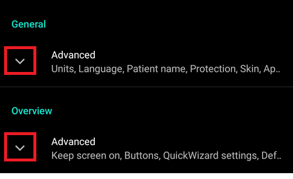
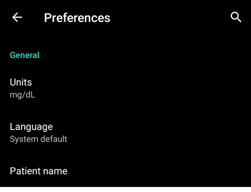
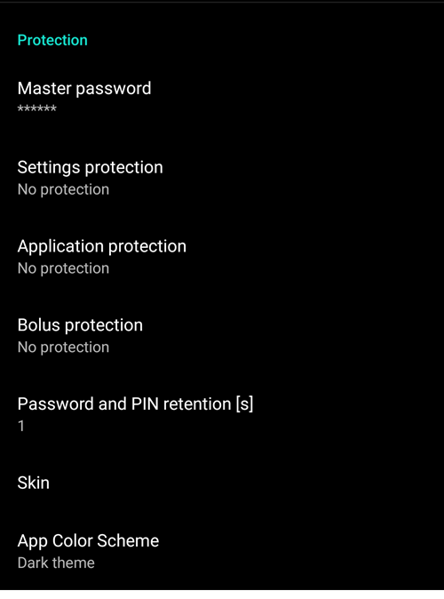
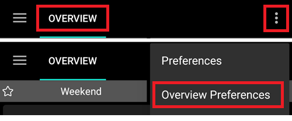
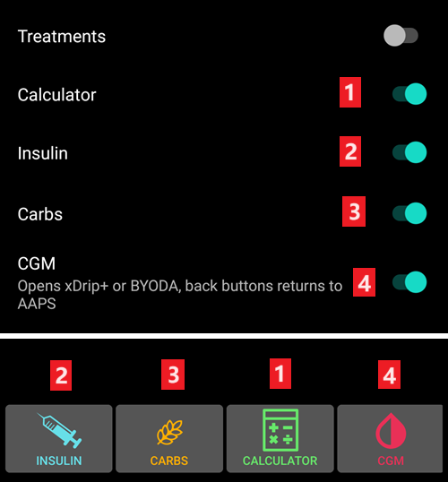
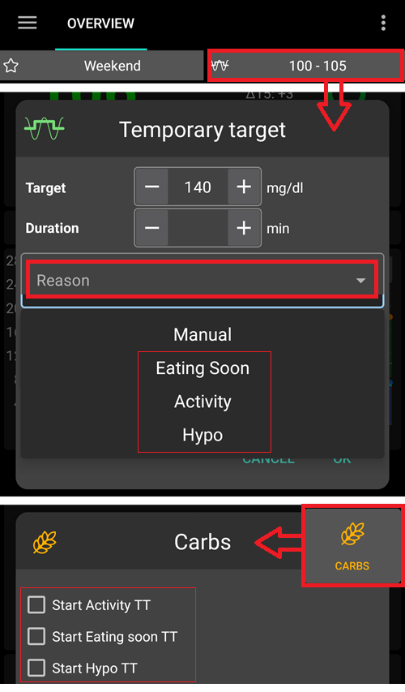

# Einstellungen

- **Öffne die Einstellungen** durch einen Klick auf das 3-Punkte-Menü rechts oben auf dem Startbildschirm.

  

- Du kannst direkt zu den Einstellungen für einen bestimmten Tab (z.B. Pumpen-Tab) springen, indem Du diesen Tab öffnest und auf Plugin-Einstellungen klickst.

  

- **Untermenüs** können geöffnet werden, indem Du auf das Dreieck unter dem Untermenü-Titel klicken.

  

- Mit der **Filter-Funktion** ganz oben auf dieser Seite kannst Du schnell die gesuchten Einstellungen finden. Beginne einfach mit der Eingabe eines Teils des Textes, nach dem du suchst.

  

```{contents}
:backlinks: entry
:depth: 2
```

(Preferences-general)=
## General



**Einheiten**

- Stelle die Einheiten auf mmol/l oder mg/dl je nach deiner Vorliebe ein.

**Sprache**

- Neue Option, um die Standardsprache des Smartphones zu verwenden (empfohlen).

- Falls Du AAPS in einer anderen Sprache als der Standardsprache deines Smartphones nutzen möchtest, kannst Du zwischen vielen verschiedenen Sprachen wählen.

- Falls sich die Systemsprache deines Smartphones und die ausgewählte Sprache für AAPS unterscheiden, kann dies manchmal zu einem Sprachmix führen. Dies ist auf ein Android-Problem zurückzuführen, sodass das Überschreiben der Standardsprache einer App manchmal nicht korrekt funktioniert.


**Name des Patienten**

- Kann verwendet werden, wenn Du zwischen verschiedenen Installationen unterscheiden musst (z.B. zwei Kinder mit Typ 1 in Deiner Familie).

(Preferences-protection)=
### Schutz

(Preferences-master-password)=



#### Master-Passwort

- Necessary to be able to [export settings](../Maintenance/ExportImportSettings.md) as they are encrypted from version 2.7. **Biometrischer Schutz funktioniert unter Umständen nicht auf OnePlus-Smartphones. Dies ist ein bekanntes Problem von OnePlus auf einigen Telefonen.**

- Öffne die Einstellungen (Drei-Punkte-Menü oben rechts)

- Klicke das Dreieck neben "Allgemein".

- Klicke auf "Master-Passwort".

- Gib ein Passwort ein, bestätige es und klicke auf OK.

  

#### Schutz der Einstellungen

- Protect your settings with a password or phone's biometric authentication (i.e. [child is using AAPS](../RemoteFeatures/RemoteMonitoring.md)).

- Custom password should be used if you want to use master password just for securing [exported settings](../Maintenance/ExportImportSettings.md).

- If you are using a custom password click on line "Settings password" to set password as described [above](#master-password).

  

#### Schutz der App

- Falls die App geschützt ist, musst du das Kennwort eingeben oder die biometrische Authentifizierung des Smartphones verwenden, um AAPS zu öffnen.
- Die App wird sofort geschlossen, wenn ein falsches Kennwort eingegeben wurde.

#### Bolus-Schutz

- Bolus protection might be useful if AAPS is used by a small child and you [bolus via SMS](../RemoteFeatures/SMSCommands.md).

- Im Beispiel unten siehst du die Aufforderung zur biometrischen Freigabe. Falls die biometrische Authentifizierung nicht funktioniert, klicke in den Bereich oberhalb der weißen Eingabeaufforderung und gib das Master-Passwort ein.

  

(Preferences-skin)=
#### Erscheinungsbild

- Du kannst zwischen vier Darstellungsarten wählen:

  

- * Bei der 'Darstellung für niedrige Auflösungen' werden die Beschriftungen kürzer dargestellt und im Careportal einige Angaben entfernt, um auf Bildschirmen mit sehr niedriger Auflösung mehr Platz zu gewinnen.

- Der Unterschied der anderen Darstellungsarten hängt von der Ausrichtung des Smartphones ab.

##### Hochformat

- **Ursprüngliches Erscheinungsbild** und **Schaltflächen werden immer am unteren Rand des Bildschirms angezeigt** sind identisch.
- **Großer Bildschirm** zeigt alle Diagramme größer an.

##### Querformat

- Bei Verwendung von **Ursprüngliches Erscheinungsbild** und **Großer Bildschirm**, musst Du nach unten scrollen, um Schaltflächen am unteren Rand des Bildschirms zu sehen

- **Großer Bildschirm** zeigt alle Diagramme größer an.

  

(Preferences-overview)=
## Übersicht

- In Übersicht kannst du Einstellungen für den Homescreen festlegen.

  

### Bildschirm aktiv lassen

- Nützlich, wenn du eine Präsentation gibst.
- Dies wird ziemlich viel Energie verbrauchen, daher ist es ratsam, Dein Telefon an ein Ladekabel anzuschließen.

(Preferences-buttons)=
### Schaltflächen

- Lege fest welche Schaltflächen am unteren Rand des Homescreens sichtbar sind.

  

- Mit den Erhöhungszahlen kannst du die Schrittweiten definieren, die in den KH- und Insulin-Dialogen benutzt werden und so die dortigen Eingaben vereinfachen.

  

  

(Preferences-quick-wizard)=
### Quick Wizard

- Bei häufigen Snacks oder Mahlzeiten kannst du über QuickWizard-Schaltflächen einfach die Menge der Kohlenhydrate eingeben und die Berechnungsgrundlagen festlegen.

- In der Konfiguration legst du fest, in welchem Zeitraum die Schaltfläche auf dem Homescreen zu sehen sein soll. Es ist nur eine Schaltfläche pro Zeitraum möglich.

  

- Wenn du auf den QuickWizard-Button klickst, berechnet AAPS für diese Kohlenhydrate einen Bolus basierend auf Deinen aktuellen Faktoren (unter Berücksichtigung des Blutzuckerwertes oder des Insulins an Bord, wenn eingerichtet) und schlägt diesen vor.

- Der Vorschlag muss bestätigt werden, bevor Insulin abgegeben wird.

  

(Preferences-default-temp-targets)=
### Vordefinierte temporäre Ziele

- [Temp targets (TT)](../DailyLifeWithAaps/TempTargets.md) allow you to define change your blood glucose target for a certain time period.

- Mit dem Setzen von Standard-TT kannst Du Dein Ziel für Aktivität, Bald essen, usw. einfach verändern.

  

- Drücke lange auf deinen Zielwert in der oberen rechten Ecke auf dem Home-Bildschirm oder verwende die Shortcuts im orange "Kohlenhydrate" (Carbs)-Button am unteren Rand.

  

###

### Füll-/Vorfüll-Standardmengen

- If you want to fill tube or prime cannula through AAPS you can do this through [actions tab](../DailyLifeWithAaps/AapsScreens.md#action-tab).
- Voreinstellungen für Füllmengen können in diesem Dialog definiert werden.

(Preferences-range-for-visualization)=
### Zielbereich für die Grafikanzeige

- Lege fest, welcher Bereich der Grafik auf dem Startbildschirm der Zielbereich sein und grün hinterlegt werden soll.

  

### Kurze Tab-Überschriften

- Gleichzeitige Anzeige von mehr Tabs auf dem Bildschirm.

- Zum Beispiel wird die 'OpenAPS AMA' -Registerkarte zu 'OAPS', 'Objectives (Ziele)' wird zu 'ZIEL' usw.

  

### Möglichkeit zur Erfassung von Notizen in Behandlungsdialogen

- Gibt dir die Möglichkeit, kurze Textnotizen zu Deinen Behandlungen hinzuzufügen (z.B. im Bolus-Rechner, den Buttons für Insulin und Kohlenhydrate etc.)

  

(Preferences-status-lights)=
### Statusanzeige

- Status Lights geben eine optische Warnung für

  - Sensoralter
  - Sensor battery level for certain smart readers (see [screenshots page](../DailyLifeWithAaps/AapsScreens.md#sensor-level-battery) for details).
  - Insulinalter (Tage Reservoirverwendung)
  - Reservoirstand (Einheiten)
  - Kanülenalter
  - Alter der Pumpenbatterie
  - Stand (%) der Pumpenbatterie

- Bei Überschreitung der Warnschwelle werden die Werte gelb angezeigt.

- Wenn die kritische Schwelle überschritten wird, werden die Werte rot angezeigt.

- In Versionen vor AAPS 2.7 mussten Einstellungen für Statusanzeigen in Nightscout-Einstellungen vorgenommen werden.

  

(Preferences-advanced-settings-overview)=
### Erweiterte Einstellungen (Übersicht)


(Preferences-superbolus)=
#### Superbolus

- Option zur Aktivierung des Superbolus im Bolus-Rechner.
- [Superbolus](https://www.diabetesnet.com/diabetes-technology/blue-skying/super-bolus/) ist ein Konzept, um in den nächsten zwei Stunden etwas Insulin aus der Basalrate "vorzuziehen", um Spitzen zu verhindern.

## Sicherheitseinstellungen der Behandlungen

### Patiententyp

- Sicherheitsgrenzwerte werden auf der Grundlage des Alters festgelegt, das Du in dieser Einstellung auswählst.
- Wenn du an diese festen Grenzen (z.B. Maximal-Bolus) kommst, ist es an der Zeit, einen Schritt weiter zu gehen.
- Es ist keine gute Idee, ein höheres Alter anzugeben als das tatsächliche, weil es zu einer Überdosierung führen kann, wenn ein falscher Wert im Insulin-Dialog eingegeben wird (z. B.
- If you want to know the actual numbers for these hard-coded safety limits, scroll to the algorithm feature you are using on [this page](../DailyLifeWithAaps/KeyAapsFeatures.md).

### Maximal erlaubter Bolus \[U\]

- Definiert die maximale Menge an Bolusinsulin, die AAPS auf einmal liefern darf.
- Diese Einstellung ist eine Sicherheitsgrenze, um die Abgabe eines massiven Bolus aufgrund einer versehentlichen Eingabe oder eines Benutzerfehlers zu verhinden.
- Es wird empfohlen, das auf eine vernünftige Menge zu setzen, die ungefähr der maximalen Abgabemenge von Bolus Insulin entspricht, das Du für eine Mahlzeitenkorrektur brauchst.
- Diese Einschränkung gilt auch für die Ergebnisse des Bolus-Rechners.

### Maximal erlaubte Kohlenhydrate \[g\]

- Dies ist die maximale Menge an Kohlenhydraten, für die der AAPS Bolus-Rechner eine Dosis berechnen darf.
- Diese Einstellung ist eine Sicherheitsgrenze, um die Abgabe eines massiven Bolus aufgrund einer versehentlichen Eingabe oder eines Benutzerfehlers zu verhinden.
- Es wird empfohlen, das auf eine vernünftige Menge zu setzen, die ungefähr der maximalen Menge an Kohlenhydraten entspricht, die du vermutlich jemals für eine Mahlzeit brauchen wirst.

## Loop

(Preferences-aps-mode)=
### APS-Modus

- Umschalten zwischen Closed Loop, Open Loop sowie Unterbrechung der Insulinzufuhr bei niedrigem Blutzucker (LGS - low glucose suspend).
- **Open Loop** bedeutet, dass Empfehlungen für temporäre Änderungen der Basalrate als Benachrichtigung auf dem Smartphone gegeben werden. Nach der manuellen Bestätigung wird das Kommando an die Pumpe übertragen und Insulin abgegeben. Nur wenn Du eine virtuelle Pumpe verwendest, musst Du die Änderungen selbst manuell an der Pumpe eingeben.
- **Closed Loop** bedeutet, dass die TBR Vorschläge automatisch zur Pumpe gesendet werden, ohne dass Du benachrichtigt wirst oder sie bestätigen musst.
- **Low Glucose Suspend** ähnelt der Closed Loop, überschreibt aber die MaxIOB-Einstellung mit Null. Dies bedeutet, dass AAPS bei fallenden BZ-Werte die Basalrate herabsetzen kann. Wenn aber die BZ-Werte steigen, werden diese nur korrigiert, wenn Dein Basal-IOB negativ ist (z.B. von einer vorangegangenen Abschaltung wegen niedriger BZ-Werte).

(Preferences-minimal-request-change)=
### Minimaler Wert zur Anfrage einer Änderung \[%\]

- Im Open Loop erhälst Du jedes Mal eine Benachrichtigung, wenn AAPS empfiehlt, die Basalrate anzupassen.
- Um die Anzahl der Benachrichtigungen zu reduzieren, kannst du entweder einen größeren BZ-Zielbereich verwenden oder den minimalen Wert zur Anfrage einer Änderung erhöhen.
- Diese definiert, wie hoch die relative Änderung sein muss, damit eine Benachrichtigung erscheint.

(Preferences-advanced-meal-assist-ama-or-super-micro-bolus-smb)=
## Advanced Meal Assist (AMA) oder Super Micro Bolus (SMB)

Depending on your settings in [config builder](../SettingUpAaps/ConfigBuilder.md) you can choose between two algorithms:

- [Advanced meal assist (OpenAPS AMA)](../DailyLifeWithAaps/KeyAapsFeatures.md#advanced-meal-assist-ama) - state of the algorithm in 2017
- [Super Micro Bolus (OpenAPS SMB)](../DailyLifeWithAaps/KeyAapsFeatures.md#super-micro-bolus-smb) - most recent algorithm recommended for beginners

### OpenAPS AMA-Einstellungen

- Erlaubt AAPS nach einem Essen schneller mit einer Erhöhung der Basalrate zu reagieren - WENN Du die Kohlenhydrate zuverlässig eingibst.
- Mehr Details zu den Einstellungen und Autosens findest Du in den [OpenAPS Docs](https://openaps.readthedocs.io/en/latest/docs/Customize-Iterate/autosens.html).

(Preferences-max-u-h-a-temp-basal-can-be-set-to)=
#### Maximale IE/h, die als TBR gesetzt werden können

- Diese Einstellung existiert als Sicherheitsgrenze, um zu verhindern, dass AAPS jemals eine gefährlich hohe Basalrate setzt.
- Der Wert wird in IE pro Stunde angegeben (IE/h).
- Es wird empfohlen, hier etwas vernünftiges einzugeben. Eine gute Empfehlung ist, die **höchste Basalrate** in Deinem Profil zu verwenden und diese **mit 4 zu multiplizieren**.
- Wenn zum Beispiel die höchste Basalrate in deinem Profil 0.5IE/h war, kannst du das mit 4 multiplizieren, um einen Wert von 2IE/h zu erhalten.
- See also [detailed feature description](../DailyLifeWithAaps/KeyAapsFeatures.md#max-uh-a-temp-basal-can-be-set-to-openaps-max-basal).

#### Maximales Basal-IOB, das OpenAPS abgeben darf \[U\]

- Menge an zusätzlichem Basalinsulin (in Einheiten), das deinem Körper zusätzlich zu deiner normalen Basalrate zugeführt werden darf.
- Wenn dieser Wert erreicht wird, wird AAPS aufhören, zusätzliches Basalinsulin abzugeben, bis dein Basalinsulin On Board (IOB) wieder unterhalb dieses Wertes liegt.
- Dieser Wert **berücksichtigt kein Bolus-IOB**, nur Basal.
- Dieser Wert wird unabhängig von deiner normalen Basalrate berechnet und überwacht. Es wird lediglich das zusätzliche Basalinsulin zu der normalen Basalrate berücksichtigt.

Wenn Du anfängst den Loop zu benutzen, wird empfohlen das **maximale Basal-IOB für eine bestimmte Zeit auf 0** zu setzen, während Du Dich mit dem System vertraut machst. Das verhindert, dass AAPS dir generell zusätzliches Basal-Insulin verabreicht. Während dieser Zeit wird AAPS trotzdem in der Lage sein, dein Basalinsulin abzuschalten, um Hypoglykämien zu verhindern. Das ist ein wichtiger Schritt, um:

- Zeit zu haben, sich auf sichere Art mit der Verwendung des AAPS Systems vertraut zu machen und zu überwachen, wie es funktioniert.
- die Gelegenheit zu nutzen, dein Basalratenprofil und die Insulinsensibilitäts-Faktoren (ISF) anzupassen.
- zu sehen, wie AAPS die Basalrate einschränkt, um Hypoglykämien zu verhindern.

Wenn du dich damit gut fühlst, kannst du dem System erlauben, dir zusätzliches Basalinsulin zu geben, indem du den Wert Max-Basal IOB erhöhst. Die empfohlene Richtlinie für diesen Wert ist, die **höchste Basalrate** in Deinem Profil zu verwenden und diese **mit 3 zu multiplizieren**. Wenn zum Beispiel die höchste Basalrate in deinem Profil 0.5IE/h war, kannst du das mit 3 multiplizieren, um einen Wert von 1.5IE/h zu erhalten.

- Du kannst konservativ mit diesem Wert starten und ihn im Laufe der Zeit langsam erhöhen.
- Das sind aber nur Richtlinien; jeder Körper ist anders. Es kann durchaus sein, dass du mehr oder weniger benötigst als hier empfohlen wurde, aber beginne dennoch konservativ und passe es langsam an.

**Hinweis: Aus Sicherheitsgründen ist es nicht möglich, den Wert Max-Basal IOB bei höher als 7 IE festzulegen.**

#### Autosens

- [Autosens](../DailyLifeWithAaps/KeyAapsFeatures.md#autosens) looks at blood glucose deviations (positive/negative/neutral).
- Dabei wird anhand dieser Abweichungen ermittelt, wie empfindlich / resistent Du auf Insulin reagierst und Deine Basalrate und den ISF entsprechend angepasst.
- Wenn Du "Autosens passt Zielwerte ebenfalls an" auswählst, wird der Algorithmus auch Dein BZ-Ziel entsprechend anpassen.

#### Erweiterte Einstellungen (OpenAPS AMA)

- Normalerweise musst Du die Einstellungen in diesem Dialog nicht ändern!
- Falls Du sie doch ändern willst, lies in jedem Fall vorher die Details dazu in den [OpenAPS Docs](https://openaps.readthedocs.io/en/latest/docs/While%20You%20Wait%20For%20Gear/preferences-and-safety-settings.html#) und stelle sicher, dass Du weißt, was Du tust.

(Preferences-openaps-smb-settings)=
### OpenAPS SMB-Einstellungen

- In contrast to AMA, [SMB](../DailyLifeWithAaps/KeyAapsFeatures.md#super-micro-bolus-smb) does not use temporary basal rates to control glucose levels, but mainly small super micro boluses.

- You must have started [objective 9](../SettingUpAaps/CompletingTheObjectives.md#objective-9-enabling-additional-oref1-features-for-daytime-use-such-as-super-micro-bolus-smb) to use SMB.

- The first three settings are explained [above](#max-uh-a-temp-basal-can-be-set-to).

- Details on the different enable options are described in [OpenAPS feature section](../DailyLifeWithAaps/KeyAapsFeatures.md#enable-smb).

- *Wie häufig SMB abgegeben werden (in Min.)* ist eine Einschränkung für SMB, die standardmäßig nur alle vier Minuten abgegeben werden. Dieser Wert verhindert, dass das System SMB zu häufig abgibt (z. B. wenn Du ein temporäres Ziel setzt). Sie sollten diese Einstellung nicht ändern, außer Du weißt genau über die Folgen Bescheid.

- If 'Sensitivity raises target' or 'Resistance lowers target' is enabled [Autosens](../DailyLifeWithAaps/KeyAapsFeatures.md#autosens) will modify your glucose target according to your blood glucose deviations.

- Wenn der Zielwert angepasst wird, wird dies durch einen grünen Hintergrund des Zielwerts angezeigt.

  

(Preferences-carb-required-notification)=
#### Kohlenhydrat-Vorschlag

- Diese Funktion steht nur zur Verfügung, wenn Du SMB ausgewählt hast.

- Der Algorithmus empfiehlt Dir, etwas zu essen, wenn er feststellt, dass zusätzliche Kohlenhydrate benötigt werden.

- In diesem Fall erhältst Du eine Benachrichtigung, die Du für 5, 15 oder 30 Minuten stummschalten kannst.

- Zusätzlich werden die vorgeschlagenen Kohlenhydrate auf dem Startbildschirm im Bereich COB angezeigt.

- Ein Schwellenwert lässt sich definieren, damit erst eine Mindest-KH-Menge erreicht werden muss, bevor eine Benachrichtigung erscheint.

- Auf Wunsch können die Kohlenhydrat-Vorschläge an Nightscout gesandt werden. In diesem Fall wird eine Ankündigung angezeigt und verteilt.

  

#### Erweiterte Einstellungen (OpenAPS SMB)

- Normalerweise musst Du die Einstellungen in diesem Dialog nicht ändern!
- Falls Du sie doch ändern willst, lies in jedem Fall vorher die Details dazu in den [OpenAPS Docs](https://openaps.readthedocs.io/en/latest/docs/While%20You%20Wait%20For%20Gear/preferences-and-safety-settings.html#) und stelle sicher, dass Du weißt, was Du tust.

## Resorptions-Einstellungen


### min_5m_carbimpact

- Der Algorithmus verwendet die Auswirkungen auf den Blutzuckerspiegel (BGI - blood glucose impact), um zu bestimmen, wann Kohlenhydrate absorbiert werden.

- Dieser Wert wird nur dann verwendet, wenn keine CGM-Werte empfangen werden oder körperliche Aktivitäten den Blutzuckeranstieg "kompensieren", den AAPS normalerweise zur Berechnung des Kohlenhydratabbaus verwendet.

- So lange der Kohlenhydratabbau nicht dynamisch aus den Veränderungen des BZ ermittelt werden kann, wird ein Standardwert für den Abbau angesetzt. Im Prinzip ist es eine Notlauffunktion.

- Einfach gesagt: Der Algorithmus "weiß", wie sich Deine BZ-Werte unter Berücksichtigung der aktuellen Insulindosis etc. **entwickeln sollten**.

- Wenn eine positive Abweichung vom erwarteten Verhalten registriert wird, werden einige Kohlenhydrate absorbiert/aufgenommen. Große Abweichung = viele Kohlenhydrate etc.

- Das min_5m_carbimpact definiert die Standard-Kohlenhydrat-Resorptionswirkung pro 5 Minuten. Für weitere Details siehe [OpenAPS Docs](https://openaps.readthedocs.io/en/latest/docs/While%20You%20Wait%20For%20Gear/preferences-and-safety-settings.html?highlight=carbimpact#min-5m-carbimpact).

- Der Standardwert für AMA ist 5, für SMB ist es 8.

- Im COB-Diagramm auf dem Startbildschirm werden Zeiten, in denen min_5m_impact verwendet wird, mit einem orangenen Punkt auf der Diagrammlinie markiert.

  

### Maximale Dauer des Essens-Resorption

- Wenn du oft Mahlzeiten mit viel Fett oder Eiweiß zu dir nimmst, wirst du die Resorptionszeit für das Essen erhöhen müssen.

### Erweiterte Einstellungen - Autosens-Faktoren

- Define min. and max. [autosens](../DailyLifeWithAaps/KeyAapsFeatures.md#autosens) ratio.
- Die Standardwerte (max. 1.2 und min. 0.7) sollten nicht verändert werden.

## Pumpen-Einstellungen

The options here will vary depending on which pump driver you have selected in [Config Builder](../SettingUpAaps/ConfigBuilder.md#pump).  Verbinde Deine Pumpe und richte sie entsprechend der pumpenspezifischen Beschreibung ein:

- [DanaR Insulinpumpe](../CompatiblePumps/DanaR-Insulin-Pump.md)
- [DanaRS Insulinpumpe](../CompatiblePumps/DanaRS-Insulin-Pump.md)
- [Accu-Chek Combo](../CompatiblePumps/Accu-Chek-Combo-Pump.md)
- [Accu Chek Insight Pumpe](../CompatiblePumps/Accu-Chek-Insight-Pump.md)
- [Medtronic Pumpe](../CompatiblePumps/MedtronicPump.md)

Stelle sicher, dass Du die virtuelle Pumpe in der KONFIGURATION ausgewählt hast, wenn Du AAPS als Open Loop betreibst.

(Preferences-nsclient)=
## Nightscout-Client


Ursprüngliches Kommunikations-Protokoll, dass mit älteren Nightscout-Versionen genutzt werden kann.

- Lege Deine *Nightscout URL* (z.B. [https://deineseite.deinprovider.com](https://yoursitename.yourplaform.dom)) fest.
  - **Stelle sicher, dass die URL NICHT mit /api/v1/ endet.**
- Das *[API Secret](https://nightscout.github.io/nightscout/setup_variables/#api-secret-nightscout-password)* (ein 12-Zeichen langes Passwort, das in den Nightscout Variablen eingetragen wurde).
- Dadurch kann AAPS Daten von Nightscout lesen und auch schreiben.
- Überprüfe die Eingaben auf Tippfehler, wenn du bei Ziel 1 hängen bleibst.

## NSClientV3


[New protocol introduced with AAPS 3.2.](../Maintenance/ReleaseNotes.md#important-comments-on-using-v3-versus-v1-api-for-nightscout-with-aaps) Safer and more efficient.

```{admonition} V3 data uploaders
:class: warning

Bei der Verwendung von NSClientV3 müssen alle Uploader die API V3 verwenden. Da die meisten noch nicht kompatibel sind, heißt das, dass Du **AAPS erlauben musst alle Daten an Nightscout hochzuladen** (Glukosewerte, Behandlungen, ...). Deaktiviere alle anderen Uploader, solange sie nicht V3 konform sind.
```

- Lege Deine *Nightscout URL* (z.B. [https://deineseite.deinprovider.com](https://yoursitename.yourplaform.dom)) fest.
  - **Stelle sicher, dass die URL NICHT mit /api/v1/ endet.**
- Erzeuge in Nightscout ein *[Admin Token](https://nightscout.github.io/nightscout/security/#create-a-token)* (die V3 API setzt [Nightscout 15](https://nightscout.github.io/update/update/) voraus) und gib dieses als **NS Zugangstoken** ein (nicht Dein API Secret!).
- Dadurch kann AAPS Daten von Nightscout lesen und auch schreiben.
- Überprüfe die Eingaben auf Tippfehler, wenn du bei Ziel 1 hängen bleibst.
- Lasse "Mit Websockets verbinden" aktiviert (empfohlen).

### Synchronisierung

Die Art der Synchronisierung hängt davon ab, wie Du AAPS nutzen möchtest.

You can select which data you want to [upload and download to or from Nightscout](../SettingUpAaps/Nightscout.md#aaps-settings).

### Alarm-Optionen


- In den Alarm-Optionen legst Du fest, welche Standard-Nightscout-Alarme in AAPS genutzt werden sollen. AAPS wird alarmieren, wenn der entsprechende Alarm von Nightscout ausgelöst wird.
  - Damit die Alarme ausgelöst werden können, musst Du in den [Nightscout-Variablen](https://nightscout.github.io/nightscout/setup_variables/#alarms) Werte für Urgent High, High, Low und Urgent Low Alarme setzen.
  - Diese funktionieren nur, wenn Du eine Online-Verbindung zu Nightscout hast und sind vor allem für Eltern und Betreuende gedacht.
  - Wenn Du die CGM-Quelle auf Deinem Smartphone hast (z.B. xDrip+ oder BYODA) solltest Du deren Alarme anstelle der Nightscout-Alarme nutzen.
- Benachrichtigungen über Nightscout-[Ankündigungen](https://nightscout.github.io/nightscout/discover/#announcement): Nightscout-Ankündigungen werden dann auch in der AAPS Benachrichtigungszeile angezeigt.
- Du kannst die Schwellenwerte für veraltete Daten und stark veraltete Alarme ändern, wenn nach einer bestimmten Zeit keine Daten von Nightscout empfangen werden.

### Verbindungseinstellungen


- Verbindungseinstellungen legen fest auf welchem Weg (z.B. WLAN oder Mobilfunknetz) eine Nightscout-Verbindung aufgebaut werden darf.
- Beschränken den Nightscout-Upload auf WLAN-Verbindungen oder sogar auf bestimmte WLAN-SSIDs.
- Wenn Du nur ein bestimmtes WLAN-Netzwerk verwenden möchtest, kannst du dessen WiFi SSID eingeben.
- Mehrere SSIDs können durch Semikolon (Strichpunkt) getrennt werden.
- Gib zum Löschen aller SSIDs ein Leerzeichen in das Feld ein.

(Preferences-advanced-settings-nsclient)=
### Erweiterte Einstellungen (Nightscout-Client)


Die Optionen in den erweiterten Einstellungen sind selbsterklärend.

## SMS Kommunikator

- Options will only be displayed if SMS communicator is selected in [Config Builder](../SettingUpAaps/ConfigBuilder.md#sms-communicator).
- Diese Einstellung erlaubt eine Fernsteuerung der App, indem Anweisungen an das Smartphone des Patienten gesendet werden, die die App ausführt (z.B. Loop oder Bolus anhalten).
- Further information is described in [SMS Commands](../RemoteFeatures/SMSCommands.md).
- Zusätzliche Sicherheit wird durch die Verwendung einer Authentifikator-App und einer zusätzlichen PIN am Tokenende erreicht.

## Automatisierung

Wähle aus, welcher Standortservice verwendet werden soll:

- Passiver Standort: AAPS nutzt nur die Standort, die von andere Apps angefordert werden.
- Netzwerkstandort: Standort Ihres Wi-Fi
- GPS-Standort (Achtung! Kann zu übermäßigen Akkuverbrauch führen!)

## Lokale Alarme


- Einstellungen sollten selbsterklärend sein.

## Datenübermittlung


- Du kannst bei der Weiterentwicklung von AAPS unterstützen, indem Du Absturzberichte an die Entwickler sendest.

## Wartungseinstellungen


- Standardempfänger der Protokolldateien ist <logs@aaps.app>.

## Open Humans

- Du kannst die Community unterstützen, indem Du Deine Daten für Forschungsprojekte zur Verfügung stellst. Details are described on the [Open Humans page](../SupportingAaps/OpenHumans.md).

- In den Einstellungen kannst Du festlegen, wann Daten hochgeladen werden sollen

  - nur über WLAN-Verbindungen
  - nur während des Ladens
