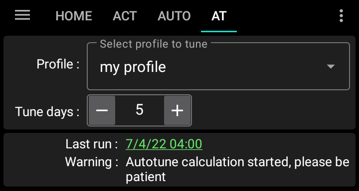
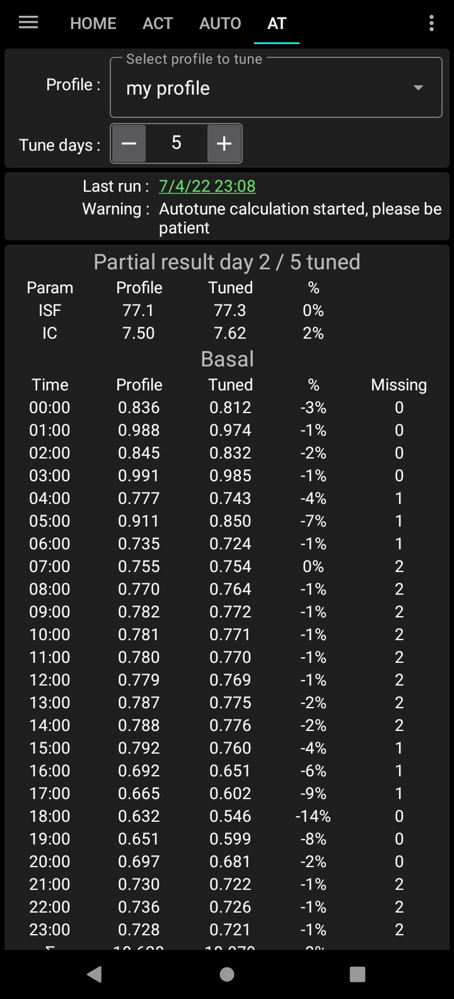
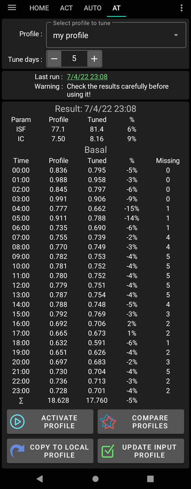
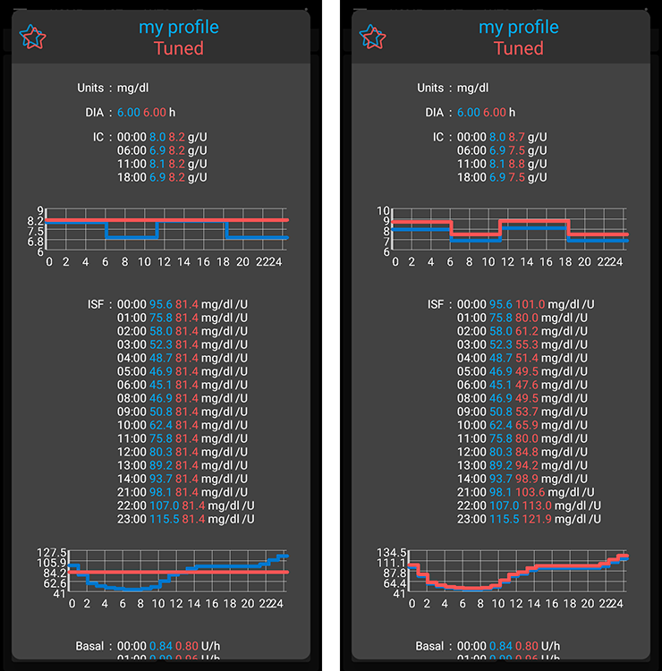
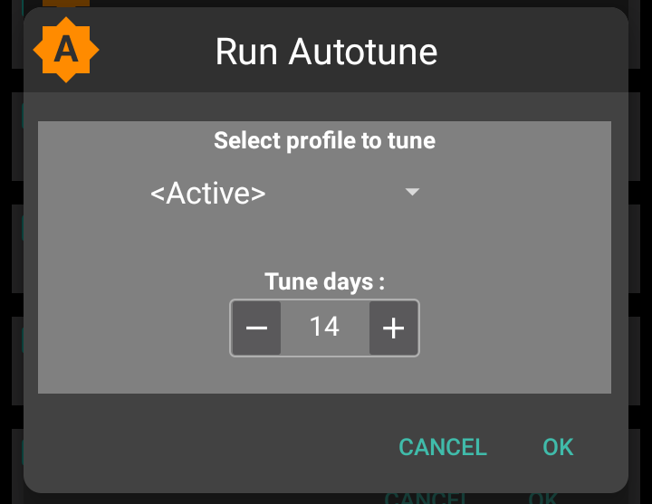

# Autotune Plugin verwenden (nur dev)

Die Dokumentation des Autotune-Algorithmus findest in der [OpenAPS Dokumentation](https://openaps.readthedocs.io/en/latest/docs/Customize-Iterate/autotune.html).

Das Autotune-Plugin ist die Umsetzung des OpenAPS Autotune-Algorithmus in AAPS.

**Aktuell ist das Autotune-Plugin nur im dev branch (noch in Entwicklung befindliche Version) bei aktivierten 'Engineering Mode' verfügbar.**

## Autotune Dialogbox

- In der Profil-Auswahlliste kannst Du das Profil auswählen, das Du automatisch überarbeiten (autotune) lassen möchtest (Dein aktives Profil ist voreingestellt)
  - Hinweis: Sobald Du ein neues Profil auswählst werden, bestehende Ergebnisse gelöscht und der Parameter 'Anpassungstage' auf den Standardwert zurückgesetzt
- 'Anpassungstage' legt fest, wie viele Tage in der Berechnung und der Überarbeitung Deines Profils berücksichtigt werden sollen. Der kleinste Wert ist 1 und der größte Wert ist 30 Tage. Um korrekte wiederholbare und geglättete Ergebnisse zu bekommen, sollte der Wert nicht zu klein gewählt werden (idealerweise sollten sieben oder mehr Tage berücksichtigt werden)
  - Hinweis: Bei jeder Änderung der 'Anpassungstage' werden die Ergebnisse zurückgesetzt
- 'Last Run' ruft die Ergebnisse Deines letzten gültigen Durchlaufs auf. Wenn Du 'Autotune' nicht am selben Tag gestartet haben solltest, oder Ergebnisse der vorherigen Durchläufe durch die Änderung der Parameter zurückgesetzt wurden, kannst Du so die letzten Parameter und Ergebnisse zurückholen
- 'Warnung' zeigt Dir im Fehlerfall Informationen zu Deinem gewählten Profil an (falls es z. B. mehrere KH- oder Korrekturfaktoren (IC/ISF) geben sollte)
  - Hinweis: Die Autotune-Berechnungen funktionieren nur mit einem einzigen KH-Faktor und einem einzigen Korrekturfaktor. Zur Zeit gibt es keinen Autotune-Algorithmus, der mit zirkadianen KH-Faktoren oder Korrekturfaktoren umgehen kann. Wenn Dein Profil mehrere Werte haben sollte, wird Dir im Abschnitt 'Warnung' der für die Berechnung genutzte (gemittelte) Wert angezeigt.
- Durch drücken auf 'Eingabeprofil überprüfen' öffnet sich die Profilansicht mit der Du wichtige Parameter Deines Profils überprüfen kannst (Einheiten, Wirkdauer (DIA), KH- und Korrekturfaktoren, Basalrate, Zielwert).
  - Hinweis: 'Autotune' wird nur Deinen KH-Faktor (Einzelwert), den Korrekturfaktor (Einzelwert) und Deine Basalrate (zirkadian verteilt) korrigieren bzw. anpassen. Einheiten, DIA und Zielwert werden im vorgeschlagenen Profil unverändert bleiben und nicht verändert.

- 'Autotune ausführen' startet den Autotune-Durchlauf mit dem ausgewählten Profil und den zu berücksichtigenden Tagen ('Anpassungstage')
  - Hinweis: Die Autotune-Berechnung kann einige Zeit in Anspruch nehmen. Sobald 'Autotune' gestartet wurde, kannst zu anderen Ansichten (Startbildschirm, ...) wechseln und später zum Autotune-Plugin zurückkehren, um die Ergebnisse zu prüfen

- Während 'Autotune' läuft, wirst Du Zwischenergebnisse angezeigt bekommen

  - Hinweis: Während die Berechnungen laufen sind sowohl die Auswahl des Profils, als auch die 'Anpassungstage' vorübergehend gesperrt. Der aktuelle Durchlauf muss abgeschlossen sein, bevor Du einen neuen Berechnungsdurchgang mit geänderten Parametern starten kannst.

  

- Sind die Autotune-Berechnungen abgeschlossen, bekommst Du das angepasste Profil und vier Schaltflächen angezeigt.

- Wichtig ist, dass Du das Eingangsprofil (Spalte 'Profil') mit dem Ergebnisprofil (Spalte 'Angepasst') und die Abweichungen der Einzelwerte (Spalte '%') vergleichst.

- Für die Basalrate wird auch die Anzahl der nicht berücksichtigten Tage ('missing days') ausgegeben. 'Fehlend' tritt immer dann auf, wenn 'Autotune' nicht genügend Daten, die eindeutig einer Basalrate zugeordnet werden können, in der gewählten Periode zur Verfügung hat (z.B. in Phasen nach Mahlzeiten wenn, die KH-Aufnahme läuft). In der Nacht oder am späten Nachmittag sollten diese Effekte selten auftreten, da dort im Regelfall überwiegend das Basal wirksam sein sollte.

- Die Schaltfläche "Profile vergleichen" öffnet die Profilvergleichsansicht. Das Eingangsprofil ist blau und das Ergebnisprofil 'Angepasst' ist rot dargestellt.

  - Hinweis: im Beispiel unten hat das Eingangsprofil hat zirkadianisch angepasste Werte für IC und ISF, aber das Ergebnisprofil hat jeweils nur einen Wert. Wenn es Dir wichtig ist ein zirkadian verteiltes Ergebnisprofil zu bekommen, lies den Abschnitt [Zirkadian verteiltes IC oder ISF-Profil](#circadian-ic-or-isf-profile) unten.

  

- Wenn Du mit den Ergebnissen zufrieden bist (geringe Abweichungen zwischen dem Eingangsprofil und dem erzeugten Profil), kannst Du auf 'Aktiviere Profil' und 'OK' zur Bestätigung drücken.

  - Wenn Du das erzeugte Profil aktivierst, wird ein neues Profil 'Angepasst' in den Tab PROFIL geschrieben.
  - Sollte es das Profil mit dem Namen schon geben, wird es mit dem erzeugten Profil aktualisiert, bevor es aktiviert wird.

  

- Wenn Du denkst, dass das angepasste/berechnete Profil verändert werden muss (z.B. wenn Du findest, dass einige Abweichungen zu gravierend sind), dann kannst Du auf 'In lokales Profil kopieren' klicken.

  - Ein neues Profil mit dem Präfix 'Angepasst' und dem Erstelldatum und der Erstellzeit wird in das Profil-Plugin geschrieben.

- Du kannst dann Dein lokales Profil auswählen, um das Ergebnisprofil zu bearbeiten (es wird vorausgefüllt, sobald Du das lokales-Profil-Plugin öffnest

  - Die Werte werden, je nachdem welchen Einstellungen Deine Pumpe zulässt, entsprechend gerundet

  

- Wenn Du Dein Eingabeprofil durch die Autotune-Ergebnis ersetzen möchtest, tippe auf 'Eingabeprofil anpassen' und bestätige die Dialogbox 'OK'

  - Hinweis: Wenn Du nach 'Eingabeprofil anpassen' auf 'Profil aktivieren' tippst, aktivierst Du das gerade aktualisierte Profil und nicht das durch Autotune berechnete Profil (Ergebnisprofil)

  

- Wenn Du Dein Eingagebeprofil angepasst hast, wird der Button durch den Button 'Eingabeprofil zurücksetzen' ersetzt (wie auf dem Screenshot unten zu sehen). Daran kannst Du sofort erkennen, ob Dein lokales Profil die berechneten Anpassungen bereits enthält oder noch nicht. Mit diesem Button kannst Du auch Dein Eingabeprofil ohne die Autotune-Ergebnisse wiederherzustellen

  

## Autotune Einstellungen

(autotune-plugin-settings)=

### Autotune Einstellungen

- Automation Profilwechsel (voreingestellt: AUS): Details hierzu findest Du unten im Abschnitt [Autotune mit einer Automatisierungsregel starten](#run-autotune-with-an-automation-rule). Wenn Du diese Einstellung auf AN änderst, wird in einer Automatisierungsregel das Eingabeprofil automatisch durch das berechnete Profil aktualisiert und anschliessend darauf gewechselt.
  - **Sei vorsichtig und prüfe in den kommenden Tagen sehr genau, ob sich das Loop-Verhalten nach der Anpassung und Aktivierung des Profils verbessert.**

- UAM als Basal kategorisieren (voreingestellt: EIN): Diese Einstellung ist für Nutzende gedacht, die AAPS ohne Eingabe der Kohlenhydrate einsetzen (vollständiges UAM). Wenn die Option deaktiviert ist, werden UAM nicht als Basal bewertet.
  - Hinweis: Wenn mindestens eine Stunde eines Tages erkannt wird, in der KH-Aufnahme stattgefunden hat, werden alle als "UAM" kategorisierte Daten, als Basal gewertet. Das ist unabhängig davon, ob Du die Option aktiviert hast oder nicht (AN oder AUS)
- Anzahl der Tage an Daten (voreingestellt: 5): Hier kannst Du den Standardwert festlegen. Jedes Mal, wenn Du ein neues Profil im Autotune-Plugin auswählst, wird der Parameter 'Anpassungstage' durch diesen Standardwert ersetzt.
- Apply average result in circadian IC/ISF (default Off): see [Circadian IC or ISF profile](#circadian-ic-or-isf-profile) below.

### Andere Einstellungen

- Autotune also uses Max autosens ratio and Min autotsens ratio to limit variation. You can see and adjust these values in Config Builder > Sensitivity detection plugin > Settings > Advanced Settings

  

## Advanced feature

(circadian-ic-or-isf-profile)=

### Circadian IC or ISF profile

- If you have important variation of IC and/or you ISF in your profile, and you fully trust in your circadian time and variation, then you can set "Apply average result in circadiant IC/ISF"

  - Note that Autotune calculation will always be done with a single value, and circadian variation will not be tuned by Autotune. This setting only apply average variation calculated for IC and/or ISF on your circadian values

- See on screenshot below Tuned profile with Apply average variation Off (on the left) and On (on the right)

  

(run-autotune-with-an-automation-rule)=

## Run Autotune with an automation rule

First step is to define correct trigger for an automation rule with Autotune:

Note: for more information on how to set an automation rule, see [here](./Automation.md).

- You should select Recurring time trigger: only run Autotune once per day, and autotune is designed to be runned daily (each new run you shift one day later and quickly profile modification should be tiny)

  

- It's better at the beginning to run Autotune during the day to be able to check results. If you want to run Autotune during the night, you have to select in the trigger 4AM or later to include current day in next Autotune Calculation.

  

- Then you can select "Run Autotune" Action in the list

  

- You can then select Autotune Action to adjust parameters for your run. Default parameters are "Active Profile", default Tune days value defined in Autotune Plugin preferences, and All days are selected.

  

- After a few days, if you fully trust Autotune results and percentage of modification is low, you can modify [Autotune settings](#autotune-plugin-settings) "Automation Switch Profile" to enabled to automatically update and activate profile tuned after calculation.

## Tips and trick's

Autotune works with information existing in your database, so if you just installed AAPS on a new phone, you will have to wait several days before being able to launch Autotune with enough days to get relevant results.

Autotune is just an help, it's important to regularly check if you agree with calculated profile. If you have any doubt, change Autotune settings (for example the number of days) or copy results in local profile and adjust profile before using it.

Always use Autotune several days manually to check results before applyling them. And it's only when you fully trust Autotune results, and when variation becomes tiny between previous profile and calculated profile than you start to use Automation (Never before)

- Autotune can work very well for some users and not for others, so **If you don't trust Autotune result, don't use it**

It's also important to analyse Autotune results to understand (or try to understand) why Autotune propose these modifications

- you can have a whole increase or decrease of the strength of your profile (for example increase of total basal associated to decrease of ISF and IC values). it could be associated to several following days with autosens correction above 100% (more agressivity required) or below 100% (you are more sensitive)
- Sometimes Autotune propose a different balance between basal rates and IC/ISF (for ex lower basal and more aggressive IC/ISF)

We advise to not use Autotune in the following cases:

- You don't enter all your carbs
  - If you don't enter carbs correction for an hypoglycemia, Autotune will see an unexpected increase of your BG value and will increase your basal rates the 4 hours earlier, it could be the opposite of what you need to avoid hypo, especially if it's in the middle of the night. That's why it's important to enter all carbs especially correction for hypo.
- Du hast viele Abschnitte mit nicht angekündigten Mahlzeiten (UAM) im Verlauf Deines Tages
  - Hast Du alle Kohlenhydrate eingegeben und hast Du die Kohlenhydratmenge richtig eingeschätzt?
  - Alle Abschnitte mit nicht angekündigten Mahlzeiten (UAM), werden der Basalrate zugerechnet, sodass eine erhebliche Anhebung (mehr als notwendig) der Basalrate als Folge vorgeschlagen werden wird. Ausnahme: Du hast die Option 'UAM als Basal kategorisieren' deaktiviert

- Deine KH-Aufnahme ist deutlich verlangsamt: Die Berechnung der aktiven Kohlenhydrate (COB) kann falsch sein und in der Folge zu falschen Ergebnissen führen. Die verlangsamte Aufnahme kannst Du an kleinen orangenen Punkten oberhalb der COB-Kurve erkennen. Als Referenz wird der Parameter 'min_5m_carbimpact' in den 'Resorptions-Einstellungen' genutzt.
  - Während Du Sport treibst, bist durchweg Insulinempfindlicher, und Dein Glukosewert steigt nur leicht. Es ist daher völlig normal während und nach dem Sport Phasen mit langsamer KH-Aufnahme zu sehen. Solltest Du aber häufiger unerwartet Phasen mit langsamer KH-Aufnahme haben, kann eine Profilanpassung sinnvoll sein. In diesem Fall kann eventuell eine Erhöhung des KH-Faktors (IC) oder eine Reduktion des 'min_5m_carbimpact'-Parameters helfen.
- Du hast einge "sehr schlechte Tage". Du hängst beispielsweise über mehrere Stunden in einer Hyperglykämie, die Du mit großen Insulinmengen korrigieren kannst oder Deine Glukosewerte sind nach einem Sensorwechsel vorübergehend nicht verlässlich.
- Wenn die vorgeschlagenen prozentualen Anpassungen zu gravierend sind
  - Eine bessere Glättung kannst Du eventuell über eine Erhöhung der zu berücksichtigenden Tage (Anpassungstage) erreichen
