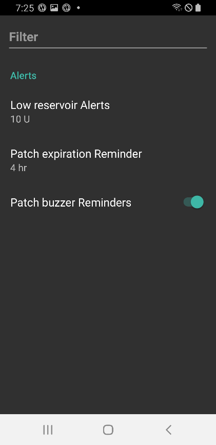
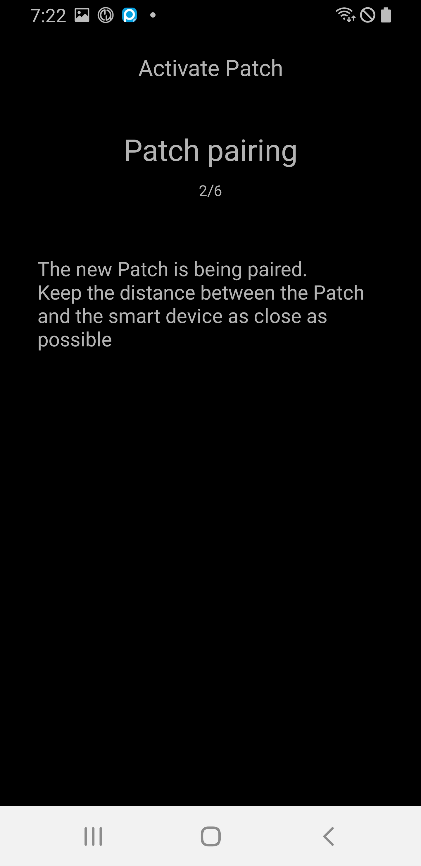
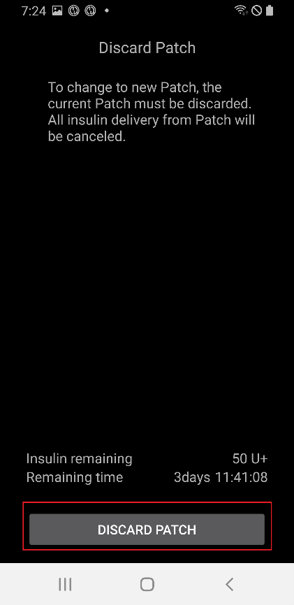
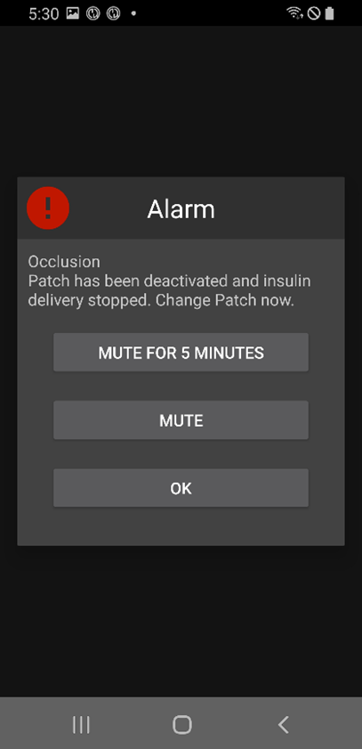

# Manual de instrucciones de EOPatch2 (Glucomen Day Pump)

**Planned but not commited for AAPS 3.2 (next version)!**

El parche requiere de insulina de acción rápida del tipo U-100, como NovoRapid o Humalog. Utiliza una insulina de acción rápida adecuada para tí, según la prescripción de tu médico e inyéctate la dosis prescrita.

La dosis más pequeña de insulina que puede ponerse cuando usamos es parche es de 0.05U. Por lo tanto, el perfil basal debe ajustarse a un valor mínimo de 0.05U o más, con un intervalo de 0.05U/h, ya que de lo contrario, puede haber un error entre la cantidad total de infusión estimada en el perfil y la cantidad real de infusión en el parche. Del mismo modo, el bolo también debe fijarse con un volumen de infusión mínimo de 0.05U.

## Configuración de la bomba
1. On the AAPS home screen, click the hamburger menu in the upper left corner and go to Config Builder.
1. Selecciona "EOPatch2" en la seción de las bombas.
1. Pulsa el botón de Atrás para volver a la pantalla de inicio.

 

## Configuración
Selecciona EOPATCH2 en la parte superior de la pantalla de inicio para ir a la pestaña EOPATCH2.

Selecciona el menú Preferencias de EOPatch2, pulsando sobre los tres puntos de la esquina superior derecha.

El menú Preferencias de EOPatch2 ofrece un menú para configurar tres tipos de notificaciones.

### Alertas de reservorio bajo
Aparece una advertencia cuando la cantidad de insulina restante en el reservorio alcanza el valor establecido o menos, durante el uso del parche. Se puede ajustar entre 10-50U, con incrementos de 5U.

### Recordatorio de expiración del parche
Se trata de un recordatorio para informarte del tiempo que falta para que caduque el parche actual. Puede ajustarse entre 1-24 horas, con incrementos de 1 hora. Por defecto, viene configurado en 4 horas.

### Recordatorio de zumbidos del parche
Se trata de una función de recordatorio para inyecciones distintas de la inyección basal. Si estás usando una inyección en bolo (extendido) o una inyección basal temporal, el parche emitirá un zumbido cuando comience la inyección y otro cuando finalice. La configuración predeterminada es Desactivado.

## Conexión del parche

### Ir a la pantalla de conexión del parche

Selecciona EOPATCH2 en la parte superior de la pantalla de inicio y pulsa el botón ACTIVAR PARCHE en la parte inferior izquierda.

### Conexión del parche
Inserta la aguja de la jeringa en la entrada de insulina del parche y, a continuación, empujea lentamente el émbolo para inyectar la insulina. Cuando se introducen mas de 80U, el parche emite un sonido de arranque (1 zumbido) y arranca. Después de confirmar el sonido del zumbido, haz clic en el botón INICIAR EMPAREJAMIENTO de la pantalla.

[Advertencia]

- No gires la palanca de acción de la aguja hasta que se indique. De lo contrario, puedes causar graves problemas durante la inyección o con los controles de seguridad.
- La cantidad de insulina que puede inyectarse en el parche es de 80~200U. Si inyectas menos de 80U en el parche inicialmente, el parche no funcionará.
- Saque del frigorífico la insulina que vas a poner en el parche y déjala a temperatura ambiente entre 15 y 30 minutos antes. La temperatura de la insulina a inyectar debe ser de al menos 10°C.

### Emparejamiento del parche
Se mostrará la pantalla de emparejamiento del patche y se intentará realizar el emparejamiento automáticamente. Si la comunicación se realiza correctamente, aparece una notificación de solicitud de emparejamiento Bluetooth. Haz clic en Aceptar y cuando aparezca por segunda vez la notificación de solicitud de emparejamiento Bluetooth con el código de autenticación, vuelva a seleccionar Aceptar.

[Advertencia]

- Para el emparejamiento, el parche y el teléfono deben estar situados a menos de 30 cm el uno del otro.
- Una vez completado el inicio del parche, éste emitirá un pitido cada 3 minutos hasta que se complete el emparejamiento.
- Después de iniciar el parche, la aplicación del parche debe completarse mediante la aplicación, en un plazo de 60 minutos. Si la aplicación no puede completarse en 60 minutos, el parche deberá desecharse.

  

### Preparación del parche
Tras retirar la cinta adhesiva del parche, comprueba si la aguja sobresale. Si no hay problemas con el parche, haga clic en SIGUIENTE.

### Fijación del parche
La insulina debe inyectarse en un lugar con grasa subcutánea, pero con pocos nervios o vasos sanguíneos, por lo que se recomienda utilizar el abdomen, el brazo o el muslo, como lugar de fijación del parche. Elije un lugar de fijación del parche y aplíqualo después de desinfectar la zona.

[Advertencia]

- Asegúrate de enderezar uniformemente el lado de la cinta adhesiva del parche pegado al cuerpo, para que se adhiera completamente a la piel.
- Si el parche no se adhiere completamente, puede entrar aire entre el parche y la piel, lo que puede debilitar la fuerza adhesiva y el efecto impermeable del parche.

### Comprobación de seguridad
Una vez finalizada la aplicación del parche, toca Iniciar comprobación de seguridad. Una vez finalizadas las comprobaciones de seguridad, el parche emitirá un pitido.

[Advertencia]

- Para un uso seguro, no gires la palanca de accionamiento de la aguja hasta que se haya completado la comprobación de seguridad.

 

### Inserción de la aguja
La aguja se inserta sujetando la zona alrededor del parche y girando la palanca de acción de la aguja más de 100°, en la dirección de la flecha de la palanca. Se escuchará un zumbido cuando la aguja se introduce correctamente. Gira aún más la palanca de acción de la aguja, en el sentido de las agujas del reloj para soltarla. Haz clic en SIGUIENTE

[Precaución]

- Si vas al siguiente paso sin haber escuchado el zumbido, aparecerá un aviso de error de inserción de la aguja.

## Descartando el parche
Los parches deben sustituirse en caso de: bajos niveles de insulina, caducidad de uso y defectos. El periodo de uso recomendado para cada parche es de 84 horas después de iniciarlo.

### Descartando el parche
Selecciona EOPATCH2 en la parte superior de la pantalla de inicio y pulsa el botón DESCARTAR/CAMBIAR PARCHE, en la parte inferior. En la siguiente pantalla, haz clic en el botón DESCARTAR PARCHE. Aparecerá un cuadro de diálogo para confirmar una vez más, y si pulsas sobre el botón DESCARTAR PARCHE, se completará la eliminación.

   

## Suspender y reanudar la administración de insulina
La suspensión de la administración de insulina,  anula tanto el bolo extendido como la basal temporal. Al reanudar la administración de insulina, no se reanudará ni el bolo extendido, ni la basal temporal canceladas. Cuando se suspenda la administración de insulina, el parche emitirá un sonido cada 15 minutos.

### Suspender la administración de insulina
Selecciona EOPATCH2 en la parte superior de la pantalla de inicio y pulsa el botón SUSPENDER en la parte inferior derecha. Cuando selecciones CONFIRMAR en el cuadro de confirmación, aparecerá un cuadro de selección de hora. Si seleccionas el botón CONFIRMAR después de seleccionar la hora, la administración de insulina se suspenderá durante el tiempo establecido.

  

### Reanudación de la administración de insulina
Selecciona EOPATCH2 en la parte superior de la pantalla de inicio y pulsa el botón REANUDAR en la parte inferior derecha. La administración de insulina se reanudará seleccionando CONFIRMAR en el cuadro de diálogo de confirmación.

 

## Alarmas/Advertencias

### Alarmas

Las alarmas se emiten en situaciones de emergencia de máxima prioridad y que requieren una actuación inmediata. La señal de alarma no desaparece hasta que se confirma. Se produce una alarma cuando hay un problema con el parche que se está utilizando, por lo que puede haber casos en los que sea necesario desechar el parche en uso y sustituirlo por uno nuevo. La advertencia se muestra como un cuadro de diálogo y no es posible cambiar a otra pantalla hasta que se complete el proceso.

 

A continuación, se explican los distintos tipos de alarmas.

| Alarmas                            | Explicación                                                                                                                                                                                                                                                     |
| ---------------------------------- | --------------------------------------------------------------------------------------------------------------------------------------------------------------------------------------------------------------------------------------------------------------- |
| Reservorio vacío                   | Se produce cuando el reservorio del parche se queda sin insulina.                                                                                                                                                                                               |
| Parche caducado                    | Ocurre cuando el tiempo de uso del parche ha expirado y no es posible realizar más inyecciones de insulina.                                                                                                                                                     |
| Oclusión                           | Se produce cuando parece que la entrada de insulina del parche está obstruida.                                                                                                                                                                                  |
| Fallo en el auto-test de encendido | Se produce cuando el parche encuentra un error inesperado durante el proceso de autocomprobación posterior al arranque.                                                                                                                                         |
| Temperatura inadecuada             | Se produce cuando el parche se encuentra fuera del intervalo normal de temperatura de funcionamiento, durante su aplicación y uso. Para hacer frente a esta alarma, mueva el parche a una condición de temperatura de funcionamiento adecuada (de 4,4° a 37°C). |
| Error de inserción de la aguja     | Se produce cuando la inserción de la aguja no es normal durante el proceso de aplicación del parche. Comprueba que el borde de inserción de la aguja del parche y el botón de activación de la aguja están en línea recta.                                      |
| Error de la batería del parche     | Se produce justo antes de que la batería interna del parche se agote y se apague.                                                                                                                                                                               |
| Error de activación del parche     | Ocurre cuando la aplicación no consigue completar el proceso de aplicación del parche en los 60 minutos siguientes al inicio del mismo.                                                                                                                         |
| Error del parche                   | Ocurre cuando el parche encuentra un error inesperado al aplicar y utilizar el parche.                                                                                                                                                                          |

### Advertencias

Una advertencia se produce en una situación de prioridad media o baja. Cuando se produce una advertencia, se muestra como una notificación en la pantalla de Inicio.

A continuación, se explican los distintos tipos de advertencias.

| Advertencias                          | Explicación                                                                                                                                                                |
| ------------------------------------- | -------------------------------------------------------------------------------------------------------------------------------------------------------------------------- |
| Fin de la suspensión de insulina      | Ocurre cuando ha transcurrido el tiempo establecido por el usuario tras finalizar la suspensión de la infusión de insulina.                                                |
| Reservorio bajo                       | Se produce cuando la cantidad restante de insulina en el parche es inferior a la cantidad establecida.                                                                     |
| Expiración de la vida útil del parche | Se produce cuando finaliza el periodo de uso del parche.                                                                                                                   |
| El parche caducará pronto             | Se produce 1 hora antes de que deba desecharse el parche.                                                                                                                  |
| Activación incompleta del parche      | Se produce cuando han transcurrido más de 3 minutos debido a una interrupción durante la aplicación del parche, en la fase posterior a la finalización del emparejamiento. |
| Batería del parche baja               | Ocurre cuando la batería del parche está baja.                                                                                                                             |

