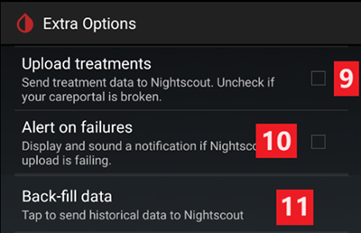
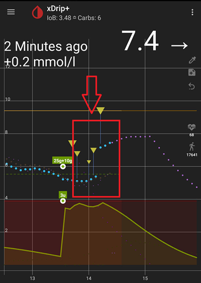
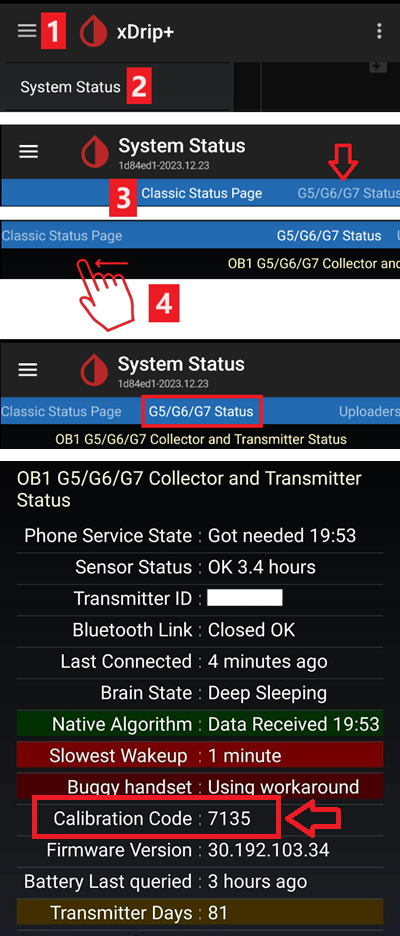

# Configuración de xDrip+

If not already set up, then download [xDrip+](https://jamorham.github.io/#xdrip-plus).

Desactiva la optimización de la batería y permite la actividad en segundo plano para la aplicación xDrip+.

You can safely download the [latest APK (stable)](https://xdrip-plus-updates.appspot.com/stable/xdrip-plus-latest.apk) unless you need recent features or are using sensors that are being actively integrated (like G7), in which case you should use the latest [Nightly Snapshot](https://github.com/NightscoutFoundation/xDrip/releases).

## Configuración básica para todos los medidores contínuos (CGM), sistemas CGM puros o sistemas flash (FGM)

### Disable Nightscout upload

Starting with AAPS 3.2, you shouldn't let any other app upload data (blood glucose and treatments) to Nightscout.

→ Hamburger Menu (1) → Settings (2) → Cloud Upload (3) -> Nightscout Sync (REST-API)(4) → Switch **OFF** `Enabled` (5)

#### Disable automatic calibration and treatments

If you use an older version of AAPS (before 3.2), make sure to deactivate `Automatic Calibration` (7) If the checkbox for `Automatic Calibration` is checked, activate `Download treatments` (6) once, then remove the checkbox for `Automatic Calibration` and deactivate `Download treatments` again.

Tap `Extra Options`(8)

:::{admonition} Safety warning :class: warning You must deactivate "Upload treatments" from xDrip+, otherwise treatments can be doubled in AAPS leading to false COB and IOB.  
:::

Deactivate `Upload treatments`(9) and make sure you will **NOT** use `Back-fill data` (11).

Option `Alert on failures` should also be deactivated (10). Otherwise you will get an alarm every 5 minutes in case Wi-Fi/mobile network issues or if the server is not available.

### **Inter-app Settings** (Broadcast)

If you are going to use AAPS and the data should be forwarded to i.e. AAPS you have to activate broadcasting in xDrip+ in Inter-App settings.

→ Hamburger Menu (1) → Settings (2) → Inter-app settings (3) → Broadcast locally **ON** (4)

In order for the values to be identical in AAPS with respect to xDrip+, you should activate `Send the displayed glucose value` (5).

Enable Compatible Broadcast (6).

If you have also activated `Accept treatments` in xDrip+ and `Enable broadcasts to xDrip+` in AAPS xDrip+ plugin, then xDrip+ will receive insulin, carbs and basal rate information from AAPS.

If you enable `Accept Calibrations`, xDrip+ will use the calibrations from AAPS. Be careful when you use this feature with Dexcom sensors: read [this](https://navid200.github.io/xDrip/docs/Calibrate-G6.html) first.

Remember to disable Import Sounds to avoid xDrip+ making a ringtone every time AAPS sends a basal/profile change.

(xdrip-identify-receiver)=

#### Identificar receptor

- If you discover problems with local broadcast (AAPS not receiving BG values from xDrip+) go to → Hamburger Menu (1) Settings (2) → Inter-app settings (3) → Identify receiver (7) and enter `info.nightscout.androidaps` for AAPS build (if you are using PumpControl build, please enter `info.nightscout.aapspumpcontrol` instead!!).
- Importante: la corrección automática a veces tiende a cambiar la "i" de "info" por una mayúscula. You **must use only lowercase letters** when typing `info.nightscout.androidaps` (or `info.nightscout.aapspumpcontrol` for PumpControl). Capital I would prevent the App from receiving BG values from xDrip+.
    
    

## Use AAPS to calibrate in xDrip+

- If you want to be able to use AAPS to calibrate then in xDrip+ go to Settings → Interapp Compatibility → Accept Calibrations and select ON. 
- You may also want to review the options in Settings → Less Common Settings → Advanced Calibration Settings.

## Dexcom G6

- El transmisor Dexcom G6 puede conectarse simultáneamente al receptor Dexcom (o alternativamente a la bomba t:slim) y a una aplicación en tu teléfono.
- Para usar xDrip+ como receptor, desinstala primero la aplicación Dexcom. **No se puede conectar al mismo tiempo la aplicación xDrip+ y Dexcom con el transmisor.**
- If you need Clarity and want to profit from xDrip+ features, use the [Build Your Own Dexcom App](DexcomG6-if-using-g6-with-build-your-own-dexcom-app) with local broadcast to xDrip+, or use xDrip+ as a Companion app receiving notifications from the official Dexcom app.

### La versión de xDrip+ a utilizar depende del número de serie de los transmisores G6.

- All G6 transmitters manufactured after fall/end 2018 are called "Firefly". They do not allow sensor restart without [removing the transmitter](https://navid200.github.io/xDrip/docs/Remove-transmitter.html), they do not send raw data. It is recommended to use the latest [Nightly Snapshot](https://github.com/NightscoutFoundation/xDrip/releases).
- Old rebatteried transmitters and modified trasmitters allow sensor life extension and restarts, they also send raw data. You can use the [latest APK (stable)](https://xdrip-plus-updates.appspot.com/stable/xdrip-plus-latest.apk).

### Ajustes específicos de Dexcom

- Follow [these instructions](https://navid200.github.io/xDrip/docs/G6-Recommended-Settings.html) to setup xDrip+.

### No se recomiendan reinicios preventivos

**Only rebatteried or modified Dexcom transmitters. [Preemptive restarts](https://navid200.github.io/xDrip/docs/Preemptive-Restart.html) do not work with standard transmitters and will stop the sensor completely: you need to [remove the transmitter](https://navid200.github.io/xDrip/docs/Remove-transmitter.html) to restart the sensor.**

The automatic extension of Dexcom sensors (`preemptive restarts`) is not recommended as this might lead to “jumps” in BG values on day 9 after restart.

To use it safely, there are a few points to be aware of:

- Si estás usando los datos nativos con el código de calibración en xDrip+ o Spike, la cosa más segura es no permitir reinicios preventivos del sensor.
- Si debe usar reinicio preventivo, a continuación, asegúrese de insertar una hora del día donde puede observar el cambio y calibrar si es necesario. 
- Si está reiniciando sensores, o bien haga esto sin la calibración de fábrica para obtener resultados más seguros en los días 11 y 12, o asegúrate de que estás listo para calibrar y vigilar la variación.
- La preabsorción del G6 con calibración de fábrica es probable que dé variaciones en los resultados. Si haces preconfiguración, entonces para obtener los mejores resultados, probablemente necesitarás calibrar el sensor.
- Si no estás observando los cambios que pueden estar teniendo lugar, puede ser mejor volver al modo no calibrado en fábrica y usar el sistema como un G5.

To learn more about the details and reasons for these recommendations read the [complete article](https://www.diabettech.com/artificial-pancreas/diy-looping-and-cgm/) published by Tim Street at [www.diabettech.com](https://www.diabettech.com).

(xdrip-connect-g6-transmitter-for-the-first-time)=

### Conectar el transmisor G6 por primera vez

**For second and following transmitters see [Extend transmitter life](xdrip-extend-transmitter-life) below.**

Follow [these instructions](https://navid200.github.io/xDrip/docs/Starting-G6.html).

(xdrip-transmitter-battery-status)=

### Estado de la batería de Transmisor

- Battery status can be controlled in system status  
    → Hamburger Menu (1) → System Status (2) → If you are on the Classic Status Page (3) swipe the screen (4) to reach → G5/G6/G7 Status screen.

- See [here](https://navid200.github.io/xDrip/docs/Battery-condition.html) for more information.

(xdrip-extend-transmitter-life)=

### Extender vida del transmisor

- [Lifetime](https://navid200.github.io/xDrip/docs/Transmitter-lifetime.html) cannot be extended for Firefly transmitters: only rebatteried or modified transmitters.
- Follow [these instructions](https://navid200.github.io/xDrip/docs/Hard-Reset.html) for non-Firefly transmitters.

(xdrip-replace-transmitter)=

### Sustituir transmisor

- Desactive el receptor Dexcom original (si se utiliza).
- [Stop sensor](https://navid200.github.io/xDrip/docs/Dexcom/StartG6Sensor.html) (only if replacing sensor).

- Forget device in xDrip+ system status AND in smartphone’s BT settings (Will be shown as Dexcom?? mientras ?? are the last two digits of the transmitter serial no.)  
    → Hamburger Menu (1) → System Status (2) → If you are on the Classic Status Page (3) swipe the screen (4) to reach → G5/G6/G7 Status screen → Forget Device (5).

- Remove transmitter (and sensor if replacing sensor). To remove transmitter without removing sensor see [this](https://navid200.github.io/xDrip/docs/Remove-transmitter.html), or this video <https://youtu.be/AAhBVsc6NZo>.
- Coloque el transmisor antiguo lejos para evitar la reconexión. A microwave is a perfect Faraday shield for this - but unplug power cord to be 100% sure no one is turning the microwave on.
- Follow [these instructions](https://navid200.github.io/xDrip/docs/Starting-G6.html).
- No encienda el receptor original de Dexcom (si lo utiliza) de nuevo antes de xDrip+ muestre las primeras lecturas.

### Nuevo Sensor

- Desactive el receptor Dexcom original (si se utiliza).
- Stop sensor following [these instructions](https://navid200.github.io/xDrip/docs/Dexcom/StartG6Sensor.html).

- Insert and then start a new sensor following [these instructions](https://navid200.github.io/xDrip/docs/Starting-G6.html).

(xdrip-retrieve-sensor-code)=

### Recuperar código de sensor

→ Hamburger Menu (1) → System Status (2) → If you are on the Classic Status Page (3) swipe the screen (4) to reach → G5/G6/G7 Status screen → Calibration Code.

(xdrip-troubleshooting-dexcom-g5-g6-and-xdrip)=

### Solución de problemas de Dexcom G5/G6 y xDrip+

#### Problema al conectar el transmisor

Follow [these instructions](https://navid200.github.io/xDrip/docs/Connectivity-troubleshoot.html).

#### Problema al iniciar un nuevo sensor

Follow [these instructions](https://navid200.github.io/xDrip/docs/Dexcom/SensorFailedStart.html).

## Libre 1

- Setup your NFC to Bluetooth bridge in xDrip+
    
    → Hamburger Menu (1) → Settings (2) → Less common settings (3) → Bluetooth Settings (4)

- In Bluetooth Settings set the checkboxes exactly as in the screenshots below (5)
    
    - Disable watchdogs as they will reset the phone Bluetooth and interrupt your pump connection.
    
    

- You can try to enable the following settings (7)
    
    - Usar escaneo
    - Trust Auto-Connect
    - Use Background Scans

- If you easily lose connection to the bridge or have difficulties recovering connection, **DISABLE THEM** (8).
    
    

- Leave all other options disabled unless you know why you want to enable them.
    
    

### Libre smart reader battery level

- Battery level of bridges such as MiaoMiao and Bubble can be displayed in AAPS (not Blucon).
- Details can be found on [screenshots page](Screenshots-sensor-level-battery).

### Connect Libre Transmitter & start sensor

- If your sensor requires it (Libre 2 EU and Libre 1 US) install the [latest out of process algorithm](https://drive.google.com/file/d/1f1VHW2I8w7Xe3kSQqdaY3kihPLs47ILS/view).

- Your sensor must be already started using the vendor app or the reader (xDrip+ cannot start or stop Libre sensors).

- Set the data source to Libre Bluetooth.
    
    → Hamburger Menu (1) → Settings (2) → Select Libre Bluetooth in Hardware Data source (3)
    
    

- Scan Bluetooth and connect the bridge.
    
    → Hamburger Menu (1) → Scan Bluetooth (2) → Less common settings (3) → Bluetooth Settings (4)
    
    - If xDrip+ can't find the bridge, make sure it's not connected to the vendor app. Put it in charge and reset it.
    
    

- Start the sensor in xDrip+.
    
    :::{admonition} Safety warning :class: warning Do not use sensor data before the one hour warm-up is over: the values can be extremely high and cause wrong decisions in AAPS.  
    :::
    
    → Hamburger Menu (1) → Start sensor (2) → Start sensor (3) → Set the exact time you started it with the reader or the vendor app. If you didn't start it today, answer "Not Today" (4).

## Libre 2 patched app

- Set the data source to Libre patched app.
    
    → Hamburger Menu (1) → Settings (2) → Select Libre (patched App) in Hardware Data source (3)
    
    

- You can add `BgReading:d,xdrip libre_receiver:v` under Less Common Settings->Extra Logging Settings->Extra tags for logging. Esto registrará mensajes de error adicionales ante problemas.

