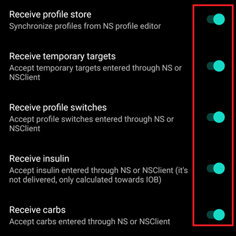

# Nightscout

(Nightscout-security-considerations)=

## Consideraciones de seguridad

Además de informar, Nightscout también se puede utilizar para controlar AAPS. Es decir, puedes establecer objetivos temporales o agregar carbohidratos futuros. Esta información será recogida por AAPS y actuará en consecuencia. Por lo tanto, vale la pena pensar en securizar tu sitio web de Nightscout.

Exercise maximum caution if using Nightscout as your AAPS data source.

### Ajustes de Nightscout

You can deny public access to your Nightscout site by using [authentication roles](https://nightscout.github.io/nightscout/security): make sure you only share your URL with a `readable` token, never with an `admin` token.

Nightscout `API_SECRET` is your site main password: don't share it publicly.

### AAPS settings

You can setup AAPS to accept Nightscout commands (profile changes, treatments, ...), or fully disable it.

* Access the NSClient or NSClientV3 plugin settings with either 1) Main view -> Config Builder -> Synchronization -> NSClient Cog icon 2) NSCLIENT tab -> Three dots menu -> Plugin preferences
* Enable all data upload to Nightscout (3) as this is now the standard method unless your BG data source is Nightscout.  
  If your AAPS BG data source is Nightscout **do not** enable Upload BG data to NS (3).
* Do not enable Receive/backfill data (4) unless Nightscout is your BG data source.

#### Do not sync from Nightscout

Disabling these options makes sure no Nightscout change will be used by AAPS.

#### Accept changes from Nightscout

Enabling these options allow you to remotely change AAPS settings through Nightscout, like profiles modifications and switch, temporary targets and adding carbs that will be taken into account by AAPS.  
Note that insulin treatments will only be used for calculations like "Do not bolus, record only".

### Configuraciones de seguridad adicionales

Mantén tu teléfono actualizado como se describe en [seguridad primero](../Getting-Started/Safety-first.md).

(Nightscout-manual-nightscout-setup)=

## Configuración manual de Nightscout

Se asume que ya tienes un sitio de Nightscout; si no lo tienes, visita la página de [Nightscout](http://nightscout.github.io/nightscout/new_user/) para obtener instrucciones completas sobre la configuración. Las siguientes instrucciones son los ajustes que también deberás agregar a tu sitio de Nightscout. Your Nightscout site needs to be at least version 15 for AAPS 3.2, so please check you are running the [latest version](https://nightscout.github.io/update/update/#updating-your-site-to-the-latest-version) otherwise you will get an error message on your AAPS app.

* [Edit your variables](https://nightscout.github.io/nightscout/setup_variables/#nightscout-configuration)

* Agrega o edita las variables de la siguiente manera:
  
  * `ENABLE` = `careportal boluscalc food bwp cage sage iage iob cob basal dbsize pushover bgi pump openaps`
  * `DEVICESTATUS_ADVANCED` = `true`
  * `SHOW_FORECAST` = `openaps`
  * `PUMP_FIELDS` = `reservoir battery clock`
  * Se pueden configurar varias alarmas para [monitorear la bomba](https://github.com/nightscout/cgm-remote-monitor#pump-pump-monitoring), se recomienda en particular la alarma de porcentaje de batería: 
    * `PUMP_WARN_BATT_P` = `51`
    * `PUMP_URGENT_BATT_P` = `26` 

* Save the modifications. Your Nightscout site should now allow you to display the pills. You can force default display adding them in `SHOW_PLUGINS`.
  
  * `SHOW_PLUGINS` = `careportal boluscalc food bwp cage sage iage iob cob basal dbsize pushover bgi pump openaps`
  
  

## Nightscout as a paid SaaS (Software as a Service)

Use the vendor web interface to set the variables. Contact the vendor support service if necessary.