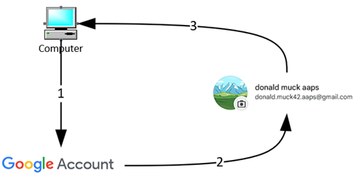
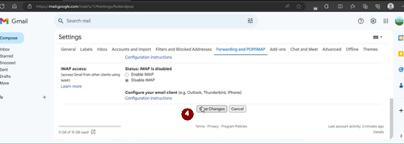

# A dedicated Google account for AAPS (optional)

Some **AAPS** users prefer to use their main email account for **AAPS** as well. Alternatively, some **AAPS** users (or their caregivers) set-up a dedicated **AAPS** email account - this is optional, we give an example of how to do it below.

If you don't want to set up an **AAPS**-dedicated Gmail account, you can just go straight to the next section, [building AAPS](building-AAPS.md).

:::{admonition} Advantages of a dedicated Google account for AAPS

- Dedicated Google drive space means you will not risk filling up your personal Google drive limit with **Export Preferences**.
- Each version of **AAPS** (and supporting apps like xdrip+, BYODA, etc) will be stored in one single place which is independent of your computer hardware. If your PC or phone is stolen/lost/broken you will still have access.
- By harmonizing the setup, it will make online support simpler across users with similar folder structure.
- Depending on the setup (see below), you will have a separate identity as an alias to communicate within the community which can protect your privacy. 
- Children with T1D can preserve their own “everyday” email account as minors while using **AAPS** and associated features which require an adult account.
- Gmail allows you to register up to 4 accounts under the same phone number.
  :::

## How to set up a dedicated Google account for AAPS

(⌛About 10 minutes)

Requirements:

- You have a Windows’ PC (Windows 10 or newer) and a Android phone (Android 9 or newer) which will host the **AAPS** app. These both have all the latest security updates, internet access and admin privileges, since some steps require downloading and installing programs.
- The Android phone is already set-up with your personal ”everyday”  email address, such as a Gmail account.

:::{admonition} Things to consider when setting up your new account
:class: dropdown

- You could use a name different to your own, which has relevance to the account (like t1dsuperstar) for privacy reasons. You can then use it in **AAPS** public forums while keeping your own identity private. Since Google requires a recovery email and phone number, it is still traceable.
- The new **AAPS** account will use the same phone number for verification as your “_everyday_” one. It will use the “everyday” email address for verification;
- We will setup email forwarding such that any email sent to the new dedicated AAPS account will be forwarded to the primary one (so there is no need to check two different mailboxes);
- Use separate passwords for your _everyday_ Gmail account and the AAPS-dedicated Gmail account
- If you use google “2-step verification” (aka multifactor) authentication for one Gmail account, you might as well do it for both Gmail accounts.
- If you plan to use Google “Passkeys”, make sure you register multiple devices. This is so you don’t lock yourself out. Only do it on devices that nobody else can access (_i.e._ not on a PC with a shared account that other people can unlock).
  :::

:::{admonition}  Video Walkthrough!
:class: Note
Click [here](https://drive.google.com/file/d/1dMZTIolO-kd2eB0soP7boEVtHeCDEQBF/view?usp=drive_link) for a video walkthrough of how to set up a dedicated Google account.
:::

These are the steps outlined in the video:

In this example: 

- Your existing “_Everyday_” Google account is donald.muck42\@gmail.com ; 
- Your new “_AAPS_” Gmail account will be: donald.muck42.aaps\@gmail.com; 

#### Go to https\://account.google.com 

If you are already logged into Google, this will direct you to your “Everyday” **My Account** page.
(1) Click on the top right of the page on your profile picture (in this case, a simple 
(2) select “_add another account_”.

#### Enter your NEW dedicated account details: 

- Enter the new account: 
- Create Account
- for my personal use. 

#### Enter your persona:

- Enter firstname
- lastname
- birthdate (needs to be an Adult age)

#### Choose your NEW email address & password

This example appends “.AAPS” to Donald Muck’s existing one…\
Set a password

####  Enter a phone number which can receive the SMS verification

Gmail will now send you a unique code to enter for validation.

#### Enter the recovery email address 

In this case it will be your existing “_everyday_” email…

#### Finish setting up the account

Gmail will display the account name. It will ask you to accept Gmail’s terms and conditions & confirm your personalization settings.

#### Customize the new profile display

At this point you should be on Gmail’s MyAccount page showing your new **AAPS**-dedicated email account. The profile picture will be set by default to the first letter of your name. Change it to something unique to avoid confusion… in this example, Donald.Muck.AAPS has replaced  with 

\

#### Open the Gmail website on both windows to configure the new account

So that you don’t need to monitor a separate email account, forward all the emails from the new **AAPS**-dedicated account to your everyday account \
This part can be a bit confusing, since you will have to switch back and forth between both accounts. To make it easier, open 2 separate browser windows on top of each other:

1. Move your existing browser to the top of your screen and resize it such that it only takes about half of the top of the screen… 
2. Right click on your Browser logo in your taskbar 
3. From the menu select “New Window”... and adjust it so it only takes the bottom half of the screen.

Open https\://gmail.com  in each browser window. Make sure your personal account is on top and the new dedicated **AAPS** account is on the bottom, and is easily identifiable by the profile picture in the top right corner. (if needed you can always switch accounts by clicking on the profile picture and selecting the correct one.

Your Gmail homepages screen should look like this:\

#### In the new Gmail account (bottom window), open Gmail settings… 

- Click on the gear on the left of the profile picture 
- then select “**See all Settings**”

#### Setup forwarding…

- Click on the “Forwarding and POP/IMAP” Setting tab
- Click on “add a forwarding address”
- Add your “everyday” email address
- Gmail will send a verification code to your “everyday” email address. 
- You will switch back to your everyday profile and click on the link to verify that you accept the forwarding (or get the code from Gmail’s verification email in your “everyday” Gmail window and cut and paste it in your “new AAPS dedicated” Gmail window).

There is quite a bit of back and forth between the windows but this will ensure that when you check your “everyday” account emails you will also see the emails forwarded from your AAPS dedicated account such as Gmail alerts.

#### Verify the forwarded email address

- In the “Everyday” gmail (top window), you will get the “Gmail forwarding Confirmation” email. 
- Open it and “click the link to confirm the request”

#### Archive forwarded emails in the new dedicated Gmail account (bottom window)

<!---->

1. Refresh the bottom window
2. Check “forward incoming email”
3. And archive Gmail’s copy (to keep your new dedicated mailbox clean)
4. Scroll all the way to the bottom to save your changes\
   

Félicitations ! Now you have created an AAPS-dedicated Google account. The next step is to [build the AAPS app](building-AAPS.md).
