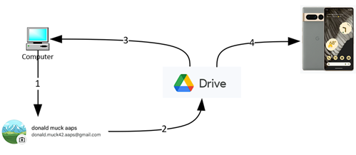
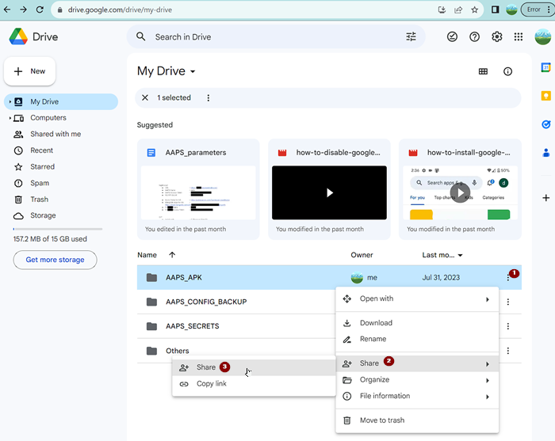
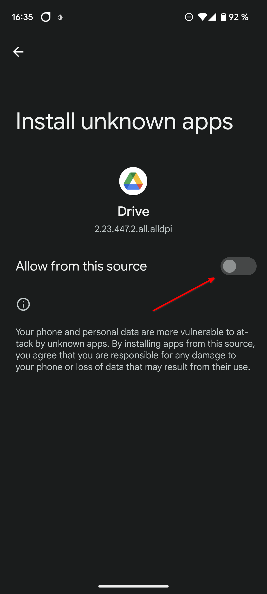

# Transferring, and Installing AAPS on your smartphone

In the previous section, [building **AAPS**](../building-AAPS.md), you built the **AAPS** app (which is an .apk file) on a computer.

The next steps are to **transfer** the **AAPS** APK file (as well as other apps you may need, like BYODA, Xdrip+ or another CGM reciever app) to your Android smartphone, and then **install** the app(s).

Following installation of **AAPS** on the smartphone, you will then be able to move onto [**configuring the AAPS loop**](configuring-the-AAPS-loop.md).

There are several ways to transfer the **AAPS** APK file from your computer to the smartphone. Here we explain two different ways:

- Option 1-  Use a USB cable
- Option 2 -  Use your Google drive (Gdrive)

Please note that transfer by email might cause difficulties, and is discouraged.

## Option 1. Use a USB cable to transfer files

The easiest way to transfer the AAPS apk file is with a  [USB cable](https://support.google.com/android/answer/9064445?hl=en). Transfer the file from its location on your computer to the "downloads" folder on the phone.

On your phone, you will have to allow installation from unknown sources. Explanations of how to do this can be found on the internet (_e.g._ [here](https://www.expressvpn.com/de/support/vpn-setup/enable-apk-installs-android/) or [here](https://www.androidcentral.com/unknown-sources)).

Once you have transferred the file by dragging it across, to install it, open the "downloads" folder on the phone, press the AAPS apk and select "install". You can then proceed to the next step, [Setup Wizard](../Installing-AndroidAPS/setup-wizard.md), which will help you setup the **AAPS** app and loop on your smartphone.

## Option 2. Use Google drive to transfer files

### **Mount a Google drive on your PC & Phone**

(⌛About 10 minutes )\


By using **Google Drive (G drive)** to do the transfer and installation, you automatically have a **backup copy** of the apk file, which is useful if you lose or break your computer or smartphone.

A **Gmail** account provides access to free cloud storage from Gdrive which can be accessed directly as a “virtual” drive from both your PC AND your phone. You can use this feature to backup important settings/files in Gdrive and to share files between the phone and the PC.
If you have not done so already, install Gdrive on your PC:

:::{admonition}  Video Walkthrough!
:class: Note
Click [here](https://drive.google.com/file/d/1EnaQ7U8U7M84vOFjcMRoB43dNwqUuLty/view?usp=drive_link) for a video walkthrough of how to install Gdrive on your PC.
:::

The steps are as follows:

1. Go to https\://drive.google.com/ 

2. Use your **Gmail** account to login (if you have an “**AAPS**-dedicated” Gmail account, switch to this account from the profile window)

3. From the gear icon next to your profile picture, select “Get drive for desktop”  

4. Download & Install the Gdrive application on your PC

5. By default, Gdrive will appear on your PC as G:\My Drive. We suggest creating three subfolders under "My Drive":

   - AAPS_APK  \
     (To store your own versions of the **AAPS** application as you build it and update it over time)
   - AAPS_CONFIG_BACKUP\
     (Where you will keep a backup of your **AAPS** phone configurations over time)
   - AAPS_SECRETS \
     (Where you will keep passwords required to rebuild the application and facilitate updates over time)

6. It is advisable to share these folders with your significant others, in case they need to re-access or re-build the app for you. 

   - (1) Right click on the folder 3 vertical dots menu
   - (2) Click Share 
   - (3) Click Share 
   - Enter the email address of the people you will want to grant access to…\
     

7. Download & install “Google drive” on your phone from the Playstore link

:::{admonition}  Video Walkthrough!
:class: Note
Click [here](https://drive.google.com/file/d/1--qwxp95cG8pwCv1pDFZuuOl6ue22W4H/view?usp=drive_link) for a  2 minute video walkthrough of how to download and install the Google drive on your smartphone
:::

- If you use an **AAPS**-dedicated **Gmail** account, make sure that you configure Google drive on your phone to use the correct account by clicking on the profile picture.

8. Transfer the file(s) from your PC to your phone:

a) Open [Google.com](https://www.google.com/) in your web browser.

b) On the right upper side select the Drive app in the Google menu.


c) Right-click in the free area below the files and folders in the **Google Drive** app and select "Upload File".


d) The apk file should now be uploaded on Google Drive.

9. Install  the **AAPS** APK file on your Android smartphone

a) Switch to working on your Android smartphone, and start the **Google Drive** app, which should be preinstalled on the phone.


b) Launch installation of the **AAPS** apk by double-clicking on the filename in the **Google Drive** App.


c) If you get a security notice that you are "not allowed to install apps from **Google Drive**", allow it while you are installing the app, and then disallow it afterwards, to prevent it being a security risk.




d) Now that you have installed **AAPS** on the Android smartphone you should see the **AAPS** icon and be able to open the app.

```{warning}
**IMPORTANT SAFETY NOTICE**

Did you remember to disallow the installation from Google Drive?

```

Félicitations ! Now you can continue with the next section, [Setup Wizard](../Installing-AndroidAPS/setup-wizard.md).
