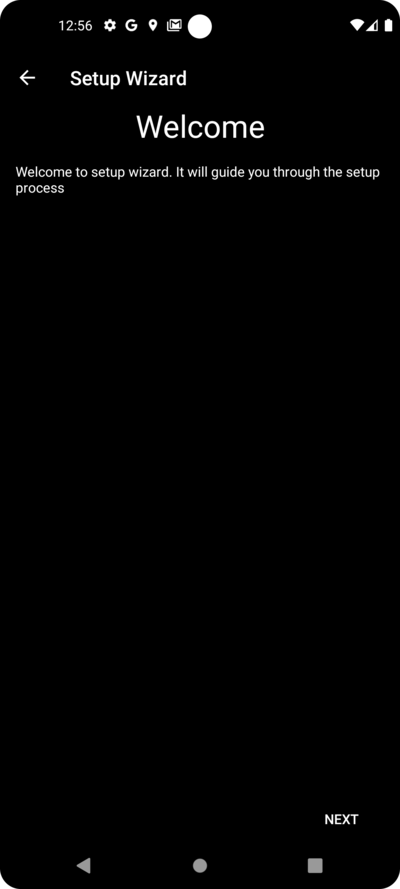
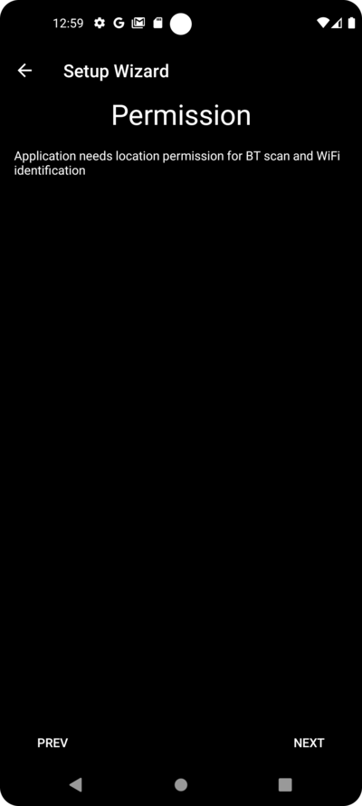
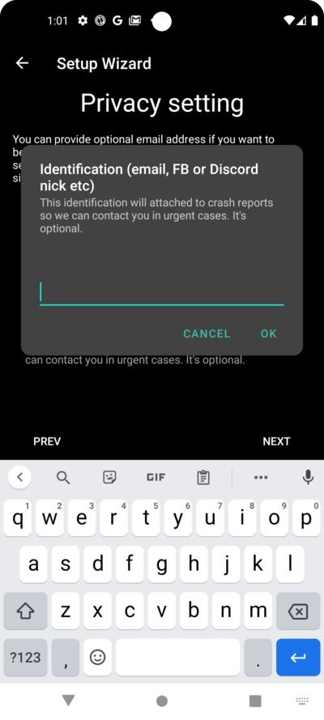
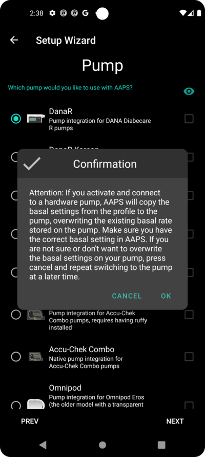
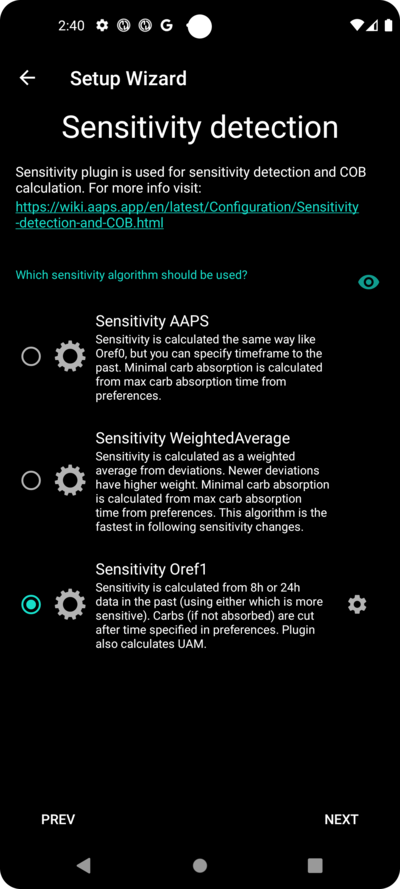
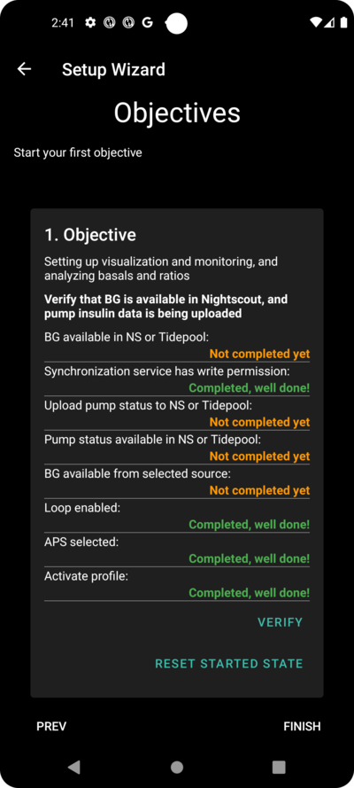

# Assistant de configuration

Lorsque vous lancez **AAPS** pour la première fois, vous êtes guidé par l'"**Assistant de configuration**", pour configurer rapidement tous les paramètres de base de votre application. L'**Assistant de configuration** vous guide, afin d'éviter d'oublier quelque chose d'essentiel. Par exemple, les **paramètres d'autorisations** sont fondamentaux pour configurer correctement **AAPS**.

Cependant, il n'est pas obligatoire de tout configurer complètement lors de la première exécution de l'**Assistant de configuration** et vous pouvez facilement quitter l'Assistant et y revenir plus tard. Il y a trois possibilités après l'exécution de l'**Assistant de configuration** pour optimiser davantage/changer la configuration. Ces options seront détaillées dans la prochaine section. Vous pouvez donc tout à fait sauter quelques points de l'Assistant de Configuration, vous pourrez facilement y revenir plus tard.

Pendant, et juste après avoir l'exécution de l'**Assistant de configuration**, vous ne verrez pas forcément de changements notables se produire dans **AAPS**. Pour mettre en place votre boucle **AAPS**, vous devez suivre les **Objectifs** pour débloquer chaque fonctionnalité l'une après l'autre. Vous commencerez l'**Objectif 1** à la fin de l'Assistant de Configuration. C'est vous le maître d'**AAPS**, pas l'inverse.

:::{admonition} Aperçu des objectifs

:::

D'expérience, nous savons que les personnes qui se lancent se mettent souvent la pression pour configurer **AAPS** le plus rapidement possible, ce qui peut entraîner de la frustration car il y a beaucoup de choses à apprendre.

Alors, prenez votre temps pour configurer votre boucle, les avantages d'une boucle **AAPS** bien configurée sont énormes.

:::{admonition} Demandez de l’aide
:class: note
Si vous trouvez une erreur dans la documentation ou si vous avez une suggestion pour mieux expliquer quelque chose, vous pouvez demander de l'aide à la communauté comme expliqué dans [Où trouver de l'aide](../Where-To-Go-For-Help/Connect-with-other-users.md).
:::

## Guide pas à pas de l'assistant de configuration AAPS

### Message de bienvenue

Il s'agit juste d'un message de bienvenue que vous pouvez passer avec le bouton "SUIVANT" :

### Contrat de licence

Dans l'accord de licence de l'utilisateur final, il y a des informations importantes sur les aspects légaux de l'utilisation de **AAPS**. Veuillez le lire attentivement.

Si vous ne comprenez pas, ou n'êtes pas d'accord avec le contrat de licence de l'utilisateur final, vous ne pouvez tout simplement pas utiliser **AAPS** !

Si vous comprenez et êtes d'accord, veuillez cliquer sur le bouton "JE COMPRENDS ET J'ACCEPTE" et poursuivre avec l'Assistant de configuration :

### Autorisations requises

**AAPS** nécessite certains prérequis pour fonctionner correctement.

Dans les écrans suivants, on vous pose plusieurs questions auxquelles vous devez accepter de répondre pour que **AAPS** fonctionne. L'assistant vous explique pourquoi il demande ces paramètres.

Sur cette page, nous nous efforçons de fournir davantage d'informations de contexte, de traduire un langage technique en langage courant ou d'expliquer la raison.

Cliquez sur le bouton "SUIVANT" :

La consommation de la batterie sur les smartphones reste une problématique, car la performance des batteries est encore assez limitée. Par conséquent, le système d'exploitation Android de votre smartphone restreint par défaut les applications qui consomment du temps processeur, et donc de la batterie.

Cependant, **AAPS** doit s'exécuter régulièrement, notamment pour recevoir les glycémies toutes les quelques minutes, puis appliquer l'algorithme qui décide comment gérer cette information, en fonction de vos spécifications. Par conséquent, nous devons l'autoriser à le faire, au niveau d'Android.

Vous le ferez en donnant cette autorisation.

Cliquez sur le bouton "DEMANDE D'AUTORISATION" :

Cliquez "Autoriser" :

Android définit une autorisation spéciale pour les applications qui souhaitent vous envoyer des notifications.

Bien qu'il soit utile de pouvoir désactiver les notifications, _par ex._ des applications de réseaux sociaux, il est essentiel que vous permettiez à **AAPS** de vous envoyer des notifications.

Cliquez sur le bouton "DEMANDE D'AUTORISATION" :

Sélectionnez l'application "AAPS" :

Activer "Autoriser la superposition sur d'autres applis" en faisant glisser le curseur vers la droite :

Le curseur doit ressembler à ceci une fois activé :

Dans Android, l'utilisation du Bluetooth est liée à la capacité d'utiliser les services de localisation. Peut-être l'avez-vous vu aussi dans d'autres applications. Il est courant d'avoir besoin d'une autorisation de localisation si vous voulez utiliser le bluetooth.

**AAPS** utilise le bluetooth pour communiquer avec votre MGC et votre pompe à insuline si elles sont directement contrôlées par **AAPS** et non par une autre application utilisée par **AAPS**. Les détails peuvent différer d'une configuration à l'autre.

Cliquez sur le bouton "DEMANDE D'AUTORISATION" :

Cette autorisation est importante. Sans cela, **AAPS** ne peut pas fonctionner correctement du tout.

Cliquez sur "Lorsque vous utilisez l'appli" :

Cliquez sur le bouton "SUIVANT" :

**AAPS** a besoin de stocker des informations sur la mémoire interne de votre smartphone. Ce stockage permanent sur la mémoire interne signifie que les fichiers seront toujours disponibles, même après le redémarrage de votre smartphone. D'autres données sont simplement perdues, car elles ne sont pas enregistrées sur la mémoire interne.

Cliquez sur le bouton "DEMANDE D'AUTORISATION" :

Cliquez sur "Autoriser" :

Vous êtes informé que vous devez redémarrer votre smartphone après ce changement pour qu'il prenne effet.

Veuillez **ne pas quitter l'Assistant de configuration maintenant**. Vous pourrez le faire après avoir terminé l'Assistant de Configuration.

Cliquez sur "OK" puis sur le bouton "SUIVANT" :

### Mot de passe principal

Comme la configuration d'**AAPS** contient des données sensibles (par exemple la clé API pour accéder à votre serveur Nightscout), elle est cryptée par un mot de passe que vous allez définir ici.

La deuxième phrase est très importante, s'il vous plaît **NE PERDEZ PAS VOTRE MOT DE PASSE PRINCIPAL**. Assurez vous de le sauvegarder, _par ex._ sur Google Drive. Google Drive est pratique pour les sauvegardes car c'est Google qui le gère pour vous. Votre smartphone ou PC peuvent vous lâcher et vous pourriez ne pas avoir de sauvegarde locale. Si vous oubliez votre mot de passe principal, il peut être difficile de récupérer la configuration de votre profil et de progresser dans les **Objectifs** par la suite.

Après avoir saisi le mot de passe deux fois, veuillez cliquer sur le bouton "SUIVANT" :

### Téléchargement Fabric

Ici vous pouvez autoriser l'envoi automatique des rapports d'erreur en cas de plantage, ainsi que de données sur l'utilisation de l'appli.

Ce n'est pas obligatoire, mais c'est une bonne pratique de l'activer.

Cela aide les développeurs à mieux comprendre votre utilisation de l'application et les informe des plantages qui se produisent.

Ils/Elles reçoivent :

1. Des informations quand l'application plante, ce qu'ils/elles ne sauraient pas autrement puisque dans leur propre configuration tout fonctionne correctement et
2. Dans les données envoyées (informations sur le plantage), il y a des informations sur les circonstances dans lesquelles le plantage s'est produit et quel type de configuration est utilisé.

Cela aide donc les développeurs à améliorer l'application.

Veuillez activer le "Téléchargement Fabric" en faisant glisser le curseur vers la droite :

De plus, vous pouvez renseigner un moyen de contact si jamais si les développeurs ont besoin de vous contacter pour des questions ou des préoccupations urgentes :

Après avoir rempli vos "informations de contact", cliquez sur le bouton "OK". Vous pouvez y mettre votre nom sur Facebook, Discord, ... Mettez juste ce qui est le plus simple pour vous pour qu'on puisse vous contacter :

Cliquez sur le bouton "SUIVANT" :

### Unités (mg/dL <-> mmol/L)

Veuillez sélectionner si vos glycémies sont en mg/dL ou mmol/L, puis cliquez sur le bouton "SUIVANT" :

### Paramètres d'affichage

Ici, vous pouvez définir les valeurs entre lesquelles la glycémie sera considérée comme "dans la cible". Vous pouvez le laisser tel quel pour l'instant et le modifier plus tard.

Les valeurs que vous choisissez n'affectent que l'affichage du graphique, et rien d'autre.

Votre cible de glycémie, elle, est configurée ailleurs, dans votre profil.

Votre plage cible pour l'analyse du TIR (temps dans la plage cible) est configurée séparément dans votre serveur de reporting.

Cliquez sur le bouton "SUIVANT" :

### Synchronisation avec le serveur de reporting, etc

Ici, vous configurez le téléchargement des données vers votre serveur de reporting.

Vous pourriez également configurer d'autres éléments ici, mais pour cette première exécution, nous nous concentrerons simplement sur le serveur de reporting.

Si vous n'êtes pas en mesure de le configurer pour le moment, passez cette étape pour l'instant. Vous pouvez le configurer plus tard.

Sur cette page, quand vous activez un élément (plugin) avec la case à cocher à gauche, vous pouvez alors choisir de cocher la case de visibilité (œil) sur la droite. Quand cette case de visibilité est cochée, le plugin sera accessible directement depuis le menu supérieur sur l'écran d'accueil de **AAPS**. Vous devriez cocher la case de visibilité si vous configurez votre serveur de reporting à ce stade.

Dans cet exemple, nous sélectionnons Nightscout comme serveur de reporting, et nous allons le configurer.

:::{admonition}  Choisissez la bonne version **NSClient** en fonction de vos besoins !

Les utilisateurs de Nightscout devraient choisir **NSClient v3**, sauf si vous souhaitez surveiller ou envoyer des traitements à distance (_par ex._ en tant que parent ou aidant utilisant **AAPS** pour un enfant) via Nightscout, auquel cas, choisissez la première option "**NSClient**" jusqu'à nouvel ordre.
:::

Pour Tidepool, c'est encore plus simple, car vous n'avez besoin que de vos informations de connexion personnelles.

Après avoir fait votre choix, veuillez cliquer sur le bouton "SUIVANT" :

Ici, vous configurez l'accès au serveur de reporting Nightscout.

Veuillez cliquer sur "URL Nightscout" :

Entrez l'URL Nightscout de votre serveur personnel. Il s'agit de l'URL que vous avez configurée vous-même, ou qui vous a été fournie par votre fournisseur Nightscout.

Cliquez sur le bouton "OK" :

Entrez votre jeton d'accès nightscout. Il s'agit du jeton d'accès que vous avez défini pour votre serveur Nightscout. Sans ce jeton, l'accès ne fonctionnera pas.

If you don't have it at the moment please check the documentation for setting up the reporting server in the **AAPS** documentation.

After filling in the "**NS access token**" and clicking "OK", please click on the "Synchronization" button:

Please select "Upload data to NS" if you already configured nightscout in the previous steps of the Setup Wizard.

If you have stored profiles on Nightscout and want to download them to **AAPS**, enable "Receive profile store":

Go back to the previous screen and select "Alarm option":

For now, leave the switches disabled. We only walked to the screen to make you familar with possible options you might configure in the future. At the moment there is no need to do it.

Go back to the previous screen before and select "Connection settings".

Here you can configure how to transfer your data to the reporting server.

Caregivers must enable "use cellular connection" as otherwise the smartphone which serves the dependant/child can not upload data outside of WiFi range _e.g._ on the way to school.

Other **AAPS** users can disable the tranfer via cellular connection if they want to save data or battery.

If in doubt, just leave all enabled.

Go back to the screen before and select "Advanced Settings".

Enable "Log app start to NS" if you want get this information in the reporting server. It can help you to know remotely if and when the app has been restarted, particularly as a caregiver.

It might be interesting to see if **AAPS** is correctly configured now, but later it is usually not that important to be able to see **AAPS** stopping or starting in Nightscout.

Enable "Create announcements from errors" and "Create announcements from carbs required alerts".

Leave "Slow down uploads" disabled. You would only use it in unusual circumstances if for example a lot of information is to be transfered to the Nightscout server, and the Nightscout server is being slow in processing this data.

Go back to the screen before and select "NEXT" to go to the next screen:

### Nom du patient

Here you can setup your name in **AAPS**.

It can be anything. It's just for differentiating users.

To keep it simple just enter first name and last name.

Press "NEXT" to go to the next screen.

### Type de patient

Here you select your "Patient type" which is important, as the **AAPS** software has different limits, depending on the age of the patient. This is important for security and safety reasons.

Here is where you also configure the **maximum allowed bolus** for a meal. That is, the largest bolus you need to give to cover your typical meals. It's a security feature to help avoid accidentally overdosing when you are bolusing for meal.

The second limit is similar in concept, but relates to the max carbohydrate intake you expect.

After setting these values, press "NEXT" to go to the next screen:

### Used insulin

Select the type of insulin being used in the pump.

The insulin names should be self-explanatory.

:::{admonition} Don't use the "Free-Peak Oref" unless you know what you are doing
:class: danger
For advanced users or medical studies there is the possibility to define with "Free-Peak Oref" a customised profile of how insulin acts. Please don't use it unless you are an expert, usually the pre-defined values work well for each branded insulin.
:::

Press "NEXT" to go to the next screen:

### Blood sugar source

Select the BG source you are using. Please read the documentation for your [BG source](../Configuration/BG-Source.md).

As there are several options available, we don't explain the configuration for all of them here. We are using Dexcom G6 with the BYODA app in our example here:

If you are using Dexcom G6 with BYODA, enable the visibility in the top level menu by clicking the tickbox on the right side.

After making your selection, press "NEXT" to go to the next screen:

If you are using Dexcom G6 with BYODA, click on the "cog/gearwheel" to access the settings for BYODA.

Enable the "Upload BG data to NS" and "Log sensor change to NS".

Press "NEXT" to go to the next screen:

### Profil

Now we are entering a very important part of the Setup Wizard.

Please read the documentation about profiles before you try to enter your profile details on the following screen.

:::{admonition} Working profile required - no exceptions here !

It's required that you have determined and discussed your profile with your doctor, and that it has been proven to work by successful basal rate, ISF and IC testing!

If a robot has an incorrect input it will fail - consistently. **AAPS** can only work with the information it is given. If your profile is too strong, you risk hypoglycemia, and if it is too weak, you risk hyperglycemia.
:::

Press "NEXT" to go to the next screen. Enter a "profile name":

You can have several profiles in the long-term if needed. We only create one here.

:::{admonition} Profile only for tutorial - not for your usage

It is not intended to be an accurate profile or something very well optimised, because each person's needs are so different.

Don't use it for actually looping!
:::

Enter your Duration of insulin Action (DIA) in hours. Then press "IC":

Enter your IC values:

Press "ISF". Enter your ISF values:

Press "BAS". Enter your basal values:

Press "TARG". Enter your blood sugar target values.

For open looping this target can be a wider range, as otherwise **AAPS** notifies you permanently to change the temporary basal rate or another setting, which can be exhausting.

Later, for closed looping, you will generally have only one value for top and bottom. That makes it easier for **AAPS** to hit the target and give you better overall diabetes control.

Enter/confirm the target values:

Save the profile by clicking on "SAVE":

After saving a new buttom "Activate Profile" occurs.

:::{admonition} Several defined but only one active profile
:class: information
You can have several profiles defined, but only one activated profile running at any given time.
:::

Press "Activate Profile":

The profile switch dialogue appears. In this case let it stay as preset.

:::{admonition} Several defined but only one active profile
:class: information
You will learn later how to use this general dialog to handle situations like illness or sport, where you need to change your profile suitable for the circumstances.
:::

Press "OK":

A confirmation dialog for the profile switch appears.

You can confirm it with pressing "OK". Press "NEXT" to go to the next screen:

Your profile has now been set:

### Pompe à insuline

Now you are selecting your insulin pump.

You get an important warning dialog. Please read it, and press "OK".

If your have already setup your profile in the steps before and you know how to connect your pump, feel free to connect it now.

Otherwise, leave the Setup Wizard, using the arrow in the top left corner and let **AAPS** first show you some blood glucose values. You can come back anytime or use one of the direct configuration options (not using the Wizard).

Please read the documentation for your [insulin pump](../Getting-Started/Pump-Choices.md).

Press "NEXT" to go to the next screen.

In this case we select "Virtual Pump".

Press "NEXT" to go to the next screen:

### Algorithme APS

Use the OpenAPS SMB algorithm as your APS algorithm. Despite the name the SMB feature of the algorithm is disabled until you are familar with AAPS and already worked through the first objectives. OpenAPS SMB is newer and in general better compared to the OpenAPS AMA anyway.

The reason SMB is disabled in the beginning is because the SMB feature enables faster reaction on blood sugar increase through the Super Micro Bolus instead of increasing the basal rate percentage. As in the begining your profile is in general not as good as after some time of experience the feature is disabled in the begining.

:::{admonition} Only use the older algorithm **OpenAPS AMA** if you know what you are doing
:class: information
OpenAPS AMA is the most basic algorithm which does not support micro boluses to correct high values. There might be circumstances where it is better to use this algorithm but it is not the recommendation.
:::

Press "NEXT" to go to the next screen:

Only read the text and change nothing here.

Due to the limitations which are imposed by the **Objectives** you can't use either "closed loop" or "SMB features" at the moment anyway.

Press "NEXT" to go to the next screen:

### Mode APS

Let "Open Loop" remain selected.

Press "NEXT" to go to the next screen:

### Estimation de Sensibilité

Let "Sensitivity Oref1" the standard for the sensitivty plugins selected.

Press "NEXT" to go to the next screen:

### Start Objective 1

You are entering now the Objectives. The qualification for access to further **AAPS** features.

Here we start Objective 1, even if at the moment our setup is not completely ready to successfully complete this Objective.

But this is the start.

Press the green "START" to to start objective 1:

You see that you already made some progress, but other areas are to be done.

Press "FINISH" to go to the next screen.

You are coming to the home screen of **AAPS**.

Here you find the information message in **AAPS** that you set your profile.

This was done when we switched to our new profile.

You can click "SNOOZE" and it will disappear.

If you accidentally leave the Setup Wizard at any point, you can either simply re-start the Wizard, or change the [configuration of the AAPS loop](../Installing-AndroidAPS/change-configuration.md) manually.

If your **AAPS** loop is now fully setup, please move on to the next section ["Completing the objectives"](../Usage/completing-the-objectives.md).
