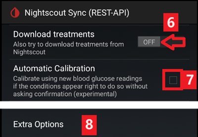
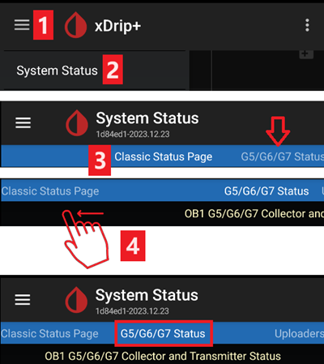
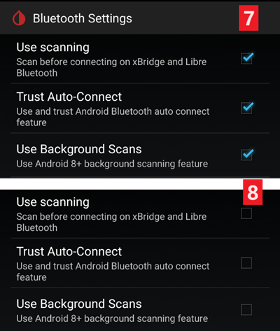
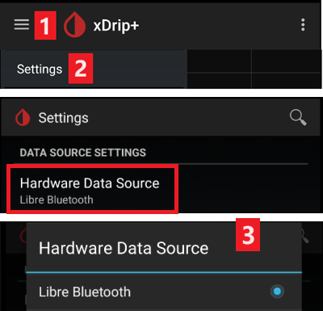

# Cofigurare xDrip+

(For additional information regarding xDrip+, please refer to the [xDrip documentation](https://xdrip.readthedocs.io/en/latest/.)

If not already set up then download [xDrip+](https://jamorham.github.io/#xdrip-plus).

**This documentation is for xDrip+ for Android only.** There is an app "xDrip for iOS" that has nothing to do with the original xDrip+ for Android.

Pentru transmițătoarele G6 fabricate după sfârșitul anului 2018 (a caror serie starting with 80 or 81) you can use the [master](https://jamorham.github.io/#xdrip-plus) version.

Pentru transmițătoarele a caror serie is starting with 8G..., 8H... or 8J... use one of the [latest nightly builds](https://github.com/NightscoutFoundation/xDrip/releases).

If your phone runs Android 10 and you have difficulties with xDrip+ master try [nightly build 2019/12/31 or later](https://github.com/NightscoutFoundation/xDrip/releases).

## Setari de baza pentru toate sistemele CGM & FGM

* Asigura-te că selectezi / scri corect baza URL-ul, inclusiv **S** de la finalul http**s**:// (nu http://)
   
   i.e. https://API_SECRET@your-app-name.herokuapp.com/api/v1/
   
   -> Meniu principal (sus in stânga ecranului principal)-> Setări-> Cloud Upload-> Nightscout Sync (REST-API)-> URL de bază

* Dezactiveaza `Preluare automata` Dacă caseta de selectare pentru `Preluare automata` este bifată, activează `Date de Descărcare` o dată, apoi eliminați caseta de selectare pentru `Preluare automată` și dezactivați din nou `Datele de descărcare`. În caz contrar, tratamentele (insulină & carbohidrați) vor fi adăugate de două ori in Nightscout.

* Apasă `Opțiuni suplimentare`

* Dezactiveaza ` Încărcare tratamente ` și ` Completare ulterioara de date `.
   
   **Avertisment: Trebuie dezactivata "Încarcare tratamente" din xDrip+, altfel tratamentele pot fi dublate în AAPS, ducând la fals COB şi IOB.**

* Opțiunea `Alerta eroare conexiune` ar trebui, de asemenea, dezactivată. În caz contrar vei primi o alarmă la fiecare 5 minute în cazul în care rețeaua wifi/mobile este prea incarcata/ nu functioneaza bine sau serverul nu este disponibil.
   
   
   
   

* **InterApp-Settings** (Broadcast) If you are going to use AAPS and the data should be forwarded to i.e. AAPS you have to activate broadcasting in xDrip+ in Inter-App settings.

* Activeaza `Trimite valoarea afişată a glicemiei` ca valorile sa fie egale.

* If you have also activated `Accept treatments` and "Enable local Broadcasts" in AAPS, then xDrip+ will receive insulin, carbs and basal rate information from AAPS and can estimate the hypo prediction etc. cu mai multă precizie.
   
   

(xdrip-identify-receiver)=

### Identificare receptor

* If you discover problems with local broadcast (AAPS not receiving BG values from xDrip+) go to Settings > Inter-app settings > Identify receiver and enter `info.nightscout.androidaps` for AAPS build (if you are using PumpControl build, please enter `info.nightscout.aapspumpcontrol` instead!!).
* Atenție: Auto-corectarea tinde uneori să schimbe litera i în majuscula I. You **must use only lowercase letters** when typing `info.nightscout.androidaps` (or `info.nightscout.aapspumpcontrol` for PumpControl). Capital I would prevent the App from receiving BG values from xDrip+.
   
   

## xDrip+ & Dexcom G6

* The Dexcom G6 transmitter can simultaneously be connected to the Dexcom receiver (or alternatively the t:slim pump) and one app on your phone.
* When using xDrip+ as receiver uninstall Dexcom app first. **Transmiţătorul NU POATE FI conectat simultan cu xDrip+ si aplicatia Dexcom**
* If you need Clarity and want to profit from xDrip+ alarms use the [Build Your Own Dexcom App](DexcomG6-if-using-g6-with-build-your-own-dexcom-app) with local broadcast to xDrip+.

### Versiunea xDrip+ în funcție de seria transmitatorului G6.

* Pentru transmițătoarele G6 fabricate după sfârșitul anului 2018 (a caror serie incepe cu 80 sau 81) foloseste versiunea [master](https://jamorham.github.io/#xdrip-plus). 
* Pentru transmițătoarele a caror serie începe cu 8G, 8H sau 8J foloseste [nightscout din 28 iulie 2019 sau mai recent](https://github.com/NightscoutFoundation/xDrip/releases).

### Setări specifice Dexcom

* Deschide Setările de Depanare G5/G6 -> Meniu principal (stânga sus pe ecranului principal) -> Setări -> G5/G6 Setări de Depanare 

* Activează următoarele setări
   
   * `Utilizeaza Collector OB1`
   * `Algoritm Original` (important dacă vrei să utilizezi SMB (super micro bolus))
   * `Suport G6`
   * `Permite demontarea legăturilor OB1`
   * `Permite conectarea inițială OB1`
* Toate celelalte opțiuni ar trebui dezactivate
* Regleaza nivelul de avertizare al bateriei la 280 (partea de jos a setărilor de Solutionare erori G5/G6)
   
   

### Nu se recomandă repornirea preventivă

**With Dexcom transmitters who's serial no. is starting with 8G, 8H or 8J preemptive restarts do not work and might kill the sensor completely!**

The automatic extension of Dexcom sensors (`preemptive restarts`) is not recommended as this might lead to “jumps” in BG values on day 9 after restart.

What’s clear is that using the G6 is perhaps a little more complex than it as first suggests. To use it safely, there are a few points to be aware of:

* If you are using the native data with the calibration code in xDrip+ or Spike, the safest thing to do is not allow preemptive restarts of the sensor.
* If you must use preemptive restarts, then make sure you insert at a time of day where you can observe the change and calibrate if necessary. 
* If you are restarting sensors, either do it without the factory calibration for safest results on days 11 and 12, or ensure you are ready to calibrate and keep an eye on variation.
* Pre-soaking of the G6 with factory calibration is likely to give variation in results. Dacă faceți preinserare, atunci pentru a obține cele mai bune rezultate, probabil că va trebui să calibrați senzorul.
* If you aren’t being observant about the changes that may be taking place, it may be better to revert to non-factory-calibrated mode and use the system like a G5.

To learn more about the details and reasons for these recommendations read the [complete article](https://www.diabettech.com/artificial-pancreas/diy-looping-and-cgm/) published by Tim Street at [www.diabettech.com](https://www.diabettech.com).

(xdrip-connect-g6-transmitter-for-the-first-time)=

### Conectează transmițătorul G6 pentru prima dată

**For second and following transmitters see [Extend transmitter life](xdrip-extend-transmitter-life) below.**

Pentru transmițătoarele G6 fabricate după sfârșitul anului 2018 (a caror serie incepe cu 80 sau 81) foloseste versiunea [master](https://jamorham.github.io/#xdrip-plus).

Pentru transmițătoarele a caror serie începe cu 8G, 8H sau 8J foloseste [nightscout din 28 iulie 2019 sau mai recent](https://github.com/NightscoutFoundation/xDrip/releases).

* Dezactivează receptorul Dexcom original (dacă este utilizat).
* Pe ecranul principal apasă lung pictograma rosie - picătura de sânge pentru a activa `Asistentul Sursă`.
* Utilizeaza butonul Asistent Sursă care asigură setările implicite, inclusiv OB1 & modul original 
   * Acesta ghidează configurarea inițială.
   * you will need your transmitter serial number if this is the first time you've used it.

* Introdu numărul de serie al noului transmițător (de pe ambalaj sau de pe spatele transmițătorului). Fiți atent să nu confundați `0` (zero) și `O` (litera majusculă O).
   
   

* Insert new sensor (only if replacing)

* Pune transmițătorul în senzor
* Dacă apare un mesaj solicitând asociere cu "DexcomXX", unde "XX" sunt ultimele două caractere din numărul de serie al transmiţătorului, acceptă (apasă "împerechere")
* Nu porni un senzor nou înainte ca următoarele informaţii să fie afişate în pagina de stare -> G5/G6 status -> PhoneServiceState:
   
   * Transmitatoare a caror serie începe cu 80 sau 81: "date primite la hh:mm" (de ex. "Date primite la 19:04")
   * Transmitătoare a caror serie începe cu 8G, 8H sau 8J: "Glicemie primita la hh:mm" (de ex. "Glicemie primita la 19:04") sau "Primit acum hh:mm" (de ex. "Am primit acum 19:04")
   
   

* Porniți senzorul (numai în caz de înlocuire)
   
   -> In partea de jos a ecranului, după câteva minute, trebuie sa apara textul `Incalzire x, x ore rămase`.

-> If your transmitter serial no. does not start with 8G, 8H or 8J and there is no time specification after a few minutes stop and restart the sensor.

* Restart collector (system status - if not replacing sensor}
* Nu reporni receptorul Dexcom original (dacă este utilizat) înainte ca xDrip+ să afișeze primele citiri.
* Pe ecranul principal apasă lung pictograma rosie - picătura de sânge pentru a activa `Asistentul Sursă`.
   
   
   
   
   
   
   
   

(xdrip-transmitter-battery-status)=

### Stare baterie transmiţător

* Starea bateriei poate fi verificata în starea sistemului (meniul principal din ecranul principal, stânga sus)
* Gliseaza stânga o dată pentru a vedea al doilea ecran. 

* Nu se cunosc valorile exacte când transmiţătorul „moare” din cauza bateriei goale. Următoarele informații vor fi postate online după ce transmitatorul „moare”:
   
   * Postarea 1: Transmitator Zile vechime: 151/Tensiune A: 297/Tensiune B: 260/Rezistenţa: 2391
   * Postarea 2: Transmitator Zile vechime: 249/Tensiune A: 275 (la momentul intreruperii functionarii)

(xdrip-extend-transmitter-life)=

### Extindere durata de functionare a transmiţătorului

* Până acum durata de functionare nu a putut fi extinsă la transmiţătorii a caror serie începe cu 8G, 8H sau 8J. Acelaşi lucru este valabil şi pentru transmiţătorii cu serial nr. starting with 81 and firmware 1.6.5.**27** (see xDrip+ System Status - G5/G6 status as shown in [screenshot above](xdrip-transmitter-battery-status)).
* Pentru a preveni dificultăţi la pornirea senzorilor, este indicat să extinzi viaţa transmiţătorului înainte de ziua 100 a primei utilizări.
* -> Dacă seria transmițătorului starting with 81 and firmware 1.6.5.**27** beyond day 100 is only possible if [engineering mode](nabling-Engineering-Mode-in-xDrip) is turned on and 'native mode' is deactivated (hamburger menu -> settings -> G5/G6 debug settings -> native algorithm) because a transmitter hard reset is NOT possible.
* Rularea senzorului va fi oprită in timpul in care se extindere viaţa transmiţătorului. Deci, extinde înainte de schimbarea senzorului sau fi constient că va exista o nouă fază de încălzire de 2 ore.
* Oprire manuala a senzorului prin intermediul meniului principal.
* Comutați la modul inginer ``: 
   * atinge uşor pictograma seringii din dreapta ecranului de pornire xDrip+
   * apoi apasă pe pictograma microfonului în colțul din dreapta jos
   * În caseta de text care deschide scrie "activează modul inginerie" 
   * clic pe "Gata"
   * Dacă motorul Google Speak este activat, poți să folosesti comanda vocală: "activează modul inginerie". 
* Mergi la setările de depanare G5 și asigura-te că `Utilizează colectorul OB1` este activat.
* Folosesti comanda vocala: "reseteaza hardul transmiţătorului"
* Comanda vocală va fi executată la următoarea primire de date a transmițătorului
* Uită-te la starea sistemului (meniu principal -> starea sistemului) și vezi ce se întâmplă
* După aprox. 10 min. poți comuta la 'Classic Status Page' (glisare la dreapta) și apasă 'Repornire colector'. Acest lucru va seta la 0 zile varsta senzorului fără a fi nevoie să pornesti un senzor nou.
* Alternativ: Dacă vedeți un mesajul 'Phone Service State: Hard Reset maybe failed" pe al doilea ecran de stare porniți senzorul și acest mesaj ar trebui să dispară.
   
   

* Vechimea transmiţătorilor, dupa extindere si pornirea senzorului, va fi setata la 0 zile.

(xdrip-replace-transmitter)=

### Înlocuire transmiţător

Pentru transmițătoarele G6 fabricate după sfârșitul anului 2018 (a caror serie incepe cu 80 sau 81) foloseste versiunea [master](https://jamorham.github.io/#xdrip-plus).

Pentru transmițătoarele a caror serie is starting with 8G, 8H or 8Juse one of the [latest nightly builds](https://github.com/NightscoutFoundation/xDrip/releases).

* Dezactivează receptorul Dexcom original (dacă este utilizat).
* Oprește senzorul (doar dacă înlocuiește senzorul)
   
   Asigură-te că este oprit:
   
   Pe al doilea ecran "G5/G6 Status" uită-te la `Elemente de coadă` de la jumatate in jos - posibil sa vezi ceva de genul `(1) Stop Senzor`
   
   Așteptați până când se dispare mesajul - de obicei în câteva minute. Starea senzorului trebuie să fie "Oprit" (vezi ecranul).
   
   -> Pentru a elimina transmițătorul fără a opri senzorul, vezi acest video <https://youtu.be/AAhBVsc6NZo>.
   
   
   
   

* Scoate dispozitivul de la starea sistemului xDrip+ ȘI DIN setările de bluetooth ale smartphone-ului (va fi afișat ca Dexcom?? unde ?? sunt ultimele două cifre ale numărului de serie al transmiţătorului.)
   
   

* Îndepărteaza transmițătorul (și, dacă îl înlocuiesti, si senzorul)

* Pune transmiţătorul vechi departe de a preveni reconectarea. Un cuptor cu microunde este o cusca Faraday perfecta pentru asta - dar deconectează cablul de alimentare electrica pentru a fi sigur ca nimeni nu pornește cuptorul.
* Pe ecranul principal apasă lung pictograma rosie - picătura de sânge pentru a activa `Asistentul Sursă`.
* Utilizeaza butonul Asistent Sursă care asigură setările implicite, inclusiv OB1 & modul original 
   * Acesta ghidează configurarea inițială.
   * Este necesar numărul de serie al transmitatorului la prima folosire a acestuia.
* Pune numărul de serie la noului transmiţător. A nu se confunda 0 (zero) cu O (majuscula o).
* Insert new sensor (only if replacing).
* Pune transmițătorul în senzor - **Nu porni senzorul imediat!**
* Noii "transmițători Firefly" (cu număr de serie care incepe cu 8G, 8H sau 8J) poate fi folosit doar in modul original.
* Următoarele opţiuni nu trebuie activate la noii "transmiţători Firefly" (cu numar de serie care începe cu 8G, 8H sau 8J):
   
   * Repornire (dezactivare!)
   * Repornire senzor (dezactivare!)
   * Revenire la xDrip+ (dezactivare!)
   
   

* Verifica în Classic Status Page -> G5/G6 status -> PhoneServiceState dacă una din următoarele informaţii este afişată:
   
   * Transmitatoare a caror serie începe cu 80 sau 81: "date primite la hh:mm" (de ex. "Date primite la 19:04")
   * Transmitătoare a caror serie începe cu 8G, 8H sau 8J: "Glicemie primita la hh:mm" (de ex. "glicemie primita la 19:04") sau "Primit acum hh:mm" (de ex. "Am primit acum 19:04")
   
   

* Aşteapta 15 minute ca transmiţătorul să comunice de mai multe ori cu xDrip înainte de a fi pornit noul senzor. Datele bateriei vor fi prezentate mai jos de informaţiile despre firmware.
   
   

* Porneste senzorul, şi NU ANULA DATELE (DO NOT BACKDATE)! Selectează întotdeauna "Da, astăzi"!

* Restart collector (system status - if not replacing sensor)
* Nu reporni receptorul Dexcom original (dacă este utilizat) înainte ca xDrip+ să afișeze primele citiri.
* Pe ecranul principal apasă lung pictograma rosie - picătura de sânge pentru a activa `Asistentul Sursă`.
   
   
   
   
   
   
   
   

### Senzor nou

* Dezactivează receptorul Dexcom original (dacă este utilizat).
* Oprește senzorul dacă este necesar
   
   Asigură-te că este oprit:
   
   Pe al doilea ecran "G5/G6 Status" uită-te la `Elemente de coadă` de la jumatate in jos - posibil sa vezi ceva de genul `(1) Stop Senzor`
   
   Așteptați până când se dispare mesajul - de obicei în câteva minute.
   
   
   
   

* Curăţa contactele de pe spatele transmiţătorul cu alcool şi lasa să se usuce la aer.

* În cazul în care folosesti această funcție, dezactiveaza `Reporniți Sensorul` și `Repornirile Preemptive` (Meniu principal -> Setări -> G5/G6 Setari Solutionare erori). Dacă omiţi acest pas şi aceste funcţii sunt activate, noul senzor nu va porni corespunzător.
   
   

* Pornește senzorul
   
   **Pentru noii transmiţători de la Firefly,** (cu seria incepand cu 8G, 8H sau 8J) **este obligatoriu, iar pentru toti ceilalti transmitatori este recomandat, sa astepti aprox. 15 minute intre oprirea si pornirea noului senzor (pana cand `Sensor Status: Stopped` apare pe al doilea ecran de stare a sistemului). NU ANULA DATELE (DO NOT BACKDATE)
</li> 
   
   * Potriveste ora
      
      * La utilizarea G6 Modul Original trebuie să aştepţi cele 2 ore de incalzire (adică timpul de inserare este acum).
      * Dacă folosesti algoritmul xDrip+, poti seta ora cu mai mult de 2 ore în urmă ca sa eviti încălzirea. Citirile pot fi foarte neregulate. Prin urmare, nu se recomandă acest lucru.
   * Introdu codul senzorului (de pe folia detaşabilă a senzorului) 
      * Păstreaza codul - il poti folosi ulterior (de ex la o noua pornire după ce transmiţătorul a trebuit înlăturat)
      * Code can also be found in [xDrip+ logs](xdrip-retrieve-sensor-code): Click 3-dots-menu on xDrip+ homescreen and choose `View Event Logs`.
   * Nu este necesară calibrarea în cazul în care utilizezi G6 în modul original. xDrip+ va afișa citiri automat după 2 ore de încălzire.
   * Nu reporni receptorul Dexcom original (dacă este utilizat) înainte ca xDrip+ să afișeze primele citiri.
      
      
      
      </ul> 
   
   (xdrip-retrieve-sensor-code)=
   
   ### Recuperează codul senzorului
   
   * În fisierul din data 2019/05/18 și în cel mai recent nightly, codul senzorului este afișat în starea sistemului (meniul Hamburger din stânga sus pe ecranul principal).
   * Gliseaza stânga o dată pentru a vedea al doilea ecran.
      
      
   
   * Codul senzorului Dexcom poate fi de asemenea găsit în jurnalele xDrip+.
   
   * Apăsați pe meniul format din 3 puncte (partea dreaptă sus pe ecranul principal)
   * Selectaţi `Vizualizare Jurnale de Evenimente` şi căutaţi "cod"
      
      
   
   (xdrip-troubleshooting-dexcom-g5-g6-and-xdrip)=
   
   ## Depanare Dexcom G5/G6 şi xDrip+
   
   ### Problemă la conectarea transmiţătorului
   
   * Transmitatorul trebuie să fie afișat în setările bluetooth ale telefonului dvs.
   * Transmiţătorul va fi afişat ca Dexcom?? unde ?? reprezintă ultimele două caractere din seria transmiţătorului. (adică DexcomHY).
   * Deschideți starea sistemului în xDrip+ (meniul hamburger din partea stângă sus a ecranului principal).
   * Verificaţi dacă transmiţătorul dumneavoastră este afişat pe prima pagină de stare ('pagina clasică de stare').
   * Dacă nu: Ștergeți dispozitivul din setările bluetooth ale telefonului dvs. și reporniți colectorul.
   * Aşteptaţi aproximativ 5 minute. până când transmițătorul Dexcom se reconectează automat.
   
   ### Problemă la pornirea unui senzor nou
   
   Please note that the following method might likely not work if your Dexcom G6 transmitter's serial no. is starting with 8G, 8H or 8J.
   
   * Senzorul nativ este marcat ca "EȘUAT: Pornirea senzorului eșuată"
   * Stop sensor
   * Reporniți telefonul
   * Pornește senzorul cu codul 0000 (patru de zero)
   * Aşteptaţi 15 minute
   * Stop sensor
   * Porniţi senzorul cu codul "real" (tipărit pe hârtia adezivă de protecţie)
   
   Check in xDrip+ logs if xDrip+ starts counting "Duration: 1 minute" (and so on). Only in the xDrip+ logs you can detect at an early stage whether xdrip+ has stopped a sensor. Latest status is not always shown correctly on bottom of startscreen.
   
   ## xDrip+ & Freestyle Libre
   
   ### Setari specifice Libre
   
   * Deschide Setările Bluetooth -> Meniu principal (stânga sus a ecranului principal) -> Setări -> derulare în jos -> Setări mai puțin frecvente -> Setări Bluetooth
      
      
   
   * Activează următoarele setări
      
      * `Activează Bluetooth` 
      * `Folosește scanarea`
      * `Intotdeauna cauta servicii Bluetooth`
   
   * Toate celelalte opțiuni ar trebui dezactivate
      
      
   
   ### Nivel baterie de la transmițătorul Libre
   
   * Nivelul de baterie al unor transmițători precum MiaoMiao 2 poate fi afişat în AAPS.
   * Details can be found on [screenshots page](Screenshots-sensor-level-battery).
   
   ### Conectează Transmiterul Libre& pornește senzorul
   
   
   
   
   
   