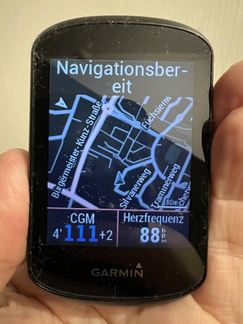
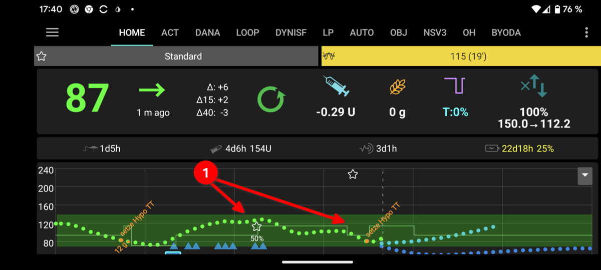
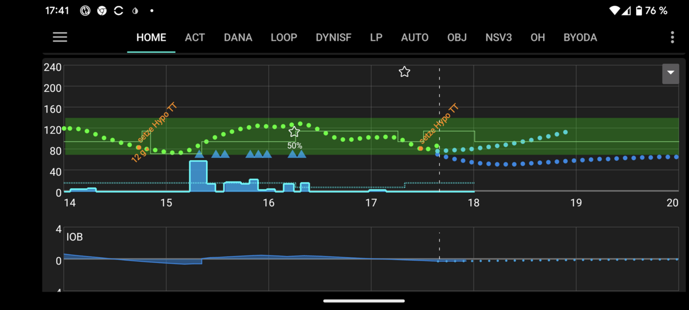
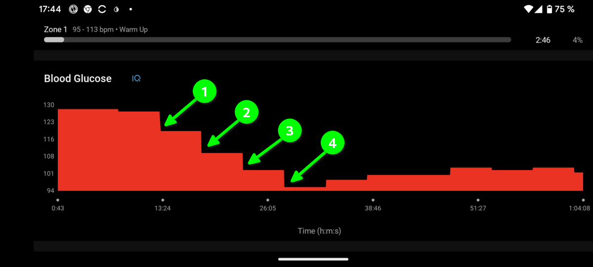
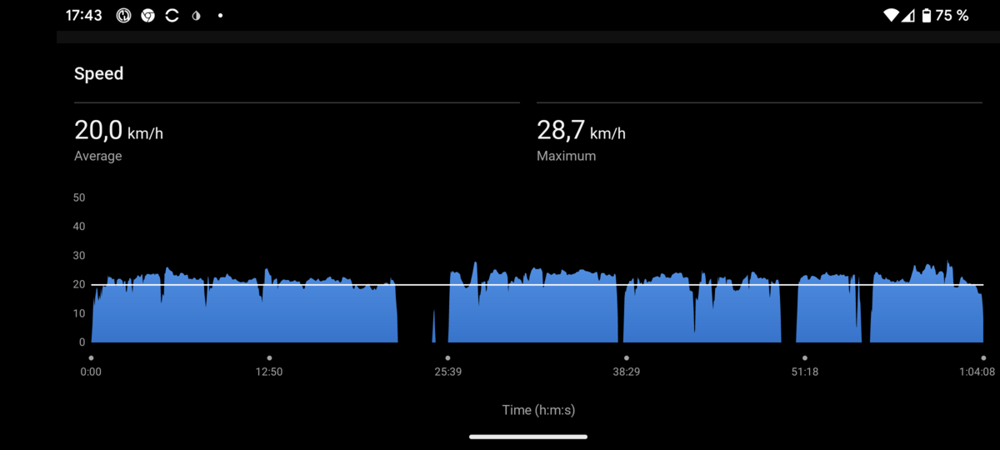
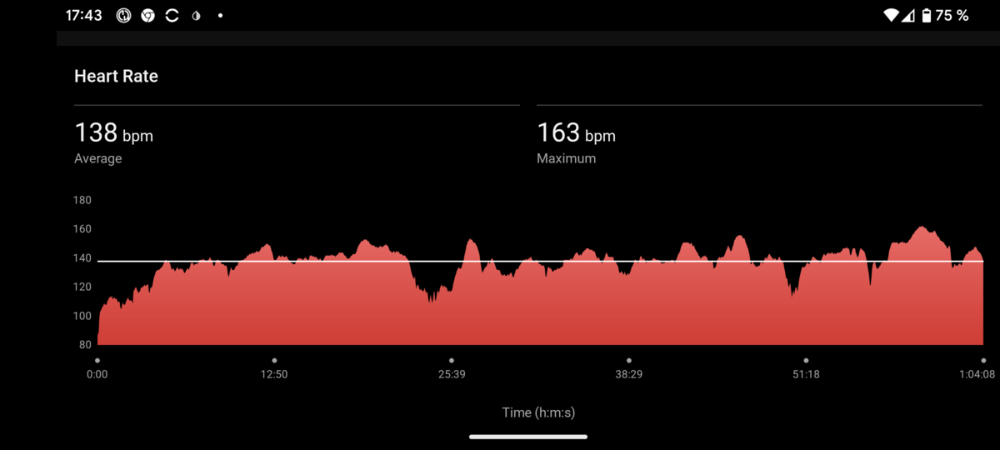
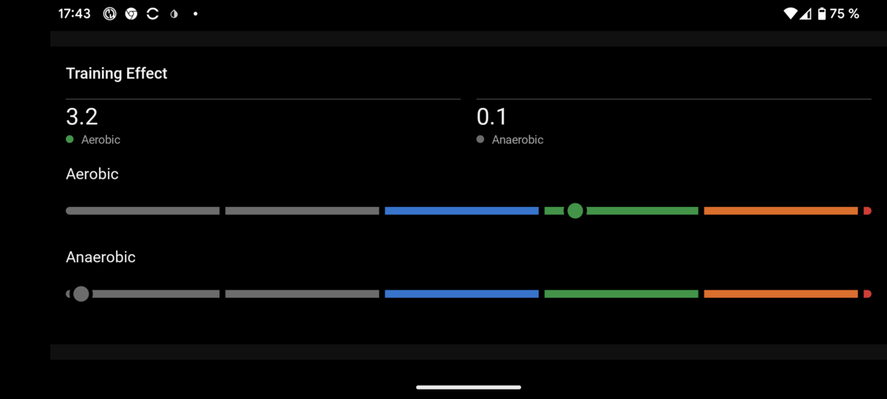
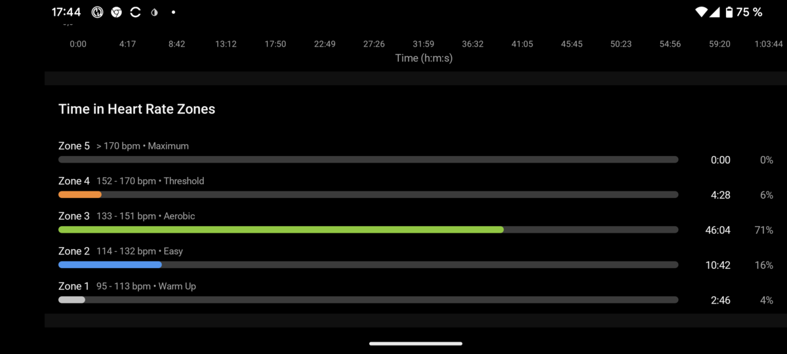

# making sport with AAPS

In this section we want to address the topic of sport with AAPS.

:::{admonition} consult with your diabetes team after reading

:::

:::{admonition} take a friend with you - at least on your first trials
:class: information
A gerneral very good idea can be to take a good friend with you on the first rides.
This is especially important if you are not experienced in T1D.
Always keep in mind please: arrival comes before speed! Safety for you and the others in road traffic is very, very important.
:::

The aim is to show you how AAPS can help you to continue doing your favorite sport more easily or even to start doing it. It is relatively common for new type 1 diabetics to ask whether exercise is still possible for them, even if the answer in the training courses is actually a clear yes. Exercise is not only good for healthy people, but also for type 1 diabetics and even moderate exercise can even help to stabilize the blood sugar curve overall.

The difficulty here is that the prerequisites that someone brings with them and the expectations of what sport means to them are very different.

Since we can assume that experienced top athletes with T1D who use AAPS are unlikely to look it up here, we deliberately set the bar low for ourselves when writing and for you when reading and using it, so that as many people as possible can benefit from it.

Since even sport as a category is far too imprecise, as the effects of endurance sports differ greatly from strength training, for example, we are trying to break it down by type of sport.

:::{admonition} more examples wanted

The focus should always be on how others can do sport and not on the top performance someone has achieved.

It's really about the basics. Your experience, which you share here, can help others to pursue their beloved sport more quickly and successfully and is therefore important.
:::

## Cycling

The first example we have chosen is cycling.

Specifically, let's take about 60 minutes of cycling on a flat route with a moderate heart rate as an example.

1. we take a flat route in order to have an even load for the first exercise. This is not about performance, but purely about learning how you should react to changes in blood glucose.
2. we take the heart rate as an indicator of the load, as it is easy to see whether you are under load or not.
3. we set ourselves the goal of doing a relaxed lap around the neighborhood and focus on staying within our target range during the lap. In my case, this would be 70 <= x <= 180 mg/dl.

We **don't** take the speed, as this is heavily dependent on personal physical conditions as well as the bike and surface used. It is therefore not very meaningful.

You should know from the diabetes training courses you have attended that during endurance sports cycling, the insulin active in the body works significantly better than during times without physical exertion. The insulin active in the body is referred to as insulin on board (IoB). It is our most important parameter when cycling with T1D.

We try to keep the IoB as low as possible at the start and during exercise. IoB should be around 0 or even slightly negative. You can get it there by not eating 3-4 hours before exercise. In the beginning it can also be helpful to exercise in the morning before breakfast, as with the right profile you should always have around 0 for IoB in the morning.

AAPS shows us the IoB value on the home screen on the left under the blood glucose value.

:::{admonition} ignoring the IoB rule increases the risk for roller coaster BG dramatically
:class: danger
If you ignore this rule, you can still go cycling, but it will be much more difficult to keep your blood sugar levels in balance, so it is better to save this for later tests after several successful simple tests.
:::

As you should know from the diabetes training courses, you should reduce the basal rate during exercise. The factor is individual. I have found a value of 50% in tests to be suitable for me.

In AAPS, you should therefore change your profile to 50% before exercise and keep it active until the end of exercise. Some people even do it a certain amount of time before, e.g. 1 hour. Unfortunately, the pre-run is also individual. We will come to the post-run later.

You should use two carbohydrates during exercise.

1. medium-fast carbohydrates for the insulin still in the body and
2. very fast carbohydrates to prevent slipping into a hypo.

For medium-fast carbohydrates, I treat myself to cookies or a banana before exercise, for example. You can also use something else that is more suitable for you.
For very fast carbohydrates, I take 3 teaspoons of dissolved glucose per 100 ml of still water in a 500 ml water bottle on my bike. If I'm cycling longer distances, I take a larger bottle with me and, if necessary, packaged glucose to refill the bottle. I add a little lemon juice for flavor. You can also use something other than lemon juice for the taste. You shouldn't change anything about the dextrose, as dissolved dextrose raises blood sugar levels super quickly. If you only take it in sips, your blood sugar won't go super high either! You can also do this tip at home beforehand as a dry run and see how quickly the change shows up on the CGMS.

Why do I place so much emphasis on fast carbohydrates?

1. once you are in a slight hypo, you may get back into the normal range by drinking the dextrose solution. As a rule, however, the oscillation of the curve then begins, which leads to a rollercoaster ride of the blood sugar. You may even be able to keep this within your target range, but you must be constantly vigilant. Without a hypo it is simply the most stable.
2. if you even slip into a somewhat severe hypo (without the need for outside help, of course), you may even have to pause briefly to avoid getting stuck in the hypo.
   With both hypos, there is a risk that you will be tempted to switch from drinking 2-3 sips at a time to larger quantities. Not too bad at first, until the oscillation sets in and pushes you into a hyper. You can correct this, but your blood sugar will most likely go on a rollercoaster ride.

What else is helpful, but not absolutely necessary?
It is important to keep an eye on your blood sugar, as your blood sugar can change enormously (e.g. 30 - 50 mg/dl) within 15 minutes of riding and a little more IoB or a basal rate that is still too high. The best way to keep an eye on it is if it is visible on the handlebars or if it is also displayed on your watch. It is even possible to install an additional app on some Garmin GPS bike computers that displays the blood glucose from XDrip or Nightscout as a data field on the bike computer. The additional app was developed by Andreas May from the T1D community. It is available free of charge in the official connect IQ Store. Certainly an interesting option for riders interested in sports.

[Link to Andreas May Data Field App on connect IQ store](https://apps.garmin.com/de-DE/apps/5a3e2cda-12f0-4afd-88ed-000e67a68d84)

Here is a picture of my Garmin Edge 530 bike computer with map, blood sugar and heart rate.

After you have eaten the medium fast carbohydrates (24 - 36 g I take) and the blood sugar is above 100 mg/dl but also below 160 mg/dl, I carry out the profile change to 50% and set the activity temp target.

:::{admonition} disable SMBs during high temp targets if necessary
:class: danger
Attention: If you prefer not to receive SMBs during the sport, please disable the option "Enable SMB with hight temp targets" in the settings of SMB or DynIFS Plugin.
:::

The following picture shows the start and end of the sport. The end was specified as the duration when the profile was changed at the start.

The temporary profile change has the following effects

1. for a period of 60 minutes
2. a reduction to 50% of the profile and
3. the target is raised by clicking on the Activity Target option, which may have the side effect of disabling the SMBs - see above.

The second image shows that the start at IoB was started towards 0.

If the blood sugar drops faster than 15 mg/dl in 5 minutes or if it is at 120 mg/dl and tends to fall, I drink 1-2 sips of dissolved glucose. Then I wait for the next value and proceed as described above.

You can hardly see it here, but at the beginning I took 2 sips from the bottle several times when my blood sugar started to fall. When it stabilized, I didn't need any more glucose.

Here is the picture that illustrates this. The chart is saved on the Garmin as a result of the activity.

If you should suddenly break out upwards, i.e. above 180 mg/dl, you should consider whether you should make a correction bolus. Caution: Remember the factor and apply it to the correction, otherwise the correction will be too strong.

If your blood sugar drops below 80 mg/dl, take a break and drink two sips until your blood sugar is back above 100 mg/dl.

At the end of the ride, the profile change should be finished as the time is up.

Since we only rode easy for 60 minutes, there shouldn't be a big muscle bulking effect continuing to pull carbohydrates from your blood sugar. However, if it felt strenuous to you, keep an eye on it. This is especially true if you then go straight to bed. It may be better to change your profile to e.g. 80% for sleep. You may come out of sleep slightly too high, but it's better than having a hypo at night. Over time, you will surely find out what happens to you.

The following pictures show the low intensity of the sport.

The elevation profile

Speed with average and maximum speed

Note the pause at the level crossing, which is also reflected in the heart rate.

The heart rate.

The training effect.

The time in the different heart rate training zones.

After succesfully mastering this simple example you could go for further targets by stretching

1. the distance and time
2. the load during the ride
3. the elevation during the right which should make a big impact on the more necessary carbs or further reduction of IoB and percentage of profile switch.

Based on my experiences I would not expect to come back 100% with time in range over the whole and every ride.

I already gave some tipps for during the ride above.

Here are some further tipps what can go wrong and how you can act to prevent it or react to compensate it.

### sky rocket high after ride

During the ride everything was fine but after siting down and relax the blood sugar go sky rocket high.

**Possible reason:** This happens when you have drunk too much dissolved glucose.

**Reaction:** Drink 500 ml water, go to the shower and then control again. Latest after 30 minutes think about giving a correction bolus but be careful when it is short for bed time. Therefore it can be very good to make the first try runs on weekend mornings.

**Action:** Next time be a bit more cautious in drinking from the dissolved glucose.

### hypo during ride

During the ride you are going into hypo and can't recover your blood sugar during cycling.

**Possible reason:** Your body cannot absorb enough carbohydrates quickly enough during exercise.

**Reaction:** Take a rest and corrrect your blood sugar with drinking dissolved glucose. Stay calm: arrival comes before speed.

**Action:** Did you started with IoB near 0? Have you eaten a small amount of middle fast carbs? Can you increase this or are the not fast enough for your body? Is it possible to prevent going into hypo by reducing the factor for the profile switch? Have you disbaled SMBs during ride as explained above?

### sky rocket high during ride

During the ride your blood sugar goes sky rocket high.

**Possible reason:** You have got taken too much carbs for your IoB at that time. Beneath for sure the typical technical problems with your
insulin pump like leakage or blockage of the catheder!

**Reaction:** If it is too high for you take a rest and correct with a bolus. Keep in mind that you must ride home and therefore make it carefully. Drink 500 ml pure water without carbs. Stay calm: arrival comes before speed.

**Action:** Have you eaten too much? Especially have you drunk too much from the  dissolved glucose during the ride? Is your percentage of reduction the profile during profile switch too low and you can increase this?
