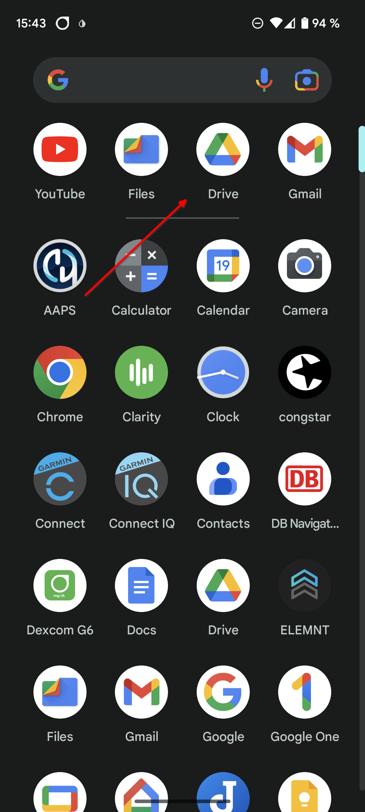

# Перенос и установка AAPS на смартфон

В предыдущем разделе [сборка **AAPS**](../building-AAPS.md), вы создали **AAPS** (файл .apk).на компьютере.

Следующие шаги - **перенести** файл **AAPS** APK (а также другие необходимые приложения, такие как BYODA, Xdrip+ или другое приложение для мониторинга CGM на Android-смартфон, а затем **установить** приложение(я).

После установки **AAPS** на смартфон, можно переходить к [**конфигурации цикла AAPS**](configuring-the-AAPS-loop.md).

Есть несколько способов переноса файла **AAPS** с компьютера на телефон. Здесь мы объясняем два различных способа:

- Способ 1 - при помощи Google диска (Gdrive)
- Способ 2 - при помощи USB-кабеля

Обратите внимание, что передача по почте не рекомендуется.

## Вариант 1. Использовать диск Google для передачи файлов

Откройте [Google.com](https://www.google.com/) в веб-браузере и войдите в учетную запись Google.

В правой верхней части выберите приложение Drive в меню Google.


Щелкните правой кнопкой мыши в свободной зоне под файлами и папками в приложении Google Drive и выберите "Загрузить файл".


Файл apk будет загружен на Google Drive.

### используйте приложение Google Drive для установки apk файла

Перейдите в мобильный телефон и запустите приложение Google Drive. Это предварительно установленное приложение и находится где расположены другие приложения Google, а также может быть найдено утилитой поиска.



Запустите установку apk двойным щелчком мыши по имени файла в Google Drive App на мобильном телефоне.


В случае, если вы получили уведомление безопасности, что вам запрещено устанавливать приложения из Google Driver, дайте разрешите на этот раз и отключите его впоследствии, поскольку постоянное разрешение представляет угрозу безопасности.


После установки этот шаг завершен.

на экране приложений в телефоне появится значок **AAPS**, нажав на который вы сможете открыть приложение.

```{warning}
**ВАЖНОЕ НАПОМИНАНИЕ БЕЗОПАСНОСТИ**
Вы не забыли отменить разрешение на установку приложений из Google Drive?
```

## Продолжайте[настройку цикла AAPS](configuring-the-AAPS-loop.md).

## Вариант 2. Использовать кабель USB для передачи файлов

Второй способ переноса установочного файла apk AAPS - при помощи [кабеля USB](https://support.google.com/android/answer/9064445?hl=ru).

Переместите файл с места расположения на компьютере в папку "Загрузки" на телефоне.

На телефоне необходимо разрешить установку из неизвестных источников. Как это сделать, объясняется в Интернете (_например._ [здесь](https://www.expressvpn.com/de/support/vpn-setup/enable-apk-installs-android/) или [здесь](https://www.androidcentral.com/unknown-sources)).

После того, как вы перетащите файл в папку загрузок откройте папку "downloads" на телефоне, нажмите на значок установочного файла AAPS apk и выберите команду "install" (установить). Затем можно перейти к следующему шагу [Setup Wizard](../Installing-AndroidAPS/setup-wizard.md), который поможет настроить цикл **AAPS** на смартфоне.
