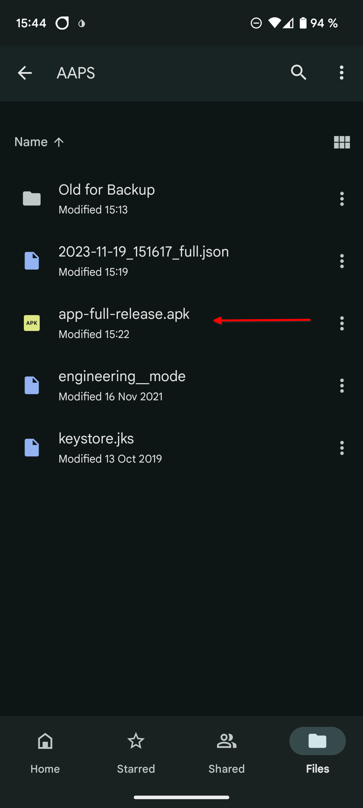

# Перенос и установка AAPS на смартфон

В предыдущем разделе [сборка **AAPS**](../building-AAPS.md), вы создали **AAPS** (файл .apk).на компьютере.

The next steps are to **transfer** the **AAPS** APK file (as well as other apps you may need, like BYODA, Xdrip+ or another CGM reciever app) to your Android smartphone, and then **install** the app(s).

После установки **AAPS** на смартфон, можно переходить к [**конфигурации цикла AAPS**](configuring-the-AAPS-loop.md).

Есть несколько способов переноса файла **AAPS** с компьютера на телефон. Здесь мы объясняем два различных способа:

- Option 1 -  Use your Google drive (Gdrive)
- Способ 2 - при помощи USB-кабеля

Обратите внимание, что передача по почте не рекомендуется.

## Option 1. Использовать диск Google для передачи файлов

Откройте [Google.com](https://www.google.com/) в веб-браузере и войдите в учетную запись Google.

В правой верхней части выберите приложение Drive в меню Google.


Щелкните правой кнопкой мыши в свободной зоне под файлами и папками в приложении Google Drive и выберите "Загрузить файл".


Файл apk будет загружен на Google Drive.

### используйте приложение Google Drive для установки apk файла

Перейдите в мобильный телефон и запустите приложение Google Drive. Это предварительно установленное приложение и находится где расположены другие приложения Google, а также может быть найдено утилитой поиска.


Запустите установку apk двойным щелчком мыши по имени файла в Google Drive App на мобильном телефоне.



В случае, если вы получили уведомление безопасности, что вам запрещено устанавливать приложения из Google Driver, дайте разрешите на этот раз и отключите его впоследствии, поскольку постоянное разрешение представляет угрозу безопасности.


После установки этот шаг завершен.

на экране приложений в телефоне появится значок **AAPS**, нажав на который вы сможете открыть приложение.

```{warning}
**ВАЖНОЕ НАПОМИНАНИЕ БЕЗОПАСНОСТИ**
Вы не забыли отменить разрешение на установку приложений из Google Drive?
```

## Please go on with [configuring the AAPS loop](configuring-the-AAPS-loop.md).

## Option 2. Использовать кабель USB для передачи файлов

The second way to transfer the AAPS apk file is with a  [USB cable](https://support.google.com/android/answer/9064445?hl=en).

Transfer the file from its location on your computer to the "downloads" folder on the phone.

On your phone, you will have to allow installation from unknown sources. Explanations of how to do this can be found on the internet (_e.g._ [here](https://www.expressvpn.com/de/support/vpn-setup/enable-apk-installs-android/) or [here](https://www.androidcentral.com/unknown-sources)).

Once you have transferred the file by dragging it across, to install it, open the "downloads" folder on the phone, press the AAPS apk and select "install". You can then proceed to the next step, [Setup Wizard](../Installing-AndroidAPS/setup-wizard.md), which will help you setup the **AAPS** app and loop on your smartphone.
