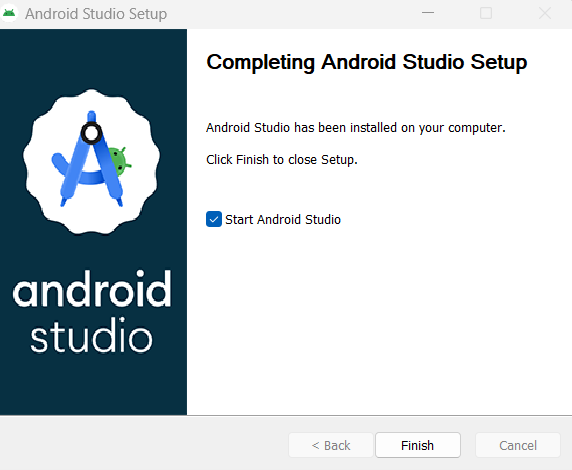
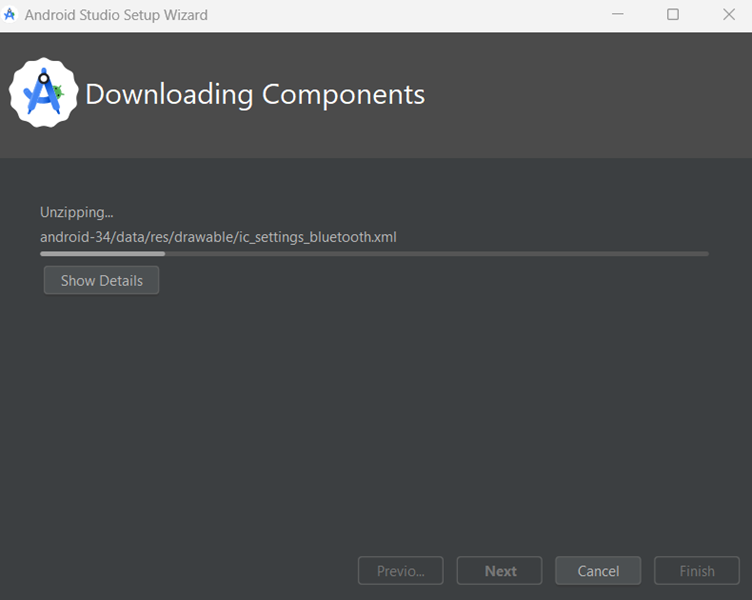
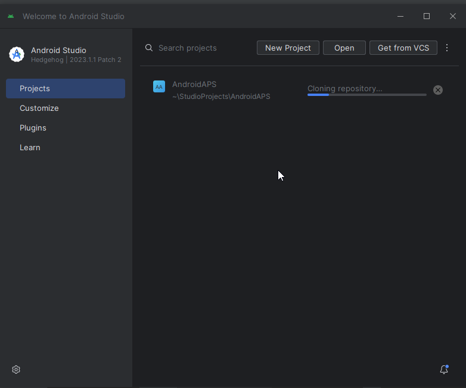
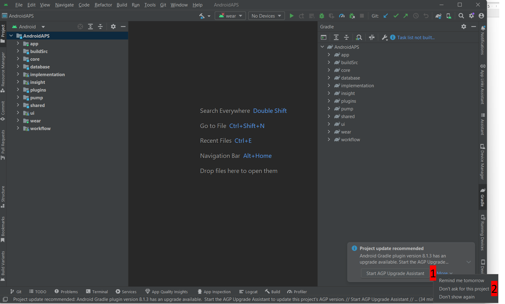
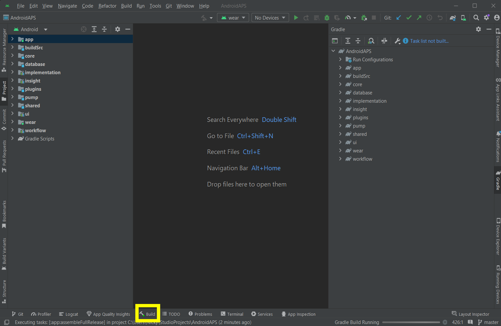
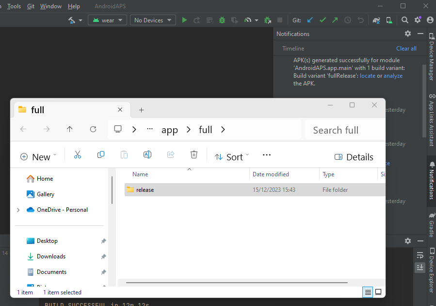

# Построение AAPS

## Постройте сами вместо скачивания

**Приложение AAPS (файл apk) не доступно для скачивания из-за законодательных норм, связанных с медицинскими устройствами. Построить приложение для собственного пользования вполне законно, но передавать копию другим не разрешается!**

Подробнее см. [Страница FAQ](../Getting-Started/FAQ.md).

(Building-APK-recommended-specification-of-computer-for-building-apk-file)=

## Технические характеристики компьютера и программного обеспечения для построения AAPS

- Пользуйтесь **[версией Android Studio под названием "Hedgehog"(2023.1.1)](https://developer.android.com/studio/)** для сборки apk. Если ву вас более старая версия, используйте ту, которая не старше версии "**Giraffe**".
- [32-разрядные системы Windows](troubleshooting_androidstudio-unable-to-start-daemon-process) не поддерживаются в Android Studio. Имейте в виду, что и 64-разрядная процессор, и 64-разрядная ОС являются обязательным условием. Если ваша система не соответствует этому условию, следует изменить аппаратное или программное обеспечение или всю систему.

<table class="tg">
<thead>
  <tr>
    <th class="tg-baqh">Операционная система (только 64 бит)</th>
    <th class="tg-baqh">Windows 8 или выше</th>
    <th class="tg-baqh">Mac OS 10.14 или выше</th>
    <th class="tg-baqh">Любой Linux поддерживающий Gnome, KDE, или Unity DE;&nbsp;&nbsp;GNU C Library 2.31 или более поздние версии</th>
  </tr>
</thead>
<tbody>
  <tr>
    <td class="tg-baqh"><p align="center">Процессор CPU (Только 64 бит)</td>
    <td class="tg-baqh">x86_64 архитектура CPU; ядро Intel или новее, или процессор AMD с поддержкой <br><a href="https://developer.android.com/studio/run/emulator-acceleration#vm-windows" target="_blank" rel="noopener noreferrer"><span style="text-decoration:var(--devsite-link-text-decoration,none)">Windows Hypervisor</span></a></td>
    <td class="tg-baqh">Чипы на базе ARM или Intel Core 2 поколения или новее с поддержкой <br><a href="https://developer.android.com/studio/run/emulator-acceleration#vm-mac" target="_blank" rel="noopener noreferrer"><span style="text-decoration:var(--devsite-link-text-decoration,none)">среды Hypervisor </span></a></td>
    <td class="tg-baqh">архитектура процессора x86_64, процессор Intel Core 2 поколения или новее, или процессор AMD с поддержкой AMD-виртуализации (AMD-V) и SSSE3</td>
  </tr>
  <tr>
    <td class="tg-baqh"><p align="center">Оперативная память</td>
    <td class="tg-baqh" colspan="3"><p align="center">8ГБ или более</td>
  </tr>
  <tr>
    <td class="tg-baqh"><p align="center">Диск</td>
    <td class="tg-baqh" colspan="3"><p align="center">Не менее 30ГБ свободного места. Рекомендуется использовать SSD.</td>
  </tr>
  <tr>
    <td class="tg-baqh"><p align="center">Разрешение</td>
    <td class="tg-baqh" colspan="3"><p align="center">минимум 1280 x 800 <br></td>
  </tr>
  <tr>
    <td class="tg-baqh"><p align="center">Интернет</td>
    <td class="tg-baqh" colspan="3"><p align="center">Широкополосный</td>
  </tr>
</tbody>
</table>

\*\*Настоятельно рекомендуется (но не обязательно) использовать SSD (Solid State Disk) вместо жесткого диска (Hard Disk Drive), так как при сборке AAPS файла потребуется меньше времени. \* Использовать HDD при создании файла apk **AAPS** можно. Процесс сборки приложения при этом может занять много времени, но после начала можно оставить его без присмотра.

## Помощь и поддержка в процессе сборки

Если вы столкнулись с трудностями в процессе создания приложения **AAPS**, сначала обратитесь к разделу [**устранение проблем с Android Studio**](../Installing-AndroidAPS/troubleshooting_androidstudio).

Если вы считаете, что что-то в инструкциях по сборке неправильно, отсутствует или сбивает с толку, свяжитесь с другими пользователями \*\* AAPS \*\* на [Facebook](https://www.facebook.com/groups/AndroidAPSUsers) или [Discord](https://discord.gg/4fQUWHZ4Mw). Если вы хотите что-то изменить самостоятельно (обновить снимки экрана _etc_), отправьте [запрос на слияние (PR)](docs/EN/make-a-PR.md).

## Пошаговое руководство по созданию приложения AAPS

В общем виде шаги по созданию файла **AAPS** apk следующие:

4.1 [Установить Git](Install-Git)

4.2 [Установить Android Studio](Building-APK-install-android-studio)

4.3 [Скачать код AAPS](Building-APK-download-AAPS-code)

4.4. [Установить путь к Git в настройках Android Studio](Building-APK-set-git-path-in-preferences)

4.5. [Build AAPS "signed" apk](Building-APK-generate-signed-apk)

В этом руководстве вы найдете _примерные_ снимки экрана при построении приложения **AAPS**. Поскольку \*\* Android Studio\*\* - программное обеспечение, которое мы используем для создания \*\* AAPS\*\*  - регулярно обновляется, эти снимки могут не совпадать с ходом вашей установки, но они дают представление о процессе.

Поскольку \*\* Android Studio \*\* работает на платформах Windows, Mac OS X и Linux, также могут быть незначительные расхождения в шагах для разных платформ.

(Установить git)=

### Установите git (если у вас его нет)

:::{admonition} Why Git?

Git известен как “_Versioning Control System_” (VCS) (система контроля версий)
Git — это программа, позволяющая отслеживать изменения в коде и сотрудничать с разработчиками. Вам понадобится Git для переноса копии исходного кода **AAPS** с веб-сайта Github на свой локальный компьютер. Затем вы будете использовать Git на своем компьютере для сборки приложения **AAPS** (apk).
:::

#### Шаги по установке Git

1. Проверьте, установлен ли у вас **Git**. Это можно сделать, набрав “git” в строке поиска Windows – если вы увидите \*\* “Git bash”\*\* или какую-либо другую форму Git, то он уже установлен, и можно сразу перейти к [установке Android Studio] (Сборка-APK-установка-android-studio):


2. Если у вас нет Git, загрузите и установите псвежую версию системы [**отсюда**](https://git-scm.com/downloads). Любая новая версия Git должна работать, выбирайте версию в соответствии с вашей системой - Mac, Windows или Linux.

**Примечание для пользователей Mac:** веб-страница Git также предложит установить дополнительную программу под названием "homebrew", которая поможет в установке. Если вы устанавливаете Git через homebrew, то нет необходимости изменять настройки.

(Запомните_путь_к_Git)=

- Во время установки, когда программа попросит "выбрать место установки", заметьте, куда устанавливается Git ("**путь установки**"), это понадобится на следующем шаге. Это будет что-то вроде "C:\Program Files\Git\cmd\git.exe"

- По мере прохождения нескольких шагов установки Git, принимайте все параметры по умолчанию.

- После установки, если вы забыли место установкин Git, вы можете найти его следующим образом: введите "git" в строке поиска ПК, щелкните правой кнопкой мыши на "Git bash", выберите "открыть местоположение файла", наведите курсор мыши на значок "Git bash"., который затем покажет, где он установлен.

- Перезагрузите компьютер перед следующим шагом.

(Building-APK-install-android-studio)=

### Установите Android Studio

- \*\* Следует постоянно находиться в Сети во время выполнения следующих шагов, так как Android Studio загружает несколько обновлений\*\*

:::{admonition} Что такое Android Studio?
:class: выпадающий
Android Studio — это программа, которая запускается на вашем компьютере. Она позволяет загружать исходный код из Интернета (используя Git) и создавать приложения для смартфона (и смарт-часов). "Сломать" текущую версию **AAPS** которая работает у вас на смартфоне, создав новое или обновленное приложение на ПК с помощью Android Studio невозможно, это совершенно разные процессы.
:::

Следующие снимки экрана были сделаны на версии **Hedgehog** (ёжик) Android Studio.

Самая важная заповедь при установке Android Studio: Будьте терпеливы! Во время установки и настройки Android Studio загружает много элементов, которые отнимают время.

Скачайте новую версию Android Studio [**отсюда**](https://developer.android.com/studio#downloads), найдите её в папке загрузок браузера и установите на свой компьютер:


При первом запуске Android Studio, прогамма приветствует вас:


выберите "Далее":


Оставьте флажки отмеченными и выберите «Далее»:


Разрешите установку в директорию по умолчанию и выберите "Далее":


Когда появится запрос на выбор папки смарт-меню просто выберите "Install". Теперь нужно подождать несколько минут во время установки Android Studio. Затем вы увидите, что установка завершена, выберите "Далее":


Now select "Finish":



Теперь запустите Android Studio.

Решите, хотите ли вы обмениваться данными с Google (если не уверены, просто выберите "Не отсылать").


Теперь вы получите сообщение о недостающем пакете разработки ПО (SDK) (не волнуйтесь, скоро вопрос будет решен), выберите "Далее":


Программное обеспечение должно автоматически выбрать недостающие данные (SDK) и директорию установки.

:::{admonition} Что такое Android SDK?

Чтобы запустить **AAPS** на телефоне, приложение должно интегрироваться с системой Android. Android предоставляет “_software development kits_” (пакеты разработки ПО) (SDK), которые позволяют **AAPS** взаимодействовать с операционной системой Android.
:::

Пакет SDK относится **не** к версии Android на телефоне, а к самой сборке **AAPS**. **AAPS** версии 3.2 (и новее) строится поверх API 34, которая автоматически выбирается в версии **Hedgehog** **Android Studio**. Поэтому просто нажмите "Далее":


На запрос о проверке настроек, просто выберите "Далее":


На запрос о Лицензионном Соглашении, выберите "Принять" и нажмите "Готово":


> **_Примечание:_** В зависимости от вашей установки, принимаемые лицензии могут отличаться от того, что показано на снимке экрана.

Подождите, пока Android Studio загружает дополнительные компоненты, это может занять несколько минут:



По завершении загрузки, кнопка "Готово" становится синей, и на нее можно нажать:


Вас приветствует экран «Добро пожаловать в Android Studio»:


(Сборка-APK-загрузка-AAPS-кода)=

### Загрузите код AAPS

:::{admonition} Почему загрузка кода AAPS занимает много времени?

Когда **AAPS** загружается первый раз, Android Studio подключается к веб-сайту Github, чтобы скачать исходный код для **AAPS**. Это займет около 1 минуты.

Android Studio затем будет использовать **Gradle** (инструмент разработки в Android studio) для определения других компонентов для установки.

:::

На экране приветствия Android Studio убедитесь, что "**Проекты**" (1) подсвечены слева. Затем нажмите "**Получить из VCS**" (2) вверху справа:


- Теперь мы скажем программе Android Studio, откуда получить код:

- Должен быть выбран "URL репозитория" (по умолчанию) слева (1).

- В качестве системы управления версиями должен быть выбран "Git" (по умолчанию) (2).

Теперь скопируйте этот URL:```
      https://github.com/nightscout/AndroidAPS.git
```

и вставьте его в текстовое поле URL (3).

- Есть смысл проверить место сохранения клонированного кода (директорию по умолчанию) (4).

- Теперь нажмите кнопку "Клонировать" (5).


Теперь вы увидите экран, сообщающий, что репозиторий клонируется:



В какой-то момент вам будет задан вопрос, хотите ли вы доверять проекту. Нажмите на "Доверять проекту":


- If your firewall asks for permission, grant access:


If asked if you want to import settings, select "Do not import settings". We don't want to import settings from previous installations:


После успешного клонирования репозитория, Android Studio откроет клонированный проект. Wait patiently (this may take a few minutes), and particularly, do not update the project as suggested in the pop-up:


:::{admonition} NEVER UPDATE GRADLE!

Android Studio might recommend updating the gradle system. **Never update gradle!** This will lead to difficulties.
:::

_Optional_ - If you want to clear the pop-up for **"project update recommended"**, click on the blue text "More" (1). In the dialog box the select "Don't ask for this project" (2).



If any errors occur, do not continue with the following steps, consult the [troubleshooting section](../Installing-AndroidAPS/troubleshooting_androidstudio) for known problems.

Now close Android Studio (select _File_-_Exit_).

If you have not restarted your computer since installing or updating Git, restart your computer now, and then re-open Android Studio.

(Построение-APK-задать-путь-к-git-в-настройках) =

### Задайте путь к git в параметрах Android Studio

Now we will tell Android studio where to find Git, which you installed [earlier](Install-Git).

- Make sure you have restarted your computer after [installing Git](Install-Git).
- Open **Android Studio** (you can find it by searching in the Start menu).
- In the top left corner of **Android Studio**, navigate to _File-Settings_ (Windows) or _Android Studio > Preferences_ (Mac). This opens the following window, click to expand the dropdown called "version control" (1):


- Now select "**Git**" (2).
- In the lower middle of the page, make sure update method "Merge" (3) is selected.
- Check if **Android Studio** can automatically locate the correct path to **git.exe** automatically by clicking the button "Test" (4):


- If the automatic setting is successful, your current version of **Git** will be displayed next to the path.

  

- If you find that **git.exe** is not found automatically, or that clicking "Test" results in an error (1), you can either manually enter the path which you saved [earlier](Make_a_note_of_Git_path), or click on the folder icon (2) and manually navigating to the directory where **git.exe** is stored:

  

- Use the [search function](https://www.tenforums.com/tutorials/94452-search-file-explorer-windows-10-a.html) in windows explorer to find "git.exe" if you are unsure where git has been installed. How to do this is explained [above](Make_a_note_of_Git_path) in more detail.

- If you have manually selected it, check your selected Git path with the "Test" button as described above.

When the Git version is displayed next to the path (see screenshot above) you have completed this stage successfully and you can close the Android Studio "Settings" window by clicking the "**OK**" button (5):


(Сборка-APK-генерировать-подписанный-apk)=

### Build the AAPS "signed" APK

:::{admonition} Why does the AAPS app need to be "signed"?

Android requires each app to be _signed_, to ensure that it can only be updated later from the same trusted source that released the original app. For more information on this topic, follow [this link](https://developer.android.com/studio/publish/app-signing.html#generate-key). For our purposes, this just means that we generate a signing or "keystore" file and use it when we build the **AAPS** app.
:::

- In the menu bar, click "Build" (1), select "Generate Signed Bundle/APK (2)


- Select "APK" instead of "Android App Bundle" and click "Next":


- In the next screen, make sure that "Module" is set to "AAPS.app" (1).
- Click "Create new\..." (2) to start creating your key store.

**_Note:_** The key store is a file in which the information for signing the app is stored. It is encrypted, and the information is secured with passwords.


- Click the "folder" symbol (1) to select a path on your computer for your key store:


- Click on the drop-down menu (1), to select where you want to save your keystore file. In this example, it is being saved in "My Documents" (2). Do not save the keystore in same folder as your Android Studio files (StudioProject). Type in a simple name for your key store (3) and confirm it with "OK" (4):


This will take you back to the previous screen. Your chosen location for saving the key store file is shown.

Now choose a simple password (make a note of it), enter it in the password box (1), and confirm it (2).  The passwords for key store and key do not have to be sophisticated. If you lose your password in the future, see [troubleshooting for lost key store](troubleshooting_androidstudio-lost-keystore).

The default alias (3) for your key is "key0", leave this unchanged.

You now need a password for your key. To keep it simple, if you want, you can use the same password you used for your keystore, above. Enter a password (4) and confirm (5) it.

The validity (6) is 25 years by default, leave it as it is.

Enter your first and last name (7). No other information needs to be added.

Click "OK" (8) to continue:


On the "Generate signed bundle or APK" page, the path to your keystore will now be displayed. Now re-enter the Key Store password (1) and Key password (2), and tick the box to remember passwords is checked (3), so you don't have to enter them again next time you build the apk (i.e. when updating to a new AAPS version). Click "Next" (4):


On the next screen, select build variant "fullRelease" (1) and click "Create" (2).


Android Studio will now build the **AAPS** apk. It will show "Gradle Build running" at the bottom right. The process takes some time, depending on your computer and internet connection, **be patient!** If you want to watch the progress of the build, click on the small hammer "build" at the bottom of Android Studio:



Now you can watch the building progress:


Android Studio will display the information "BUILD SUCCESSFUL" after build is finished. You may see a popup notification which you can click to select "locate". If you miss this, click on the notification "locate or analyse the APK" (yellow highlight) at the very bottom of the screen to bring up the Notifications:


_If the build was not successful, refer to the [troubleshooting section](../Installing-AndroidAPS/troubleshooting_androidstudio)._

In the Notifications box, click on the blue link "locate":


Your file manager/explorer will open. Перейдите в директорию "full" (1) > "release" (2).



Open the folder "release". The file "app-full-release.apk" (1) is the **AAPS** apk that you have just built, you will be transferring this file to your smartphone in the next section of the docs:

_Optional at this stage - if you are planning to also build the "**AAPS** wear" app for your smartwatch so you can remotely control **AAPS**, delete the "output-metadata" .json file (2) from this folder, to avoid the error of [uncommitted changes](troubleshooting_androidstudio-uncommitted-changes) during the **AAPS** wear app build_:


Поздравляем! Now you have built the **AAPS** apk file, you can move to the next stage of [Transferring and Installing **AAPS**](Transferring-and-installing-AAPS.md).
