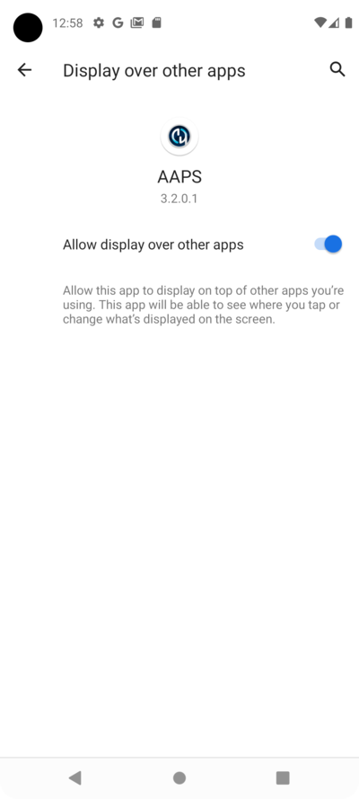
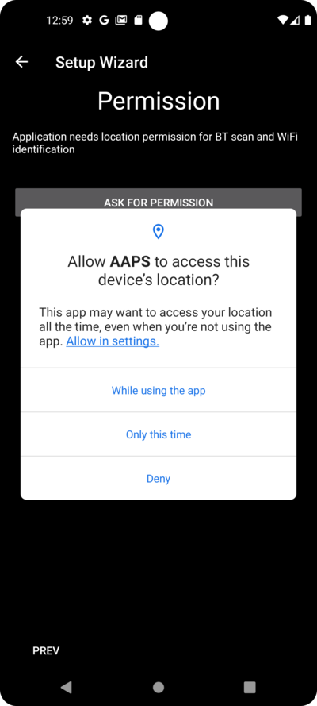
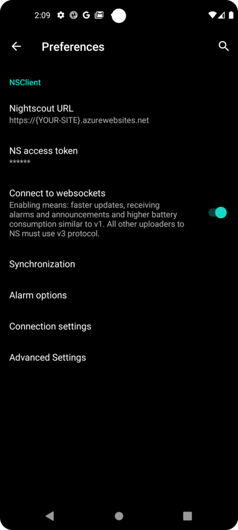
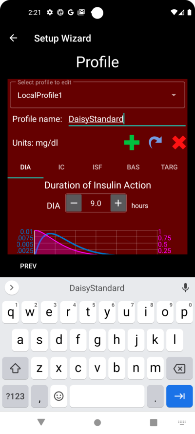
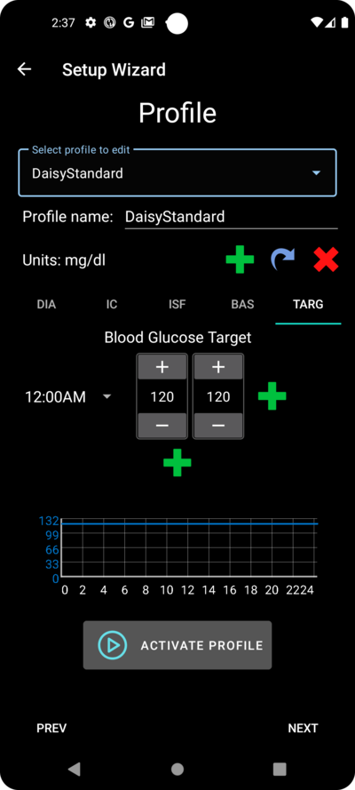
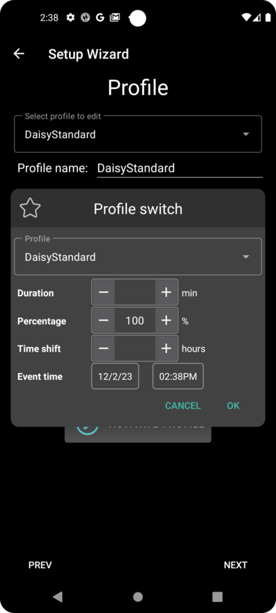
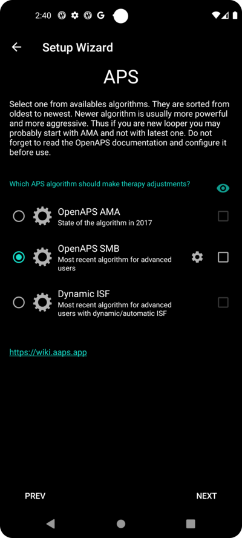
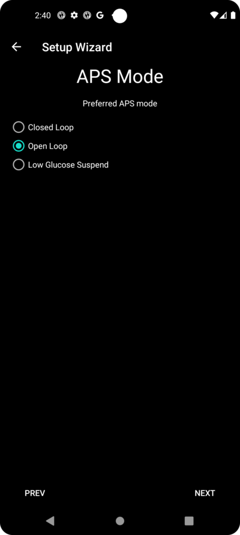

# Мастер установки AAPS

При первом запуске **AAPS** вашими действиями руководит **Мастер установки**, который не даст упустить из виду основные параметры приложения. **Мастер установки** охватывает все важные моменты. Например, **настройки разрешений** критически важны для правильной работы **AAPS**.

Однако применение **Мастера установки** не обязательно, из него можно легко выйти и вернуться к нему позже. Наряду с **Мастером установки** существуют три способа оптимизации или изменения конфигурации. О них расскажем в следующем разделе. Итак, если пропустить некоторые этапы в мастере установки, их можно легко выполнить позже.

В ходе и непосредственно после **Мастера установки** можно не заметить какие-то существенные изменения в **AAPS**. Чтобы активировать замкнутый цикл **AAPS**, необходимо пройти **цели**, и последовательно разблокировать функцию за функцией. В конце мастера установки. будет запущена **Цель 1**. Вы являетесь хозяином **AAPS**, а не наоборот.

:::{admonition} Просмотр целей

:::

По опыту мы знаем, что новички стараются как можно быстрее настроить \*\* AAPS \*\*, а это может привести к разочарованию, поскольку на обучение уйдет немало времени.

Поэтому настраивайте работу AAPS не спеша, так как преимущества хорошо работающей системы компенсируют все временные неудобства.

:::{admonition} Обращение за помощью
:class: примечание
Если в документации найдена ошибка или у вас есть идея, как объяснить что=то получше, обратитесь за помощью к сообществу по этой инструкции [Связаться с другими пользователями](../Куда-Обратиться-за-помощью/Связаться-с-другими-пользователями.md).
:::

## Пошаговое руководство к Мастеру установки AAPS

### Приветственное сообщение

Это просто приветственное сообщение, которое можно пропустить, нажав кнопку "ДАЛЕЕ":

### Лицензионное соглашение

В лицензионном соглашении с пользователем имеется важная информация о правовых аспектах пользования **AAPS**. Внимательно изучите его.

Если вы не понимаете лицензионного соглашения или не можете согласиться с ним, не пользуйтесь системой **AAPS**!

Если вы понимаете и соглашаетесь, нажмите кнопку "I UNDERSTAND AND AGREE" (я принимаю и соглашаюсь) и следуйте подсказкам Мастера установки:

### Необходимые разрешения

для корректной работы **AAPS** требуются некоторые условия.

На следующих экранах задано несколько условий которые надо принять для корректной работы **AAPS**. Мастер сам объясняет, почему он запрашивает соответствующие разрешения или настройки.

На этом экране мы даем дополнительную справочную информацию, переводим с технического языка на общий или объясняем причину.

Нажмите кнопку «ДАЛЕЕ»:

Расход батареи на смартфонах все еще является сложной задачей, поскольку производительность батарей по-прежнему весьма ограничена. Операционная система Android довольно неохотно разрешает приложениям запускатьсся и расходоавать время работы процессора, а, следовательно, и заряд батареи.

Однако **AAPS** должен запускаться регулярно, _напр. каждые несколько минут чтобы получать данные о гликемии и применять алгоритм на основе настроек профиля. Поэтому Android должен разрешить эти действия без препятствий.

You do this by confirming the setting.

Нажмите кнопку "ASK FOR PERMISSION"(запросить разрешение):

Выберите "Разрешить:

Android требует специального разрешения для уведомлений от приложений.

Хотя иногда полезно отключать уведомления _например._ из социальных сетей, важно разрешить **AAPS** отправлять уведомления.

Нажмите кнопку "ASK FOR PERMISSION"(запросить разрешение):

Выберите приложение "AAPS":

Включите "Разрешить поверх других приложений", сдвинув переключатель вправо:

Так выглядит переключатель во включенном положении:

Android увязывает использование Bluetooth со службой определения местоположения. Возможно, вы замечали это у других приложений. Обычно, если нужен доступ к Bluetooth, требуется разрешение на определение местоположения.

\*\* AAPS \*\* использует Bluetooth для связи с системой мониторинга гликемии CGM и инсулиновой помпой, они напрямую управляются \*\* AAPS \*\*. Детали могут различаться в зависимости от настроек.

Нажмите кнопку "ASK FOR PERMISSION"(запросить разрешение):

Это важно. Иначе \*\* AAPS\*\* вообще не сможет работать должным образом.

Выберите "При использовании приложения":

Нажмите кнопку «ДАЛЕЕ»:

**AAPS** должен сохранять информацию в постоянной памяти телефона. Постоянная память означает, что информация будет доступна даже после перезагрузки телефона. Остальная информация теряется, поскольку она не сохраняется в постоянной памяти.

Нажмите кнопку "ASK FOR PERMISSION"(запросить разрешение):

Нажмите "Разрешить":

Сообщается, что после внесения этого изменения необходимо перезагрузить телефон.

**Не останавливайте мастер установки сейчас**. Перезагрузить телефон можно после завершения мастера установки.

Нажмите кнопку "OK", затем "ДАЛЕЕ":

### Главный пароль

Так как конфигурация **AAPS** содержит некоторые конфиденциальные данные (_напр. API_KEY для доступа к серверу Nightscout), здесь можно установить пароль.

Второе предложение очень важно, **НЕ ПОТЕРЯЙТЕ ГЛАВНЫЙ ПАРОЛЬ**. Please make a note of it _e.g._ on Google Drive. Google Drive - хорошее место, так как он создан специально для подобных целей. Телефон или ПК могут выйти из строя, оставив нас без актуальной копии. Если вы забыли главный пароль, то будет трудно восстановить конфигурацию профиля и прохождение **Целей**.

После двукратного ввода пароля нажмите кнопку "Далее":

### Загрузка отчета для разработчиков в Fabric

Здесь вы можете настроить автоматизированную службу отчетов о пользовании приложением и сбоях.

Это не обязательно, но рекомендуется.

Это помогает разработчикам лучше понимать как пользователи работают с приложением и информирует о происходящих сбоях.

Они получают:

1. The information that the app crashed, which they would not otherwise know since in their own set-up everything works fine and
2. В отправляемых данных (информация о сбоях) содержится информация о обстоятельствах, при которых произошел сбой, а также о конфигурации приложения.

Что помогает разработчикам улучшить приложение.

Please enable the "Fabric Upload" by sliding the slider to the right:

Кроме того, вы можете определить что разработчики могут связаться с вами только по неотложным проблемам:

Заполнив "контактную информацию" нажмите кнопку "ОК". Контактная информация может быть учетная запись в Facebook, на Discord, ... Просто информация для связи с вами наилучшим способом:

Нажмите кнопку «ДАЛЕЕ»:

### Единицы (мг/дл <-> ммоль/л)

Выберите, в каких единицах хотите видеть значения гликемии -- в мг/дл или ммоль/л, затем нажмите кнопку "ДАЛЕЕ":

### Параметры экрана

Здесь выбираем диапазон значений, в котором хотим видеть свою гликемию. Его можно оставить заданным по умолчанию и отредактировать в дальнейшем.

Эти значения влияют только на графическое отображение ГК и больше ни на что.

Так, например, целевые значения гликемии задаются отдельно в профиле.

Величины для анализа TIR (времени в целевом диапазоне) конфигурируются отдельно при создании отчетов на сервере отчетов.

Нажмите кнопку «ДАЛЕЕ»:

### Синхронизация с сервером отчетов и другие вопросы

Здесь вы настраиваете загрузку данных на сервер отчетов.

Здесь также можно выполнить другие настройки, но для первого запуска мы сосредоточимся на сервере отчетов.

Если вам неудобно заниматься этим в данный момент, пропустите их. Их можно сделать потом.

Если вы выберете элемент, отметив его галочкой слева, то справа можно поставить галочку на видимость этого элемента (пиктограмма глаза), что одновременно включает этот модуль в верхнее меню на главном экране **AAPS**. Если на этом этапе вы настраиваете сервер отчетов, для него тоже выбирайте видимость.

In this example we select Nightscout as reporting server, and will configure it.

:::{admonition}  Выберите версию **NSClient** под свои задачи!

Nightscout users should choose **NSClient v3**, unless you want to monitor or send remote treatments (_e.g._ as a parent or caregiver using **AAPS** for a child) through Nightscout, in which case, choose the first option "**NSClient**" until further notice.
:::

Для Tidepool проще, так как требуются только персональные данные для входа.

Выбрав нужный вариант, нажмите кнопку «ДАЛЕЕ»:

Здесь вы настраиваете сервер отчетов Nightscout.

Нажмите на "URL-адрес Nightscout":

Enter you Nightscout URL which is your personal Nightscout server. Это просто URL-адрес, который вы настроили самостоятельно, или он был предоставлен поставщиком услуг Nightscout.

Нажмите кнопку "OK":

Введите атрибут защиты доступа к Nightscout. Это код доступа для Nightscout, настроенный вами. Без него доступа не будет.

Если в данный момент у вас его нет, см. настройку сервера отчетов в документации **AAPS**.

After filling in the "**NS access token**" and clicking "OK", please click on the "Synchronization" button:

Please select "Upload data to NS" if you already configured nightscout in the previous steps of the Setup Wizard.

Если вы хранили профили на Nightscout и хотите загрузить их в **AAPS**, включите "Принимать хранилище профилей":

Вернитесь на предыдущий экран и выберите "Опции оповещения":

Пока что оставьте переключатели неактивными. Мы зашли на этот экран только чтобы показать параметры, которые можно настроить в будущем. В настоящий момент такой необходимости нет.

Вернитесь на предыдущий экран и выберите "Параметры подключения".

Здесь вы можете настроить способ передачи данных на сервер отчетов.

Лица, осуществляющие уход, должны включить опцию "использовать сотовую связь", поскольку в противном случае смартфон, обслуживающий иждивенца/ребенка, не сможет передавать данные за пределы зоны действия Wi-Fi, например, по дороге в школу.

Другие пользователи **AAPS** могут отключить передачу данных через сотовое соединение, если хотят экономить данные или батарею.

Если сомневаетесь, просто оставьте все включенным.

Вернитесь на предыдущий экран и выберите "Дополнительные настройки".

Включите "Передать в NS запись о начале работы приложения", если хотите получить эту информацию на сервере отчетов. Это может помочь вам удаленно узнать, было ли перезапущено приложение и когда именно, особенно если вы лицо, осуществляющее уход.

На начальном этапе интересно посмотреть, правильно ли настроен \*\* AAPS **, но потом уже не так важно видеть, как \*\* AAPS** останавливается или запускается в Nightscout.

Включите "Создавать оповещение на основе названия ошибки" и "Создавать оповещения из напоминаний о необходимых углеводах".

Leave "Slow down uploads" disabled. Эта функция может пригодиться только в необычных обстоятельствах, если, например, на сервер Nightscout необходимо передать много информации, а Nightscout медленно обрабатывает данные.

Вернитесь к предыдущему экрану и выберите "ДАЛЕЕ", чтобы перейти к следующему экрану:

### Имя пациента

Здесь указываем свое имя в **AAPS**.

Можете выбрать любое. Это нужно, чтобы различать пользователей.

To keep it simple just enter first name and last name.

Нажмите "ДАЛЕЕ" и перейдите к следующему экрану.

### Тип пациента

Here you select your "Patient type" which is important, as the **AAPS** software has different limits, depending on the age of the patient. This is important for security and safety reasons.

Здесь также можyj настроить **максимальный разрешенный болюс** на прием пищи. То есть, самый большой болюс, который можно ввести на свои обычные блюда. Это мера безопасности, которая помогает избежать случайной передозировки, когда вводится болюс на еду.

Второе ограничение аналогично по концепции, но относится к максимальному ожидаемому потреблению углеводов.

После установки этих значений нажмите "ДАЛЕЕ" и перейдите на следующий экран:

### Применяемый инсулин

Выберите тип инсулина, используемого в помпе.

Названия инсулинов должны быть самоочевидными.

:::{admonition} Не выбирайте"Свободный от пиков Oref", если не знаете, что это такое
:class: опасность
Для опытных пользователей или медицинских исследований существует возможность определить индивидуальный профиль Oref и пик действия инсулина. Не выбирайте его, если не являетесь экспертом, обычно заранее определенные значения хорошо работают для каждого бренда инсулина.
:::

Нажмите "ДАЛЕЕ" и перейдите к следующему экрану:

### Blood sugar source

Выберите используемый вами источник ГК Изучите документацию по вашему [источнику ГК](../Configuration/BG-Source.md).

Поскольку доступно несколько вариантов, мы не объясняем здесь конфигурацию каждого. В нашем примере мы приводим Dexcom G6 с самостоятельно собранным приложением BYODA:

Если вы используете Dexcom G6 с BYODA, активируйте видимость его меню, поставив галочку справа.

После установки этих значений нажмите "ДАЛЕЕ" и перейдите на следующий экран:

При использовании самостоятельно собранным приложением BYODA для Dexcom G6 нажмите на "шестеренку" для доступа к настройкам BYODA.

Включите «Загружать данные ГК в NS» и «Вносить запись о замене сенсора в NS».

Нажмите "ДАЛЕЕ" и перейдите к следующему экрану:

### Профиль

Теперь мы переходим к очень важной части мастера установки.

Прежде чем вводить данные профиля на следующем экране, ознакомьтесь с документацией по профилям.

:::{admonition} Требуется работающий профиль - здесь нет исключений !

Важно определить и обсудить ваш профиль с эндокринологом, провести успешное тестирование базального инсулина, определить фактор чувствительности к инсулину ISF и углеводный коэффициент IC!

Если роботу задать неверные вводные данные, то он все время будет работать неправильно. **AAPS** может работать только с той информацией, которая ему предоставлена. Если профиль слишком сильный, вы рискуете гипогликемией, а если он слишком слабый,- то гипергликемией.
:::

Нажмите "ДАЛЕЕ" и перейдите к следующему экрану. Введите "название профиля":

В дальнейшем при необходимости можно настроить несколько профилей. Мы здесь создадим только один.

:::{admonition} Профиль только для обучения - не для использования

Он не должен быть точным или хорошо оптимизированным, потребности разные у каждого человека.

Еще раз напоминаем - это учебный профиль, не применяйте его!
:::

Введите время действия инсулина (DIA) в часах. Затем нажмите "IC" (углеводный коэффициент):

Введите значения вашего углеводного коэффициента IC:

Нажмите "ISF" (фактор чувствительности к инсулину). Введите ваши значения фактора чувствительности к инсулину ISF:

Нажмите "БАЗАЛ". Введите значения базального профиля:

Нажмите "ЦЕЛЬ". Введите целевые значения сахара в крови.

Для открытого цикла этот целевой диапазон может быть шире, так как в противном случае **AAPS** постоянно уведомляет вас об изменении временной базальной скорости или другой настройки, что надоедает.

Позднее для замкнутого цикла у вас обычно будет одно значение для верхней и нижней границы. Это облегчает работу **AAPS** по достижению целевого диапазона и общий контроль над диабетом.

Введите/подтвердите целевые значения:

Сохраните профиль, нажав "СОХРАНИТЬ":

После сохранения профиля появляется новая кнопка "Активировать профиль".

:::{admonition} Несколько заданных, но только один активный профиль
:class: информация
Можно иметь несколько заданных профилей, но в каждый данный момент активен только один.
:::

Нажмите "Активировать профиль":

Появляется диалог переключения профиля. В этом случае он останется как предустановленный.

:::{admonition} Несколько заданных, но только один активный профиль
:class: информация
В дальнейшем вы узнаете, как пользоваться этим диалогом в таких ситуациях, как болезнь или спорт, когда есть необходимость изменить профиль.
:::

Нажмите "OK":

Появляется диалог подтверждения переключения профиля.

Подтвердите нажав кнопку "OK". Нажмите "ДАЛЕЕ" и перейдите к следующему экрану:

Ваш профиль установлен:

### Инсулиновая помпа

Теперь выберем инсулиновую помпу.

Появится важный диалог предупреждения. Прочитайте его и нажмите "OK".

Если ваш профиль уже установлен на предыдущих шагах и вы знаете, как подключить помпу, сделайте это сейчас.

В ином случае, выйдите из мастера установки через стрелку в верхнем левом углу и дождитесь, когда **AAPS**отобразит несколько значений ГК. Вы можете вернуться к этому в любое время или использовать один из параметров прямой конфигурации (минуя мастер).

Ознакомьтесь с документацией по вашей [инсулиновой помпе](../Getting-Started/Pump-Choices.md).

Нажмите "ДАЛЕЕ" и перейдите к следующему экрану.

В данном случае мы выберем "Виртуальную помпу".

Нажмите "ДАЛЕЕ" и перейдите к следующему экрану:

### Алгоритм APS

Примените алгоритм OpenAPS SMB. Несмотря на название, функция алгоритма микроболюсов SMB отключена до полного знакомства с AAPS и прохождения первых целей. В любом случае алгоритм OpenAPS SMB новее и лучше по сравнению с OpenAPS AMA.

Причина, по которой SMB отключён в начале, заключается в том, что функция SMB позволяет быстрее реагировать на увеличение сахара в крови через супермикроболюсы, а не повышать базальную скорость. Поскольку на начальном этапе ваш профиль в целом не так хорош, как с приобретением опыта, эта функция сначала отключена.

:::{admonition} Пользуйтесь старым алгоритмом **OpenAPS AMA**, если хорошо понимаете, что делаете
:class: информация
OpenAPS AMA является самым простым алгоритмом, который не поддерживает микроболюсы для коррекции высоких значений ГК. Могут возникнуть ситуации, когда лучше использовать этот алгоритм, но, как правило, это не рекомендуется.
:::

Нажмите "ДАЛЕЕ" и перейдите к следующему экрану:

Только прочтите текст и ничего не меняйте.

В связи с ограничениями, налагаемыми **Целями**, вы все равно не сможете активировать "замкнутый цикл" или "SMB" на этом этапе.

Нажмите "ДАЛЕЕ" и перейдите к следующему экрану:

### Режим APS

Оставьте выбранным "Открытый цикл".

Нажмите "ДАЛЕЕ" и перейдите к следующему экрану:

### Определение чувствительности

Выберите "Чувствительность Oref1" в качестве модуля чувствительности.

Нажмите "ДАЛЕЕ" и перейдите к следующему экрану:

### Начните выполнение Цели 1

Здесь вы приступаете к Целям. Это приобретение навыков для доступа к дополнительным функциям **AAPS**.

Здесь мы запускаем цель 1, даже если на данный момент наши настройки не полностью готовы к завершению этой цели.

Но это – начало.

Нажмите на зеленую надпись "СТАРТ" для запуска Цели 1:

Вы видите, что уже добились определенного прогресса, но другие области еще не завершены.

Press "FINISH" to go to the next screen.

You are coming to the home screen of **AAPS**.

Here you find the information message in **AAPS** that you set your profile.

This was done when we switched to our new profile.

You can click "SNOOZE" and it will disappear.

If you accidentally leave the Setup Wizard at any point, you can either simply re-start the Wizard, or change the [configuration of the AAPS loop](../Installing-AndroidAPS/change-configuration.md) manually.

If your **AAPS** loop is now fully setup, please move on to the next section ["Completing the objectives"](../Usage/completing-the-objectives.md).
