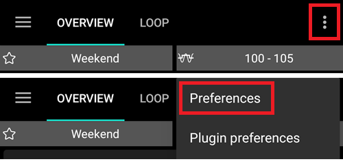
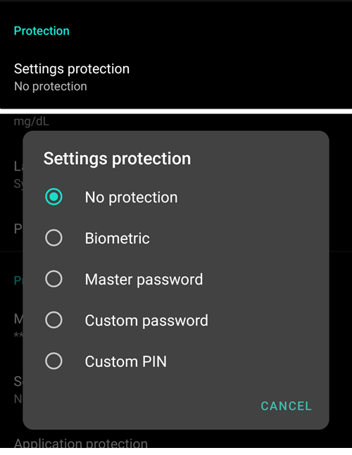
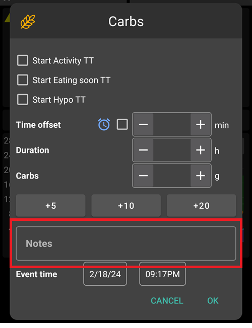
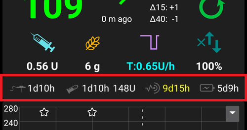

# Настройки

- **Open preferences** by clicking the three-dot menu on the top right side of the home screen.

  

- Перейдите непосредственно к настройкам определенной вкладки (например, вкладки помпы), открыв эту вкладку и нажав на настройки конкретного модуля расширения.

  

- **Подменю** можно раскрыть, нажав на стрелку слева от пункта меню.

  

- С помощью **фильтра** наверху экрана настроек можно быстро перейти к нужной настройке. Просто начните вводить часть текста, который вы ищете.

  

```{contents}
:backlinks: entry
:depth: 2
```

(Preferences-general)=
## Общие настройки


**Единицы**

- В зависимости от предпочтений установите единицы mmol/l или mg/dl.

**Язык**

- Появился новый пункт для выбора - System default - язык телефона по умолчанию (рекомендуется выбрать этот вариант).

- Если вы хотите, чтобы в вашем AAPS использовался другой язык - выберите его из предложенных вариантов.

- Если вы используете в AAPS язык, отличный от системного, то иногда будете видеть кашу из языков. Это связано с тем, что иногда на телефонах с Android не удается переопределить используемый по умолчанию язык в приложении.


**Имя пациента**

- Может быть полезно, если необходимо отличать несколько различных настроек (например - у вас два ребенка с СД1).

(Preferences-protection)=
### Защита

(Preferences-master-password)=


#### Главный пароль

- Необходимо для [экспорта настроек](../Usage/ExportImportSettings.md), т. к. они шифруются начиная с версии 2.7. **Защита биометрией (отпечаток пальца, распознавание лица) может не работать на некоторых телефонах OnePlus. Это известная проблема телефонов OnePlus.**

- Откройте настройки (трехточечное меню в правом верхнем углу начального экрана)

- Нажмите на галочку слева от заголовка "Общее"

- Нажмите "Главный пароль"

- Введите пароль, подтвердите пароль и нажмите кнопку Ok.

  

#### Защита настроек

- Защитите свои настройки с помощью пароля или биометрии (полезно в случае, когда [AAPS используется ребенком](../Children/Children.md)).

- Если вы хотите, чтобы главный пароль использовался только для [экспорта настроек](../Usage/ExportImportSettings.md). то примените отдельный пароль для настроек.

- If you are using a custom password click on line "Settings password" to set password as described [above](#master-password).

  

#### Защита приложения

- Если приложение защищено - вам потребуется вводить пароль приложения или использовать биометрию каждый раз при открытии приложения AAPS.
- Если введен неверный пароль - приложение будет немедленно закрыто, но все еще будет выполняться в фоне, если до этого было успешно открыто и запущено.

#### Защита болюсов

- Защита болюсов бывает полезна, если AAPS используется маленьким ребенком и вы [вводите болюсы через SMS](../Children/SMS-Commands.md).

- В примере ниже вы видите запрос на биометрическую защиту. Если биометрическое распознавание не работает, нажмите на пробел над запросом и введите главный пароль.

  

(Preferences-skin)=
#### Тема оформления

- Можно выбрать одну из четырех тем оформления:

  

- 'Тема оформления в низком разрешении' содержит укороченные подписи и не показывает возраст сенсора, катетера /уровень инсулина, чтобы освободить больше места на экране с низким разрешением.

- Различия других тем зависят от ориентации дисплея.

##### Портретная ориентация

- Темы **Исходная тема оформления** и **Кнопки всегда в нижней части экрана** идентичны
- Тема **Большой Экран** имеет увеличенные размеры всех элементов по сравнению с другими темами

##### Альбомная ориентация

- При использовании **Исходной темы оформления** и темы **Большой экран**придется прокручивать экран вниз, чтобы увидеть кнопки в нижней части экрана

- Тема **Большой Экран** имеет увеличенные размеры всех элементов по сравнению с другими темами

  

(Preferences-overview)=
## Общие замечания

- В разделе Начало можно определить параметры главного экрана.

  

### Не отключать экран

- Полезно если делаете презентацию.
- При этом потребляется много энергии, поэтому разумно держать телефон подключенным к зарядному устройству.

(Preferences-buttons)=
### Кнопки

- Определите, какие кнопки будут видны в нижней части главного экрана.

  

- Для простоты ввода при помощи величины приращения можно задать параметры трех кнопок в диалоговых окнах инсулина и углеводов.

  

  

(Preferences-quick-wizard)=
### Мастер быстрых настроек

- Если у вас частые перекусы или приемы пищи, для упрощения расчетов можно воспользоваться кнопкой мастера быстрого ввода.

- При настройке вы можете определить время, в течение которого кнопка будет видна на главном экране - только одна кнопка в определенный период.

  

- При нажатии на кнопку быстрого мастера AAPS будет вычислять и предлагать болюс на углеводы, основанный на ваших текущих коэффициентах (с учетом текущего значения ГК, активного инсулина и т. п.).

- Это предложение должно быть подтверждено перед подачей инсулина.

  

(Preferences-default-temp-targets)=
### Временные цели по умолчанию

- [Временные цели(TT)](../Usage/temptarget.md) позволяют вам задавать целевое значение ГК на определенный период времени.

- При помощи временных целей TT, заданных по умолчанию, можно легко установить цель при нагрузках, предстоящем питании и т. п.

  

- Выполните долгое нажатие в правом верхнем углу на главном экране или используйте оранжевую кнопку «Углеводы» внизу.

  

###

### Заполнить стандартное количество инсулина

- If you want to fill tube or prime cannula through AAPS you can do this through [actions tab](../Getting-Started/Screenshots.md#action-tab).
- В этом диалоге можно задать предустановленные значения.

(Preferences-range-for-visualization)=
### Диапазон визуализации

- Определите, какая часть графика на главном экране будет заполнена зеленым фоном в качестве целевого диапазона.

  

### сокращенные имена табул

- Видеть больше вкладок на экране.

- Например, вкладка 'Помощник болюса OpenAPS AMA' становится 'OAPS', 'ЦЕЛЕВЫЕ ЗНАЧЕНИЯ ГК' становится 'ЦЕЛИ' и т. д.

  

### Показывать поле примечаний в диалогах терапии

- Дает возможность добавить короткие примечания к терапии (мастер болюса, углеводы, инсулин...)

  

(Preferences-status-lights)=
### Индикаторы состояния

- Индикаторы состояния сообщают:

  - сколько времени отработал сенсор
  - Sensor battery level for certain smart readers (see [screenshots page](../Getting-Started/Screenshots.md#sensor-level-battery) for details).
  - сколько времени прошло с момента установки резервуара
  - об уровне заполнения резервуара (в единицах)
  - сколько времени прошло с момента установки канюли
  - Батарея помпы работает... (Возраст батареи помпы)
  - Уровень заряда батареи помпы (%)

- Если превышено пороговое значение, данные показываются желтым цветом.

- Если превышено критическое пороговое значение, значения будут показаны красным цветом.

- Настройки индикатора состояния должны были быть выполнены в настройках Nightscout в версиях AAPS до 2.7.

  

(Preferences-advanced-settings-overview)=
### Расширенные настройки (обзор)


(Preferences-superbolus)=
#### Суперболюс

- Опция для включения суперболюса в мастере.
- [Суперболюс](https://www.diabetesnet.com/diabetes-technology/blue-skying/super-bolus/) - это идея "заимствовать" некоторое количество инсулина от базальной скорости следующих двух часов, чтобы предотвратить резкие пики.

## Безопасность терапии

### Тип пациента

- Ограничения безопасности устанавливаются на основе возраста, который вы выбираете в этом параметре.
- Если вы начинаете достигать верхних ограничений (как например максимальный болюс) пора подняться на один шаг вверх (например, от ребенка перейти к подростку - прим. перев.).
- Выбирать возраст выше, чем реальный, не следует, потому что может привести к передозировке при введении ошибочного значения в диалоге инсулина (например, если пропущен десятичный разделитель - точка или запятая).
- Если вы хотите знать фактические величины жестких ограничений безопасности в коде, перейдите к функции алгоритма на [этой странице](../Usage/Open-APS-features.md).

### Максимально разрешённый болюс \[ед.\]

- Максимальное количество болюсного инсулина, разово разрешаемое в AAPS.
- Эта настройка существует как ограничение безопасности для предотвращения подачи чрезмерного болюса из-за случайного ввода или ошибки пользователя.
- Рекомендуется установить это значение как разумный предел, приблизительно соответствующий максимальному количеству болюсного инсулина, который вы когда-либо можете подать на еду или на коррекцию.
- Это ограничение также налагается на результаты калькулятора болюса.

### Макс разрешенные углеводы [г.]

- Это максимальное количество углеводов, на которое калькулятор болюса AAPS может подать дозу инсулина.
- Эта настройка существует как ограничение безопасности для предотвращения подачи чрезмерного болюса из-за случайного ввода или ошибки пользователя.
- Рекомендуется установить это значение как разумный предел, приблизительно соответствующий максимальному количеству углеводов, которые вам когда-либо понадобится на еду.

## Замкнутый цикл

(Preferences-aps-mode)=
### Режим APS

- Переключение между открытым и замкнутым циклом, а также приостановкой на низких ГК (LGS)
- Работа в **Открытом цикле** означает, что предложения временного базала TBR делаются на основе ваших данных и отображаются в виде уведомления. После подтверждения вручную, команда о дозировке временного базала передается на помпу. Если вы пользуетесь виртуальной помпой, необходимо вводить команду вручную.
- **Замкнутый цикл** означает, что предложения по изменению скорости временного базала TBR автоматически отправляются на вашу помпу без вашего подтверждения.
- **Приостановка помпы на низкой ГК** похожа на работу в замкнутом цикле, но переопределяет параметр макс активного инсулина maxIOB на ноль. Это значит, что при падении гликемии базал будет снижен, но когда гликемия будет расти, он повысится только при отрицательном значении активного инсулина IOB (например, после предыдущей остановки подачи инсулина из-за низкой гликемии).

(Preferences-minimal-request-change)=
### Минимальный запрос на изменения \[%\]

- При открытогм цикле вы будете получать уведомления каждый раз, когда AAPS рекомендует скорректировать базальную скорость.
- Чтобы уменьшить число уведомлений, можно либо использовать более широкий диапазон целевой ГК, либо увеличить процент минимального запроса на изменения.
- Он определяет относительное изменение, необходимое для активации уведомления.

(Preferences-advanced-meal-assist-ama-or-super-micro-bolus-smb)=
## Улучшенный ассистент приема пищи (AMA) или Супер Микро Болюс (SMB)

Depending on your settings in [config builder](../SettingUpAaps/ConfigBuilder.md) you can choose between two algorithms:

- [Advanced meal assist (OpenAPS AMA)](../Usage/Open-APS-features.md#advanced-meal-assist-ama) - state of the algorithm in 2017
- [Super Micro Bolus (OpenAPS SMB)](../Usage/Open-APS-features.md#super-micro-bolus-smb) - most recent algorithm recommended for beginners

### Настройки OpenAPS AMA

- Позволяет системе быстрее установить высокое временное целевое значение после болюса на еду, ЕСЛИ вы правильно ввели углеводы.
- Более подробную информацию о настройках и Autosens можно найти в документации [OpenAPS](https://openaps.readthedocs.io/en/latest/docs/Customize-Iterate/autosens.html).

(Preferences-max-u-h-a-temp-basal-can-be-set-to)=
#### Максимальное значение ед./ч для скорости временного базала

- Эта настройка существует как ограничение безопасности, чтобы не позволить алгоритму ААПС когда-либо задать слишком большую величину скорости базала.
- Значение задается в единицах в час (ед./ч).
- Рекомендуется установить какое-то разумное значение. Хорошая рекомендация – взять **наивысшую скорость базала** в вашем профиле и **умножить ее на 4**.
- Например, если максимальная скорость базала в вашем профиле была 0,5 ед./ч, то, умножив ее на 4, вы получите значение 2 ед./ч.
- See also [detailed feature description](../Usage/Open-APS-features.md#max-uh-a-temp-basal-can-be-set-to-openaps-max-basal).

#### Максимальный активный базальный инсулин IOB, разрешенный в OpenAPS [ед.]

- Количество базального инсулина (в единицах) которому позволено накопиться в вашем организме в дополнение к нормальному базальному профилю.
- По достижении этой величины AAPS перестает подавать дополнительный базальный инсулин до тех пор, пока ваш активный базальный Инсулин (IOB) снова не вернется в этот диапазон.
- Это значение **не учитывает болюсный IOB, **только базал.
- Эта величина вычисляется и отслеживается независимо от скорости вашего обычного базала. Учитывается только дополнительный базал, который свыше обычного.

Когда вы начинаете работать с алгоритмом ИПЖ, **рекомендуется установить максимум активного базальный инсулина IOB на 0 ** на время привыкания к системе. Такая настройка запрещает AAPS давать дополнительный базальный инсулин. В этот период алгоритм AAPS в состоянии ограничить или отключить базу инсулина для предотвращения гипогликемии. Это важный шаг для того чтобы:

- Безопасно привыкнуть к системе AAPS и тому, как она работает.
- Совершенствовать свой базальный профиль и лучше настроить фактор чувствительности к инсулину ISF.
- Увидеть, как AAPS ограничивает ваш базальный инсулин, чтобы предотвратить гипокликемию.

Когда вы почувствуете себя комфортно, то можете позволить системе начать давать вам дополнительный базал, повышая макс. значение активного базального инсулина IOB. Хорошая рекомендация – взять **наивысшую скорость базала** в вашем профиле и **умножить ее на 3**. Например, если максимальная скорость базала в вашем профиле была 0,5 ед./ч, то, умножив ее на 3, вы получите значение 1.5 ед./ч.

- Вы можете консервативно принять это значение и медленно увеличивать его со временем.
- Это только руководящие принципы; организмы всех людей отличаются друг от друга. Вы можете понять, что вам требуется больше или меньше, чем рекомендуется здесь, но всегда следует начинать консервативно и регулировать медленно.

**Примечание: В качестве функции безопасности максимально допустимый базальный Max Basal IOB жестко ограничен 7ед.**

#### Autosens

- [Autosens](../Usage/Open-APS-features.md#autosens) looks at blood glucose deviations (positive/negative/neutral).
- На основе отклонений он пытается выяснить, насколько вы чувствительны/резистентны к инсулину и корректирует базальную скорость и коэффициент чувствительности к инсулину ISF.
- Если вы выберете "Autosense также подстраивает цели", алгоритм будет менять целевую ГК.

#### Дополнительные настройки (OpenAPS AMA)

- Обычно нет необходимости изменять настройки в этом диалоге!
- Если все же вы хотите изменить их, обязательно прочтите подробности в документации [OpenAPS](https://openaps.readthedocs.io/en/latest/docs/While%20You%20Wait%20For%20Gear/preferences-and-safety-settings.html#) для полного понимания ваших действий.

(Preferences-openaps-smb-settings)=
### Настройки OpenAPS SMB

- In contrast to AMA, [SMB](../Usage/Open-APS-features.md#super-micro-bolus-smb) does not use temporary basal rates to control glucose levels, but mainly small super micro boluses.

- You must have started [objective 9](../SettingUpAaps/CompletingTheObjectives.md#objective-9-enabling-additional-oref1-features-for-daytime-use-such-as-super-micro-bolus-smb) to use SMB.

- The first three settings are explained [above](#max-uh-a-temp-basal-can-be-set-to).

- Details on the different enable options are described in [OpenAPS feature section](../Usage/Open-APS-features.md#enable-smb).

- *Как часто SMB будут подаваться в минутах* - по умолчанию эта величина определена только в четыре минуты. Эта величина не позволяет системе подавать микроболюсы слишком часто (например, при постановке временной цели). Не следует менять эту настройку, если только точно не осознаете последствия.

- If 'Sensitivity raises target' or 'Resistance lowers target' is enabled [Autosens](../Usage/Open-APS-features.md#autosens) will modify your glucose target according to your blood glucose deviations.

- Если цель изменена, она будет отображаться в поле целей на зеленом фоне на главном экране.

  

(Preferences-carb-required-notification)=
#### Уведомление о потребности в углеводах

- Эта функция доступна только если выбран алгоритм супермикроболюсов SMB.

- Если алгоритм обнаруживает, что организму требуются дополнительные углеводы, об этом появится сообщение.

- Вы получите уведомление, которое может быть отложено на 5, 15 или 30 минут.

- Кроме того, на главном экране в секции активных углеводов будет показано необходимое количество углеводов.

- Вы можете сами определить пороговое значение минимального количества углеводов, необходимых для запуска уведомления.

- При желании уведомления об углеводах могут быть переданы в Nightscout. В этом случае сработают стандартные настройки оповещения NS.

  

#### Дополнительные настройки (OpenAPS AMA)

- Обычно нет необходимости изменять настройки в этом диалоге!
- Если все же вы хотите изменить их, обязательно прочтите подробности в документации [OpenAPS](https://openaps.readthedocs.io/en/latest/docs/While%20You%20Wait%20For%20Gear/preferences-and-safety-settings.html#) для полного понимания ваших действий.

## Настройки усваиваемости


### min_5m_carbimpact

- Алгоритм использует BGI (воздействие на глюкозу в крови) для определения поглощения углеводов.

- Это значение используется только во время пробелов в мониторинге или когда физическая нагрузка "съедает" весь подъем гликемии, которая в ином случае заставила бы алгоритм AAPS поглощать углеводы COB организма.

- В тех случаях, когда на основании реакции гликемии крови невозможно динамически рассчитать усвоение углеводов, алгоритм пользуется значением по умолчанию. Этот параметр не приводит к отказам.

- Говоря по-простому, алгоритм "знает" как *должна* вести себя ГК при воздействии дозы инсулина и т. п.

- При положительном отклонении от ожидаемого поведения некоторые углеводы поглощаются/исчезают. Большие изменения=много углеводов и т. д.

- По умолчанию величина min_5m_carbimpact определяет поглощение углеводов за 5 минут. Дополнительную информацию см. в документации [OpenAPS](https://openaps.readthedocs.io/en/latest/docs/While%20You%20Wait%20For%20Gear/preferences-and-safety-settings.html?highlight=carbimpact#min-5m-carbimpact).

- Стандартное значение для AMA 5, для SMB это 8.

- График COB на главном экране показывает, когда используется min_5m_impact в виде оранжевого круга в верхней части.

  

### Максимальное время усвояемости пищи

- Если вы часто едите блюда с высоким содержанием жиров или белка, вам следует увеличить время усвоения пищи.

### Расширенные настройки - коэффициент autosens

- Define min. and max. [autosens](../Usage/Open-APS-features.md#autosens) ratio.
- Обычно стандартные значения (макс. 1.2 и мин. 0.7) не должны меняться.

## Настройки помпы

The options here will vary depending on which pump driver you have selected in [Config Builder](../SettingUpAaps/ConfigBuilder.md#pump).  Выполните сопряжение и настройте помпу в соответствии с инструкциями относящимися к помпе:

- [Инсулиновая помпа DanaR](../CompatiblePumps/DanaR-Insulin-Pump.md)
- [Инсулиновая помпа DanaRS](../CompatiblePumps/DanaRS-Insulin-Pump.md)
- [Помпа Accu Chek Combo](../CompatiblePumps/Accu-Chek-Combo-Pump.md)
- [Помпа Accu-Chek Insight](../CompatiblePumps/Accu-Chek-Insight-Pump.md)
- [Помпа Medtronic](../CompatiblePumps/MedtronicPump.md)

Для работы AndroidAPS в незамкнутом цикле, в конфигураторе выберите виртуальную помпу.

(Preferences-nsclient)=
## клиент NS


Оригинальный протокол коммуникации, может использоваться с более ранними версиями Nightscout.

- Создайте свой сайт *Nightscout URL* (напр. <https://yoursitename.yourplaform.dom>).
  - **Убедитесь, что URL-адрес БЕЗ /api/v1/ в конце.**
- *[API secret](https://nightscout.github.io/nightscout/setup_variables/#api-secret-nightscout-password)* (12-значный пароль записан в переменных Nightscout).
- Это позволит считывать и записывать данные веб-сайту Nightscout и приложению AAPS.
- Если вы застряли на Цели 1, еще раз проверьте поля с адресом и паролем на наличие опечаток.

## Клиент NSV3


[Новый протокол, начиная с AAPS 3.2.](../Installing-AndroidAPS/Releasenotes.md#important-comments-on-using-v3-versus-v1-api-for-nightscout-with-aaps) - безопаснее и эффективнее.

```{admonition} V3 data uploaders
:class: warning

When using NSClientV3, all uploaders must be using the API V3. Since most are not compatible yet, this means **you must let AAPS upload all data** (BG, treatments, ...) to Nightscout and disable all other uploaders if they're not V3 compliant.
```

- Создайте свой сайт *Nightscout URL* (напр. <https://yoursitename.yourplaform.dom>).
  - **Убедитесь, что URL-адрес БЕЗ /api/v1/ в конце.**
- В Nightscout создайте *[атрибут доступа администратора ](https://nightscout.github.io/nightscout/security/#create-a-token)* (для APIV3 требуется [Nightscout 15](https://nightscout.github.io/update/update/)) и введите его в качестве атрибута входа в **NS** (не путать с API Secret!).
- Это позволит считывать и записывать данные веб-сайту Nightscout и приложению AAPS.
- Если вы застряли на Цели 1, еще раз проверьте поля с адресом и паролем на наличие опечаток.
- Оставьте Подключение к websocket включенным (рекомендуется).

### Синхронизация

Synchronization choices will depend on the way you will want to use AAPS.

You can select which data you want to [upload and download to or from Nightscout](../SettingUpAaps/Nightscout.md#aaps-settings).

### Опции оповещения


- Опции звуковых оповещений позволяют выбрать оповещения Nightscout по умолчанию для использования через приложение. AAPS будет подавать звуковые сигналы при срабатывании оповещений Nightscout.
  - Для того, чтобы работали оповещения, следует настроить значения переменных для Чрезвычайно Высокой, Высокой, Низкой и Чрезвычайно Низкой ГК в переменных [Nightscout](https://nightscout.github.io/nightscout/setup_variables/#alarms).
  - Они будут работать только во время подключения к Nightscout и предназначены для родителей/опекунов.
  - Если на телефоне есть источник мониторинга CGM (например xDrip+ или самостоятельно собранное приложение BYODA), то используйте сигналы этих приложений вместо оповещений Nightscout.
- [Оповещения ](https://nightscout.github.io/nightscout/discover/#announcement)Nightscout при соответствующих настройках будут повторяться в строке уведомлений AAPS.
- Вы можете изменять порог срабатывания оповещений при отсутствии данных от Nightscout в течение определенного времени.

### Параметры подключения


- Настройки подключения определяют, когда включено соединение с Nightscout.
- Ограничьте загрузку в Nightscout только через Wi-Fi или даже через Wi-Fi SSID.
- Если вы хотите использовать только конкретные сети WiFi, в настройках подключения укажите конкретный идентификатор сети WiFi SSID.
- Несколько идентификаторов SSID разделяются точкой с запятой.
- Чтобы удалить все SSID оставьте поле пустым.

(Preferences-advanced-settings-nsclient)=
### Расширенные настройки (Клиент NS)


Options in advanced settings are self-explanatory.

## СМС-коммуникатор

- Options will only be displayed if SMS communicator is selected in [Config Builder](../SettingUpAaps/ConfigBuilder.md#sms-communicator).
- Эта настройка позволяет осуществлять удаленное управление приложением при помощи смс-инструкций, отправляемых на телефон пациента, который выполняет их в AAPS, например, приостанавливая работу цикла или подавая болюсы.
- Дальнейшая информация описана в [Команды SMS ](../Children/SMS-Commands.md).
- Дополнительная безопасность обеспечивается с помощью приложения-Аутентификатора и дополнительного PIN-кода в конце сообщения.

## Автоматизация

Select which location service shall be used:

- Использовать пассивное расположение: AAPS принимает положения только в том случае, если другие приложения запрашивали его
- Использовать расположение сети: расположение вашего Wifi
- Используйте локатор GPS (Внимание! Может привести к чрезмерной разрядке аккумулятора!)

## Локальные оповещения


- Настройки самоочевидны.

## Отбор данных


- Вы можете помочь разработчикам AAPS, посылая отчеты об ошибках.

## Параметры обслуживания


- Standard recipient of logs is <logs@aaps.app>.

## Проект Open Humans

- Вы можете помочь науке, поделившись данными с исследовательскими проектами! Детали описаны на странице [Open Humans](../Configuration/OpenHumans.md).

- В настройках вы можете определить, когда загружать данные

  - загружать только при подключении к WiFi
  - только при зарядке
