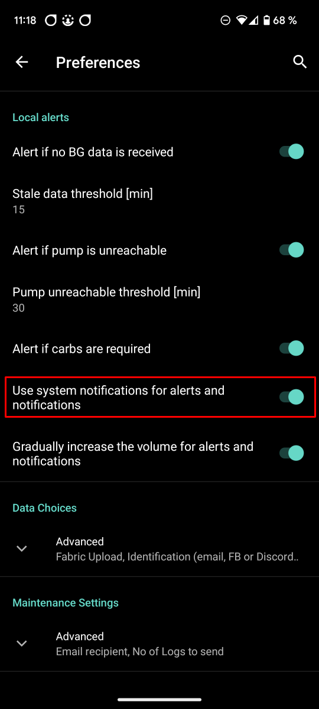
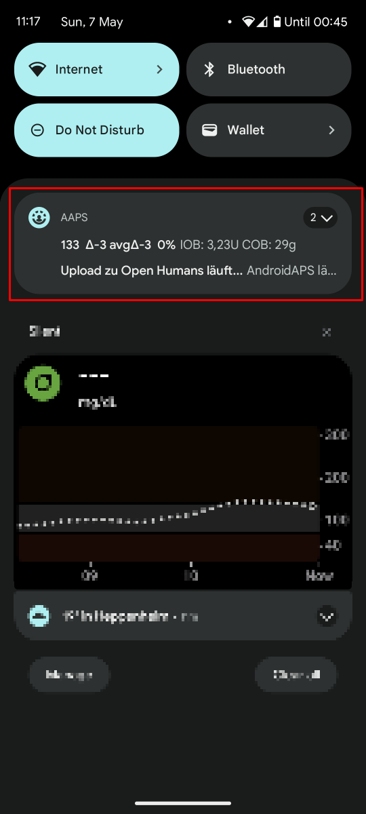
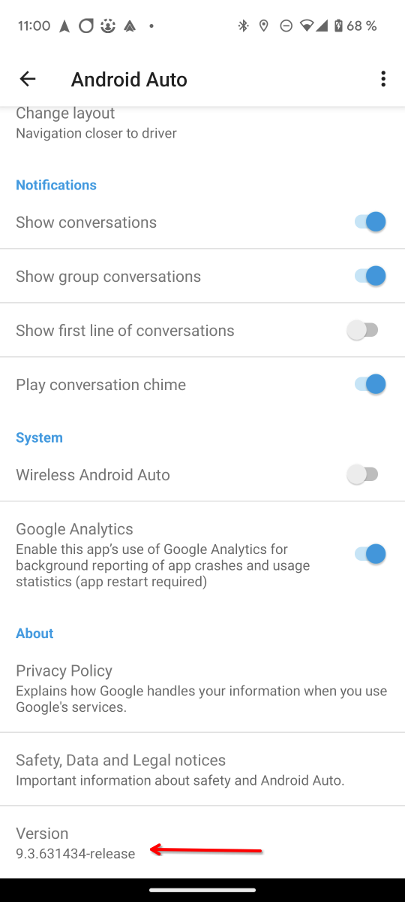
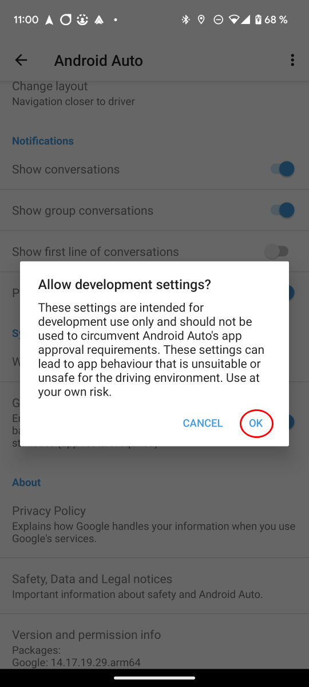
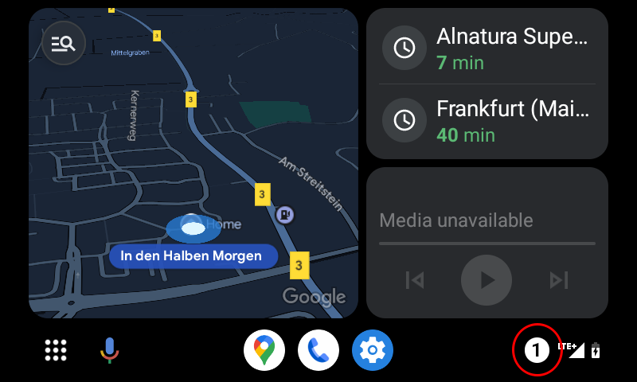

# Android Auto

**AAPS** is capable of sending you information about your current status as a message, directly into Android Auto in your car.

:::{admonition} версия информация о изменениях :class: выпадающий дата редактирования: 07/05/2023

версии, используемые для документации:

* AAPS 3.2.0-dev-i
* Android Auto: 9.3.631434-release :::

## Что потребуется:

**AAPS** uses a feature of Android Auto which allows messages from apps on the mobile to be routed to the display of Auto Audio in the car.

That means that:

* You must configure **AAPS** to use system notifications for alerts and notifications and
* As **AAPS** is an unofficial App, allow the use of "unknown sources" with Android Auto.

(Параметры-AndroidAPS-для-Android-Auto)=

## Use system notifications in AAPS for alerts and notifications

Open 3-dot-menu on top right of **AAPS** home screen and select **Preferences**

В **Локальных оповещениях** активируйте **Использовать системные уведомления для оповещений и уведомлений**

Please check now that you get notifications from **AAPS** on the phone before you walk to your car!

(Android авто-AAPS-настройки-в--android-auto-на-телефоне)=

## Allow the use of "unknown sources" with Android Auto.

As **AAPS** is not an official Android Auto app, notifications have to be activated for "unknown sources" in Android Auto. Это делается с помощью режима разработчика, который мы покажем здесь.

Перейдите к своему автомобилю и подключите мобильный телефон к аудиосистеме автомобиля.

Должен появиться экран, похожий на этот.

Нажмите на иконку **настроек** чтобы начать конфигурацию.

Прокрутите вниз до конца страницы и выберите **см. больше в телефоне**.

Теперь, на мобильном устройстве, активируем режим разработчика.

The first screen looks like this. Прокрутите вниз до конца страницы.

Там в списке вы видите версию Android Auto. Нажмите 10 раз (буквально десять) на версию Android Auto. With this hidden combination you have now enabled developer mode.

Подтвердите, что вы хотите включить режим разработчика в диалоге "Разрешить настройки разработки?".

В настройках **разработчика** включите "Неизвестные источники".

Теперь можно выйти из режима разработчика. Чтобы сделать это, нажмите на три точки меню вверху справа.

## Показывать уведомления в автомобиле

Коснитесь **значка № ** на нижней панели меню Android Авто в автомобиле.

Your CGM data will be shown as follows:

## Устранение неполадок:

* Если уведомление не показано, проверьте, даны ли разрешения [ показывать уведомления AAPS](Android-auto-AAPS-settings-for-android-auto) в Android и имеет ли [ Android Auto права доступа к уведомлениям ](Android-auto-AAPS-settings-in-android-auto-app-on-your-phone).