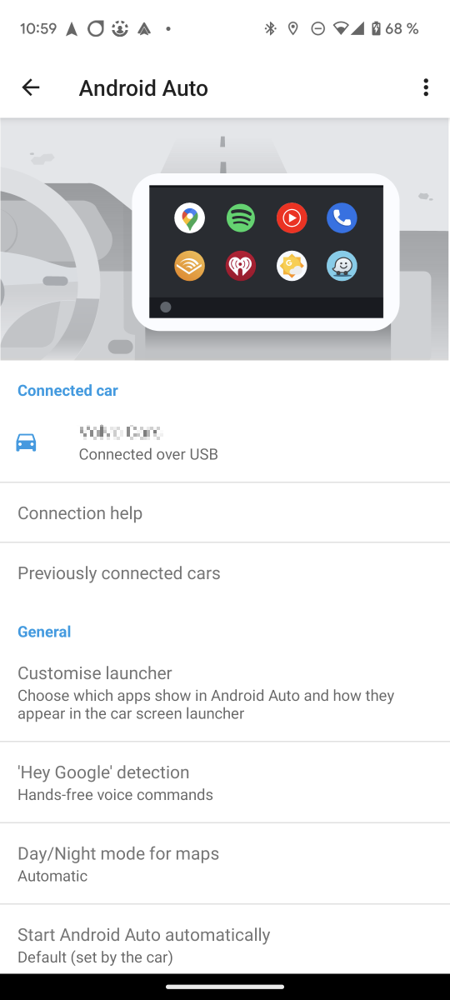

# Android Auto

AAPS способен отправлять информацию в качестве сообщения непосредственно в Android Auto в автомобиле.

:::{admonition} версия информация о изменениях :class: выпадающий дата редактирования: 07/05/2023

версии, используемые для документации:

* AAPS 3.2.0-dev-i
* Android Auto: 9.3.631434-release :::

## Что потребуется:

AAPS использует функцию Android Auto, которая позволяет отправлять сообщения из приложений на мобильном устройстве на дисплей Auto Audio в автомобиле.

Это означает, что

* следует разрешить AAPS работу с системными уведомлениями
* поскольку AAPS неофициальное приложени, то дать разрешение для "неизвестных источников" с Android Auto.

(Параметры-AndroidAPS-для-Android-Auto)=

## для оповещений и предупреждений включите системные уведомления

Откройте меню в правом верхнем углу экрана и выберите **Настройки**

В **Локальных оповещениях** активируйте **Использовать системные уведомления для оповещений и уведомлений**

Проверьте, что вы получаете уведомления от AAPS на мобильном телефоне, прежде чем идти к автомобилю!

(Android авто-AAPS-настройки-в--android-auto-на-телефоне)=

## в Android Auto разрешите использование "неизвестных источников".

Так как AAPS не является официальным приложением Android Auto, в Android Auto. нужно активировать уведомления из "неизвестных источников". Это делается с помощью режима разработчика, который мы покажем здесь.

Перейдите к своему автомобилю и подключите мобильный телефон к аудиосистеме автомобиля.

Должен появиться экран, похожий на этот.

Нажмите на иконку **настроек** чтобы начать конфигурацию.

Прокрутите вниз до конца страницы и выберите **см. больше в телефоне**.

Теперь, на мобильном устройстве, активируем режим разработчика.

первый экран выглядит так. Прокрутите вниз до конца страницы.

Там в списке вы видите версию Android Auto. Нажмите 10 раз (буквально десять) на версию Android Auto. С этой скрытой комбинацией вы открываете режим разработчика.

Подтвердите, что вы хотите включить режим разработчика в диалоге "Разрешить настройки разработки?".

В настройках **разработчика** включите "Неизвестные источники".

Теперь можно выйти из режима разработчика. Чтобы сделать это, нажмите на три точки меню вверху справа.

## Показывать уведомления в автомобиле

Коснитесь **значка № ** на нижней панели меню Android Авто в автомобиле.

Значения гликемии будут показаны следующим образом.

## Устранение неполадок:

* Если уведомление не показано, проверьте, даны ли разрешения [ показывать уведомления AAPS](Android-auto-AAPS-settings-for-android-auto) в Android и имеет ли [ Android Auto права доступа к уведомлениям ](Android-auto-AAPS-settings-in-android-auto-app-on-your-phone).