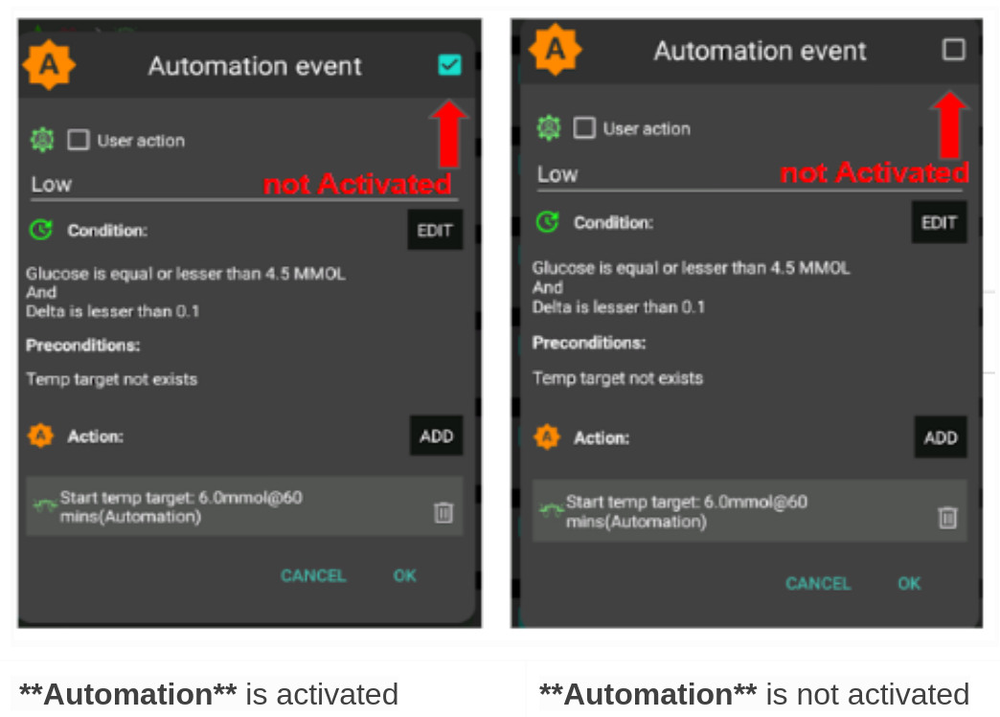
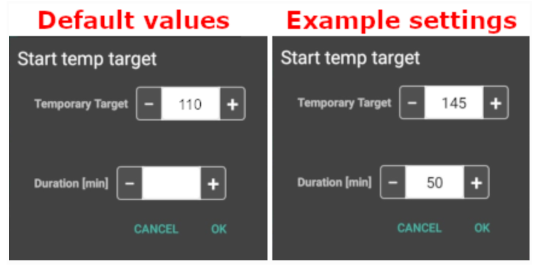
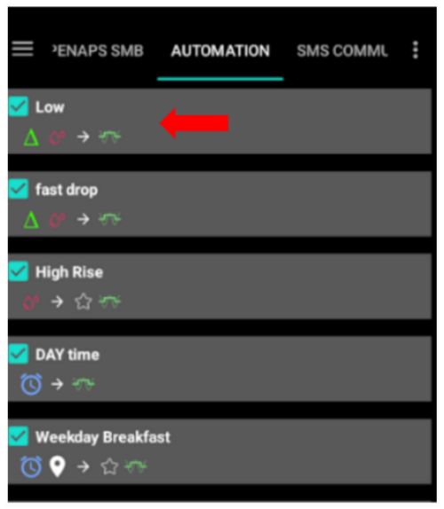
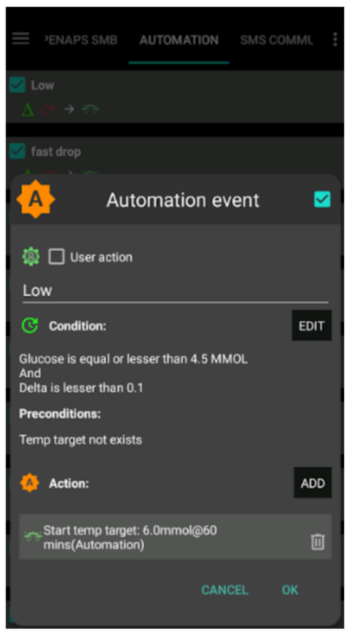
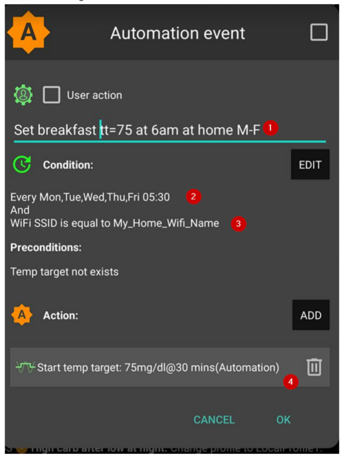
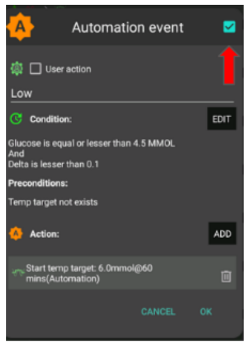

# Автоматизация

## Что такое автоматизация?

"**Automation**" является функцией **AAPS**, которая позволяет упростить управление диабетом пользователя путем автоматических изменений в подачу инсулина. **Автоматизации** позволяют пользователям **AAPS<** подстраивать его работу под свои индивидуальные потребности.

Каждый конкретный скрипт Автоматизации **** инструктирует **AAPS** выполнять определенное действие в результате одного или нескольких условий, или триггеров. Такими активаторами могут быть назначены нерегулярные эпизодические событий вроде низкого или высого сахара крови, или некоторая заданная величина отрицательного активного инсулина IOB в организме. Ими также могут стать периодические мероприятия, например, прием пищи или физ нагрузки в определенное время суток, или когда пользователь находится в пределах определенного местоположения GPS или зоны WIFI SSID.

Существует большой выбор опций автоматизации, и пользователям рекомендуется изучать их в приложении **AAPS** в разделе автоматизации. Можно также найти группы пользователей **AAPS** на **Facebook**, **Discord**, Telegram и т. п. для обмена примерами автоматизации с другими пользователями.

## Как может помочь автоматизация

1. **Уменьшение забот, связанных с принятием решений:** Основное преимущество **автоматизации** заключается в освобождении пользователя от бремени ручного вмешательства в работу **AAPS**. [Исследования](https://www.ncbi.nlm.nih.gov/pmc/articles/PMC6286423/#ref4) показывают, что людям с сахарным диабетом 1 типа, приходится принимать в среднем 180 дополнительных решений в день. **Автоматизация** может уменьшить эту нагрузку, высвобождая умственную энергию пользователя для других аспектов жизни.

1. **Потенциально улучшит гликемический контроль: ** например, **автоматизация** может обеспечить, чтобы ** Временные целевые показатели** устанавливались по мере необходимости, даже во время напряженного графика или периодов забывчивости. Например, если у ребенка с сахарным диабетом запланированы занятия спортом в школе по вторникам в 10 утра и четвергам в 14: 00, и ему всегда нужно, чтобы за 30 минут до этих занятий включалась временная высокая цель, это может быть обеспечено автоматизацией.

1. <**Позволяет тщательно настраивать AAPS**, чтобы быть более или менее агрессивными в конкретных ситуациях, в зависимости от предпочтений пользователя. Например, срабатывание временного пониженного % профиля на заданный период времени, если активный инсулин **IOB** стал отрицательным посреди ночи, что указывает на чрезмерную агрессивность профиля действующего.

Приводимый ниже пример показывает, как **Автоматизация** может активировать шаги для устранения забот. Пользователь настроил **Автоматизацию** на запуск "Временной цели Нагрузка" в 5 утра, чтобы обеспечить себе оптимальную гликемию **ГК** и **активный инсулин IOB** для зарядки в 6 утра:


## Основные соображения перед началом применения автоматизации

1. Перед настройкой **Автоматизации**необходимо иметь надлежащий контроль ГК с помощью **AAPS**. <**Автоматизация** не должна применяться для компенсации неоптимизированной базы, коэффициента чувствительности ISF или углеводного коэффициента IC (обсуждается ниже). Избегайте установки автоматизации на **переключение профиля** для компенсации повышения ГК _например_, вследствие приема пищи, с этим лучше справляться с помощью других стратегий (микроболюсов и т.п.).

1. Как любые другие технологии, <мониторинги ГК</strong>, **помпы** и **телефоны** могут работать со сбоями: технические проблемы или ошибки сенсоров могут нарушить работу **автоматизации** и потребовать ручного вмешательства.

1. **Требования к автоматизации могут меняться при изменении хода событий**. При смене между периодами работы/школы/отпуска, установите в календаре напоминание о том, какие автоматизации активны (их легко активировать и деактивировать). Например, если вы едете в отпуск, то больше не нуждаетесь в автоматизации для занятий физподготовкой или занятий в зале, или же требуется корректировать время.

1. Режимы автоматизации могут конфликтовать друг с другом, поэтому рекомендуется тщательно просмотреть любые новые настройки автоматизации в безопасной среде и понять, почему автоматизация может сработать, а может и не сработать в соответствии с ожиданиями.

1. При использовании Autosense попробуйте использовать **Временные цели** вместо **Переключателя профилей**. **Временные цели TT** не сбрасывают Autosens на 0. **Переключатели профиля** сбрасывают Autosens.

1. Большинство автоматизаций следует устанавливать на **ограниченный промежуток времени**, после чего **AAPS** при необходимости повторно оценит и повторит автоматизацию. Например, "начать временную цель 7,0 ммоль/л продолжительностью 30 мин" или "начать профиль 110% продолжительностью 10 мин" _ и_ "начать временную цель 5,0 ммоль/л продолжительностью 10 мин". Использование автоматизации для внесения постоянных изменений (например, для повышения %p профиля) может привести к гипогликемии.

## Когда начать применять Автоматизацию?

При запуске Цели 10.

## Где находятся настройки автоматизации в AAPS?

Depending on your [config builder](../SettingUpAaps/ConfigBuilder.md) settings, **Automation** is located either in the ‘hamburger’ menu or as a tab with **AAPS**.

## Как настроить автоматизацию?

Чтобы настроить **Automation** создайте правило **AAPS** следующим образом:

* Дайте название вашему "правилу";
* Выберите хотя бы одно "условие"; и
* Выберите одно «действие»;
* Установите правый флажок события **Automation** для активации автоматизации:




Чтобы отключить правило **Automation**, снимите галочку с поля слева от названия правила **Automation**. В приведенном ниже примере показаны **Automation**  под названием «Low Glucose TT» как активированный («помеченный) или деактивированный («unticked»).


При настройке автоматизации сначала можно проверить ее, включив опцию «notification (уведомление)» в разделе «Действия». Это заставляет**AAPS** сначала вывести уведомление, а не автоматизировать действие. Когда вы убедитесь, что уведомление запущено в правильное время/ при правильных условиях, правило **Автоматизации** может быть обновлено, с заменой "Уведомления" на ‘Действие’.


```{admonition} Important note
:class: note

Automations are still active when the Loop is disabled!
```


## Ограничения безопасности

Для **Автоматизации** установлены ограничения безопасности:

* Значение ГК должно составлять от 72 до 270 мг/дл или от 4 до 15 ммоль/л).
* Процент **профиля** должен составлять от 70% до 130%.
* Существует 5-минутный промежуток времени между выполнениями **Автоматизации** (и ее первым выполнением).

## Правильное использование отрицательных значений

```{admonition} Warning
:class: warning

Please be careful when selecting a negative value in Automation
```

Необходимо соблюдать осторожность при выборе «отрицательного значения» в «Условиях», как например «менее чем» в **Automations**. Например:


**Пример 1:** Создание условия **"меньше, чем"** "-0,1" приведет к:

Запустит **Automation** для любого числа, которое **строго** меньше, чем** -0,1. Сюда войдут такие числа как -0.2, -0.3, -0.4 и так далее. Помните, что -0,1 само **не** включен в это условие. (условие "меньше или равно -0,1" _включало бы_ -0,1).

**Пример 2:** Создание условия "больше, чем" -0,1 приведет к:

Запустит **Автоматизацию** для любого числа, которое **строго** больше, чем** -0,1. Сюда входят такие числа как 0, 0,2, 0,4 и любые другие положительные числа.

Важно тщательно учитывать точное назначение **автоматизации** при выборе этих условий и значений.

## Условия Автоматизации

Существуют различные «Условия», которые могут быть выбраны пользователем. Приводимый ниже перечень не исчерпывающий:

**Условие** связка условий

**Варианты:**

Несколько условий могут быть связаны при помощи
* “И”
* “Или”
* * "Исключительно либо" (что означает, что если применяется одно - и только одно из этих условий, то действие (действия) произойдет

**Условие:** время и время повторения

**Варианты:**

* время = одно событие времени
* периодическое время = то, что происходит регулярно (т.е. раз в неделю, каждый рабочий день и т. д.)

**Условие:** место

**Варианты:**

* в **конфигураторе** (Автоматизация) пользователь может выбрать необходимую ему службу определения местоположения.

**Условие:** служба определения местоположения

**Варианты:**

* Использовать пассивное расположение: **AAPS** принимает локацию только в том случае, если ее запрашивают другие приложения.
* Использовать расположение сети: расположение вашего Wifi.
* Используйте локатор GPS (Внимание! Может привести к чрезмерной разрядке аккумулятора!)

## Действие

**Действия:** начать **Временную цель**

**Варианты:**

* **ГК** должна быть между 72 мг/дл и 270 мг/дл (4 ммоль/л и 15 ммоль/л)
* **ВЦ** работает только в том случае, если нет предыдущей временной цели

**Действия:** остановить **временную цель**

**Варианты:**

отсутствуют

**Действия:** процент **Профиля**

**Варианты:**

* **Профиль** должен быть между 70% и 130%
* работает только в том случае, если предыдущий процент составляет 100%

После добавления «Действия» значения по умолчанию должны быть изменены на желаемую величину путем нажатия и изменения значения по умолчанию.




## Порядок автоматизаций в списке имеет значение
 <**AAPS** автоматизирует правила в порядке предпочтения, начиная с верхней части списка **Автоматизация**. Например, если **Автоматизация** ‘низкая гипогликемия’ является наиболее важной **автоматизацией**, превышающей все остальные правила, то эта **Автоматизация** должна отображаться в начале списка созданных пользователем **Автоматизаций **, как показано ниже:




Чтобы изменить приоритет **Правил автоматизации**, нажмите и удерживайте кнопку с четырьмя строками в правой части экрана. Меняйте порядок  **Автоматизаций**, перемещая правила вверх или вниз.


## Как удалить правила автоматизации

Для удаления правила **автоматизации** нажмите на значок корзины.


## Примеры Автоматизации

Ниже приведены примеры **Автоматизаций**. Обсуждение **Автоматизаций** и того, как пользователи индивидуализировали свою  **Automation** можно найти в группах Facebook или в Discord. Приведенные ниже примеры не следует воспроизводить без хорошего понимания пользователем того, как будет работать **Автоматизация**.

### Временная Цель Низкая ГК

Эта **Автоматизация** запускает автоматическую  "Временную Цель Гипо", когда низкая **ГК** находится на определенном пороговом уровне.



### Временная цель Обеденный перерыв (с "Локацией")


Эта **Автоматизация** была создана для пользователя, который обедает на работе примерно в одно и то же время каждый будний день, но запускается только в том случае, если пользователь находится в пределах заданного ‘местоположения’.  Таким образом, если пользователь однажды не окажется на работе, эта автоматизация НЕ будет активирована.

Эта **Автоматизация** установит Низкую Временную цель (ожидаемый прием пищи) в 13:00, чтобы снизить уровень ГК до 90 мг (или 5 ммоль/л) при подготовке к обеду.

"Инициирующее" местоположение устанавливается путем ввода GPS-координат широты и долготы, как показано ниже:


Из-за союза "И" **Автоматизация** происходит только в "выбранное" время при нахождении пользователя на предопределенном месте.

**Автоматизация ** не будет активирована ни в какое другое время в этом месте или в это время за пределами 100 метров от установленных GPS-координат.

### Автоматизация по локации SSID WIFI

Использование SSID WI-Fi - хороший вариант для запуска **автоматизации** по нахождению в зоне действия определенной сети Wi-Fi (по сравнению с GPS), он достаточно точен, потребляет меньше заряда батареи и работает в закрытых помещениях, где GPS и другие службы определения местоположения могут быть недоступны.

Еще один пример установки **Временной Цели** на рабочие дни только перед завтраком (1).


Автоматизация **** запустится в 05:30am только в понедельник-пятницу (2)  
и при подключении к домашней сети wifi (3).


Затем будет установлена **временная цель**  в 75мг/dl на 30 минут (4). Одно из преимуществ включения местоположения заключается в том, что правило не будет срабатывать, если пользователь путешествует в отпуске, например.



Вот снимок экрана с подробным описанием активаторов **автоматизации**:

1) Под основным “И” (для запуска должны быть выполнены оба условия) 1) Повторяющееся время = пн, вт, ср, чт, пт в 5:30 утра   
1) SSID WI-FI = Имя WiFi_Мой_дом


## Журналы автоматизации

В <**AAPS** ведется журнал недавно сработавших **автоматизаций** в нижней части экрана на вкладке **Автоматизация**.

В приведенном ниже примере журнал показывает:

(1) в 01:58 ночи активируется правило “Низкий ГК запускает временный профиль Гипо”
* уровень ГК менее 75 мг/дл;
* дельта отрицательна (т. е. ГК снижается);
* время в пределах 01:00 и 06:00 утра.

**Автоматизация**:
* установит **временную цель** 110mg/dl на 40 минут;
* запустит временный 50% **профиль** продолжительностью 40 минут.

(2) в 03:38 утра срабатывает правило "Много углеводов после низкой ГК ночью"
* время в пределах 01:05 и 06:00 утра;
* уровень ГК выше 110мг/дл.

**Автоматизация**:
* изменит **профиль** на LocalProfile1 (т. е. отменит временный профиль, если таковой имеется)
* остановит **Врем Цель Temp Target** (если есть)


## Устранение неполадок

* Проблема: __Мои автоматизации не запускаются в AAPS__

Установите флажок справа от события **Автоматизации**, чтобы убедиться, что правило активировано.



* Проблема: __ Мои автоматизации запускаются в неправильном порядке.__

Проверьте порядок расстановки приоритетов правил, как описано ранее.

## Альтернативы автоматизации

Для опытных пользователей есть и другие возможности автоматизации задач с помощью IFTTT или приложения других разработчиков Android под названием Automate. 

