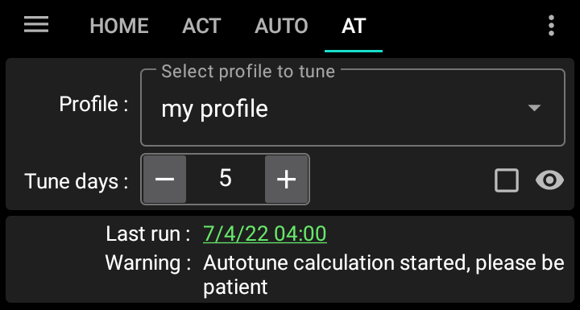
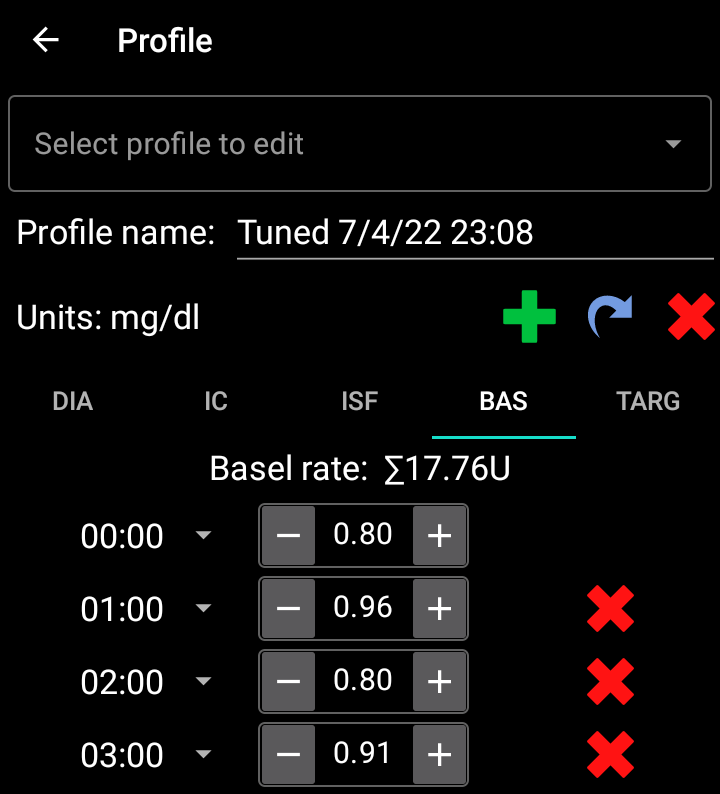
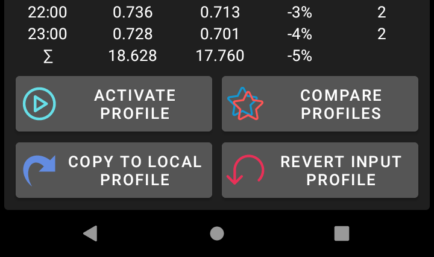
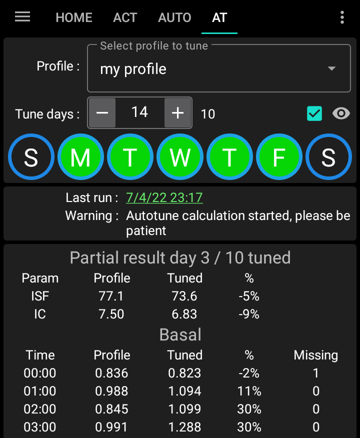
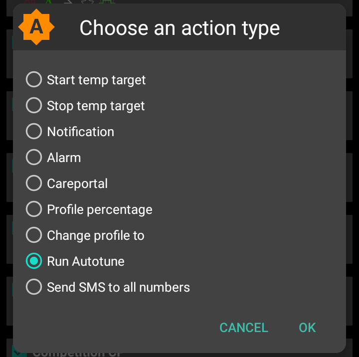

# Как использовать модуль Autotune (только для ветки разработчиков (dev))

Подробнее об алгоритме Autotune можно прочитать в [документации OpenAPS](https://openaps.readthedocs.io/en/latest/docs/Customize-Iterate/autotune.html).

Модуль Autotune - это реализация алгоритма autotune OpenAPS в среде AAPS.

**В настоящее время модуль Autotune доступен только в ветке dev и в режиме разработчика.**

## Интерфейс пользователя Autotune

- В выпадающем меню профилей можно выбрать профиль, который хотите настроить (по умолчанию выбран ваш текущий активный профиль)
  - Примечание: каждый раз при выборе нового профиля, предыдущие данные будут удалены и параметр дней настройки Tune будет установлен в значение по умолчанию
- Затем необходимо выбрать количество дней, используемых при расчете для настройки профиля. Минимальное значение составляет 1 день и максимальное 30 дней. Это число не должно быть слишком маленьким, чтобы получить правильные итеративные и сглаженные результаты (более 7 дней для каждого расчета)
  - Примечание: каждый раз при изменении параметра дней настройки предыдущие результаты будут удалены
- Последнее выполнение - это ссылка, восстанавливающая предыдущий корректный расчёт. Если вы не запускали Autotune в текущий день, или если предыдущие результаты были удалены с модификацией параметра вычисления выше, то вы можете восстановить параметры и результаты последнего успешного запуска.
- Предупреждение показывает некоторую информацию о выбранном профиле (если у вас есть несколько значений IC или несколько значений ISF)
  - Примечание: Расчет Autotune работает только с одним углеводным коэффициентом и одним значением ISF. В настоящее время не существует алгоритма Autotune для настройки суточных почасовых ISF или углеводных коэффициентов. Если профиль имеет несколько значений, вы увидите предупреждение о среднем значении, принятом для настройки профиля.
- Проверьте вкладку профиля и убедитесь, что все величины установлены корректно (единицы, DIA, IC, ISF, базал и цели)
  - Примечание: Autotune подстроит только углеводный коэффициент IC (единичное значение), ISF (единичное значение) и базальный профиль (с вариацией в пределах суток). Единицы, продолжительность действия инсулина и цель останутся неизменными в итоговом профиле.

- "Запустить Autotune" запустит расчет Autotune с выбранным профилем и количеством дней, выбранных для подстройки
  - Примечание: Расчет Autotune может занять длительное время. После запуска autotune можно переключиться на другое окно (главый экран и. п., ...) и вернуться позже в Autotune, чтобы увидеть результаты

- Затем во время запуска вы увидите промежуточные результаты

  - Примечание: Во время работы Autotune настройки заблокированы, поэтому изменить выбранный входной профиль или количество суток, участвующих в анализе, уже нельзя. Если требуется запустить другой анализ с другими параметрами, дождитесь окончания текущего расчета.

  

- По завершении вычисления Autotune вы увидите результат - настроенный профиль (Tuned profile) и четыре кнопки.

- Важно всегда сравнивать входной профиль (столбец "Профиль"), выходной профиль (столбец "Настроено") и процент изменений каждого значения (столбец "%").

- Для базальной скорости имеется "количество недостающих дней". Недостающие дни появляются когда Autotune не хватает данных в категории «Basal» для настройки базовой скорости за этот период (например, после каждой еды, когда идет поглощение углеводов). Это число должно быть как можно более низким, особенно если базал важен (например, в ночь или в конце второй половине дня)

- Кнопка "Сравнить профили" открывает окно сравнения профилей. Профиль на входе синий, а на выходе ("Настроенный") - красный.

  - Примечание: в примере ниже профиль на входе имеет циклические суточные отклонения для IC и ISF, но профиль на выходе имеет одно значение. Если вам важно получить выходной профиль с меняющимися значениями в зависимости от времени суток см. [Посуточный профиль для IC или ISF](autotune-circadian-ic-or-isf-profile) ниже.

  

- Если вы доверяете результатам (низкий процент изменений между входным профилем и выходным профилем), нажмите на кнопку "Активировать профиль" и затем на OK для подтверждения.

  - Активация профиля Tuned автоматически создаст новый профиль "Tuned" в модуле Локальный профиль.
  - Если у вас уже есть профиль с названием "Tuned" (подстроенный) в локальном модуле профиля, то он будет обновлен на рассчитанный профиль Autotune до активации

  

- Если вы считаете, что профиль Tuned должен быть скорректирован (например, если некоторые вариации слишком важны), вы можете нажать на кнопку "Копировать в локальный профиль"

  - Новый профиль с префиксом "Tuned" и датой и временем запуска будет создан в локальном модуле профиля

- Затем вы можете выбрать локальный профиль для редактирования подстроенного профиля Tuned (он будет выбран по умолчанию при открытии локального модуля профиля)

  - значения в локальном профиле, будут округлены в соответствии с возможностями вашей помпы

  

- Если вы захотите заменить свой профиль на результат Autotune, нажмите на кнопку "Обновить профиль ввода" и нажмите OK во всплывшем окне

  - Примечание: если нажать на "Активировать профиль" после "Обновить входной профиль", то вы активируете свой обновленный профиль, а не "Tuned" по умолчанию.

  

- Если вы обновили свой профиль ввода, то кнопка «Обновить профиль ввода» заменяется кнопкой «Вернуть профиль ввода» (см. снимок экрана ниже). Вы можете сразу же увидеть, содержит ли ваш текущий профиль ввода в локальном модуле результат последнего запуска или нет. Также есть возможность восстановить профиль ввода без результатов autotune с помощью этой кнопки

  

## Настройки Autotune

(autotune-plugin-settings)=

### Настройки модуля Autotune

- Переключение профиля при Автоматизации (по умолчанию выключено): см. [Запуск Autotune с правилом автоматизации](autotune-run-autotune-with-an-automation-rule) ниже. Если изменить эту настройку на Включить, профиль ввода будет автоматически обновлен профилем Tuned и активирован.
  - **Будьте внимательны, в течение нескольких следующих дней следите, чтобы после обновления и активации настроенного профиля ваша система заработала лучше по сравнен с профилем без изменений**

- Классифицировать UAM как базал (по умолчанию Вкл.): Этот параметр предназначен для пользователей, использующих AAPS без ввода углеводов (Полный UAM). Это помешает (когда Выключено) классифицировать UAM как базал.
  - Примечание: если в течение одного дня обнаружен по крайней мере один час абсорбции углеводов, тогда все данные, классифицированные как UAM, будут классифицированы как basal, вне зависимости от того, включен параметр или выключен
- Количество дней данных (по умолчанию 5): Для этого параметра можно задать значение по умолчанию. Каждый раз, когда вы выбираете новый профиль в модуле Autotune, параметр "дней для анализа" будет заменен на это значение по умолчанию
- Применить средний суточный результат IC/ISF (по умолчанию Off): см. [Circadian IC или ISF профиль](autotune-circadian-ic-or-isf-profile) ниже.

### Другие настройки

- Autotune also uses Max autosens ratio and Min autotsens ratio to limit variation. Эти параметры можно увидеть и настроить в Конфигураторе > Модуль определения чувствительности > Настройки > Расширенные настройки

  

## Дополнительные возможности

(autotune--циркадный-профиль-ic-или-isf)=

### Циркадный профиль IC или ISF

- Если в профиле присутствуют существенные вариации IC и/или ISF, и вы полностью доверяете своим циркадным биоритмам, то можно активировать параметр "Применять средний результат в циркадных IC/ISF"

  - Обратите внимание, что вычисление Autotune всегда будет выполняться с одним значением, а циркадные вариации не будут подстроены при помощи Autotune. This setting only apply average variation calculated for IC and/or ISF on your circadian values

- На снимке экрана ниже настроенный профиль с отключенной опцией "применять средний вариант значения" слева и с включенной - справа

  

### Настройка определенных дней недели

- Если нажать на галочку с глазом справа от параметра "Дней для анализа", вы увидите дни недели для отбора. Можно указать, какой день недели войдет в расчет Autotune (на снимке экрана пример для "рабочих дней" с неотмеченными для расчета autotune субботой и воскресеньем)
  - Если количество дней, включенных в расчет Autotune меньше, чем количество дней для настройки то вы увидите, сколько дней будет включено справа от селектора настраиваемых дней (10 дней в примере ниже)
  - Этот параметр дает хорошие результаты только в том случае, если количество оставшихся дней не слишком мало (например, если вы настраиваете конкретный профиль на выходные дни только с выбранным воскресеньем и субботой, следует выбрать не менее 21 или 28 дней, чтобы было 6 или 8 дней для расчета Autotune)

- Во время вычисления Autotune вы можете увидеть прогресс вычислений ("Частичный результат дня 3/10 для расчета" на примере внизу)

  

(autotune-run-autotune-with-an-automation-rule)=

## Запустить Autotune с правилом автоматизации

Первый шаг заключается в определении правильной отправной точки (триггера) для правила автоматизации с автонастройкой:

Примечание: подробнее о создании правил для автоматизации см [здесь](./Automation.md).

- Следует выбрать время повторения триггера: запускать Autotune только один раз в сутки, ежедневно (после каждого нового выполнения Autotune смещать график на день вперед и делать небольшие быстрые модификации профиля)

  

- Вначале лучше запускать Autotune днем, чтобы иметь возможность проверить результаты. Если вы хотите запустить Autotune ночью, в триггере следует выбрать 4 часа ночи или позже, чтобы включить текущий день в следующий запуск Autotune.

  

- Затем можно выбрать действие "Запустить Autotune" из списка

  

- Затем выберите Действие Autotune чтобы настроить параметры запуска. Параметры по умолчанию - "Активный профиль", значение дней в настройках модуля Autotune по умолчанию - выбраны все дни.

  

- After a few days, if you fully trust Autotune results and percentage of modification is low, you can modify [Autotune settings](autotune-plugin-settings) "Automation Switch Profile" to enabled to automatically update and activate profile tuned after calculation.

Note: if you want to automatically tune profiles for specific days of the week (for example a profile for "Weekend days" and another one for "Working days"), then create one rule for each profile, select the same days in Trigger and in Autotune Action, Tune days must be high enough to be sure tuning will be done with at least 6 or 8 days, and don't forget to select time after 4AM in trigger...

- See below an example of rule to tune "my profile" on all "Working days" with 14 Tune days selected (so only 10 days included in autotune calculation).

## Tips and trick's

Autotune works with information existing in your database, so if you just installed AAPS on a new phone, you will have to wait several days before being able to launch Autotune with enough days to get relevant results.

Autotune is just an help, it's important to regularly check if you agree with calculated profile. If you have any doubt, change Autotune settings (for example the number of days) or copy results in local profile and adjust profile before using it.

Always use Autotune several days manually to check results before applying them. And it's only when you fully trust Autotune results, and when variation becomes tiny between previous profile and calculated profile than you start to use Automation (Never before)

- Autotune can work very well for some users and not for others, so **If you don't trust Autotune result, don't use it**

It's also important to analyse Autotune results to understand (or try to understand) why Autotune propose these modifications

- you can have a whole increase or decrease of the strength of your profile (for example increase of total basal associated to decrease of ISF and IC values). it could be associated to several following days with autosens correction above 100% (more agressivity required) or below 100% (you are more sensitive)
- Sometimes Autotune propose a different balance between basal rates and IC/ISF (for ex lower basal and more aggressive IC/ISF)

We advise to not use Autotune in the following cases:

- You don't enter all your carbs
  - If you don't enter carbs correction for an hypoglycemia, Autotune will see an unexpected increase of your BG value and will increase your basal rates the 4 hours earlier, it could be the opposite of what you need to avoid hypo, especially if it's in the middle of the night. That's why it's important to enter all carbs especially correction for hypo.
- You have a lot of period with UAM detected during the day.
  - Do you have entered all your carbs and correctly estimated your Carbs ?
  - All UAM periods (except if you enter no carbs during a day and categorized UAM as basal is disabled), all your UAM periods will be categorized as basal, this can increase a lot your basal (much more than necessary)

- Your carbs absorption is very slow: if most of your carbs absorption are calculated with min_5m_carbimpact parameter (you can see these periods with a little orange dot in the top of COB curve), the calculation of COB could be wrong and leads to wrong results.
  - When you practice sport, you are generally more sensitive and your BG doesn't rise a lot, so during or after an exercice, it's usual to see some periods with slow carbs. But if you have too often unexpected slow carb absorption, then you may need a profile adjustment (higher value of IC) or a min_5m_carbimpact a bit too high.
- You have a "very bad days", for example stuck several hours in hyperglycemia with a huge amount of insulin to be able to go down within the range, or after a sensor change you got long periods of wrong BG values. If during the pas weeks you only have one or 2 "bad days", you can disable manually these days in autotune calculation to exclude them from calculation, and again **check carefully if you can trust the results**
- If the percentage of modification is too important
  - You can try to increase the number of days to get smoother results