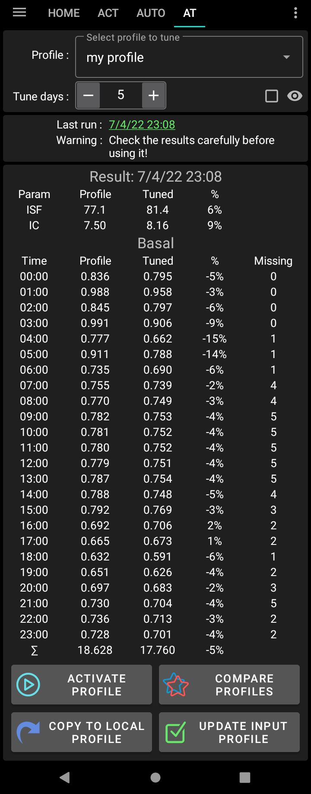
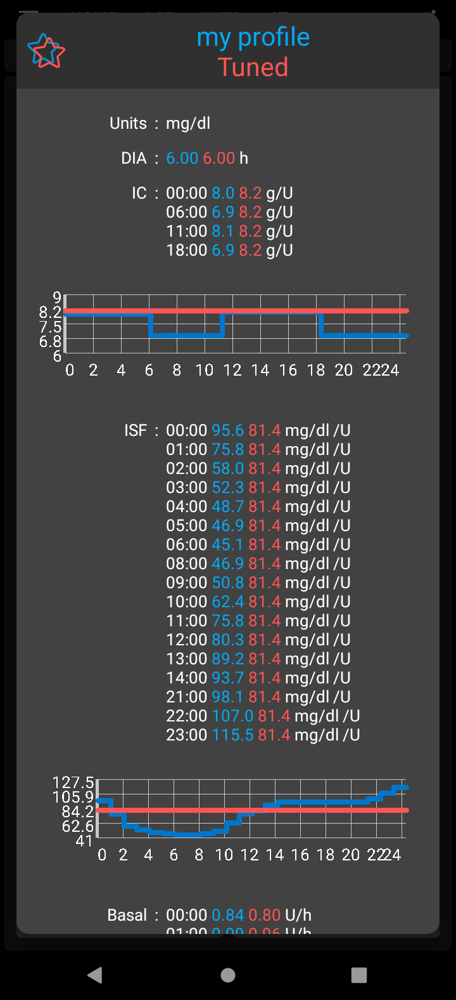
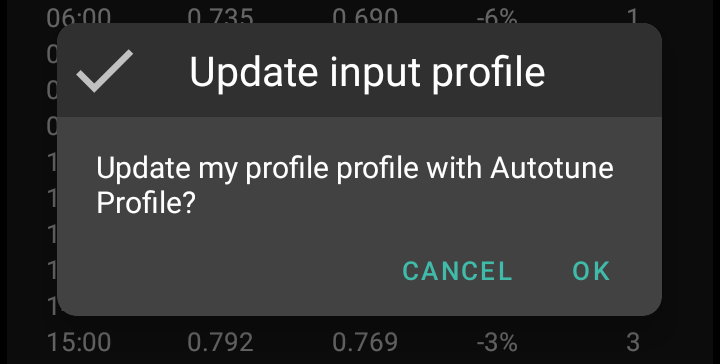
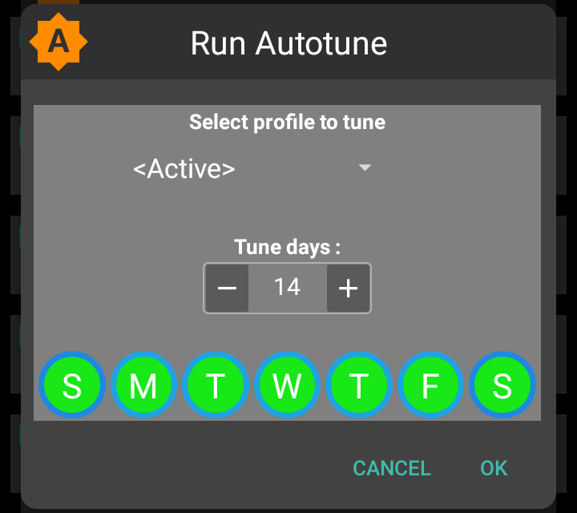

# Otoayar eklentisi nasıl kullanılır?

Otoayar algoritması hakkında daha fazla ayrıntıyı [OpenAPS dokümantasyonu](https://openaps.readthedocs.io/en/latest/docs/Customize-Iterate/autotune.html)nda bulabilirsiniz.

Otoayar eklentisi, AAPS içindeki OpenAPS otoayar algoritmasının uygulanmasıdır.

**Şu anda otoayar eklentisi yalnızca mühendislik modundaki geliştirici sürümünde mevcuttur.**

## Otoayar kullanıcı arabirimi

- Ayarlamak istediğiniz giriş profilini Profil açılır menüsünden seçebilirsiniz (varsayılan olarak mevcut etkin profiliniz seçilidir)
  - Not: Her yeni profil seçiminde, önceki sonuçlar kaldırılacak ve Gün Ayar parametreleri varsayılan değere ayarlanacaktır.
- Ayar günleri, profilinizi ayarlamak için hesaplamada kullanılan gün sayısını içermektedir. Minimum değer 1 gün ve maksimum değer 30 gündür. Doğru yinelemeli ve sorunsuz sonuçlar elde etmek için bu sayı çok küçük olmamalıdır (her hesaplama için 7 günden fazla)
  - Not: Ayar günleri parametresini her değiştirdiğinizde, önceki sonuçlar kaldırılacaktır
- Son Çalıştırma, en son geçerli hesaplamanızı kurtaran bir bağlantıdır. Otoayarı o gün başlatmadıysanız veya yukarıdaki hesaplama parametresinin değiştirilmesiyle önceki sonuçlar kaldırıldıysa, en son başarılı çalıştırmanın parametrelerini ve sonuçlarını kurtarabilirsiniz.
- Uyarı size örneğin seçilen profil hakkında bazı bilgiler gösterir (birkaç Kİ değeriniz veya birkaç İDF değeriniz varsa)
  - Not: Otomatik ayar hesaplaması yalnızca tek bir Kİ ve tek bir İDF değeriyle çalışır. Şu anda bir sirkadiyen Kİ veya sirkadiyen İDF'yi ayarlamak için mevcut bir OtoAyar algoritması yoktur. Giriş profilinizin birkaç değeri varsa, profilinizi ayarlamak için dikkate alınan ortalama değeri uyarı bölümünde görebilirsiniz.
- Giriş Profilini Kontrol Et düğmesi, profilinizi (Ünite, İES, Kİ, İDF, bazal ve hedef) hızlı bir şekilde doğrulamanıza izin vermek için Profil Görüntüleyiciyi açar.
  - Not: OtoAyar, yalnızca Kİ (tek değer), İDF (tek değer) ve bazal (sirkadiyen varyasyonlu) ayarlarınızı yapacaktır. Üniteler, İES ve hedef, çıktı profilinde değişmeden kalacaktır.

- "OtoAyarı Çalıştır", seçili profil ve ayarlama gün sayısı ile OtoAyar hesaplamasını başlatır
  - Not: Otomatik ayar hesaplaması uzun sürebilir. Başlatıldıktan sonra, başka bir görünüme (ev, ...) geçebilir ve sonuçları görmek için daha sonra otoayar eklentisinde geri dönebilirsiniz

- Ardından çalıştırma sırasında aşağıda ara sonuçları göreceksiniz

  - Not: Çalıştırma sırasında ayarlar kilitlenir, bu nedenle artık seçilen giriş profilini veya gün sayısını değiştiremezsiniz. Diğer parametrelerle başka bir çalıştırma başlatmak istiyorsanız mevcut hesaplamanın bitmesini beklemeniz gerekecektir.

  

- OtoAyar hesaplaması bittiğinde, sonucu (Ayarlanmış profil) ve aşağıda dört buton göreceksiniz.

- Girdi profilini ("Profil" sütunu), çıktı profilini ("Ayar" sütunu) ve her değer için varyasyon yüzdesini ("%" Sütunu) her zaman karşılaştırmak önemlidir.

- Bazal oranlar için "kayıp gün" sayısına da sahipsiniz. Otoayarın bu dönemde bazal oranı ayarlamak için "Bazal" olarak kategorize edilmiş yeterli veriye sahip olmadığı durumlarda (örneğin, her yemekten sonra karbonhidrat emilimi durumunda) eksik günleriniz olacaktır. Bu sayı, özellikle bazal önemli olduğunda (örneğin gece veya öğleden sonra) mümkün olduğunca düşük olmalıdır.

- "Profilleri karşılaştır" butonu, profil karşılaştırıcı görünümünü açar. Giriş profili mavi ve çıkış profili ("Ayarlanmış" olarak adlandırılır) kırmızıdır.

  - Not: Aşağıdaki örnekte, giriş profilinin Kİ ve İDF için sirkadiyen değişimi vardır, ancak hesaplanan çıktı profilinin tek bir değeri vardır. Bir sirkadiyen çıktı profili almanız sizin için önemliyse aşağıdaki [Sirkadiyen Kİ veya İDF profiline](#circadian-ic-or-isf-profile) bakın.

  

- Sonuçlara güveniyorsanız, (giriş profili ile çıktı profili arasında düşük yüzdeli farklılık) "Profili etkinleştir" düğmesine tıklayabilir ve ardından doğrulamak için Tamam'a tıklayabilirsiniz.

  - Ayarlanmış profili etkinleştirin, Yerel profil eklentinizde otomatik olarak yeni bir "Ayarlanmış" profil oluşturacaktır.
  - Yerel profil eklentinizde zaten "Ayarlanmış" (Tuned) adlı bir profiliniz varsa, bu profil aktivasyondan önce hesaplanan Otoayar profiliyle güncellenecektir.

  

- Ayarlanmış profilin gerektiğini düşünüyorsanız (örneğin, bazı varyasyonların çok önemli olduğunu düşünüyorsanız), "Yerel profile kopyala" düğmesine tıklayabilirsiniz.

  - Yerel profil eklentisinde "Ayarlanmış" ön ekine ve çalıştırmanın tarih ve saatine sahip yeni bir profil oluşturulacak

- Ardından, Ayarlanmış profilini düzenlemek için yerel profili seçebilirsiniz (Yerel profil eklentisini açtığınızda varsayılan olarak seçilecektir)

  - yerel profildeki değerler ancak kullanıcı arabiriminde pompa kapasitenize yuvarlanır

  

- Giriş profilinizi Otoayar sonuçlarıyla değiştirmek isterseniz, "Giriş profilini güncelle" düğmesine tıklayın ve açılan pencereyi Tamam ile onaylayın

  - Not: "Giriş profilini güncelle"den sonra "Profili etkinleştir"e tıklarsanız, varsayılan "Ayarlanmış" profili değil, güncellenmiş profilinizi etkinleştirirsiniz.

  

- Giriş profilinizi güncellediyseniz, "Giriş profilini güncelle" butonunun yerini "Giriş profilini geri al" butonu alır (aşağıdaki ekran görüntüsüne bakın). Bu şekilde, Yerel profil eklentisindeki mevcut giriş profilinizin zaten son çalıştırmanın sonucunu içerip içermediğini hemen görebilirsiniz. Ayrıca, bu buton ile otoayar sonucu olmadan giriş profilinizi kurtarma olanağına da sahipsiniz.

  

## OtoAyar ayarları

### Otoayar eklenti ayarları

- Otomasyon ile Profil değiştirme (varsayılan Kapalı): aşağıdaki [Otoayarı bir otomasyon kuralıyla çalıştırma](#run-autotune-with-an-automation-rule) bölümüne bakın. Bu ayarı Açık olarak değiştirirseniz, giriş profili Ayarlanmış profil tarafından otomatik olarak güncellenecek ve etkinleştirilecektir.
  - **Dikkatli Olun, Ayarlanmış profilin güncellenmesi ve etkinleştirilmesinden sonra döngünüzü iyileştirdiğine güvenmeli ve takip eden birkaç gün boyunca bunu doğrulamalısınız.**

- UAM'ı bazal olarak kategorize et (varsayılan Açık): Bu ayar, herhangi bir karbonhidrat girmeden AndroidAPS kullanan kullanıcılar içindir (Tam UAM). (Kapalı olduğunda) UAM'ın bazal olarak kategorize edilmesini önleyecektir.
  - Not: Bir gün boyunca tespit edilen en az bir saatlik karbonhidrat emiliminiz varsa, bu ayar ne olursa olsun (Açık veya Kapalı) "UAM" olarak sınıflandırılan tüm veriler bazal olarak kategorize edilir.
- Veri gün sayısı (varsayılan 5): Bu ayar ile varsayılan değer tanımlayabilirsiniz. Otoayar eklentisinde her yeni profil seçtiğinizde, Ayar günleri parametresi bu varsayılan değerle değiştirilecektir.
- Ortalama sonucu sirkadiyen Kİ/İDF olarak uygulayın (varsayılan Kapalı): aşağıdaki [Sirkadiyen Kİ veya İDF profiline](#circadian-ic-or-isf-profile) bakın.

### Diğer ayarlar

- Otoayar, varyasyonu sınırlandırmak için Maks. otoduyarlılık oranı ve Min. otoduyarlılık oranı da kullanır. Bu değerleri; Konfigürasyon ayarları > Hassasiyet algılama eklentisi > Ayarlar > Gelişmiş Ayarlarda görebilir ve ayarlayabilirsiniz.

  

## Gelişmiş özellik

### Sirkadiyen Kİ veya İDF profili

- Profilinizde önemli Kİ ve/veya İDF varyasyonlarınız varsa ve sirkadiyen zamanınıza ve varyasyonunuza tamamen güveniyorsanız, "Sirkadiyen İK/İDF'de ortalama sonucu uygula" ayarını yapabilirsiniz.

  - Otoayar hesaplamasının her zaman tek bir değerle yapılacağını ve sirkadiyen varyasyonun Otoayar tarafından ayarlanmayacağına dikkat edin. Bu ayar yalnızca sirkadiyen değerlerinizde Kİ ve/veya İDF için hesaplanan ortalama değişimi uygular.

- Ortalama varyasyonu uygula Kapalı (solda) ve Açık (sağda) ile Ayarlanmış profilin altındaki ekran görüntüsüne bakın

  

### Haftanın belirli günlerine ayarlama

- "Çalışma günleri" parametresinin sağındaki göz ile onay kutusuna tıklarsanız, gün seçimini göreceksiniz. Haftanın hangi gününün Otoayar hesaplamasına dahil edileceğini belirleyebilirsiniz (aşağıdaki ekran görüntüsünde Cumartesi ve Pazar günleri otoayar hesaplamasından çıkarılmış "çalışma günleri" örneğini görebilirsiniz)
  - Otoayar hesaplamasına dahil edilen gün sayısı Ayar gün sayısından az ise Ayar günleri seçicinin sağında kaç gün dahil edileceğini göreceksiniz (aşağıdaki örnekte 10 gün)
  - Bu ayar, ancak kalan gün sayısı küçük değilse iyi sonuçlar verir (örneğin, yalnızca Pazar ve Cumartesi seçili olarak hafta sonu günleri için belirli bir profili Ayarladıysanız, Otomatik Ayar hesaplamasına 6 veya 8 gün dahil etmek için en az 21 veya 28 Ayar günü seçmelisiniz)

- OtoAyar hesaplaması sırasında, hesaplamaların ilerleyişini görebilirsiniz (Aşağıdaki örnekte "Kısmi sonuç 3 / 10 gün ayarlandı")

  

## Otomasyon kuralı ile Otoayar çalıştırma

İlk adım, otomasyon kuralı için doğru tetikleyiciyi Otoayar tanımlamaktır:

Not: Bir otomasyon kuralının nasıl ayarlanacağı hakkında daha fazla bilgi için [buraya](./Automation.rst) bakın.

- Yinelenen Zaman Tetikleyicisi'ni seçmelisiniz: sadece günde bir kez otomatik olarak çalıştırın ve Otoayar günlük olarak çalıştırılacak şekilde tasarlanmıştır (bir gün sonraki her yeni çalışma için profil modifikasyonu minik olmalıdır)

  

- Sonuçları kontrol edebilmek için Otoayarı gün boyunca çalıştırmak daha iyidir. Gece boyunca Otoayarı çalıştırmak istiyorsanız, bir sonraki Otoayar hesaplamasına şu anki gün de dahil tetikleme için saat 4 veya daha sonrasını seçmeniz gerekir.

  

- Ardından listede "Otoayarı Çalıştır" eylemini seçebilirsiniz

  

- Ardından, çalıştırmanız için gerekli parametreleri ayarlamak için Otoayar eylemini seçebilirsiniz. Varsayılan parametreler "Aktif Profil", Otoayar eklentisi tercihlerinde tanımlanan varsayılan ayar günleri değeridir ve tüm günler seçilir.

  

- Birkaç gün sonra, Otoayar sonuçlarına tam olarak güveniyorsanız ve değişiklik yüzdesi düşükse, [ Otoayar Ayarları ](#autotune-plugin-settings) "Profili değiştirme Otomasyonu" modifiye edilerek hesaplamadan sonra ayarlanan profil otomatik olarak güncellenebilir ve etkinleştirebilir.

Not: Profilleri haftanın belirli günleri için otomatik olarak ayarlamak istiyorsanız (örneğin, "Hafta sonu günleri" için bir profil ve "Çalışma günleri" için başka bir profil) her profil için bir kural oluşturun. OtoAyar eyleminde tetiklemede aynı günleri seçin ve ayar günlerinin yeterince yüksek olduğundan emin olmak için en az 6 veya 8 gün ve tetiklemede saat 4:00'ten sonraki zaman seçilmelidir...

- Aşağıda, 14 Ayar günü seçili olarak tüm "Çalışma günleri"nde "profilim"i ayarlamak için bir kural örneğine bakabilirsiniz (yani, otomatik ayar hesaplamasına yalnızca 10 gün dahildir).

## Ipuçları ve Püf noktaları

Otoayar, veritabanınızda bulunan bilgilerle çalışır, bu nedenle AAPS yeni bir telefona henüz yüklendiyse, ilgili sonuçları almak için yeterli günle Otoayarı başlatmadan önce birkaç gün beklemeniz gerekecektir;

Otoayar sadece bir yardımdır, hesaplanan profille hemfikir olup olmadığınızı düzenli olarak kontrol etmek önemlidir. Herhangi bir şüpheniz varsa, Otoayar (örneğin gün sayısını) ayarlarını değiştirin veya yerel profildeki sonuçları kopyalayın ve kullanmadan önce profili ayarlayın.

Her zaman Otoayarı birkaç gün manuel olarak kullanın ve uygulamadan önce sonuçları kontrol edin. Ve yalnızca, Otoayar sonuçlarına tam olarak güvendiğinizde ve önceki profil ile hesaplanan profil arasında değerler, otomasyonu kullanmaya başladığınızdan bu yana küçükse kullanın. (Daha önce değil)

- Otoayar, bazı kullanıcılar için çok iyi çalışabilir ve bazıları için çalışmaz, bu nedenle ** Otoayara güvenmiyorsanız, kullanmayın **

Otoayarın neden bu değişiklikleri önerdiğini anlamak (veya anlamaya çalışmak) için otoayar sonuçlarını analiz etmek de önemlidir.

- Profil direncinizin bir artışı veya azalması olabilir (örneğin, İDF ve Kİ değerlerinin azalmasıyla ilişkili toplam bazal artışı). Otoduyarlılık % 100'ün üzerinde (daha fazla agresif) veya% 100'ün altında (daha hassassınız) sonraki birkaç gün ile ilişkilendirilebilir.
- Bazen Otoayar, bazal oranlar ve Kİ/İDF arasında farklı bir denge önerir (önceki düşük bazal ve daha agresif Kİ/İDF için)

Aşağıdaki durumlarda Otoayar kullanmayı tavsiye etmiyoruz:

- Tüm karbonhidratları girmiyorsanız
  - Bir hipoglisemideki karbonhidrat düzeltmesini girmezseniz, Otoayar, KŞ değerinizde anlaşılmaz bir artış görecek ve saatlerce bazal oranlarınızı arttıracaktır. Özellikle de gece yarısı hipodan kaçınmanız gerekirken tam tersi olabilir. Bu yüzden tüm karbonhidraları, özellikle hipo için yapılan düzeltmeleri girmek önemlidir.
- Gün boyunca UAM tespit edilen çok fazla periyot varsa.
  - Tüm karbonhidratlarınızı girdiniz ve karbonhidratlarınızı doğru tahmin ettiniz mi?
  - Tüm UAM dönemleri (bir gün boyunca karbonhidrat girmezseniz ve bazal devre dışı bırakıldığı için UAM kategorize edilmezse) bazal olarak kategorize edilir ve bu bazalınızı çok artırabilir (gerekenden çok daha fazla)

- Karbonhidrat emiliminiz çok yavaş: Karbonhidrat emiliminizin çoğu min_5m_carbimpact parametresi ile hesaplanıyorsa (bu periyotları AKRB eğrisinin üst kısmında küçük bir turuncu nokta ile görebilirsiniz), AKRB hesaplaması yanlış olabilir ve yanlış sonuçlara yol açabilir.
  - Spor yapıyorsanız, genellikle daha hassassınız ve kan şekeriniz çok fazla yükselmez, bu nedenle egzersiz sırasında veya sonrasında, yavaş karbonhidratlı bazı dönemler görmek normaldir. Ancak çok sık beklenmedik yavaş karbonhidrat emiliminiz varsa, o zaman bir profil ayarlamasına (daha yüksek Kİ değeri) veya biraz yüksek bir min_5m_carbimpact'e ihtiyacınız olabilir.
- "Çok kötü günler" geçiriyorsunuz, örneğin, aralığın içine inebilmek için yüksek miktarda insülinle birkaç saat hiperglisemide kalmışsınız veya bir sensör değişikliğinden sonra uzun süre yanlış kan şekeri değerleriniz olmuş.
- Değişiklik yüzdesi çok önemliyse
  - Daha sorunsuz sonuçlar almak için gün sayısını artırmayı deneyebilirsiniz.