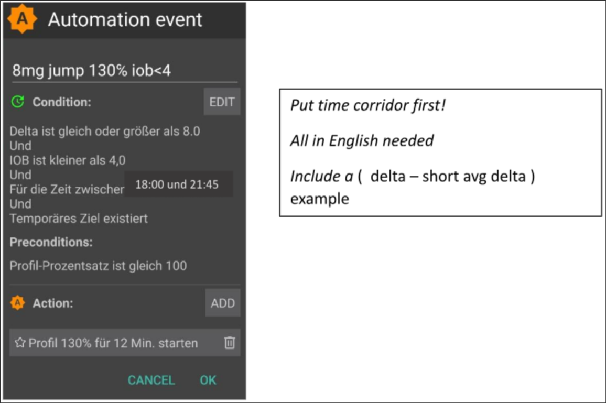
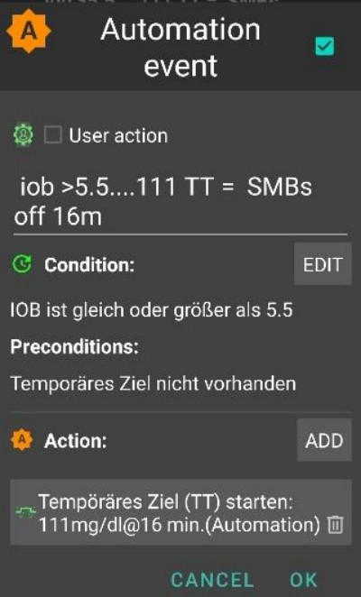

# 全自動循環（Full Closed Loop）

## 全自動循環 vs. 混合自動循環（FCL, HCL）

### 定義

在**混合自動循環**中，您在進餐前至少注射了一次胰島素。 這會將您的循環系統推向臨時關閉（暫時停止基礎率），並在胰島素仍然啟動時進行共同管理。

此外，每次進餐前，您會輸入碳水化合物、脂肪和蛋白質的攝取量，並提供估計的碳水化合物吸收時間的提示（通常在設定中，並與每天的每頓餐相關）。

AAPS 還允許在不輸入任何胰島素和碳水化合物的情況下進行**全自動循環（UAM，未註明餐點模式）**。

- 請注意，**UAM** 也可以在混合自動循環中啟用，此時意味著演算法能更好地容忍錯誤的碳水化合物輸入。

- 針對高碳水化合物餐點或某些用餐習慣或敏感度變動較大的人，是否需要提前小劑量的注射，目前仍存在爭議。 這實際上是一種混合自動循環，沒有碳水化合物資訊，因而是一種 HCL 的變體。 我們將 FCL 定義為**完全不需要使用者注射胰島素**，一旦您調整好 FCL，甚至可以移除 AAPS 主畫面底部所有「無用」的按鈕。

### 應該期待什麼？

在 2022/23 年進行並發表的首個醫學研究表明，患者使用 AAPS 在簡單的 FCL 模式中可以獲得相當好的結果：

> 16 位糖尿病青少年（HbA1c 範圍 43-75），糖尿病病史為 9-15 年，參加了三個不同的為期三天的營地生活期間，使用了修改和鎖定的 AAPS 3.1.0.3 版本**結果：** 在研究期間，該系統控制了 95% 的血糖時間，且在整個研究期間，低於 3.9 mmol/L 的時間比例沒有超過 1%（0.72%）。 HCL 情景中低於 3 mmol/L 的時間百分比顯著較高（HCL 1.05% vs. MA 0.0% vs. FCL 0.0%；P = 0.05） **在 3.9 到 10 mmol/L 的時間百分比上沒有觀察到顯著差異**（HCL 83.3% vs. MA 79.85% vs. **FCL 81.03%**，P = 0.58），對應的平均血糖值為（HCL 6.65 mmol/L vs. MA 7.34 mmol/L vs. FCL 7.05 mmol/L，P = 0.28）。 在每日胰島素劑量或每日碳水化合物攝取量上沒有觀察到差異。 在研究期間沒有發生嚴重的不良事件。 **結論：** 我們的試驗研究表明，**FCL 可能是 1 型糖尿病患者的現實治療模式**。

來源：

1)   美國國家醫學圖書館，PubMed [首例使用開源自動胰島素遞送 AndroidAPS 在全自動循環場景：Pancreas4ALL 隨機試點研究](https://pubmed.ncbi.nlm.nih.gov/36826996/)；

2)  臨床試驗註冊 ClinicalTrials.gov 美國國家醫學圖書館，臨床試驗 [Pancreas4ALL（ASAP）自動胰島素遞送閉環系統的可行性和安全性研究](https://www.clinicaltrials.gov/study/NCT04835350?term=Feasibility%20and%20Safety%20Study%20of%20the%20Automated%20Insulin%20Delivery%20Closed%20Loop%20System%20Pancreas4ALL%20(ASAP)&rank=1)

要享受減輕日常負擔的好處，您必須：

- 檢查是否具備全自動循環的所有先決條件
- 設置一些自動化程式
- 經歷一個學習和調整階段，您需要調整您的設定，特別是那些自動化中的設定。 以下建議將指導您完成這個過程。

### 為什麼（或不）從混合模式轉換到全自動循環的考量

全自動循環系統**並不適合每個人**：

- 雖然一些使用自動化的全自動循環使用者達到了大約 90% 的 TIR（70-180），HbA1c 低於 6%，但您可能會更喜歡更嚴格的控制。 特別是**在快速碳水化合物飲食中將血糖值維持在 140 mg/dl 以下**可能需要提前注射。
- 您是否準備好以知情且謹慎的方式，對系統進行高度個性化的校準？ 這種**個性化調整**可能會**充滿挑戰**。 如果您已經對設定基礎率和 ISF 感到不堪重負，這可能不適合您。 但要權衡一下，與您每天不用再計算碳水化合物相比，您能獲得什麼。 您可能還會從分析和調整循環系統對您的進餐反應中獲得更深入的知識。
- 雖然進餐管理變得非常簡單，但**活動**管理可能會變得更加困難，特別是考慮到大多數人可能會限制運動零食，試圖控制體重。
- 不幸的是，對於兒童來說，建立全自動循環系統會有額外的困難（見下一節，先決條件）。

## 全自動循環的先決條件

全自動循環的主要吸引力在於，您可以接近人工胰臟的夢想。 它確實承諾非常簡單的日常使用。 **「只需吃飯！」**

### 良好調整的混合自動循環

在考慮轉換到全自動循環之前，建議先建立一個良好調整的混合自動循環。 這有兩個重要原因：

- 全自動循環需要高度個性化的（個人）設定調整，因此循環系統會模擬您成功的混合自動循環模式提供胰島素。
- 全自動循環引入了新的參數（在您的自動化程式中）需要設定和調整。 在基本設定正確之前就設定和調整這些額外參數**會引發問題**。 錯誤可以輕易地被其他錯誤平衡。 這在單一情況下可以運作，但會造成高度不穩定的系統，後續很難重新校準。 此外，根據許多早期測試者以及上述研究，您應該預期在**FCL** 模式下達到與您在**HCL** 中相似的 TIR 比例。 轉換並不是關於性能，而是關於方便性，經過一些不方便的過程後：**FCL 方法的核心是您需要自行建立的自動化程式，分析*您的資料*，包括從您的*成功 HCL* 和最初 FCL 調整經驗中學到的知識。** 這不是一種現成的自我調整奇蹟產品！ 軟體的開發者和此維基的撰寫者不承擔任何責任。 您必須自行決定是否以及如何使用這些工具，並探討可能的使用方式。

### 快速胰島素（Lyumjev, Fiasp）

如果使用者不為進餐注射胰島素，顯然需要非常快速的胰島素，這樣當餐後血糖開始上升時，循環系統才有可能將血糖控制在範圍內（一般定義為低於 180 mg/dl（10 mmol/L））。

一項模型研究（詳情請參閱 LINK FullLoop V2/March2023；第 2.2 節）可以從定量角度顯示出*更快的胰島素*

來源：

1)   IEEE 控制系統雜誌，ResearchGate [人工胰臟與餐後血糖控制：1 型糖尿病餐後血糖調節概述](https://www.researchgate.net/publication/322866519_The_Artificial_Pancreas_and_Meal_Control_An_Overview_of_Postprandial_Glucose_Regulation_in_Type_1_Diabetes)；

- 會顯著降低血糖**峰值**，相比較慢的胰島素。
- **延遲幾分鐘的餐前注射**對血糖峰值的影響會被最小化，而不會造成不可接受的峰值高度。
- **將不同的**碳水化合物負荷（**餐量**）對血糖峰值的影響最小化。

總結來說，除非您採取的是低碳水化合物飲食，否則不要嘗試使用非 Lyumjev 或 Fiasp 的胰島素進行 FCL。

許多使用 Fiasp 或 Lyumjev 的用戶觀察到頻繁的**堵塞**，即使在優化了針頭長度或 SMB 的輸送速度後。 對於使用**導管（或夾具）**的時間要特別注意（許多人發現**48 小時**是**極限**），並觀察是否發生難以解釋的血糖上升。

一份事件報告（LINK，第 2.2 節）闡明了這個問題，顯示每發生*一次*堵塞，您當天輕易失去 25% 的 TIR，當週損失 5% TIR，當月仍然會損失 1% TIR。

### 優質 CGM

您不再為餐量注射胰島素，所有的胰島素分配任務都交給了演算法！ 由於血糖數值是最基本的依據，請**詳細了解**您的**CGM**的 1）基本性能，2）這是否以及如何取決於資料流和您使用的中間應用，或者在感應器使用天數之間是否有所不同，3）具體來說，在哪裡進行了平滑處理，這對於調整的影響，特別是在定義餐後血糖上升的時候，該如何定義真實的增量變化。

在進餐期間，穩定的藍牙連線至關重要，以便 CGM、循環系統和幫浦能夠在不中斷的情況下迅速處理。

但更重要的是，在其他時間（白天和夜晚），CGM 不應產生任何偽資料（跳動的數值），否則循環系統會**誤解**為餐後信號。 請注意，校準也可能產生跳動。

目前，最佳選擇是使用 Dexcom G5 或**G6**，並確保透過右臂和左臂傳感器和發射器的**重疊**使用，始終能提供循環系統使用的優質數值。 其他方法也是可行的，但需要大量的監控工作（透過手錶），並偶爾會讓循環系統暫時失效。

### 進餐相關的限制

對於飲食主要不由對血糖有快速影響的成分構成，且進餐模式不會每天大幅變動的人來說，設置全自動循環系統相對容易。 他們不一定需要是低碳水化合物飲食。

富含脂肪或蛋白質的飲食，或者消化緩慢/胃輕癱，反而使全自動循環系統更加簡單，因為晚期碳水化合物可以很好地彌補胰島素作用高峰期的“尾巴”。


最難處理的餐點是那些完全由高和非常高 EBG 成分組成的餐點（請參閱圖片中的紅色）：這些餐點不僅會迅速升高血糖，而且沒有多少脂肪/蛋白質/纖維成分來平衡早期胰島素作用不可避免的“尾巴”。

**隨機食用零食和甜飲料**，這些飲料充滿了快速吸收的碳水化合物，是一個問題。


### 生活方式相關的限制

#### 技術穩定的系統

全自動循環需要 24/7 技術穩定的系統，特別是在 CGM 信號的穩定性方面，以及幫浦的**藍牙穩定性**，並避免（或至少及早發現）堵塞。 這可能需要注意細節，例如保持所有組件充滿電並且距離靠近；及時更換導管（或夾具），以降低堵塞風險；隨身攜帶可能需要的部件。 **根據您的系統、使用經驗，還有您的接受度和一般生活方式，這些方面可能會限制您，也可能不會。**

#### 運動/活動準備

為運動/活動/鍛煉做準備，正常的幫浦或**混合**自動循環協議是採取減少活性胰島素的措施。

使用**全自動循環**時，演算法會調整以檢測餐後並自動為您提供胰島素，以抵抗血糖上升。 設置高臨時目標和降低百分比設定檔（在進餐開始時已經生效）會產生問題。 立即設置目標並降低%設定檔（在進餐開始時生效）會產生問題。

因此，非尋常的活動水平可能需要**嚴格的準備**（特別是**如果您希望在運動時保持少量的零食需求**）。 在一天活動後的夜晚，保持較低的%設定檔是明智的，並在晚餐完全消化後的幾個小時內設置較高的（>100 mg/dl）血糖目標，並在 AAPS 偏好設定中選擇「不在較高目標時使用 SMB」。

#### 兒童的挑戰

為兒童建立並維護全自動循環會帶來一些額外的挑戰，特別是如果：

- Lyumjev 不可用或不耐受
- 每小時的基礎率非常低，無法為大量的 SMB 提供良好的基礎。
- 飲食中富含甜食成分。 由於兒童的血容量較低，這會強烈導致非常高的血糖尖峰！
- 胰島素敏感性或晝夜節律的顯著變化使得維持適當調整的全自動循環變得困難。

有一些家長和孩子在這個領域進行了開創性的嘗試。 本文強調了需要一些最低合規性的領域；最後的問題是，取得的結果是否至少與他們平時在混合自動循環中的情況相當。

#### 設定所需的時間

最後，在享受功能正常的全自動循環之前，您需要經歷數週的空閒時間和「空閒心態」來完成設置。 問題實際上是您願意投入的時間是否能讓您達到認為「足夠好」的結果。 這取決於您的「習慣」，以及您願意做出的妥協（例如更頻繁地更換導管/夾具，避免在血糖過高時開始進餐等）。 ）這些妥協能否讓您不再需要管理每次進餐和注射。

## 啟用強化的 SMB；安全性

在混合自動循環中，系統會實施關於自動注射劑量的強大安全限制。

然而，在全自動循環中，使用者不再在進餐開始時進行大劑量注射。 因此，SMB 的大小限制必須放寬，以使循環系統能夠給予足夠大的 SMB。

由於您正在使用 AAPS Master 版本，建議您在 AAPS 偏好設定中設置最大允許 SMB 尺寸的最大設定（maxUAMSMBBasalMinutes=120，即相當於該時間段內 2 小時的基礎率）。

> 如果您的基礎率非常低，則結果 SMB 限制可能太低，無法有效控制餐後血糖的上升。 在這種情況下，解決方案可能是避免引起強烈血糖波動的飲食，並改用 AAPS 開發版本，該版本在 SMB 交付設定中提供了一個新參數：smb_max_range_extension。 這個參數可以將標準的 2 小時基礎率的上限擴展超過 1 倍。 （此外，在開發版本中，預設的 50% SMB 交付比例可能會提高）。

將 AAPS Master 版本中的 SMB 大小設置為最大不會使全自動循環模式本身變得不安全。 相反，您將大劑量注射拆分為幾個小劑量注射，這樣即使有幾分鐘的延遲，循環系統也能為您提供所需的注射。 這幾乎可以消除進餐後 1-2 小時內低血糖的風險。 在第 3 小時及之後，應該不會有太大區別，因為在 HCL 和 FCL 模式中，循環系統都是使用相同的演算法。

**按照指示操作**以啟用 AAPS **模擬您的 SMB 注射**。

不時檢查 SMB 標籤，看看您的 SMB 是否足夠大，以滿足進餐開始時全自動循環所需的胰島素需求。

如果不是，您的調整努力有時可能會毫無成果！

```{admonition} Boosting ISF can become dangerous
:class: danger

Carefully observe/analyze the SMB sizes that, briefly after meal start, result from your settings. 逐步調整，並且一次不要更改超過 1 或 2 個參數。

設定必須對於你不同的飲食種類足夠有效。
```

## 餐點偵測/自動化升強

成功進行完全閉環循環，ISF 是調整的關鍵參數。 當使用 AAPS Master + 自動化時，**當餐點被識別時（透過血糖變化），必須自動觸發超過 100% 的設定變更**，並提供強化的 ISF。

AAPS Master 允許最高 130% 的臨時設定。 在混合閉環模式中的設定。 升強 ISF 的三個步驟：

- 第一步是在設定中查找適用於這個餐點時間的 ISF，並檢查例如 Autosens 是否建議進行修改以反映當前身體（最近幾小時）的胰島素敏感性狀況。
- 第二步是應用一個因子（1/設定百分比，根據您的自動化設定）來升強 ISF。
- 第三步是檢查建議的 ISF 是否落在預設的安全範圍內。

### 完全閉環自動化模板

在頂部勾選框：你始終有以下選項：

- 在所有自動化列表中，您可以勾選取消（位於每個欄位的左側）=> 這將停用該自動化。  例如，您可以對與早餐相關的所有完全閉環自動化進行此操作，以進入混合閉環早餐模式。
- 在每個自動化事件模板中，您可以勾選**用戶操作**=>這樣當條件適用時，定義的動作不會自動執行。 相反，當完全閉環自動化將自動執行 SMB 時，AAPS 主畫面會提醒您。 屆時您可以選擇是否執行。 這在**調整階段非常有用**。                                                                                                                        
  這個功能在日常使用中也非常有價值。 例如，當您看到「腳離地症狀」（起床時血糖突然上升），但希望防止自動「早餐開始」的回應時。

以下部分詳細展示了如何將一系列條件組合起來，以描述 AAPS 循環應增加（或減少）胰島素輸送的情況。                                                                                                                                      由於 ISF 無法直接調整，將設定百分比提高到超過 100% 對我們的目的是相同的。

### 當血糖上升時自動執行大劑量的 SMB

完全閉環循環成功的關鍵：**在餐後血糖開始上升時，循環系統必須盡快自動注射大劑量的胰島素（SMBs），以「趕上」所需的活性胰島素。** （與您在混合閉環模式下相似餐點的注射劑量進行比較！）

首先，您需要查看**個人資料**（從您在混合閉環模式下的時間）以確定哪些**變化**不是與餐點相關的，而哪些肯定是的。

- 由於您可以將自動化設定為僅在預定的時間範圍內工作，因此只需分析那段時間。
- 如果您吃的餐點差異很大（例如高碳水化合物的早餐，但低碳水化合物的午餐），您可以選擇為每個時間段設置兩個不同的自動化。
- 如果您在晚上看到偶爾因壓迫而產生的低血糖，請排除夜晚的自動化。
- 通常，使用過去 5 分鐘內的變化資料就足夠了。
- 但您也可以使用其中一個平均變化資料。 透過比較您的自動化條件中的變化資料，您甚至可以根據血糖上升的速度來定義不同激進程度的動作。

> （變化 – 短期平均變化）>n 是可以用來檢測加速上升的術語，以在血糖剛開始上升的早期觸發第一個 SMB。 - 注意：不適用於 CGM 資料不佳或過度平滑的情況！

如果 CGM 資料過於分散，您將陷入困境，因為為了安全起見，您需要「預設緩衝」，以確保變化資料確實顯示餐點開始。 這意味著：

- 您的完全閉環系統將失去更多時間，導致更高的血糖峰值和較低的 TIR 百分比。
- 因為您無法使用更早或更小的變化資料來觸發 SMB，這些 SMB 本應彌補用戶在完全閉環模式下的注射。

此外，餐後的最初血糖上升特點是**活性胰島素**較低。 考慮到這一點，針對晚餐的自動化(#1) 可能如下所示：



自動化 #1

如果條件適用，循環系統將在接下來的 12 分鐘內給予 1 或 2 次 SMB，根據設定的提高百分比（例如 30% 的胰島素需求提升）。 只要這些條件適用，自動化規則將延長 12 分鐘。 低碳水化合物餐點的血糖上升可能較慢。 它將受益於另一個自動化 (#2)，該自動化在更小的變化資料下啟動，並給予較弱的胰島素提升。


同樣的自動化也可能在高碳水化合物餐點中啟動，當自動化 #1 定義的急劇上升結束後。

您需要「階段性」地安排這兩個（可能再加上第三個）自動化，以適應您觀察到的餐點（變化）的情況 => 設置合適的上升幅度、胰島素需求條件和提升幅度將是一個反覆調整的過程。  此外，如果您在條件中包括適當的時間段，您可以輕鬆地為不同的日常餐點時間設置不同的自動化（早餐、午餐、晚餐）。

請注意，在上升階段（！）中，必須阻止「活性胰島素」的「過剩」，以避免後期（3-5 小時後）胰島素的尾部效果超過循環系統透過零基礎速率的控制能力（停止基礎速率，降低低血糖風險）。

對於大餐，有時會出現**第二次上升**。 到那時，活性胰島素通常已經下降了一些，更積極的自動化再次生效。 （檢查您的自動化 #2 中的活性胰島素條件，設定是否過低以至於這種情況不會發生）。

在給予幾次初始 SMB 後，進入**平衡階段**，此時應適量增加胰島素以覆蓋額外吸收的碳水化合物。 （除了低碳水化合物餐點，這種情況下循環系統可能會看到血糖上升太弱，立即進入零基礎速率的狀態）。

AAPS 主畫面（在完全閉環自動模式下，您總是會看到 cob=0）在此階段可能會要求更多碳水化合物。 在完全閉環模式下，這意味著您可以進行一個大致的合理性檢查：這些碳水化合物量是否可能在您的體內，來自大約一個小時前未完全吸收的餐點（您未向循環系統提供該資訊）？


### 活性胰島素閾值

通常，自動化 #1 和/或 #2 會使活性胰島素上升到足以應對您的餐點的高度。 為了個性化調整，請檢查您的混合閉環資料中的最大活性胰島素值，這些資料發生在餐點處理良好時（通常是您的餐點注射），並在此數值以上會發生低血糖（或需要額外碳水化合物）。

合理的**活性胰島素閾值**，應在循環系統降低積極性的時間點設定，不同餐點可能有所不同。 但特別是在餐後的第一小時，這對於完全閉環模式非常關鍵，這些資料對我來說變化不大：每小時大約吸收 30g，並且可以定義一個與具體餐點無關的合理活性胰島素。

對於特別的餐點，或在餐後有運動的情況下，您可以快速調整自動化中的活性胰島素閾值。

自動化 (#3)，“達到活性胰島素閾值 => 關閉 SMB”，是用來結束（或暫停，直到下一波碳水化合物相關上升）積極的 SMB 促進劑的。



自動化 #3

它告訴循環系統在您設定的**活性胰島素閾值**以上最好不再使用任何 SMB。

- 給定的示例透過設定 TT=111（這是任意的；選擇一個大於 100 的數字，您可以輕鬆識別為自動關閉 SMB 的數字）來實現此目的。
- 在 AAPS 偏好設定/SMB 設定中，通常不允許在提高的目標值下進行 SMB。                                                                                                                   
  胰島素需求將需要更加謹慎地透過 TBRs 的瓶頸來提供。

**注意：自動化 #3 僅在沒有啟動 TT 時有效。** 因此，如果您使用了即將用餐 TT，必須在那段時間結束，通常應在餐後 30-40 分鐘結束。

一個自動化的想法是根據條件在活性胰島素超過 65% * 活性胰島素閾值時，自動結束即將用餐 TT。
> 使用即將用餐 TT 的方式 一些使用者會設置（透過按下 TT 按鈕，或透過降低設定的目標血糖值，如果用餐時間較為固定）即將用餐 TT 大約在餐前一小時或更早開始，以保證一個低的起始血糖和少量正向活性胰島素。 但假設完全閉環系統始終在目標範圍內，這可能並無太大作用，您可能更願意定義一個自動化，在餐點開始時（透過血糖變化，或加速度 = 變化資料 > 平均變化資料）設定即將用餐 TT。 在這個階段，低 TT 很重要，因為您的循環系統會透過 (預測的血糖減去 TT)/敏感性來計算任何 SMB，所以較小的 TT 會使胰島素需求更大。

在給予最初的加強 SMB 後，您設定的活性胰島素閾值和自動化 #3 應該能達到控制血糖峰值的平衡，但也不會導致餐後低血糖。

例如，如果您的早餐完全不同於您的晚餐，碳水化合物含量差異很大，您可以透過定義適用於不同時間段的自動化來受益，並設置不同的活性胰島素閾值（可能也不同的變化資料和不同的設定百分比）。 您和您的循環系統必須接受某些血糖峰值高度，以降低 SMB 胰島素作用時間尾部結束時的低血糖風險。

### 高血糖停滯

如果在「豐富」的餐點後看到長期的**高血糖**停滯，則自動化 #6（下圖左側），「餐後高血糖」，有助於應對脂肪酸抗性：在多道菜餐點、大份油膩披薩、奶酪晚餐後，血糖曲線可能形成兩個波峰或更常見的是延長的高平臺。


自動化 #4


自動化 #5

自動化 #4，「餐後高血糖」，也適用於混合閉環。

此外，還需要一個終止自動化 #5，「停止餐後高血糖」，以便當血糖開始下降時減少胰島素輸送的積極性。 （然而，通常循環系統為防止低血糖，已經會限制更多胰島素，因為預測的血糖已經偏低）。

### 防止低血糖

核心問題在於完全閉環自動模式（無碳水化合物輸入）下**無法知道還有多少克碳水化合物尚未吸收**，並可能在您進入低血糖前耗盡「尾部」胰島素。

透過加強的 SMB，循環系統「追上了」我們以前用餐點注射所做的事情。 但是，在**胰島素作用的「尾部」階段，防止低血糖可能成為一個嚴重的問題**。

為了準備您的完全閉環自動化，您因此必須仔細查看**活性胰島素的時間過程**，並判斷**何時會過多，並如何透過調整您的自動化來捕捉這一點**。 這是完全可能的，因為我們有幾個調整的機制。 然而，要「準確」地設置，讓它合理地適用於您多樣化的餐點可能有點棘手。

通常來說，針對一種餐點不斷優化設定並沒有意義。 一旦您針對一種經常吃的午餐設置了足夠有效的設定，請測試其對其他類型餐點的適用性，並考慮如何進行「妥協」。

為了防止餐後 3-5 小時內發生低血糖，請在活性胰島素過多之前減少其積極性。 具體方法：

- 在血糖上升期間逐步減弱 ISF，就像自動化範例 #1 和 #2 所述。
- 定義活性胰島素閾值，從此閾值開始，循環系統將變得顯著更謹慎（參見上述自動化 #3）。 請注意，這個活性胰島素閾值可能會被最後一個 SMB 超過，因為它在作用前就進入了效果；隨後，如果循環系統偵測到胰島素需求，碳水化合物被吸收會對活性胰島素提供反向作用，降低活性胰島素。
- 活性胰島素閾值可以根據餐點進行區分：透過複製自動化，您可以輕鬆區分早餐、午餐和晚餐時段（甚至可以根據地理位置區分，例如公司餐廳或丈母娘家等）。  
  >您還可以透過設定不同的 TT 值（低碳水與快速碳水），進一步區分這些時間段內的餐點類型，並為它們呼叫專門調整的自動化。（除非您的飲食習慣變化很大，否則這可能不必要）。

在面對特別餐點挑戰之前，您可以提高活性胰島素閾值，或在 5 秒內快速修改自動化中的任何設置，直接在 AAPS 主畫面進行（點擊左上方的漢堡選單，或依據您的 AAPS 設置，在自動化選項卡中）。

餐後數小時內低血糖的風險主要取決於您的餐點組成是否導致**為應對大量碳水所產生的胰島素尾部**會被**「延長碳水」所消耗**（過量/延遲的碳水化合物吸收/蛋白質/脂肪/纖維）。

隨著時間的推移，您會學會辨識模式，調整您的自動化 —— 甚至可能稍微調整您的飲食習慣，例如享受偶爾的小點心，這可能有助於在整個餐點（消化、吸收）期間保持**胰島素活動與碳水化合物吸收的良好平衡**，從而使您的循環系統（以及您自己）的生活更輕鬆。

### 自動化程式的順序

自動化定義重疊時可能會產生問題。 範例：問題在於 delta >8 也是 delta >5，這意味著可能有兩個競爭的自動化。 那麼循環系統會怎麼做呢？ 它總是根據自動化在漢堡選單 / AAPS 主畫面中的顯示順序來決定。  範例：delta > +8 規則必須先執行（如果所有條件都適用，將啟動最強的升強）；然後檢查 delta >5（並做出較溫和的回應）。 如果順序相反，則 delta>8 規則永遠不會生效，因為 delta>5 已經適用，結果已定。
> 自動化「清理」的提示：更改順序非常簡單。 如果您在 AAPS/自動化中按下列表條目，您可以將所選的自動化移至另一個位置。 這樣您可以快速重新安排。

此外，隨時快速調整任何條件或動作也非常容易，直接在您的 AAPS 手機上進行，例如在參加特別的用餐活動時。 （但不要忘記在第二天將其恢復為正常狀態）。

## 疑難排解

### 如何回到混合閉環模式

您可以取消勾選與完全閉環自動化相關的頂部框，然後回到用餐注射和再次輸入碳水化合物的狀態。  您可能需要進入 AAPS 偏好設定/首頁總覽/按鈕，並將「胰島素、計算機...」等按鈕  恢復到您的 AAPS 混合閉環主畫面。 請注意，現在再次由您負責為餐點注射。

僅在自動化已完全定義且勾選的用餐時段執行完全閉環可能也是明智的，並在您想要執行混合閉環時取消勾選其他餐點時段的自動化（或在過渡期間尚未定義）。

例如，在為晚餐時段定義自動化後，完全可以在不做任何額外步驟的情況下，僅對晚餐進行完全閉環，而早餐和午餐則按照您習慣的方式使用混合閉環。


### 完全閉環的前提條件是否仍然成立？

- 基本設定檔是否仍然正確？
- CGM 資料品質是否惡化
- 等等（請參閱先決條件部分）。

### 血糖過高

- 餐點未能及時被識別
    - 檢查藍牙連線（不）穩定性
    - 檢查是否可以設定更小的變化值來觸發第一個 SMB。
    - 在餐前幾分鐘內嘗試喝點開胃酒或湯。
- SMBs 劑量過小
    - 檢查自動化順序（例如：大變化在小變化之前）。
    - 檢查在 SMB 標籤中的即時資料，是否每小時的基礎設定和設置的時間（最多 120 分鐘）限制了允許的 SMB 劑量。
    - 檢查在 SMB 標籤中的即時資料，是否需要將設定百分比調大。
- 如果您的所有設定都達到了極限，您可能需要接受暫時的高血糖，或調整飲食。
> 如果您準備使用 AAPS 開發版本，您也可以使用允許進一步擴展 SMB 劑量的版本。 有些使用者也會在他們的「完全閉環」中使用小劑量的預注射。 然而，這會影響血糖曲線及因此觸發 SMB 的偵測，難以確保整體效益。
- 試點使用者的一個重要觀察結果是，您的血糖和活性胰島素曲線如何接近餐點開始的方式對於碳水化合物峰值有很大影響： 向下（例如接近設定的即將用餐 TT），建立一些活性胰島素，並朝強勁的正加速度曲線發展似乎對保持低峰值非常有幫助。

### 血糖過低

- 餐點被錯誤識別
    - 檢查是否可以設定更大的變化值來觸發第一個 SMB。
    - 點選相關自動化中的「用戶操作」，這樣在未與餐點相關時，您可以隨時阻止該自動化的執行。
    - 為防止零食觸發 SMB，像對待運動和抗低血糖零食一樣，設定 TT>100。
- SMBs 總是輸送過多的胰島素。
    - 檢查在 SMB 標籤中的即時資料，是否需要將 SMB 範圍擴展設置調小。
    - 檢查在 SMB 標籤中的即時資料，是否需要將設定百分比調小。
    - SMB 輸送比例可能需要調小。 請注意，這樣做會對所有 SMB（所有時間段）產生作用。
- 餐後胰島素「尾部」問題
    - 您可能需要吃零食（如果預測低血糖）或服用葡萄糖片（如果已經處於低血糖區域）。 但請注意，循環系統告訴您的所需碳水化合物量很可能被誇大，因為循環系統完全不知道您攝入了多少碳水化合物（而您可能能夠猜測還有多少碳水化合物，來自脂肪和蛋白質，仍在等待吸收）。
    - 有價值的資訊是問題主要出現在血糖上升階段。 此時，設定一個較低的活性胰島素閾值可能是一個簡單的解決方案。
    - 如果經常需要額外的碳水化合物，記下所需的碳水化合物克數（不包括您最終攝入過多的部分，因為這需要額外的胰島素）。  然後使用您的設定 IC 值來估算 SMB 應輸送的少量胰島素，並根據這些資訊進行調整（關於自動化中的設定百分比，或者您的活性胰島素閾值）。 這可能與在血糖高時給予的 SMB 相關，也可能延伸至血糖上升期間的 SMB。
    - 很可能您必須接受較高的血糖峰值，以避免低血糖。 或者，將飲食改為含較低碳水化合物和較高蛋白質及脂肪的食物。


### 更多資訊

請確保與其他完全閉環使用者保持聯繫。

討論完全閉環自動化：

- 英文: [Discord 頻道](https://discord.gg/ChXj8BaKwA)

- 德文:  [德國 Looper 社群](https://de.loopercommunity.org/t/ueber-die-kategorie-full-loop/10107)
