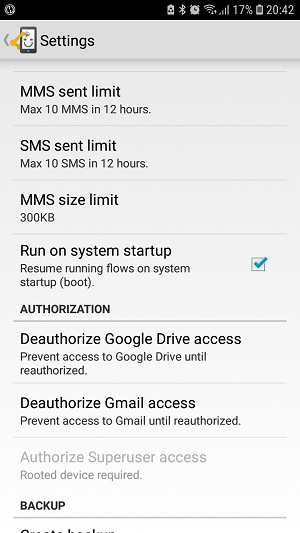
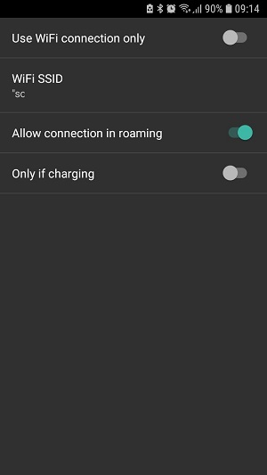
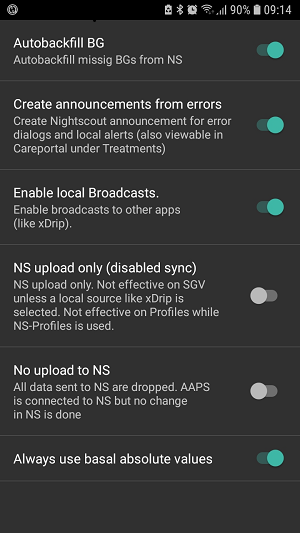
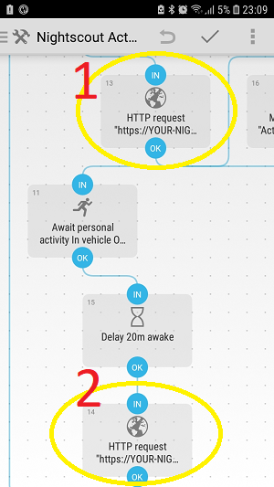
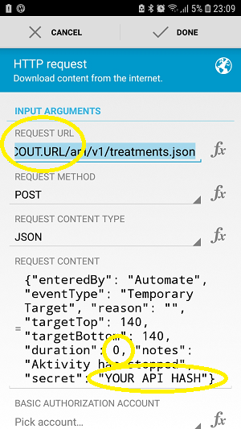
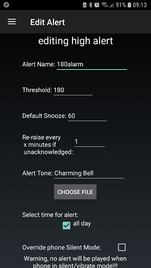
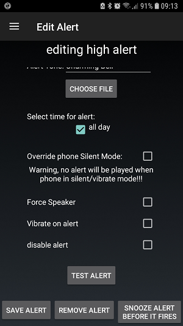
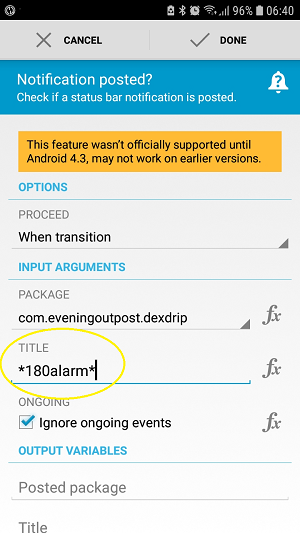
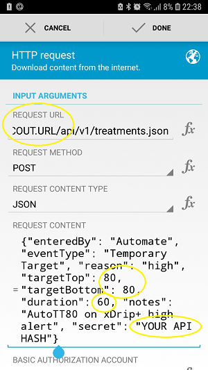

# 與第三方 Android Automate 應用程式的自動化

**這篇文章是在 AAPS 2.5 版本之前撰寫的。在 AAPS 2.5 版本中，本身已包含[自動化外掛](./Automation.md)。對某些人來說，這裡的內容仍然有用，但應該僅限於進階使用者使用。**

由於 AAPS 是一個混合閉環系統，仍然需要一些使用者的互動（例如告訴系統你正在走路、即將進食、或是躺在沙發上...）。 透過外部工具如 Automate 或 IFTTT，您可以自動化頻繁的手動使用者輸入，從而擴展 AAPS 的最新功能。

## Android Automate 應用程式

免費的 Android™ 應用程式 Automate 允許您自動化手機上的各種任務。 通過流程圖創建自動化，讓您的裝置根據位置、時間或其他「事件觸發」自動更改設定，如藍牙、Wi-Fi、NFC，或執行像是發送 SMS、電子郵件等操作。 您幾乎可以自動化裝置上的所有事務，Automate 甚至支援為 Tasker 和 Locale 設計的外掛。

使用這個工具，您可以輕鬆創建基於各種條件的工作流程，來自動管理糖尿病，按照「如果這個...」的原則。 以及「這個...」。 如果不是這個...，那就做那個... 以及那個...。 您可以配置成千上萬種可能性。

到目前為止，仍**必須透過 Nightscout 檔案進行閉環**，因為 Automate 是通過 HTTP 請求直接在您的 Nightscout 網站上執行命令，然後同步到 AAPS 應用程式。

**離線閉環（Automate 和 AAPS 應用程式之間的直接通訊）尚未支援**，但技術上是可行的。 未來也許會有解決方案。 如果您已經找到了解決方法，請將其添加到此文件中或聯繫開發者。

### 基本需求

#### Automate 應用程式

在 Google Play 商店或 <https://llamalab.com/automate/> 下載並安裝 Android Automate 到運行 AAPS 的智慧型手機上。

在 Automate 中，點擊左上角的漢堡選單 > 設定 > 勾選「系統啟動時執行」。 這會讓您的工作流程在系統啟動時自動執行。

#### AAPS

在 AAPS 中，點擊右上角的三點選單，進入偏好設定 > NSClient > 連線設定 > 取消勾選「僅限使用 WiFi 連線」和「僅限充電時」，因為自動化治療僅在 AAPS 有實際 Nightscout 連線時才能工作。

在 AAPS 中，點擊右上角的三點選單，進入偏好設定 > NSClient > 高級設定 > 取消勾選「僅上傳至 NS（已停用同步）」和「不向 NS 上傳」。

請注意[可能發生的安全問題](Nightscout-security-considerations)，如果您使用[Insight 幫浦](Accu-Chek-Insight-Pump-settings-in-aaps)，務必小心。

### 工作流程範例

#### 範例 1：如果偵測到活動（如走路或跑步），則設定高 TT。 如果活動結束，等待 20 分鐘後取消 TT

這個工作流程會監聽手機的感測器（步數計、重力感測器等），偵測活動行為。 如果最近有走路、跑步或騎自行車等活動，Automate 會為指定時間內設定使用者指定的高臨時目標。 如果活動結束，您的智慧型手機會偵測到此，等待 20 分鐘後將目標恢復為正常檔案值。

下載 Automate 腳本 <https://llamalab.com/automate/community/flows/27808>。

點擊編輯鉛筆 > 流程圖來編輯流程。

根據您的需求自定義工作流程如下：

1. = 設定高 TT
2. = 活動結束後 20 分鐘，回到正常目標

1 

2 

請求 URL：您的 NS-URL，結尾為 /api/v1/treatments.json（例如 https://my-cgm.herokuapp.com/api/v1/treatments.json）

請求內容：

* targetTop / targetBottom：高 TT 值（上限和下限應該相同）
* duration：高 TT 的持續時間（過後將回到常規目標，除非活動繼續）。 
* secret：您的 API SHA1 雜湊值。 這不是您的 API 金鑰！ 您可以在<http://www.sha1-online.com/> 將 API 金鑰轉換為 SHA1 格式。

儲存：點擊「完成」並點擊鉤子

啟動腳本：點擊播放按鈕

#### 範例 2：如果 xDrip+ 發出高血糖警報，則設定低 TT 持續 ... 分鐘。

這個工作流程會監聽 xDrip+ 的通知頻道。 如果觸發了使用者指定的 xDrip+ 高血糖警報，Automate 會設定使用者指定的低臨時目標，持續使用者指定的時間。 時間到後，另一個可能的警報會延長低 TT 的持續時間。

##### xDrip+

首先，您必須在 xDrip+ 中新增一個高血糖警報，具體如下：

警報名稱：（請注意！）這個名稱對觸發非常重要。 名稱應該明確無誤，不應與其他警報名稱相似。 範例：'180alarm' 不應與 '80alarm' 並存。

門檻值：應該觸發高血糖警報的血糖值。

預設暫停時間：在此輸入您打算設定的低 TT 持續時間，因為警報會再次出現，可能會延長低 TT 的持續時間。

##### Automate

其次，下載 Automate 腳本 <https://llamalab.com/automate/community/flows/27809>。

點擊編輯鉛筆 > 流程圖來編輯流程。

根據您的需求自定義工作流程如下：

在「是否發布通知？」觸發器中，您必須將「標題」設置為應該觸發的 xDrip+ 警報名稱，並在該名稱前後添加 * 變數。

請求 URL：您的 NS-URL，結尾為 /api/v1/treatments.json（例如 https://my-cgm.herokuapp.com/api/v1/treatments.json）

請求內容：

* targetTop / targetBottom：低 TT 值（上限和下限應相同）
* duration：低 TT 的持續時間（過後將回到常規目標）。 建議您使用與 xDrip+ 警報「標準暫停」相同的持續時間。
* secret：您的 API SHA1 雜湊值。 這不是您的 API 金鑰！ 您可以在<http://www.sha1-online.com/> 將 API 金鑰轉換為 SHA1 格式。

儲存：點擊「完成」並點擊鉤子

啟動腳本：點擊播放按鈕

#### 範例 3：請自行添加！

請透過上傳 .flo 檔案到 Automate 社群（關鍵字為「Nightscout」）來添加其他工作流程，並在這裡描述，透過[Pull Request 提交至 AndroidAPSDocs 資料庫](../make-a-PR.md)。

## 如果這個，則那個（IFTTT）

歡迎透過 PR 添加使用說明...