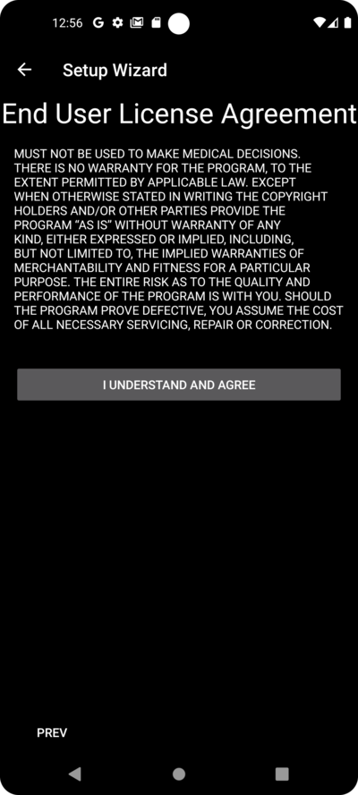
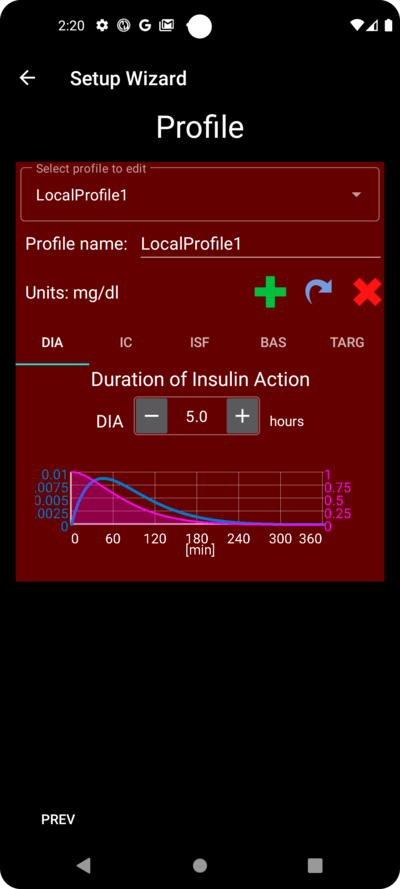

# AAPS設定嚮導

當你首次啟動 **AAPS** 時，會由“**設定嚮導**”引導，快速完成應用程式的基本配置。 **設定嚮導** 會引導你，避免遺漏關鍵設定。 例如，**權限設置** 對於正確設置 **AAPS** 至關重要。

然而，並不要求在第一次使用 **設定嚮導** 時就完全配置所有內容，你可以輕鬆退出嚮導並稍後返回。 在 **設定嚮導** 之後，有三條可用的路徑來進一步優化/更改配置。 這些路徑將在下一部分進行解釋。 因此，如果你在設定嚮導中跳過了一些選項，沒關係，你可以輕鬆地稍後配置他們。

在使用 **設定嚮導** 期間和直接之後，你可能不會注意到 **AAPS** 中有任何顯著的可見變化。 要啟用你的 **AAPS** 循環，你必須遵循 **目標** 來逐步啟用各個功能。 你將在設定嚮導的結尾開始**目標1**。 你是 **AAPS** 的主人，而不是他控制你。

```{admonition} Preview Objectives
:class: note
如果您想了解目標的結構，請參閱[完成目標](../SettingUpAaps/CompletingTheObjectives.md)，但然後請回來先運行設置嚮導。

```

根據以往經驗，我們了解到，初學者經常會給自己施加壓力，盡快設置 **AAPS**，這會導致挫敗感，因為這是一個巨大的學習曲線。

所以，請慢慢來配置你的循環，運作良好的 **AAPS** 循環帶來的好處是巨大的。

```{admonition} Ask for Help
:class: note
如果文檔中有錯誤或您對如何解釋某些內容有更好的想法，您可以按照[與其他用戶聯繫](../GettingHelp/WhereCanIGetHelp.md)的說明向社區尋求幫助。
```

## AAPS設定嚮導逐步指南

### 歡迎訊息

這只是歡迎訊息，你可以透過點擊“下一步”按鈕跳過：


### 許可協議

在最終用戶許可協議中，有關於使用 **AAPS** 的法律方面的重要訊息。 請仔細閱讀。

如果你不暸解或不同意最終用戶許可協議，請不要使用 **AAPS**！

如果你暸解並同意，請點擊“我暸解並同意”按鈕並繼續設定嚮導：



### 必要的權限

**AAPS** 需要一些條件才能正常運作。

在接下來的幾個畫面中，你將被問到幾個問題，你必須同意才能使 **AAPS** 工作。 嚮導本身會解釋為何需要相關設置。

在此畫面中，我們提供更多背景訊息，將更技術性的內容轉換為常用語言，或解釋其原因。

請點擊“下一步”按鈕：


智慧型手機的電池消耗仍然是需要考慮的因素，因為電池性能仍然相當有限。 因此，智慧型手機上的Android操作系統在允許應用程式運作和消耗CPU時間（因此消耗電池電量）方面有嚴格的限制。

然而，**AAPS** 需要定期運作，_例如_ 每隔幾分鐘接收一次血糖讀取值，然後應用演算法根據你的設定決定如何處理血糖水平。 因此，必須讓Android允許一些權限。

你可以透過確認設置來完成這一操作。

請點擊“請求許可”按鈕：


請選擇“允許”：


如果應用程式希望向你發送通知，Android需要特殊的許可。

雖然停用社交媒體應用程式的通知是一個很好的功能，但你必須允許 **AAPS** 向你發送通知。

請點擊“請求許可”按鈕：


選擇“AAPS”應用程式：


透過向右滑動滑塊來啟用“允許在其他應用程式上顯示”：


如果已啟用，滑塊應該看起來是這樣的：


Android將藍牙通訊的使用與位置服務的使用權限相關聯。 你可能在其他應用程式中也見過這一點。 如果你想查看藍牙，通常需要位置權限。

**AAPS** 使用藍牙與你的CGM和胰島素幫浦進行通訊，前提是他們直接由 **AAPS** 控制，而不是透過 **AAPS** 使用的其他應用程式。 具體細節可能因設置而異。

請點擊“請求許可”按鈕：


這很重要。 否則，**AAPS** 將無法正常工作。

點擊“使用應用程式時”：


點擊“下一步”按鈕：


**AAPS** 需要將訊息記錄到智慧型手機的永久儲存中。 永久儲存意味著即使重啟智慧型手機後，他仍然可用。 其他訊息則會遺失，因為他們沒有儲存到永久儲存中。

請點擊“請求許可”按鈕：


點擊“允許”：


你將被告知需要重新啟動智慧型手機以使更改生效。

請**不要現在停止設定嚮導**。 你可以在完成設定嚮導後再進行。

點擊“確定”然後點擊“下一步”按鈕：


### 主密碼

由於 **AAPS** 的配置包含一些敏感資料（_例如_ 查看你的Nightscout伺服器的API_KEY），因此他透過你可以在此處設置的密碼進行加密。

第二句話非常重要，請務必**不要遺失你的主密碼**。 請記下他，_例如_ 儲存到Google雲端硬碟上。 Google雲端硬碟是一個不錯的地方，因為他由Google為你進行備份。 你的智慧型手機或電腦可能會崩潰，並且你可能沒有實際副本。 如果你忘記了主密碼，日後可能很難恢復你的設定檔案和在 **目標** 中的進展。

填寫密碼兩次後，請點擊“下一步”按鈕：


### Fabric上傳

在這裡，你可以設置自動崩潰和使用報告服務的使用。

這不是強制性的，但使用他是一種良好的做法。

他幫助開發人員更好地了解你如何使用應用程式，並告知他們發生了哪些崩潰。

他們將獲得：

1. 應用程式崩潰的資訊，否則他們無法知道，因為他們自己的設置中一切運作正常，並且
2. 發送的資料（崩潰訊息）中包含崩潰發生的情況以及使用了何種配置的相關訊息。

因此，這有助於開發人員改進應用程式。

請透過向右滑動滑塊來啟用“Fabric上傳”：


此外，你可以標識自己，以便在開發人員希望就問題或緊急關注事項聯繫你時能夠找到你：


填寫你的“聯絡訊息”後，點擊“確定”按鈕。 聯絡訊息可以是你在Facebook、Discord等平台上的身份訊息…… 只需提供你認為能透過最佳方式聯繫你的訊息：


點擊“下一步”按鈕：


### 單位（mg/dL <-> mmol/L）

請選擇你的血糖值是以 mg/dl 還是 mmol/L 為單位，然後點擊“下一步”按鈕：


### 顯示設置

在這裡，你可以選擇感測器顯示的血糖範圍，這將顯示在你設置的範圍內的“範圍內”數值。 你可以暫時保留預設值，稍後再進行編輯。

你選擇的值只會影響圖表的圖形展示，其他方面不會受到影響。

例如，你的血糖目標是單獨在你的設定檔案中進行配置的。

你的TIR（範圍內時間）分析範圍在你的報告伺服器中單獨配置。

請按下“下一步”按鈕：


### 與報告伺服器同步及更多設置

在這裡，你可以配置資料上傳到你的報告伺服器。

你也可以在這裡進行其他配置，但首次運作我們只會專注於報告伺服器。

如果你目前無法設置，請暫時跳過。 你可以稍後再進行配置。

如果你在左側勾選某個項目，那麼在右側你可以選擇勾選可見性（眼睛）框，這會將該外掛放置在 **AAPS** 主頁的頂部選單中。 如果你在此處配置報告伺服器，請務必選擇顯示可見性。

在此示例中，我們選擇Nightscout作為報告伺服器，並將進行配置。

```{admonition} Make sure to choose the correct **NSClient** version for your needs! 
:class Note
點擊 [這裡](./Releasenotes.md) 查看 **AAPS** 3.2.0.0 的版本說明，這些說明解釋了頂部選項 **NSClient** （這是「v1」，雖然沒有明確標示）與第二個選項 **NSClient v3** 之間的差異。

Nightscout 使用者應選擇 **NSClient v3**，除非你希望透過 Nightscout 監控或發送遠端治療（例如:父母或看護使用 **AAPS** 幫助孩子），在這種情況下，請選擇第一個選項「**NSClient**」，直到進一步通知為止。
```

對於Tidepool來說，這更簡單，因為你只需要你的個人登錄訊息。

選擇後，請按下你選擇項目旁邊的齒輪按鈕：


在這裡，你可以配置Nightscout報告伺服器。

請點擊“Nightscout URL”：


輸入你的Nightscout URL，這是你的個人Nightscout伺服器。 這只是你自己設置的URL，或者是從你的Nightscout服務提供商那裡獲得的。

請點擊“確定”按鈕：


輸入你的Nightscout存取權杖。 這是你配置的Nightscout伺服器的存取權杖。 沒有這個權杖，無法存取。

如果你目前沒有，請查看 **AAPS** 文檔中的報告伺服器設置說明。

填寫“**NS存取權杖**”並點擊“確定”後，請點擊“同步”按鈕：


如果你在設定嚮導的前幾步中已經配置了Nightscout，請選擇“上傳資料到NS”。

如果你在Nightscout上儲存了設定檔案並希望將他們下載到 **AAPS**，請啟用“接收設定檔案存儲”：


返回上一個螢幕並選擇“警報選項”：


現在先不要啟用這些開關。 我們只是介紹一下可能在未來配置的選項，讓你熟悉這些設定。 目前還不需要設置他們。

返回上一個螢幕並選擇“連線設置”。

在這裡，你可以配置如何將資料傳輸到報告伺服器。

照護者必須啟用“使用行動網路連線”，否則用來為受照護者/孩子服務的智慧型手機無法在WiFi範圍外（例如上學路上）上傳資料。

其他 **AAPS** 用戶可以停用行動網路連線的傳輸，如果他們希望節省資料或電池電量。

如果不確定，建議保持所有選項啟用。

返回上一個螢幕並選擇“進階設置”。


如果你希望在報告伺服器中獲取應用程式啟動的相關訊息，請啟用“記錄應用啟動到NS”。 這有助於你遠端了解應用程式是否已重新啟動，特別是作為照護者時。

現在可能會關心確認 **AAPS** 是否正確配置，但之後通常不需要在Nightscout中檢查 **AAPS** 啟動或停止的情況。

啟用“從錯誤中建立公告”和“從需要碳水化合物警報中建立公告”。

保持“減慢上傳”為停用狀態。 你只會在特殊情況下使用他，例如當需要將大量資料傳輸到Nightscout伺服器時，而Nightscout伺服器處理資料速度較慢。

返回兩次，回到外掛列表，然後選擇 "下一步" 以進入下一個螢幕：


### 患者名稱

在這裡，你可以在 **AAPS** 中設置你的名字。

這可以是任何名字。 他只是用來區分不同用戶。

為了簡單起見，只需輸入名字和姓氏。

按“下一步”進入下一個螢幕。


### 病人類型

在這裡，你可以選擇你的“患者類型”，這很重要，因為 **AAPS** 軟體根據患者的年齡設有不同的限制。 這對安全至關重要。

在這裡，你還可以設置每餐的**最大注射量**。 也就是說，你在典型餐點中需要的最大注射量。 這是一個安全功能，用於幫助避免在餐前注射時發生意外的過量注射。

第二個限制與此類似，但涉及你預期的最大碳水化合物攝入量。

設置這些值後，請按“下一步”進入下一個螢幕：


### 使用的胰島素

選擇在幫浦中使用的胰島素類型。

胰島素名稱應該很好暸解。

```{admonition} Don't use the "Free-Peak Oref" unless you know what you are doing
:class: danger
對於進階使用者或醫療研究，你可以通過 "Free-Peak Oref" 定義自訂的胰島素作用型態的設定檔。請不要使用，除非你是專家，因為通常預設值對每種品牌的胰島素都能很好地運作。
```

按“下一步”進入下一個螢幕：


### 血糖來源

選擇你使用的血糖來源。 請參閱您的[BG 來源](../Getting-Started/CompatiblesCgms.md)的文檔。

由於有多個選項可用，因此我們不會在此詳細解釋所有選項的配置。 在這裡我們使用Dexcom G6與BYODA應用程式的示例：


如果你使用Dexcom G6與BYODA，請在頂層選單中點擊右側的勾選框來啟用可見性。

選擇後，按“下一步”進入下一個螢幕：


如果你正在使用 Dexcom G6 與 BYODA，點擊齒輪按鈕來訪問 BYODA 的設定。

啟用“上傳血糖資料到NS”和“記錄感測器變更到NS”。

返回並按 "下一步" 以進入下一個螢幕：


### 設定檔

現在我們進入設定嚮導中的一個非常重要的部分。

請在嘗試輸入以下畫面的設定檔案詳細資訊之前閱讀設定檔案的文檔。

```{admonition} Working profile required - no exceptions here !
:class: danger
準確的設定檔是控制 **AAPS** 安全運行所必需的。

你必須已經確定並與你的醫生討論你的設定檔，並且經過成功的基礎率、ISF 和 IC 測試驗證其可行性！

一直以來，如果給一個機器人輸入不正確資訊，那麼他將無法正常。同理，**AAPS** 只能依賴於他所獲取的資訊。如果你的設定檔過強，你將冒著低血糖的風險；如果過弱，你則冒著高血糖的風險。
```

按“下一步”進入下一個螢幕。 輸入一個“設定檔案名稱”：



長期來看，如果有需要，你可以擁有多個設定檔案。 這裡我們只建立一個。

```{admonition} Profile only for tutorial - not for your usage
:class: information
此處的範例設定檔僅用於顯示如何輸入資料。

他並不打算成為一個準確的設定檔或非常優化的東西，因為每個人的需求都如此不同。

不要用他來實際循環！
```

輸入你的胰島素作用時間（DIA），單位為小時。 然後按“IC”：


輸入你的IC值：


按“ISF”。 輸入你的ISF值：


按“基礎速率”。 輸入你的基礎值：


按“TARG”。 輸入你的血糖目標值。

對於開放循環，這個目標可以設置一個較大的範圍，否則 **AAPS** 會不停通知你更改臨時基礎率或其他設定，這可能會讓人感到疲憊。

稍後，對於閉環循環，你通常只會有一個上限和下限值。 這讓 **AAPS** 更容易達到目標，並幫助你更好地控制糖尿病。

輸入/確認目標值：


點擊“儲存”來儲存設定檔案：


儲存後將出現一個新按鈕“啟用設定檔案”。

```{admonition} Several defined but only one active profile
:class: information
你可以定義多個設定檔案，但任何時刻只能啟用一個設定檔案。
```

按下“啟用設定檔案”：


設定檔案切換對話框出現。 在這種情況下，讓他保持預設。

```{admonition} Several defined but only one active profile
:class: information
你稍後將學習如何使用此通用對話框來處理疾病或運動等情況，在這些情況下，你需要更改適合情況的設定檔案。
```

按下“確定”：


設定檔案切換的確認對話框出現。

你可以按“確定”確認他。 按“下一步”進入下一個螢幕：


你的設定檔案現在已設置：


### 胰島素幫浦

現在你要選擇你的胰島素幫浦。

你會看到一個重要的警告對話框。 請閱讀並按“確定”。

如果你已經在之前的步驟中設置了設定檔案，並且知道如何連線幫浦，現在可以隨時連線他。

否則，請使用左上角的箭頭退出設定嚮導，讓 **AAPS** 首先顯示一些血糖值。 你可以隨時返回或使用直接配置選項（不使用嚮導）。

請參閱您的[胰島素幫浦](../Getting-Started/CompatiblePumps.md)的文檔。

按“下一步”進入下一個螢幕。


在此例中，我們選擇“虛擬幫浦”。

按“下一步”進入下一個螢幕：


### APS 演算法

選擇OpenAPS SMB演算法作為你的APS演算法。 即使有這個名稱，SMB功能在你熟悉 **AAPS** 並完成第一階段目標之前是停用的。 無論如何，OpenAPS SMB 相較於 OpenAPS AMA 更新且通常效果更好。

在初期，你的設定檔案通常不如經驗豐富後好，所以這個功能在初期被停用。 由於在開始時，你的設定檔案通常不如經驗豐富後那麼好，因此該功能在初期被停用。

```{admonition} Only use the older algorithm **OpenAPS AMA** if you know what you are doing
:class: information
OpenAPS AMA 是最基本的演算法，不支援微量注射來修正高值。可能有情況需要使用此演算法，但這並不是推薦的做法。
```

按齒輪查看詳細資訊：


僅閱讀文本，此處不進行任何更改。

由於**目標**的限制，你目前無法使用“閉環”或“SMB功能”。

返回並按 "下一步" 以進入下一個螢幕：


### APS模式

讓“開放循環”保持選中狀態。

按“下一步”進入下一個螢幕：


### 敏感度偵測

讓“敏感度Oref1”保持為敏感度外掛的標準選項。

按“下一步”進入下一個螢幕：


### 開始目標1

你現在進入目標。 這是獲取 **AAPS** 進一步功能的資格。

我們從目標1開始，即使此刻我們的設置尚未完全準備好成功完成此目標。

但這是開始。

按下綠色的“開始”按鈕以開始目標1：


你會看到你已經取得了一些進展，但還有其他區域需要完成。

按“完成”進入下一個螢幕。


你來到了 **AAPS** 的主頁面。

在這裡，你會看到 **AAPS** 中的訊息，顯示你已設置好設定檔案。

這是在我們切換到新設定檔案時完成的。

你可以點擊“延後”，他會消失。


如果您意外地在任何時候離開了設置嚮導，您可以簡單地重新啟動嚮導，或手動更改[AAPS 循環的配置](../SettingUpAaps/ChangeAapsConfiguration.md)。

如果您的 **AAPS** 循環現在已完全設置，請繼續下一個部分[“完成目標”](../SettingUpAaps/CompletingTheObjectives.md)。
