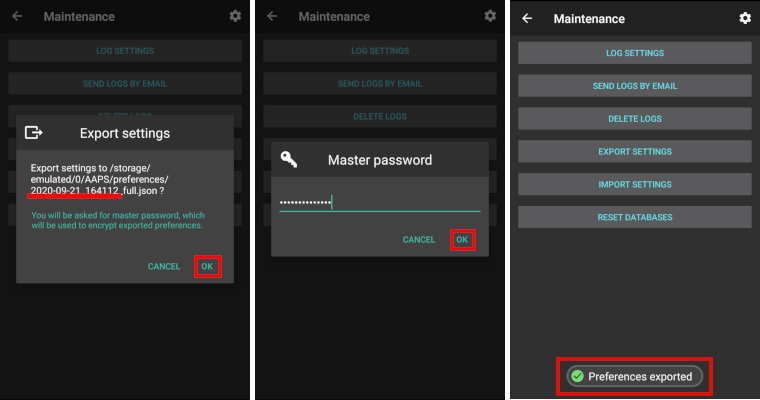
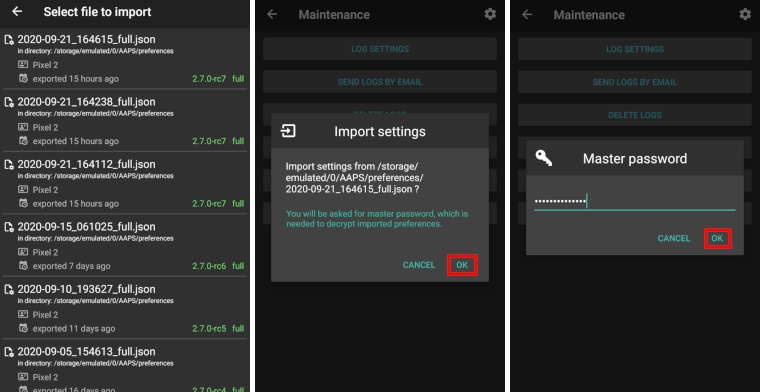

# 建立和恢復備份

保持下列項目的備份非常重要。 最佳做法是將備份儲存在本地硬碟以及雲端位置（例如 Google Drive、box 等）。 以下是建議保留備份的項目。

## 1 - 你用來建立 APK 的電腦上的金鑰庫檔案。
金鑰庫允許你在現有應用程式上安裝更新的 APK。 保留金鑰庫將大大降低未來更新 APK 的複雜性，特別是在你需要從新電腦建置應用程式的情況下。 有關使用金鑰庫建立新 APK 的詳細資訊，請參閱 AAPS 更新（連結）部分。

**何時進行備份：**首次建立 AAPS apk 後應進行金鑰庫備份。

**如何進行備份：**找到你的金鑰庫路徑。 如果你不記得，可以在 Android Studio 中選擇「Build > APK > Next」找到他。 路徑將列在「金鑰庫路徑」中。 使用檔案總管導航到該路徑，並複製你的金鑰庫檔案（檔案副檔名為 .jks）。 將他儲存到一個安全的雲端位置，以防你的電腦無法使用。 確保也記錄下你的金鑰庫密碼、金鑰別名和金鑰密碼。

## 2 - 最新的 APK 副本
如果你的主要 AAPS 手機丟失或損壞，擁有 APK 的副本將使你能夠快速在新手機上重新使用 AAPS（注意：你還需要如下面所述的偏好設定備份）。

**何時進行備份：**你應該維持最新 APK 的備份，這是你在主要 AAPS 手機上安裝的。 你也可能希望保留一個早期版本的副本，以防出現需要回滾的情況。

**如何進行備份：**Android Studio 用來建置 APK 的電腦將保留一個副本。 此外，如果你使用雲端平台將 APK 複製到手機，該平台也會在雲端保留副本。 確保你知道如何在需要時找到這兩個位置。 考慮在電腦和雲端平台上設置專用資料夾來儲存這些備份。

## 3 - AAPS 偏好設定
偏好設定是根據你設定的方式來調整預設 AAPS 應用程式。 偏好設定包括有關組態建置工具設定、目標狀態、Nightscout 設定、自動化和本地設定檔的詳細資料。 有了 APK（見上文）和偏好設定的副本，你可以快速在新手機上運作。

**何時進行備份：**

1 - 由於偏好設定會儲存你完成目標的進度，因此每次完成一個目標時都應備份偏好設定，以避免遺失進度。 _如果沒有偏好設定的副本，當你更換手機時，將必須重新完成所有目標。_

2 - 每當你計劃對配置進行重大變更時（例如更改 SMB 設定、更改胰島素類型、更換幫浦、進行自動化變更），應在變更前後備份偏好設定。 這樣你就可以保留最新的設定副本以及變更前的設定副本，萬一需要回滾時可以使用。

3 - _僅限 Omnipod Dash 用戶_ - 偏好設定檔案包含目前幫浦的連線詳細資訊，可用來在新手機上恢復幫浦連線。 如果你在開始使用目前幫浦後未匯出偏好設定的副本，當需要更換手機時，將需要重新啟動一個新的幫浦。

**如何進行備份：**

1 - 如果這是你首次匯入或匯出偏好設定，你需要設置一個主密碼。 在 AAPS 中，選擇右上角的三個點 > 偏好設定 > 一般 > 保護 > 主密碼。 設置密碼並將其記錄在安全的地方。 _沒有此密碼，你將無法存取偏好設定的備份。_

2 - 從 AAPS 主畫面，選擇左上角的三條線（漢堡）選單 > 維護 > 匯出設定 > 輸入上述設置的主密碼 > 確定。

 

3 - 使用手機上的檔案總管（通常稱為「檔案」或「我的檔案」），導航到內部儲存空間 > AAPS > 偏好設定。 在這裡你可以看到所有匯出的偏好設定檔案副本。 檔案名稱應為 YYYY-MM-DD_時間_appname.json。 將此檔案上傳到你選擇的雲端平台。 然後從雲端平台下載一份副本到你的本地電腦。

# 從備份中恢復至新手機或重新安裝 AAPS
如果你有 APK 和偏好設定的備份，想要將其載入到新手機上，或因任何原因需要刪除並重新安裝 APK，請遵循以下指示。

_如果你是使用相同金鑰庫建置的 APK 更新 AAPS，則不需要按照此過程進行。 不過，仍建議在更新前建立備份。_

如果你在丟失或更換原金鑰庫後更新 AAPS（例如在未傳輸金鑰庫的情況下使用新電腦建置），請確保根據上述方法備份所有設定，然後在手機上卸載現有版本的 AAPS。

If needed, [setup your CGM/BG source receiver](../Getting-Started/CompatiblesCgms.md) prior to the steps listed below

_Omnipod 用戶：_ 如果在不同的幫浦活動期間匯出偏好設定檔案，匯入該檔案將會停用目前幫浦。

1 - Using the back-up copy of your APK from above, follow the instructions for a [new installation](../SettingUpAaps/TransferringAndInstallingAaps.md)

2 - 啟動 AAPS 並允許任何請求的權限。

3 - 退出設定精靈。 我們將從偏好設定的備份檔案中匯入所有必要的設定。

4 - 從 AAPS 主畫面選擇請求並允許頂部紅色列出的所有權限。

5 - 從 AAPS 主畫面，選擇右上角的三個點 > 偏好設定 > 一般 > 保護 > 主密碼。 將主密碼設置為與備份時使用的密碼相同。

6 - 從 AAPS 主畫面，選擇左上角的三條線（漢堡）選單 > 維護 > 匯出設定 > 輸入上述設置的主密碼 > 確定。 這將在手機上建立偏好設定資料夾（如果尚未存在）。

7 - 從雲端平台下載偏好設定檔案備份。

8 - 使用你的檔案總管（通常稱為「檔案」或「我的檔案」）將檔案從下載移動到 /內部儲存/AAPS/偏好設定 資料夾中。

9 - 從 AAPS 主畫面，選擇左上角的三條線（漢堡）選單 > 維護 > 匯入設定 > 選擇你想要備份的偏好設定檔案 > 確定 > 輸入上述設置的主密碼 > 確定。 確保選擇正確的偏好設定檔案，所有來自偏好設定資料夾的 .json 檔案將顯示。

 

10 - AAPS 會自動重新啟動，並應該匯入所有偏好設定。

11 - 僅限 Omnipod Dash 用戶 - 如果你的偏好設定不是從你目前使用的幫浦備份的，你將需要啟動一個新的幫浦以開始胰島素輸送。

**問題排除：** 如果你無法從 AAPS 主畫面設置一個啟動的設定檔，請選擇左上角的三條線（漢堡）選單 > 組態建置工具 > 幫浦 > 切換到虛擬幫浦，然後再切換回你的幫浦類型。

### Dana RS 使用者注意事項

- 由於幫浦連線設定也會匯入，新手機上的 AAPS 已經「認識」幫浦，因此不會啟動藍牙掃描。
- 請手動配對新手機與幫浦。
