# setup wizard

This is just the welcome message which you can skip with the "NEXT" button.

In the end user license agreement you find important information about the legacl aspects of using AAPS.

Please read it carefully.

If you don't understand and can't agree to the end user license agreement please don't use AAPS at all!

If you understand and agree please click the "I UNDERSTAND AND AGREE" button and follow the setup wizard.

AAPS needs some requirements to operate correctly.

In the following screens you are asked several question you have to agree to get AAPS working. The wizard itself explains why he asks for the relevant setting.

We try here to give some more background information, translate more technical speak into common language or explain the reason.

Please click the "NEXT" button.

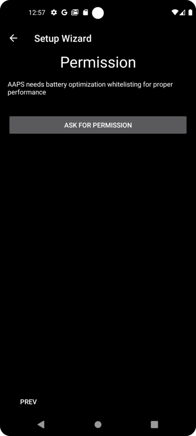

Battery consumption on cell phones is still a sensitive issue, as the performance of the batteries is still quite limited. Therefore, Android is quite restrictive about the circumstances under which it allows applications to run and consume CPU time and therefore battery power.

However, since AAPS needs to run regularly, e.g. to receive the blood sugar every few minutes, to apply the algorithm with which it decides how to deal with it on your behalf based on your specifications, it must be allowed to do so by Android.

You do this by confirming the setting.

Please click the "ASK FOR PERMISSION" button.

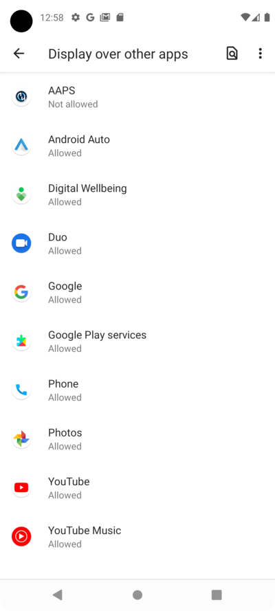

Please select the "AAPS" app.

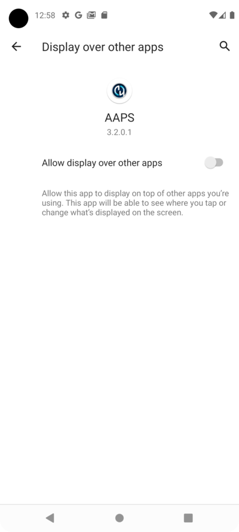

Please enable "Allow display over other apps" by sliding the slider to the right.

The slider should look this way if it is enabled.

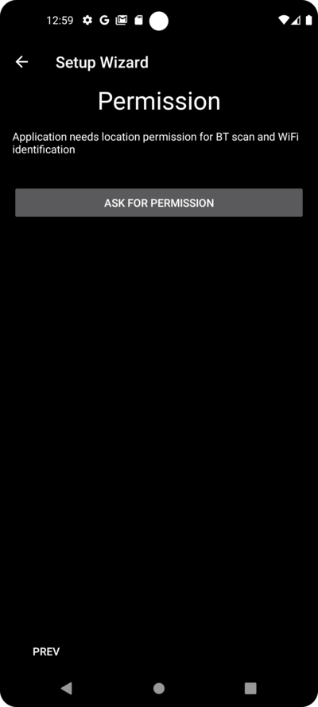

Android binds the usage of blutetooth communication on the ability to use location services. Perhaps you have seen it by others apps too. It's a common task you have to do if you want to access bluetooth.

AAPS uses bluetooth to communicatte in general with your CGMS and pump if it is directly controlled by AAPS and not another app which is used by AAPS. Details may differ from setup to setup.

Please click the "ASK FOR PERMISSION" button.

This is important. Otherwise AASP can not work properly at all.

Please click "While using the app".

Please click the "NEXT" button.

AAPS needs to write logging information to the permanent storage of you smartphone. Permanent storage means that it will be available even after rebooting your mobile. Other information is just lost as it was not saved to permanent storage.

Please click the "ASK FOR PERMISSION" button.

Please click "Allow".

You are getting informed that you have to reboot your smartphone after this change to take effect.

Please don't stop the setup wizard now. You can do it after finishing the setup wizard.

Please click "OK" and then the "NEXT" button.

As the configuration of AAPS contains some sensitive data (e.g. API_KEY for accessing the application programming interface of your nightscout server) it is encrypted by a password you can set here.

The second sentence is very important. Please make a backup copy of it e.g. on Google Drive. Google Drive is a good place as it is backuped by Google for you. Your smartphone or pc can crash and may be you have no actual copy.

After filling in the password twice please click the "NEXT" button.

Here you can setup the usage of an automated crash and usage reporting service.

It's not mandatory but good practice to use it.

It helps the developer to better understand your usage of the app and informs them about crashes which are happen.

They get
1. the information that the app crashed where they otherwise don't get the information because in their own environment all works fine and
1. in the send data (crash information) their is information about under which circumstances the crash happened and what kind of configuration is used.

Though it's really helpful.

Please enable the "Fabric Uload" by sliding the slider to the right.

Furthermore you can identify yourself that just in case the developers want to reach out to you for questions or urgent concerns.

After filling in your "contact information" click the "OK" button. Contact information can be your identification on Facebook, on Discord, ... Just the information you think is helpful to contact you best.

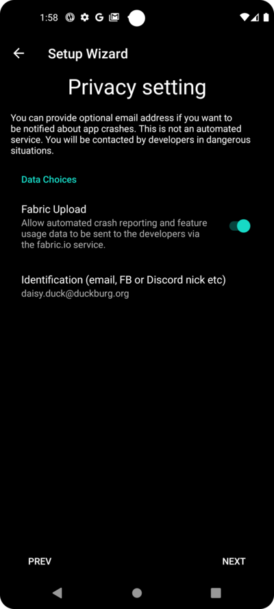

Please click the "NEXT" button.

Please select if your blood sugar values are in mg/dl or mmol/L and then please click the "NEXT" button.

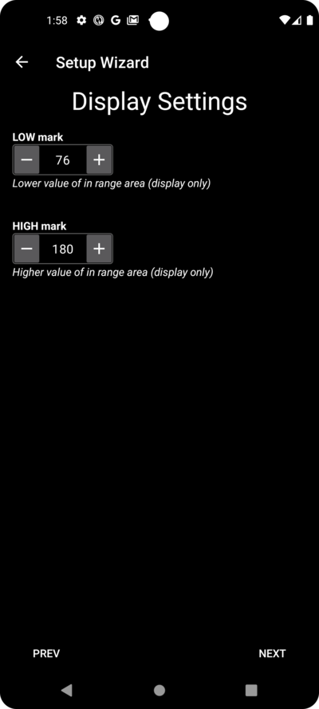

Here you select the range for the blood sugar diagram between values are shown as in range. You can leave it in the begining at the standard and adapt later.

It is here only for the graphical persentation of the diagram and nothing else.

Your blood sugar target e.g. is configured in your profile.

Your range to analyze TIR (time in range) is configured in your reporting server.

Please press the "NEXT" button.

Here you are configuring the data upload to the reporting server.

You could do other configurations here too but for the first run that's all you should do.

If you are not able to do it at the moment skip it please. It will not work but you can configure it later.

If you select an item here on the left, you can enable on the right the visibility in the upper menu on the AAPS home screen. In the begining please select the visibility too if you configure your reporting server here.

In this case we select Nightscout as reporting server and will configure it.

For Tidepool it is even simpler as you only need your personal login information.

Please press the "NEXT" button.

Here you are configuring the Nightscout reporting server.

Please click on "Nightscout URL".

Enter you Nightscout URL which is your personal nightscout server. It's just an URL you setup yourself or you got from your service provider for nightscout.

Please click the "OK" button.

Enter your nightscout access token. This is the access token for your nightscout server you configured. Without this token the access will not work.

If you don't have got it at the moment please check the documentation for setting up the reporting server in the AAPS documenation.

After filling in the "NS access token" please click on the "Synchronization" button.

Please select "Upload data to NS" if you already configured nightscout in the steps of the setup wizard before.

If you have stored profiles on nightscout and want to download them to AAPS enable "Receive profile store".

Go back to the screen beore and select "Alarm option".

At the moment let the switches disabled. We only walked to the screen to make you familar with possible options you might configure in the future.

At the moment there is no need to do it.

Go back to the screen beore and select "Connection settings".

Here you can configure how to transfer your data to the reporting server.

Caregivers must enable "use cellular connection" as otherwise the smartphone which serves the cared person can not upload data outside of the WiFi range e.g. at the way to school.

Others can disable the tranfer via cellular connection if they want to save data rate or battery.

If in doubt just leave all enabled.

Go back to the screen before and select "Advanced Settings".

Enable "Log app start to NS" is you want get information about this in the reporting server.

It might be interesting to see if AAPS is correctly configured but later it is not really important.

Enable "Create announcements from errors" and "Create announcements from carbs required alerts".

Let "Slow down uploads" disabled. You only use it if for some untypical reasons a lot of information is to be transfered to the nightscout server and the nightscout server is slow in processing this data.

Go back to the screen before and select "NEXT" to go to the next screen.

Here you can setup your name in AAPS.

It can be anything. It's just for differantiation.

To keep it simple just enter prename and lastname.

Press "NEXT" to go to the next screen.

Here you select your "Patient type" which is important as in the software are different limits defined depending on the age of the patient. This is important for security reason.

Further you configure the maximum allowed bolus for a meal. That means how much is the greatest blous you need to take to cover your typical meals? It's a security feature that you are not accidently overdose your selve when you are bolusing for meal.

the second limit is similar but now for the max carb intake you expect.

Press "NEXT" to go to the next screen.

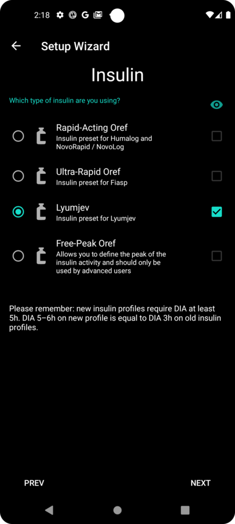

Select the type of insulin you take.

The names on the screen should be self-explaing.

:::{admonition} don't use the Free-Peak Oref unless you know what you do
:class: danger
For advanced users or medical studies there is the possibility to define with Free-Preak Ored your own profil how insulin acts. Please don't use it.
:::

Press "NEXT" to go to the next screen.

Select the BG source you are using.

As there are several options available we don't explain the configuration for all of them here. We are using Dexcom G6 with the BYODA app in our example here.

Please look in the documentation of AAPS for your BG source.

Press "NEXT" to go to the next screen.

If you are using Dexcom G6 with BYODA too enable the visibility in the top level menu by clicking the checkbox on the right side.

Press "NEXT" to go to the next screen.

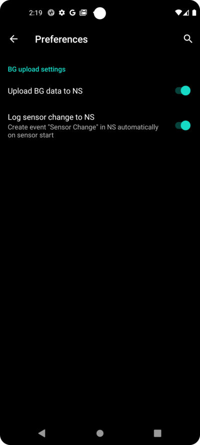

If you are using Dexcom G6 with BYODA too click on the gearwheel to access the settings for BYODA.

Enable the "Upload BG data to NS" and "Log sensor change to NS".

Press "NEXT" to go to the next screen.

Now we are entering a very sensitive part of the setup wizard.

Please read the documentation about profiles before you try to enter your profile on the following screen.

:::{admonition} working profile required - no excetions here !
:class: danger
Your profile is necessary to control AAPSs action.

It's required that you determined and discussed your profile with your doctor and that it has been proven to work by HbA1c measurement and successful basal rate testing!

You have no chance to be successfully with AAPS either.

If a robot has got a wrong setup of control set he will fail - consistenly.
:::

Press "NEXT" to go to the next screen.

Enter a "profile name".

You can have several profiles if needed. We only create one hear.

:::{admonition} profile only for documentation purpose - not for your useage
:class: information
The used profile here is only to show you how to enter data.

It is not a general good profile or something very well.

Don't use it!
:::

Enter your (!) DIA in hours.

Press "IC".

Enter your IC values.

Press "ISF".

Enter your ISF values.

Press "BAS".

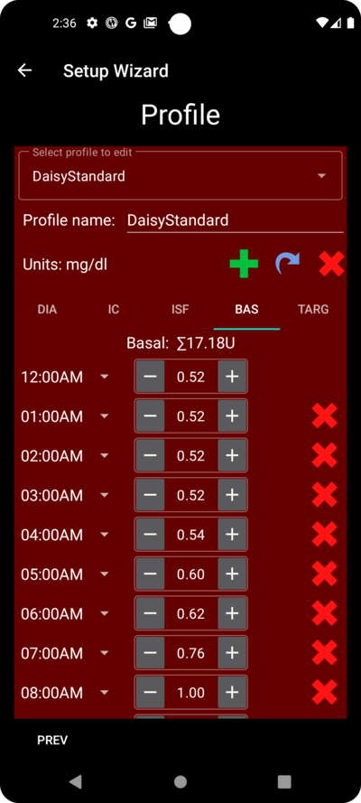

Enter your basal values.

Press "TARG".

Enter your blood sugar target values.

For open looping it can be a wider range as otherwise AAPS notifies you permanently to change the temporary basal rate or another setting which can be exhausting.

Later (!) for closed looping you will have in general only one value for top and bottom. That makes it AAPS easier to hit the target and you to have better diabetes control overall.

Confirm the target.

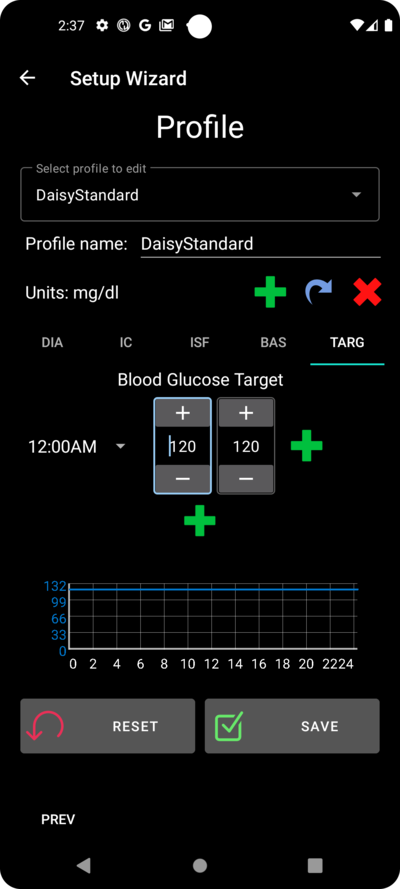

Save the profile by clicking on "SAVE".

After saving a new buttom "Activate Profile" occurs.

:::{admonition} several defined but only one active profile
:class: information
You can have several profiles been defined but only one activated profile.
:::

Press "Activate Profile".

The profile switch dialog appears. In this case let it as preset.

:::{admonition} several defined but only one active profile
:class: information
You will learn later how to use this general dialog to handle situations like illness or sport where you need to change your profile suitable for the circumstances.
:::

Press "OK".

A confirmation dialog for the profile switch appears.

You can confirm it with pressing "OK".

Press "NEXT" to go to the next screen.

Now you are selecting your insulin pump.

You get an important warning dialog. Please read it and press "OK".

If your have alread setup your profile in the steps before and you know how to connect your pump as you already read the documentation about this feel free to connect it now. It will not harm if you followed the instruction in the setup wizard until here.

Otherwise leave the setup wizard with the arrow in the top left corner and let AAPS first show you only some blood glucose values. You can come back anytime or use one of the direct configuration options (not using the wizard).

Press "NEXT" to go to the next screen.

In this case I select "Virtual Pump".

Press "NEXT" to go to the next screen.

Let the standard OpenAPS SMB algorithm seleced.

:::{admonition} only use the older algorithm AMA if you know what you are doing
:class: information
OpenAPS AMA is an older algorithm which has not supported micro bolus to correct high values. Only use it if you know what you are doing e.g. an experienced OpenAPS user who  migrated to AAPS.
:::

Press "NEXT" to go to the next screen.

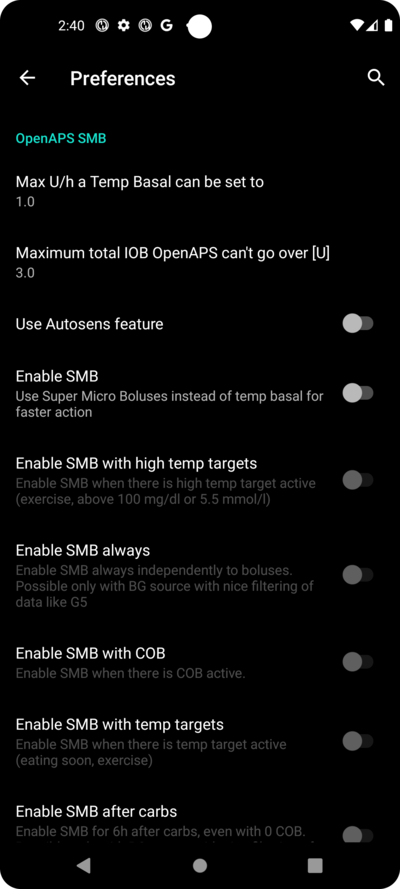

Only read the text and change nothing here.

Through the limitations which are imposed by the objectives you can't use neither closed loop nor SMB features at the moment anyway.

:::{admonition} several defined but only one active profile
:class: information
Please be patient and trust us that patience will pay off for you. It's a proven experience of thousands of users who are successful looping with AAPS.
:::

Press "NEXT" to go to the next screen.

Let "Open Loog" selected.

Press "NEXT" to go to the next screen.

Let "Sensitivity Oref1" the standard for the sensitivty plugins selected.

Press "NEXT" to go to the next screen.

You are entering now the Objectives. The qulification for access to further features.

Here we start Objective 1 even if know that at the moment our setup is not ready to successfully complete this objective.

But this is the start.

Press "START" to to start objective 1.

You see that you already made some improvements but other areas are to be done.

Press "FINISH" to go to the next screen.

You are coming to the home screen of AAPS.

Here you find the information message in AAPS that you set your profile.

This was done when we switchted to our new profile.

You can click "SNOOZE" and it will disappear.

Please read further in the secion ["Completing the objectives"](../Usage/completing-the-objectives.md).